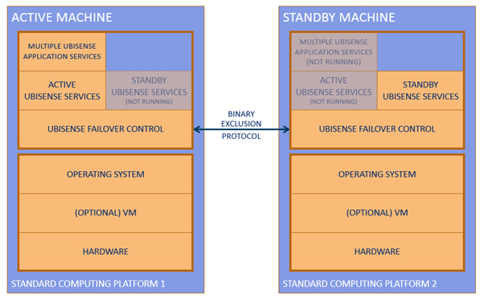

Skip To Main Content

  * placeholder

Filter:

  * All Files

Submit Search

   

You are here:

[Software Version](../../FrontMatters\(Online\)/features-and-versions.htm):
3.3

# Failover

Automated high-availability for Ubisense systems, using a simple protocol
running over a standard network to co-ordinate between N active machines and N
standby machines

## Summary

SmartSpace Failover automates switching from active to standby machines in
case of machine failure, or to enable maintenance or backups, in a manner that
protects data integrity by ensuring that active and standby machines never run
at the same time.

Failover is based around the ‘two machine’ setup in which pairs of machines
are configured so that at any one time only one machine is active whilst the
other is on standby. If the active machine stops or fails, the standby machine
takes over.

SmartSpace Failover ensures platform availability by automating switchover to
an alternative host. It assumes an up-to-date copy of production data is made
available by some method, for example by using SmartSpace Replication.

Ubisense Failover runs on Linux and Windows platforms.

## Benefits

The benefits of SmartSpace Failover are:

  * Automated  
Failover is automated so that the standby machine will take over from the
active machine if it detects that the active machine has timed out. This
ensures continuity without manual intervention.

  * Maintenance and backups  
Maintenance that requires a machine to be taken out of service can be
performed while the system is live so long as only one machine in a pair is
halted at a time with Failover ensuring continuity of service on the other
machine.  
Failover also allows scheduled dataset backups to be taken while the system is
live.

  * Data integrity  
Failover implements a protocol between two machines to make them work in a two
machine setup, controlling Ubisense services on both machines, and minimizing
the likelihood of both machines simultaneously becoming active.

  * Scalable  
Failover can be implemented with a single pair of machines running all
necessary Ubisense services or it can be scaled to encompass many pairs of
machines, including pairs running different operating systems. For example the
real-time control elements could run on Linux machines whilst the web
visibility features run on Windows machines.  
Failover uses standard hardware and software and can be conveniently
configured across whatever virtual machine and hardware configuration is
required.

   

* * *

[www.ubisense.net](http://www.ubisense.net/)  
Copyright © 2020, Ubisense Limited 2014 - 2020. All Rights Reserved.

