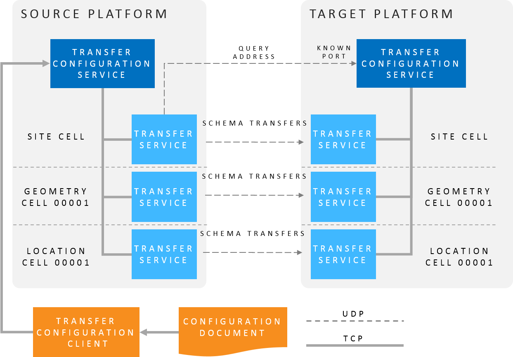

Skip To Main Content

  * placeholder

Filter:

  * All Files

Submit Search

   

You are here:

[Software Version](../../FrontMatters\(Online\)/features-and-versions.htm):
3.2

# Property transfer

Maintain side-by-side test systems using production data

## Summary

Property transfer provides software support for copying live data such as
object locations, names, battery status, spatial ownerships, data messages,
and sensor status, from one instance of the Ubisense platform to another.

The transfer operates at a low level in the platform architecture, and can be
configured to copy data in a best-effort or reliable mode.

Individual transfers can be stopped and started using a configuration tool,
and the current status and statistics of each transfer are recorded to a
central schema.

   

* * *

[www.ubisense.net](http://www.ubisense.net/)  
Copyright © 2020, Ubisense Limited 2014 - 2020. All Rights Reserved.

