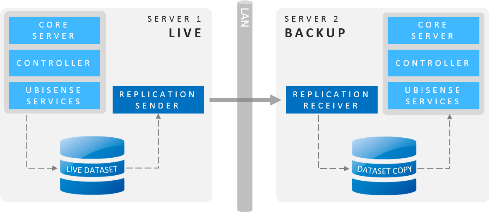

Skip To Main Content

  * placeholder

Filter:

  * All Files

Submit Search

   

You are here:

[Software Version](../../FrontMatters\(Online\)/features-and-versions.htm):
3.2

# Replication

Maintain asynchronous hot copies of datasets to support hot backup and fail
over

## Summary

Replication provides software support for the configuration of a continuously-
updated backup of the live dataset. This is stored on a separate (backup)
machine, which also has the Ubisense platform installed, but inactive. In case
the production machine fails, the Ubisense platform on the backup machine can
be started and take over as the production platform server.

The backup machine can also share the same data as the live machine, for
example by using a Storage Area Network (SAN) or Network-Attached Storage
(NAS).

The benefits of using Replication are:

  * Replication is performed in software, meaning there is no need for specialized high availability storage hardware
  * The copy of data on the backup machine can be used as a hot backup
  * Live machine is immune from latency problems commonly caused by synchronous replication
  * Good for long-distance off-site replication where latency would be a serious issue

   

* * *

[www.ubisense.net](http://www.ubisense.net/)  
Copyright © 2020, Ubisense Limited 2014 - 2020. All Rights Reserved.

