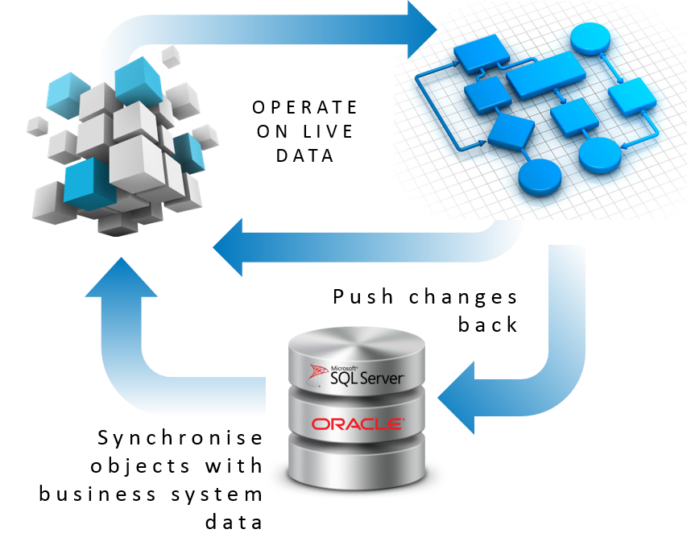

Skip To Main Content

  * placeholder

Filter:

  * All Files

Submit Search

   

You are here:

[Software Version](../../FrontMatters\(Online\)/features-and-versions.htm):
3.2

# RDBMS map

Integrate with external relational database management systems to read or
write application data

## Summary

The mapping allows the configuration of the import and export of object
properties between the Ubisense platform and external database schemas. SQL
Server and Oracle are supported directly.

RDBMS map allows operations to be scheduled, or to be triggered based on
changes to object properties.

   

* * *

[www.ubisense.net](http://www.ubisense.net/)  
Copyright © 2020, Ubisense Limited 2014 - 2020. All Rights Reserved.

