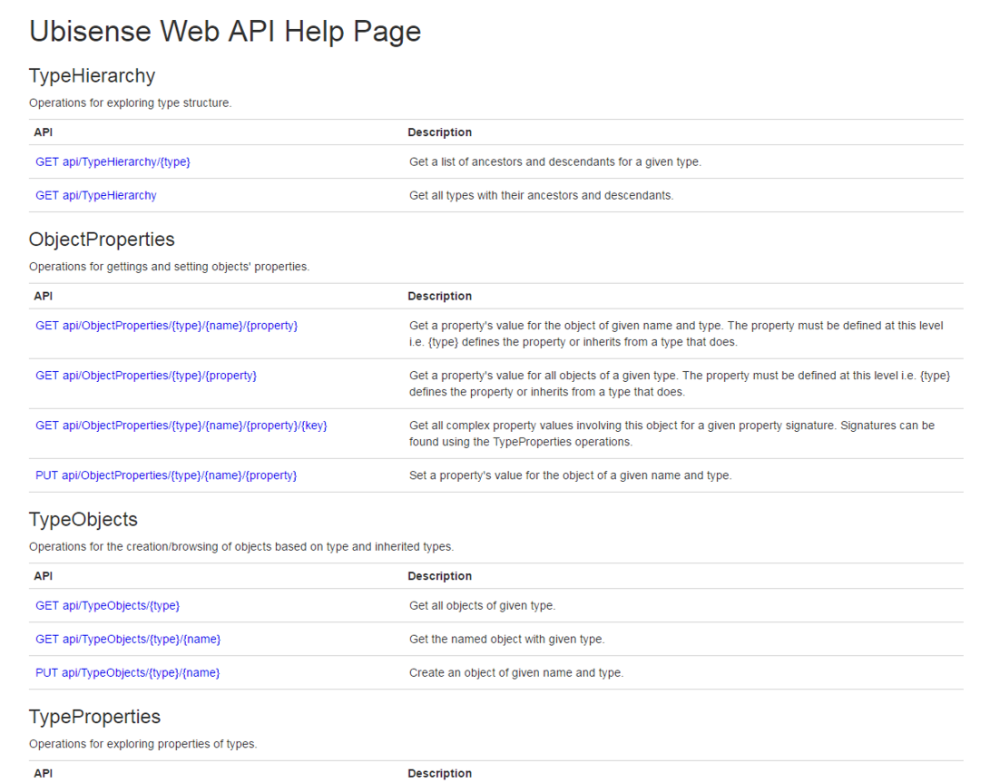

Skip To Main Content

  * placeholder

Filter:

  * All Files

Submit Search

   

You are here:

[Software Version](../../FrontMatters\(Online\)/features-and-versions.htm):
3.2

# Application REST API

A web API serving UDM objects/properties

## Summary

Application REST API is an http base API allowing the viewing or creation of
objects and properties from the UDM.

Application REST API:

  * Provides an interface to the Ubisense platform without requiring knowledge of or access to Ubisense protocols
  * Allows for easy access to the platform information without needing to write software. This is useful for viewing information in a one time/non-automated fashion or when writing lightweight web scripts

   

* * *

[www.ubisense.net](http://www.ubisense.net/)  
Copyright © 2020, Ubisense Limited 2014 - 2020. All Rights Reserved.

