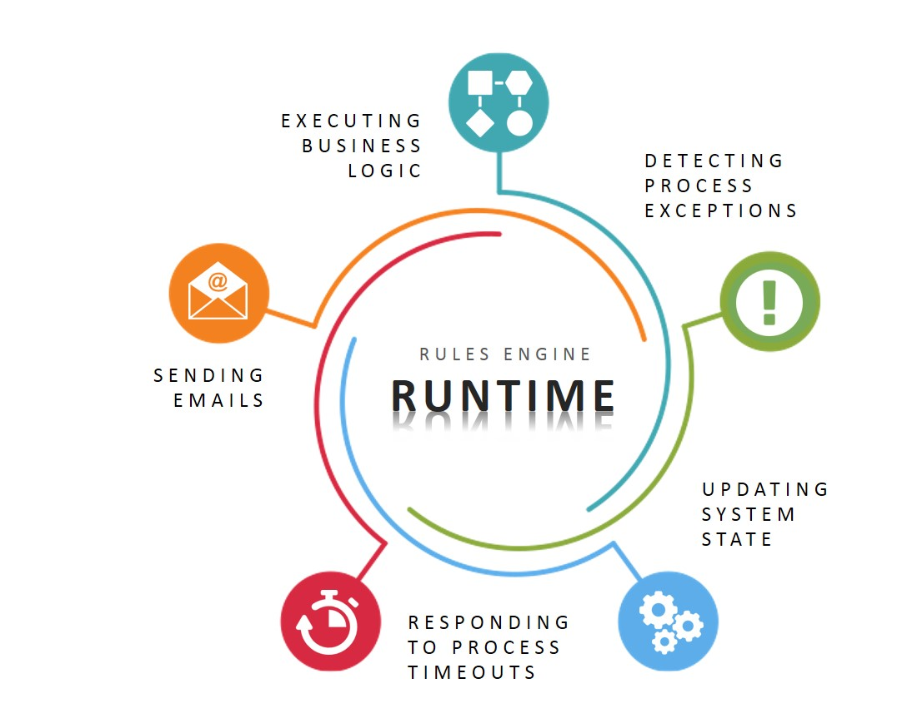

Skip To Main Content

  * placeholder

Filter:

  * All Files

Submit Search

   

You are here:

[Software Version](../../FrontMatters\(Online\)/features-and-versions.htm):
3.2

# Business rules engine

Execution of configurable rules and event handlers to implement business logic

## Summary

The Business rules engine includes the features necessary to encode a business
process. It includes support for calculating derived properties of objects,
enforcing constraints on data, setting timeouts, taking actions when timeouts
expire, detecting error cases and raising alerts to users. Alerts can be
routed to appropriate users using the inbuilt multi-level role definition, and
also displayed graphically to a logged-in user if the Visibility component is
licensed.

   

* * *

[www.ubisense.net](http://www.ubisense.net/)  
Copyright © 2020, Ubisense Limited 2014 - 2020. All Rights Reserved.

