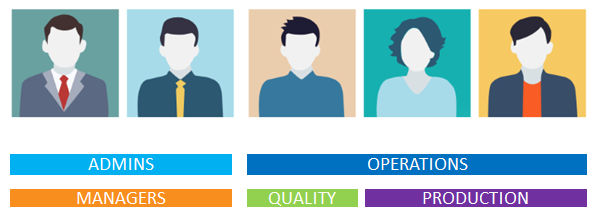

Skip To Main Content

  * placeholder

Filter:

  * All Files

Submit Search

   

You are here:

[Software Version](../../FrontMatters\(Online\)/features-and-versions.htm):
3.2

# Users and roles

Manage user authorizations and integrate with external user and role
definitions in LDAP

## Summary

Users and their roles can be defined within SmartSpace or imported from
external systems via LDAP.

SmartSpace roles control which parts of the web interface can be accessed by a
user, and the maps, reports and other screens available to them. It also
determines which users should receive notifications, emails and alerts
generated through the Business rules engine.

This allows the application experience to be tailored to meet the needs of
specific classes of end user.

The SmartSpace configuration client includes a workspace for defining roles
and assigning users to them. In addition SmartSpace provides a browser-based
view of the underlying users and roles model, giving system administrators
simple access for editing or extending the underlying user and group
allocations.

   

* * *

[www.ubisense.net](http://www.ubisense.net/)  
Copyright © 2020, Ubisense Limited 2014 - 2020. All Rights Reserved.

