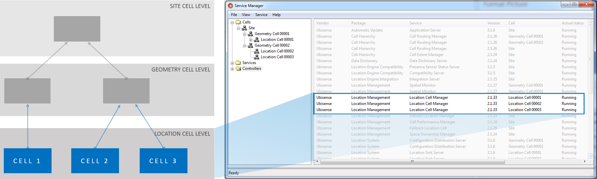

Skip To Main Content

  * placeholder

Filter:

  * All Files

Submit Search

   

You are here:

[Software Version](../../FrontMatters\(Online\)/features-and-versions.htm):
3.2

# Location store

Persistent storage and real-time distribution of location data

## Summary

Location store is a distributed, persistent store for location and orientation
of objects: it is designed to support high event rates (for example, for fast-
moving objects) and reliable storage of location data (for example, for
objects whose position is only ever asserted once). Location store has been
proven in mission-critical industrial applications, handling several hundred
million individual location events per day and providing reliable persistent
storage.

Location store can scale to cover an arbitrarily-large area by splitting it up
into multiple cells, each of which is managed by a separate location cell
manager service.

   

* * *

[www.ubisense.net](http://www.ubisense.net/)  
Copyright © 2020, Ubisense Limited 2014 - 2020. All Rights Reserved.

