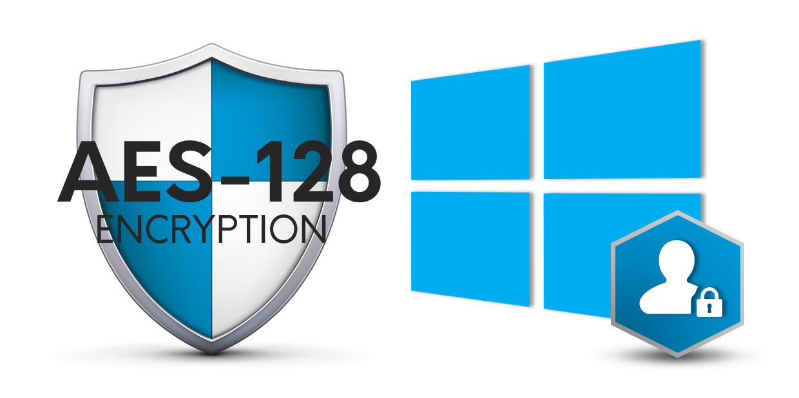

Skip To Main Content

  * placeholder

Filter:

  * All Files

Submit Search

   

You are here:

[Software Version](../../FrontMatters\(Online\)/features-and-versions.htm):
3.2

# Service security

Multi-level role-based access control for the basic Ubisense services

## Summary

SmartSpace implements a service-oriented architecture where each service is a
unit of functionality that works with other services to deliver some larger
capability. Service security allows each service to be protected so only
authorized users and clients can access the data or execute operations to
modify it.

## Features

Key features include:

  * Protection of system state at the service level for security and data integrity
  * Three service access levels: Open, Read-only, Closed
  * Configurable role-based multi-level security model
    * Each (Role, Service, Cell) combination maps to a service access level
    * Uses AES-128 (Advanced Encryption Standard)
  * Client credential entry integrated with Windows authentication

   

* * *

[www.ubisense.net](http://www.ubisense.net/)  
Copyright © 2020, Ubisense Limited 2014 - 2020. All Rights Reserved.

