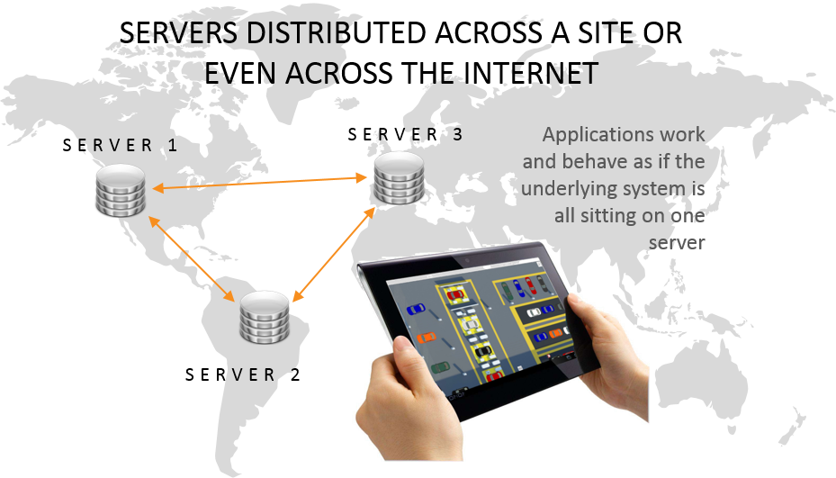

Skip To Main Content

  * placeholder

Filter:

  * All Files

Submit Search

   

You are here:

[Software Version](../../FrontMatters\(Online\)/features-and-versions.htm):
3.2

# Site connector

Connect Ubisense platforms on separate networks using TCP/IP, either for
multi-site operation, or for support purposes

## Summary

Site connector has two related uses.

It can connect together distributed computers on disjoint networks, via a
TCP/IP connection, so they appear to be connected to the same Ubisense
platform. In this role, Site connector has been used to connect production
sites around Europe to a single central platform.

Site connector can also be used to connect client computers to a platform when
the network configuration prevents direct connection, such as for remote
access support via a VPN.

   

* * *

[www.ubisense.net](http://www.ubisense.net/)  
Copyright © 2020, Ubisense Limited 2014 - 2020. All Rights Reserved.

