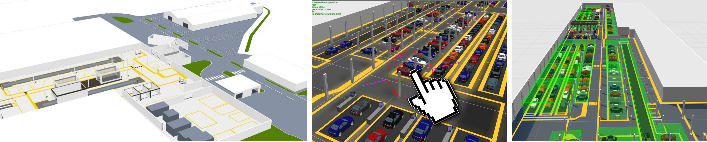

Skip To Main Content

  * placeholder

Filter:

  * All Files

Submit Search

   

You are here:

[Software Version](../../FrontMatters\(Online\)/features-and-versions.htm):
3.2

# Site visualization

Import 2D and 3D graphics into an easy-to-use configuration tool to visualize
models of objects and buildings in a virtual representation of the real world

## Summary

Building location-aware applications with SmartSpace is all about modeling the
behavior and interaction of real-world objects in a real-world environment.
The task of building and testing such applications is greatly simplified when
the types and objects involved can be visualized and manipulated in a virtual
representation of the real world.

To this end, SmartSpace supports a site visualization feature that renders a
graphical model of the environment and the application-specific objects within
it. This is enabled by importing simple graphical elements (both images and 3D
models) that can be assigned to object types or used as a backdrop for the
site. These image primitives are called representations (or reps) in
SmartSpace and can be arbitrarily attached to objects or used as layers to
construct a “scene” representative of the real-world environment.

## Features

Site visualization includes the following capabilities:

  * Importing standard graphics formats, including vector (SVG), raster (JPG, BMP, PNG), and 3D models (DAE) into a SmartSpace reps library
  * Setting the scale and offset of all reps to match the scale and coordinate system of the application environment
  * A scene visualization GUI which renders the environment scene and all located objects which have a representation assigned
  * The ability to drag, drop, position and lock "scene reps" in the site visualization
  * The ability to assign reps to object types so they appear in the site visualization
  * The ability to move objects "virtually" by using the mouse
  * The ability to visualize spatial relationships and containment events

   

* * *

[www.ubisense.net](http://www.ubisense.net/)  
Copyright © 2020, Ubisense Limited 2014 - 2020. All Rights Reserved.

