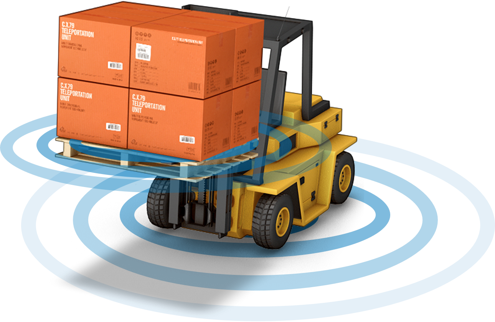

Skip To Main Content

  * placeholder

Filter:

  * All Files

Submit Search

   

You are here:

[Software Version](../../FrontMatters\(Online\)/features-and-versions.htm):
3.2

# Driven objects

Track and locate objects without RTLS tags in real time

## Summary

Driven objects allows objects which do not have an RTLS tag to be given
locations by associating them with an object which does have a location.

There are a number of use cases.

  1. Crates can be associated with a trolley or forklift by using RFID or a barcode scanner. The crates are then given a position by the trolley or forklift and move with it.
  2. Crates can be associated with a storage area by using RFID or a barcode scanner. The crate is then given a location within the storage area. It will not be the exact location of the crate but it will show that the crate is in the area and will allow an operator to locate it.
  3. Objects which do have RTLS tags can be located in areas with no RTLS sensor coverage. For example cars can be parked in a warehouse where there is no coverage. The car will be given a position, which is not exact, but which allows the operator to know the car is located somewhere in the warehouse. 

   

* * *

[www.ubisense.net](http://www.ubisense.net/)  
Copyright © 2020, Ubisense Limited 2014 - 2020. All Rights Reserved.

