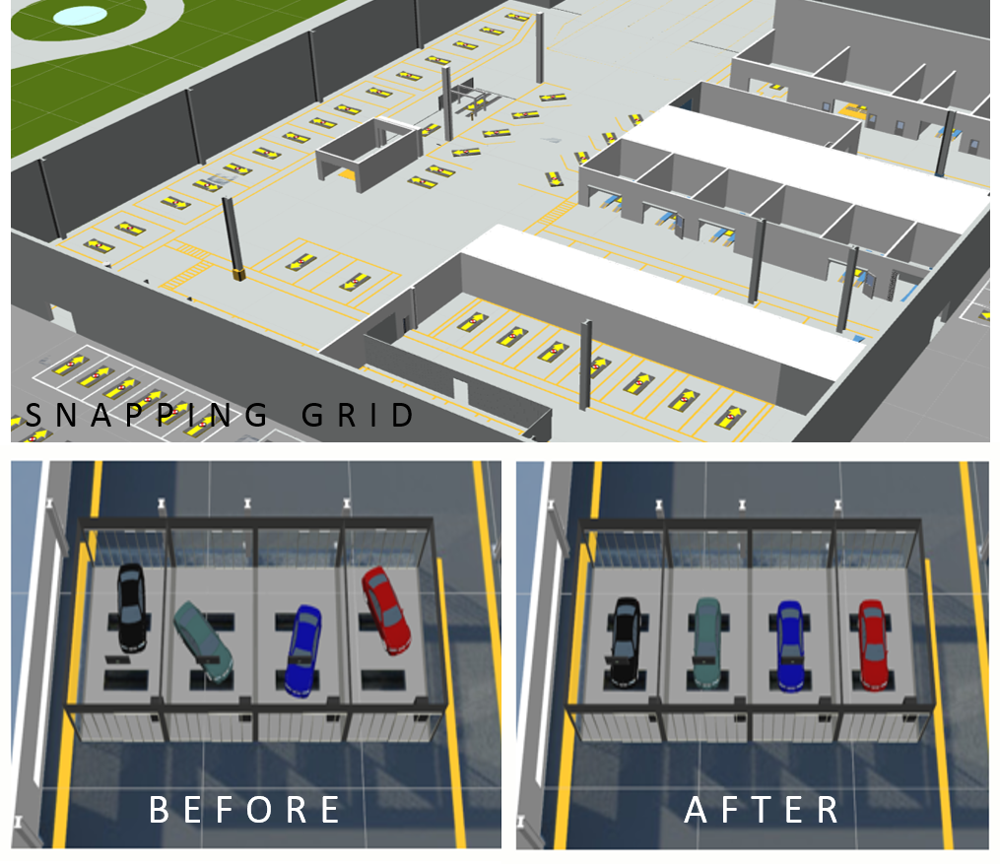

Skip To Main Content

  * placeholder

Filter:

  * All Files

Submit Search

   

You are here:

[Software Version](../../FrontMatters\(Online\)/features-and-versions.htm):
3.2

# Parking bay snapping

Definition of positions in which objects are parked, real-time detection of
parking, and snapping and orientation of objects into parking spaces

## Summary

Parking bay snapping controls the position and orientation of objects when
they stop at user-configured parking bays. It is configured by placing parking
bays, grouping them into parking areas, and setting parameters on the parking
areas to control parking detection. When Parking bay snapping detects that an
object is parked in a bay, it snaps it to the bay, orients it to line up to
the bay and asserts that it is parking in the bay. These parking assertions
can then be used by third-party systems, via the [.NET API](../Core/NET-
API.htm) or the [C++ API](../Core/C-plus-plus-API.htm), or by logic configured
using the [Business rules](../../TopLevelComponents/business-rules.htm)
component (if the Business rules component is also licensed).

   

* * *

[www.ubisense.net](http://www.ubisense.net/)  
Copyright © 2020, Ubisense Limited 2014 - 2020. All Rights Reserved.

