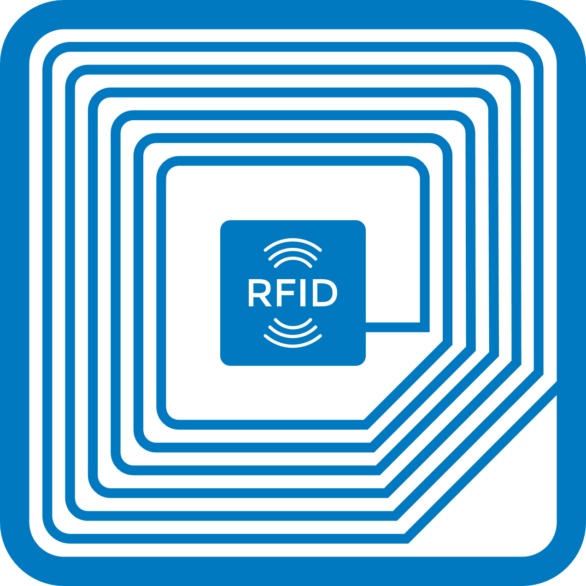

Skip To Main Content

  * placeholder

Filter:

  * All Files

Submit Search

   

You are here:

[Software Version](../../FrontMatters\(Online\)/features-and-versions.htm):
3.2

# LLRP interface

Collect data from LLRP readers and add it to the Ubisense platform

## Summary

The LLRP interface enables configurable integration and mapping of
identification events from 3rd-party RFID readers that support LLRP to objects
and events.

The LLRP interface collects tag reports from readers and stores the data (what
tags have been seen by what readers) in the assertion store/UDM, allowing a
user to write logic based on this data using the [Business rules
engine](../Business rules/business-rules-engine.htm).

   

* * *

[www.ubisense.net](http://www.ubisense.net/)  
Copyright © 2020, Ubisense Limited 2014 - 2020. All Rights Reserved.

