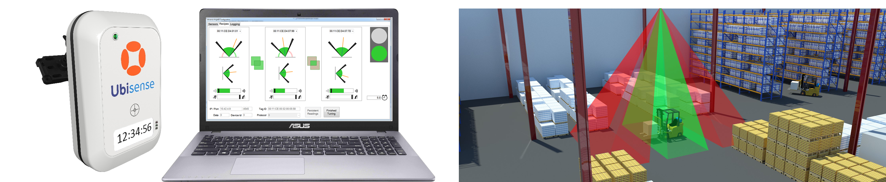

Skip To Main Content

  * placeholder

Filter:

  * All Files

Submit Search

   

You are here:

[Software Version](../../FrontMatters\(Online\)/features-and-versions.htm):
3.2

# AngleID connect

Collect data from an AngleID system and add it to the Ubisense platform

## Summary

The entry_exit_connector service collects data from an (entry/exit) AngleID
system and adds it to the platform in the form of UDM properties in real time.
The following UDM elements are maintained by the service:

  * Ubisense AngleID Recipe objects
  * Object satisfies Ubisense AngleID Recipe property which contains entries for object inside a recipe detection zone

This allows a user to program logic based on this property using the [Business
rules engine](../Business rules/business-rules-engine.htm), for example to
place an object at location “x” when it satisfies recipe “y”.

   

* * *

[www.ubisense.net](http://www.ubisense.net/)  
Copyright © 2020, Ubisense Limited 2014 - 2020. All Rights Reserved.

