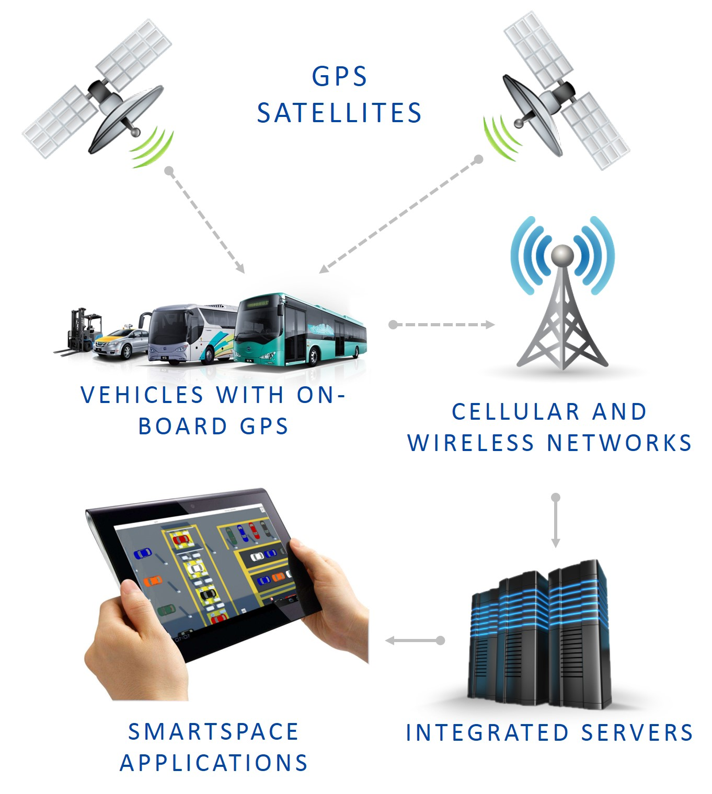

Skip To Main Content

  * placeholder

Filter:

  * All Files

Submit Search

   

You are here:

[Software Version](../../FrontMatters\(Online\)/features-and-versions.htm):
3.2

# AVL/GPS connect

Import data from automatic vehicle locator systems in real time

## Summary

AVL/GPS connect simplifies integration with vehicle locator systems for yard
management applications in transit, vehicle production, and vehicle shipping
applications. It provides an easily-configurable way of connecting to AVL
systems using web services or RDBMS back ends such as SQL Server.

   

* * *

[www.ubisense.net](http://www.ubisense.net/)  
Copyright © 2020, Ubisense Limited 2014 - 2020. All Rights Reserved.

