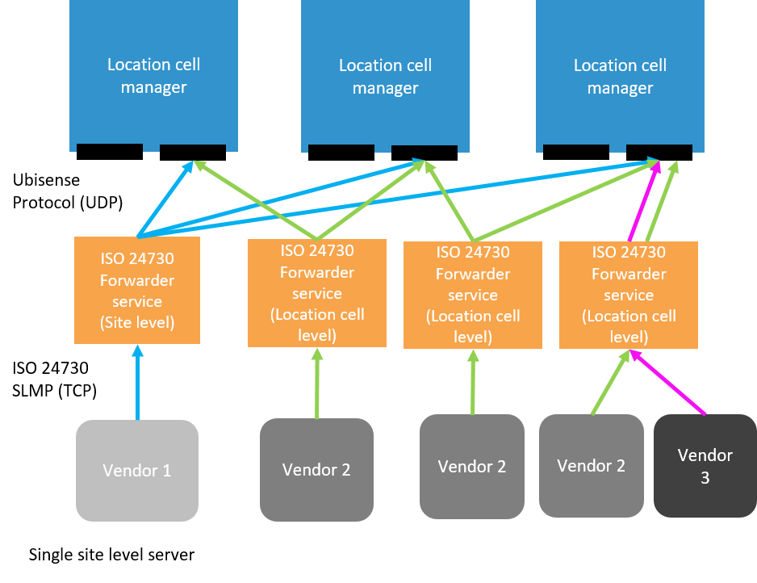

Skip To Main Content

  * placeholder

Filter:

  * All Files

Submit Search

   

You are here:

[Software Version](../../FrontMatters\(Online\)/features-and-versions.htm):
3.2

# ISO 24730

Scalable standards-based real-time data import from a wide range of RTLS
systems

## Summary

The ISO 24730 feature provides a configurable cellular ISO 24730 client for
the integration of multiple third-party location sources.

The ISO/IEC 24730 standard defines protocols for transferring information
between different Real‑time Location Systems.

The Ubisense ISO 24730 feature consists of Ubisense services and tools that
allow a Ubisense RTLS to receive real-time locations using a Text over Socket
connection over TCP/IP.

The Ubisense services act as a client connecting to a server within a third-
party RTLS system. The services are added to a Ubisense dataset which contains
the Ubisense platform, and optionally ISO 24730 applications.

ISO 24730 is supported on Windows and Linux operating systems.

   

* * *

[www.ubisense.net](http://www.ubisense.net/)  
Copyright © 2020, Ubisense Limited 2014 - 2020. All Rights Reserved.

