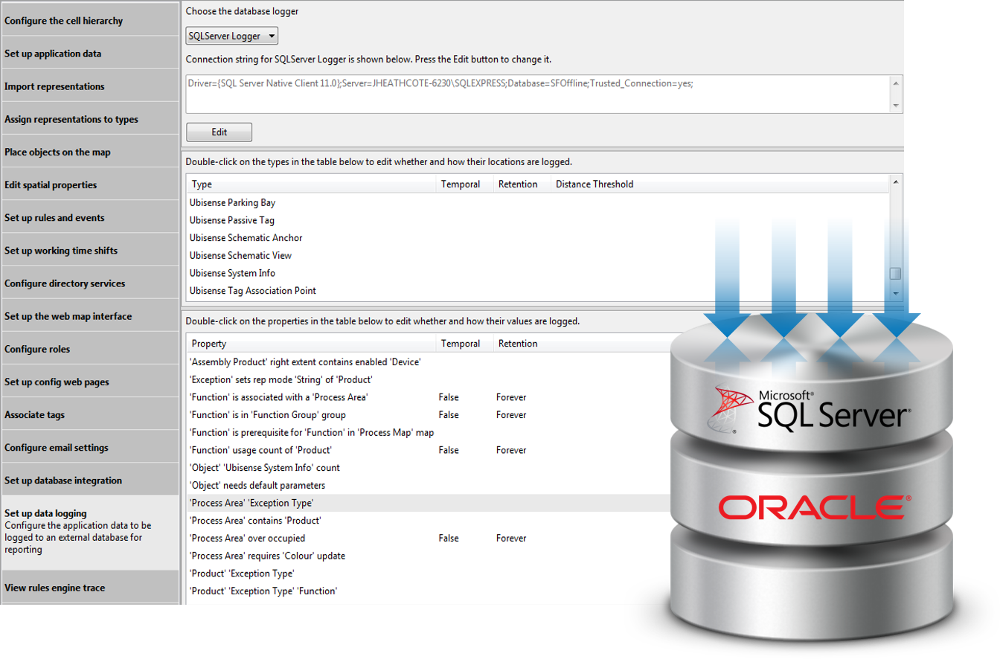

Skip To Main Content

  * placeholder

Filter:

  * All Files

Submit Search

   

You are here:

[Software Version](../../FrontMatters\(Online\)/features-and-versions.htm):
3.2

# Location and property history

Record the locations of tracked assets, and their other properties, over time

## Summary

The locations of configurable asset types can be recorded into a relational
database and retained for a given time period. Similarly the values of asset
properties and other business properties can be stored in the database.

Customers can license SmartSpace Reporting or run their own reporting engine
over the recorded data.

   

* * *

[www.ubisense.net](http://www.ubisense.net/)  
Copyright © 2020, Ubisense Limited 2014 - 2020. All Rights Reserved.

