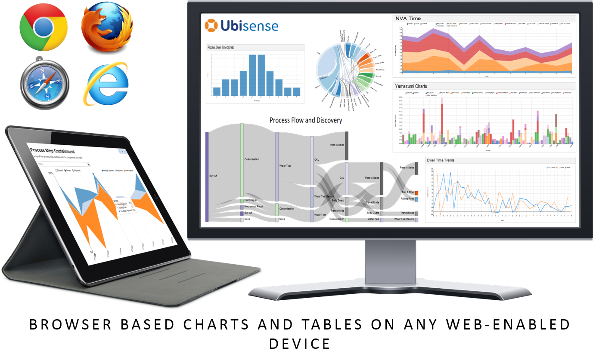

Skip To Main Content

  * placeholder

Filter:

  * All Files

Submit Search

   

You are here:

[Software Version](../../FrontMatters\(Online\)/features-and-versions.htm):
3.2

# Web reports

Deliver reports based on location and property history

## Summary

The Web reports feature runs queries over the recorded location and property
history to generate sophisticated tabular and chart-based reports displayed in
the browser. On its own, this feature can deliver pre-built reports, such as
those available as part of a vertical application. With the [Reports engine
developer](../Reports engine developer/reports-engine-developer.htm) feature,
reports can be edited on line.

Web reports can be accessed from a wide variety of devices, ranging from
desktop computers to tablets and phones, and do not require installation.

Supported charts include line, discrete bar, multi-bar, horizontal bar,
stacked area, scatter, cumulative line, line and focus, pie, histogram, box
plot, Sankey diagram, chord diagram and location history.

   

* * *

[www.ubisense.net](http://www.ubisense.net/)  
Copyright © 2020, Ubisense Limited 2014 - 2020. All Rights Reserved.

