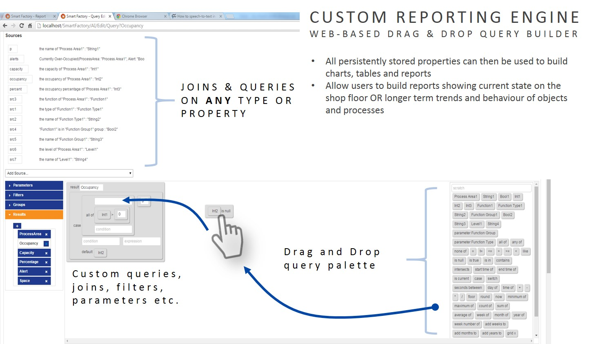

Skip To Main Content

  * placeholder

Filter:

  * All Files

Submit Search

   

You are here:

[Software Version](../../FrontMatters\(Online\)/features-and-versions.htm):
3.2

# Reports engine developer

Build custom web reports within the browser

## Summary

The Reports engine developer allows authorized users to create and modify
reports based on recorded location and property history. The feature provides
editor web pages that allow drag-and-drop construction of queries over the
recorded data.

These queries can then be used to populate tables and charts, and the charts
built into reports with user-entered parameters.

Reports can then be assigned to specific roles so that they can be run by
users that are members of those roles.

The editor pages can be accessed from a wide variety of client operating
systems and do not require installation. The editors are easiest to use on
devices with tablet- or desktop-sized screens.

   

* * *

[www.ubisense.net](http://www.ubisense.net/)  
Copyright © 2020, Ubisense Limited 2014 - 2020. All Rights Reserved.

