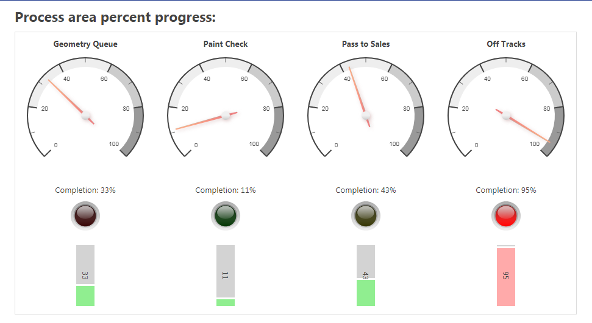

Skip To Main Content

  * placeholder

Filter:

  * All Files

Submit Search

   

You are here:

[Software Version](../../FrontMatters\(Online\)/features-and-versions.htm):
3.4

# HMIs

Custom interfaces for displaying current business objects and properties in
the SmartSpace website

## Summary

HMIs (Human Machine Interfaces) allow custom web interfaces to be developed
and deployed within the Ubisense SmartSpace web site. They can display content
based on web searches defined within SmartSpace in a variety of formats
including:

  * visual components such as progress bars or gauges
  * embedded versions of web maps or web reports (if licensed)

Administrators can use a web-based editor to develop and test interfaces,
before publishing the finished versions to designated SmartSpace roles.

A simple declarative binding API is provided to allow HMI content to be
generated using only attributed HTML; whilst, for more advanced uses, CSS and
JavaScript can be added to the interfaces and external assets, such as images
and script libraries, can be hosted in the SmartSpace web site for use by the
feature.

   

* * *

[www.ubisense.net](http://www.ubisense.net/)  
Copyright © 2020, Ubisense Limited 2014 - 2020. All Rights Reserved.

