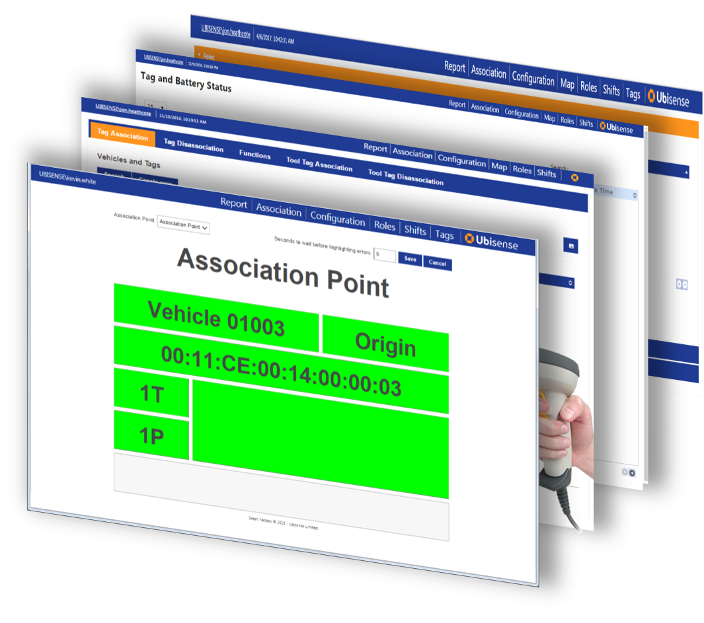

Skip To Main Content

  * placeholder

Filter:

  * All Files

Submit Search

   

You are here:

[Software Version](../../FrontMatters\(Online\)/features-and-versions.htm):
3.2

# Operations web interface

Web user-interfaces for the operation of applications and maintenance of tags
in the Ubisense location system

## Summary

Operations and maintenance users can use browser-based interfaces to perform
or monitor associations, configure application users and working time, and
perform periodic tag maintenance such as battery changes.

Operations web interface provides a browser-based interface to the following
areas of operations:

## Shift Configuration UI

Users can update and modify working time schedules through a browser-based
calendar and shift pattern editor. Shifts and working time are immediately
updated in the underlying data model.

## Manual Tag Association and Disassociation UI

Manual tag association requires the operator to enter a tag identifier and the
name of an object. This can be done by typing them in manually or using a
barcode scanner. The interface can also be configured to create new objects at
tag association time.

## Automatic Tag Association UI

The user can see the status of automatic tag association. This is useful if an
operator is attaching a tag to an object, say a car, and wishes to know
whether automatic association has happened correctly.

## Tag Status UI

The user can see the status of all tags, including whether they are owned,
i.e. assigned to, an object, whether they are currently active, and the status
of the battery (whether it is OK or running low). The user can also reset the
tag battery status after the battery has been replaced by an operator.

## Users and Roles UI

A browser-based view of the underlying users and roles model, giving system
administrators simple access for editing or extending the underlying user and
group allocations.

   

* * *

[www.ubisense.net](http://www.ubisense.net/)  
Copyright © 2020, Ubisense Limited 2014 - 2020. All Rights Reserved.

