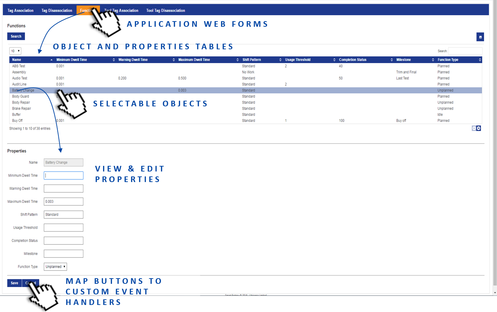

Skip To Main Content

  * placeholder

Filter:

  * All Files

Submit Search

   

You are here:

[Software Version](../../FrontMatters\(Online\)/features-and-versions.htm):
3.2

# Web forms

Customizable screens showing role-specific lists and forms based on current
data objects, types and business object properties

## Summary

Web forms are a browser-based interface that display textual data from the
Ubisense data model to end users, and optionally allow the entry of data.

## Features

The set of interface screens shown to a user is configurable based on their
role memberships. Similarly, users can be allowed to enter data into these
screens using configurable forms, and this data is written into the data
model. The screens update dynamically, and columns and rows can be also be
colored based on data.

Web forms can be accessed from a wide variety of client devices, ranging from
desktop computers to tablets and phones, and do not require installation.

   

* * *

[www.ubisense.net](http://www.ubisense.net/)  
Copyright © 2020, Ubisense Limited 2014 - 2020. All Rights Reserved.

