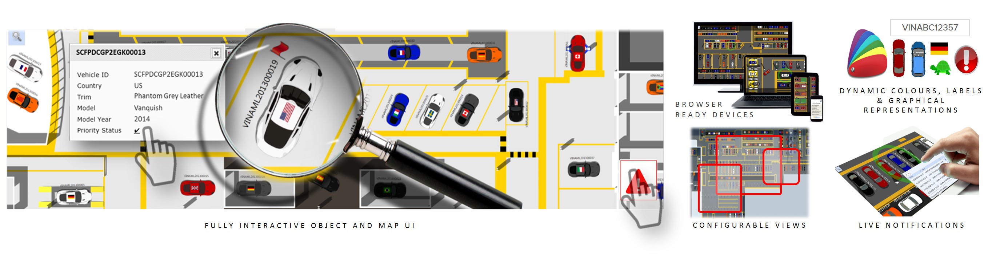

Skip To Main Content

  * placeholder

Filter:

  * All Files

Submit Search

   

You are here:

[Software Version](../../FrontMatters\(Online\)/features-and-versions.htm):
3.2

# Web maps

Real-time views of the locations of tracked assets, with role-specific
searches, representations, details and alerts

## Summary

The web map is a browser-based interface that displays the current locations
of tracked assets. It supports role-specific searches that can be configured
to the needs of specific types of end user. Each search can be set up with
appropriate representations of assets, including labels and annotations based
on [Business object properties](../Business rules/business-object-properties-
business-rules.htm). Searches also return textual data about assets, both in
summary and detailed form. The map can also display current raised alerts
relevant to the user.

Web maps can be accessed from a wide variety of client devices, ranging from
desktop computers to tablets and phones, and do not require installation.

   

* * *

[www.ubisense.net](http://www.ubisense.net/)  
Copyright © 2020, Ubisense Limited 2014 - 2020. All Rights Reserved.

