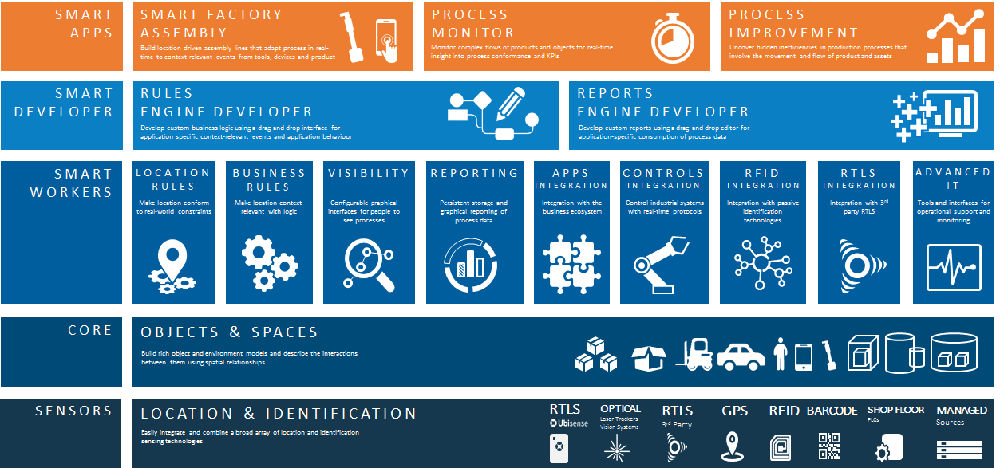

Skip To Main Content

  * placeholder

Filter:

  * All Files

Submit Search

# UbisenseSmartSpace

Ubisense SmartSpace is a modular software platform that manages real‑time
location and identification data from multiple sources to support
industrial‑scale mission‑critical visibility and control.

SmartSpace makes it easy to build, deploy and manage software applications
that can detect and respond to real-world physical interactions between
people, things, and the environment. The modularity of SmartSpace means that
users can license only the functionality they will need for their specific
location‑aware applications.

To facilitate building sensor-rich, industrial-scale implementations,
SmartSpace is fully sensor-independent, meaning it can take in and handle
location and identification events from almost any data source, including
third‑party sensors, third-party tag readers, barcode or other software
systems (such as RDBMS, ERP or MES).

Scalability and real-time performance lie at the core of the SmartSpace
architecture, allowing users to build applications that scale from
micro‑installations (small control systems running on a single machine)
through to large sites with several servers and thousands of sensors, devices,
people, etc., all with predictable performance.

##  Modular Platform

SmartSpace is divided into a set of functional blocks that can be plugged
together in different ways to create new types of location‑aware business
applications. Each component supports a number of different features that are
common to the theme of that component. For example, the [Location
rules](ComponentandFeatureOverview/TopLevelComponents/location-rules.htm)
component provides application-level control over object location, giving you
options to constrain object position via models of the environment, driving
object location via the location of other objects, or detecting important
location state for objects that can drive business process.

This website introduces the SmartSpace components and provides detailed
descriptions of the available features. It also provides step-by-step
information for installing and configuring your SmartSpace software and
additional in-depth technical information about SmartSpace.

Components are divided into three major layers:

  * Core
  * Smart Workers
  * Smart Developer

  * [SmartSpace Core](ComponentandFeatureOverview/TopLevel/core.htm) is a fundamental component for all SmartSpace applications, enabling the building of rich object and environment models and the description of the interactions between them.
  * [Smart Workers](ComponentandFeatureOverview/TopLevel/smart-workers-introduction.htm) consume the object data provided by the Core to generate business activity events and deliver information to business systems and users through integration paths and graphical interfaces. Smart Workers are also used to integrate third-party sensor systems such as barcode, RFID and RTLS.
  * Building new business logic or historical reports is enabled through the [SmartSpace Developer](ComponentandFeatureOverview/TopLevel/Developer-introduction.htm), allowing SmartSpace customers to fully customize or extend defined functionality or create new application behavior and reports.
  * Smart Apps are preconfigured implementations of SmartSpace for specific industries and applications. Smart Apps are not described further on this website.

[About this site](ComponentandFeatureOverview/FrontMatters\(Online\)/about-
this-site.htm)

[www.ubisense.net](https://www.ubisense.net/)  
Copyright © 2020, Ubisense Limited 2014 - 2020. All Rights Reserved.

