Skip To Main Content

  * placeholder

Filter:

  * All Files

Submit Search

   

You are here:

[Download as
PDF](../../../../SmartSpaceDownloads/B7GZWZS4WX9F/UbisenseArchitectureProtocols.pdf
"link to PDF version of this content")

# Ubisense Architecture and Protocols

# Introduction and key principles

UbisenseSmartSpace and DIMENSION4 products are built using the same
architecture that has been in use in large-scale installations for over a
decade. As a result, the underlying protocols and techniques have been proven
in many different environments on various computing platforms. This section
explains the principles behind Ubisense operation, focusing on SmartSpace, by
describing:

  * the underlying architecture of a Ubisense system, the protocols it uses, how a system is decomposed into components, and how components are mapped onto processing units
  * the most important services within SmartSpace, their role and usage
  * how operational management of SmartSpace is done
  * the SmartSpaceVisibility component, how it uses web protocols, and the relevant security considerations
  * how SmartSpace supports various use cases relating to scalability and multi-site operation

The key principles underlying the SmartSpace and DIMENSION4 architectures are
as follows:

## Homogeneity

All Ubisense data is managed using the same basic unit (the schema), and all
schemas manage data using the same underlying mechanisms. This means that
system test, management and optimization just requires that the maintainer
test and optimize one kind of thing.

## Dynamic Binding

Schemas are located using a simple discovery protocol that ensures that data
consumers will transparently rebind to schemas when they are restarted,
upgraded or migrated between machines.

## Asynchronicity

Synchronization between processes is kept to the minimum possible level:
consumers use locally-cached data to eliminate contention for data; cached
data is updated using an asynchronous protocol; and remote operations may
optionally be asynchronous.

## Modularity

Schema data can only be changed by external agents using well-defined remote
operations interfaces, ensuring that contracts are clearly defined and schema
implementations are replaceable.

## Low Latency

Data consumers in real-time location-driven control systems typically evaluate
some kind of variably-complex query triggered by one of a number of events.
Ubisense consumers use locally-cached data, ensuring that the data that they
need is present in their address space when they need it.

## Elasticity

Ubisense systems can run on one or many machines, and because Ubisense schemas
can be migrated seamlessly, processing resources can be added at runtime. The
combination of dynamic binding, asynchronicity, and local caching means that
it is easy to run multiple copies of data consumers (e.g. web map, search
support), so new instances can be added at runtime to support increasing user
activity.

# Service and protocol architecture

## Schema Services

The diagram below shows a view inside a typical schema implementation, showing
the data store, reliable multicast event channel, persistence layer, remote
operations interface and behavioral implementation code.

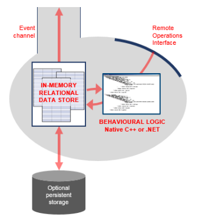

## Schema Clients

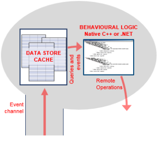

## Processes and Cross-schema Synchronization

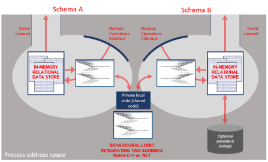

In general, arbitrary numbers of schema clients and servers can be used within
one address space.

## Building Applications – An Example

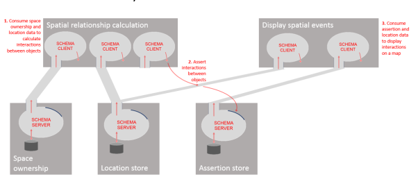

# Protocols

## Configuration Protocol

The configuration protocol is used by all Ubisense processes to establish
parameters relevant to the other protocols which they will be using. For
example, whether to use unicast or multicast IP for the operation of the
system, the multicast port to use for service finding protocol requests, and
other details relevant to overall system operation.

The configuration server is contained in the core Ubisense server (described
in Core Services). The configuration protocol proceeds by sending a single UDP
configuration request packet to port 49980 at a target address; the server
responds with configuration data. A series of target addresses is tried until
a response is received, in this order:

  1. If we are in unicast cluster mode, each of the addresses in the cluster
  2. The address given by the DNS entry ubisenseconfig
  3. The local host
  4. The broadcast address on the local subnet

The general configuration procedure uses a combination of local and networked
data. The sources of configuration parameter values, from the highest to the
lowest priority, are:

  1. Any file called platform.conf in the folder where the running executable is located
  2. Global parameters from the core server and retrieved by this configuration protocol
  3. The registry key HKLM\Software\Ubisense 2.1\Platform\Config on Windows
  4. A machine-level file platform.conf located in a central folder on the machine that the service is running on (by default on Windows: <installdir>\bin, on Linux: /etc/ubisense)
  5. Default values built into the executables

Service Finding Protocol

Service finding uses a simple discovery protocol that uses the same underlying
multicast abstraction as the event channel protocol. This protocol supports
discovery of an IP address and port number for the remote operations interface
of a named service.

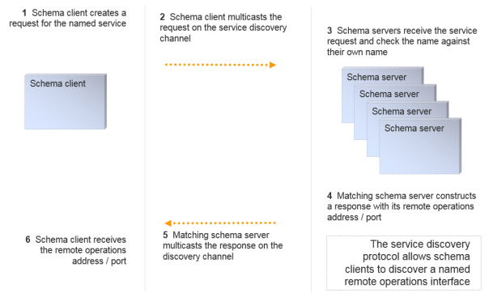

Remote Operations Protocol

The remote operations invocation protocol is built on top of UDP unicast. The
protocol supports reliable synchronous RPCs, and also supports unreliable RPCs
that are fully asynchronous, generally involving a single IP packet send.

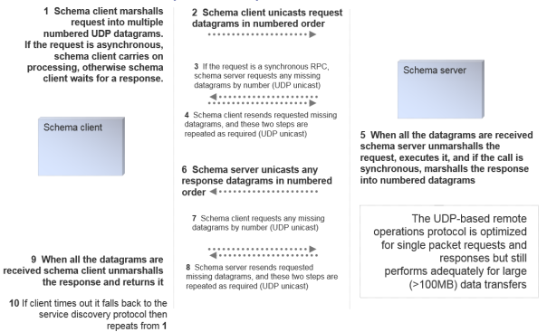

## Event Channel Protocol and Schema Cache Update

The event channel protocol uses SRM
([http://www.icir.org/floyd/papers/srm_ton.pdf](http://www.icir.org/floyd/papers/srm_ton.pdf)),
a well-known reliable 1:N protocol that scales well for the distribution of
events to consumers. When well-tuned in a low packet loss environment, this
protocol is as efficient as an unreliable multicast channel, but it also
supports a NAK-based extension that guarantees reliable delivery and packet
labeling that guarantees in-order delivery.

SRM relies on an abstraction of an underlying multicast transport. In a
Ubisense system, this can be configured in one of three modes, selectable at
runtime:

  * Using IP Multicast, where one or more event channels can be assigned to a fixed multicast group. This approach is the easiest to manage and works well for systems spread across a large set of machines, but is not always supported by IT department policies.
  * Using a (small) nominated set of N unicast addresses, where multicast sends are simulated by N separate unicast addresses. This approach works well for clusters of up to around a dozen machines. Very often this mode is used with N = 1, implementing a Ubisense system that runs on one single server. 
  * Using ‘standalone’ mode, where event channels are mapped to the localhost broadcast address. This mode is generally used for configuration and informal test of non-production systems, where the configuration user will run the test system on their personal machine.

The schema cache update process uses a combination of the remote operations
protocol and the event channel protocol. When a schema client starts:

  1. It uses the service finding protocol to discover the IP address/port of the required schema service
  2. It invokes the operation get_group on the service to retrieve a suitable IP address/port to listen for event channel messages
  3. If it is a caching client, it invokes the operation get_dump to retrieve a copy of the cache that it requires
  4. Finally, it listens on the event channel for messages (using the event channel protocol), and updates its cache accordingly, generating events for its own local application code

If any of the levels of operation fails, the schema client will fall back to
the lower level. For example, if the event channel protocol fails (e.g. if
very severe packet loss exceeds the size of a recovery window, the client will
invoke get_dump again to recover its data and then proceed with the event
channel protocol; or if the schema service is stopped and restarted on another
machine, the client will fall back to the service discovery protocol to find
the new location of the service).

The schema cache update process client-server interactions look like this:

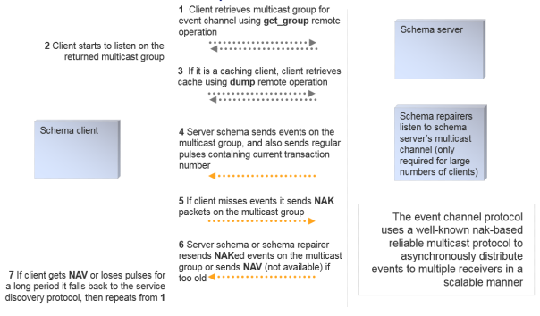

## Encryption and Authentication

The event channel and remote operations protocol may both be configured to be
encrypted using AES-128 encryption. This can be done at the granularity of
individual schemas, providing three levels of access:

  * No encryption – full read/write access to all
  * Encryption of remote operations (apart from the get_group and get_dump operations, which cannot be used to modify data), but no encryption of event channel – full read access to all, but write access restricted to key holders
  * Encryption of both protocols – read and write access restricted to key holders

The key exchange for this encrypted data (using an AMP protocol) provides an
authentication procedure for individual schema access. Ubisense includes a
schema that implements a standard role-based access control model, providing
security at the schema level.

A detailed discussion of the Ubisense schema security model, encryption and
authentication protocols, can be found in [Ubisense Architecture: Schema
Security](../../../UserResources/Core/Securitymanager/security-manager-
configuration.htm).

## Protocol Tunneling

A protocol tunnel is included in Ubisense, to allow the protocols to run over
any network that supports TCP. The basic tunnelling component implements a
schema server on one side and the corresponding schema client on the other
side, as shown in the diagram below. The schema server forwards remote
invocation traffic over TCP to the schema client, where it is retransmitted;
and the schema client forwards event channel traffic over TCP to the schema
server, where it is retransmitted.

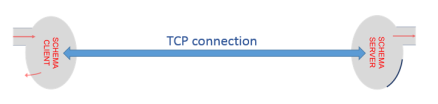

Each side of the tunnel connection can support any number of schema clients
and servers, so the tunnel can connect two arbitrary sets of Ubisense
processes over any network that supports TCP.

# Partitioning

The Ubisense architecture supports many ways of partitioning services in order
to increase the options for scalability. In general, it is possible to run
multiple copies of the same service in order to provide load balancing. This
can be achieved very simply in some cases where services just consume data for
delivery to other systems (e.g. a service which displays maps over the web may
have many copies according to user requirements). But when services actually
store and publish data, some kind of data partitioning scheme is required. The
most important partitioning scheme in SmartSpace is cellular partitioning.

## Cellular Partitioning

SmartSpace manages location data using a cellular architecture. This ensures
that:

  * systems can scale to cover large physical areas by splitting the areas up into cells, and
  * real-time data for nearby objects is generally handled by the same schema instance

The cellular decomposition is generally into a hierarchy with three levels as
shown in this diagram. Each of the levels has its own special role.

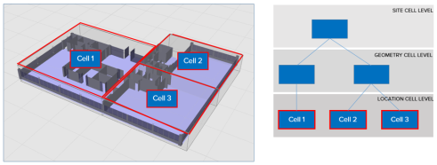

The cells are used to create a kind of schema federation: a service can run at
the level of a Site, geometry cell, or location cell, and in the case of
geometry and location cells multiple copies of the service will be run. This
diagram shows an example with services organized according to the hierarchy
above, showing just the ‘location management’ services; each location cell
level schema has a copy running for each location cell, each geometry cell
level schema has a copy running for each geometry cell, and each site level
schema has one copy:

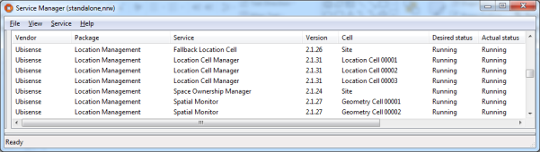

## Location Cells

Location cell level is where location data (e.g. (x,y,z), rotation, …) is
managed, by location cell manager schemas. One location cell manager schema
runs for each location cell. The data in a location cell manager is usually
directly input from sensor systems, or set manually by a remote operations
interface. In a vehicle production plant a location cell might cover (e.g.)
one or more individual bands of a production line, the space between two
production lines, part of a logistics area.

The aggregate event rate across all the location cells is generally equal to
the total event rate produced by all location sensor systems being used. As
the location sensor systems become more capable, and generate higher event
rates, the event rate at location cell level will increase.

## Geometry Cells

Geometry cell level is where relationships between objects are evaluated. The
key component of this is the spatial monitor schema. One spatial monitor
schema runs for each geometry cell. The spatial monitor process consumes data
from all the location cells underneath it, together with data from the spatial
ownership schema, and publishes a new schema that contains the set of all
interactions between objects within its cell.

A very important property of the geometry cell is that the aggregate event
rate of interaction data is essentially independent of the event rate at the
underlying location cells. For example, a tool tracked at 10Hz generates 10
location events per second, but if it is placed inside a vehicle it generates
one interaction event (when the interaction is asserted), and then no other
events until it is removed again (when the interaction is retracted). Thus
geometry cells isolate applications from the high data traffic generated by
sensor systems.

## Site Cell

There is normally a single Site cell, where data is managed if it does not
have a significant real-time component. For example, this includes site layout
and appearance, most properties of objects, details of the spatial properties
of objects and so on.

## Cellular Applications

An important feature of SmartSpace is that application logic itself should
execute at an appropriate level in order to avoid creating bottlenecks in
applications. For example, application logic that processes (x,y,z) location
data will execute at location cell level to ensure that it scales correctly as
the system size increases.

## Aggregation

Sometimes it is desirable to have an overview of all data at Site level, but
this needs to be done without concentrating a massive event rate at a single
service. To achieve this we use aggregated services. An aggregated service has
copies (i.e. processes containing schema servers with the same signature) that
run at all the cells above some specified level. An aggregation client running
at some level will consume data from the schema at its level and throttle the
event rate so that it changes the state at the schema in the parent cell with
some configurable rate limit. In this way the top level cell will manage data
that aggregates the data below it but maintains a configurable upper limit on
the event rate.

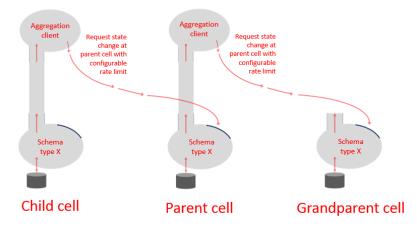

One of the most important aggregated services in SmartSpace is the location
aggregation service, which generates a Site level view of location data with a
guaranteed rate limit. The diagram below shows the location aggregator
services running in the configuration defined previously.

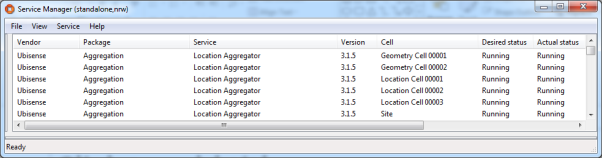

# Processing

## Processing Nodes

A processing node is a computer with networking and (optionally) non-volatile
store. A Ubisense system can contain one or many processing nodes.

One processing node is chosen to host the Ubisense core services. These are a
small set of basic schema services that are necessary to describe the
structure of the system and manage its fundamental configuration data. All
other services may be deployed to any processing node. Processing nodes can be
added or removed at runtime and services may be freely migrated between them.

Processing nodes may run Linux (basically any post-2.6 kernel) or Windows
(basically any post-XP OS version). The same system may contain both Linux and
Windows processing nodes freely mixed.

## Ubisense Service Administration Schema

The service administration schema is a Ubisense schema that manages all the
data relevant to schemas, their level in the cell hierarchy, their assignment
to processing nodes, and their status.

### Mapping cells and services to nodes

Normally it makes sense to nominate a processing node that a group of services
would be expected to run on, perhaps because the services in some group
communicate heavily with each other and would run more efficiently on the same
machine. In the service administration schema, nodes can be assigned to
services individually, or nodes can be assigned to a cell, and indirectly to
all the copies of services running within that cell.

### Ubisense file server

The service administration schema works together with a file server that
stores relevant files (e.g. service executables, data files, and resources
like COLLADA models or SVG images).

### Managing service status

The service administration schema allows the user to specify the desired
status of a service or services at a given cell or cells. Example status
values might be: running on node N; stopped on node N; not assigned to any
node. The schema also records the actual status of each service/cell pair.
Service administration then ensures that the actual status is changed so that
it matches the desired status.

### Local controllers

The operations necessary for service administration are performed by a special
service called the local controller, a copy of which runs on each processing
node. The local controller contains a service administration schema client,
and its job is to download, start, stop, or upload executables and data files
to ensure that the actual state matches the desired state.

For example, if the location cell server at Cell 1 is assigned to node N1, and
it is reassigned to node N2, the controllers on the respective cells do the
following:

  * N1: stop the process for the location cell server at Cell 1
  * N1: set actual status of location cell server at Cell 1 to stopped
  * N1: write back any modified data files to the file server
  * N1: set actual status of location cell server at Cell 1 to not assigned to any node
  * N2: set actual status of location cell server at Cell 1 to assigned to N2
  * N2: read required executable and data files from the file server
  * N2: start the process for the location cell server at Cell 1
  * N2: set actual status of location cell server at Cell 1 to running on N2

## Third-party Service Administration

Ubisense service administration is especially convenient for managing
SmartSpace, because it is aware of the fundamental concepts of cells and
services. But it is also possible to run a Ubisense system using some third-
party management software if this is desired, replacing the Ubisense
administration methods and not using the local controllers.

## Elasticity

In some cases it is desirable to have a mixture of Ubisense service
administration and third party administration systems. A good example of this
is in managing visibility applications in some environment with a large user
population, which is handled very well by running some SmartSpace services
within an existing elastic computing framework, and simultaneously running
real-time control systems using high-bandwidth sensor systems, which is
handled best by running other SmartSpace services within the standard Ubisense
service administration framework.

### Working with standard elastic computing services

The SmartSpace web map is composed of three main components: a query service
that uses multiple caching schema clients (including the user data schema, the
aggregated location schema, and search configuration schema) and performs
queries over user data, returning results to a web service hosted by a web
server that deals with http invocations directly to update a web client that
manages the user interactions, executing queries and displays the results on a
map.

In the default distribution, a single copy of the query service is configured
to be run by the service administration support at site level. But it is
simple to reconfigure the service administration schema so that the query
service is not directly managed by Ubisense, and instead to package all three
web map services within an elastic computing environment. Using standard
techniques, multiple copies of the three services can be executed by the
elastic computing environment, according to demand.

Because the query service retrieves its data using the Ubisense event channel
protocol, which is 1:N and asynchronous, and stores data in a local cache,
extra copies of the web service can be created without adding any additional
synchronization overhead to the SmartSpace platform. Therefore, with
sufficient processing resources, the package of services can be made to scale
to an essentially unlimited user population.

### Repartitioning the cell hierarchy

Standard commercially available techniques for dealing with scale do not work
so well when we need to sink data at high update rates from sensor systems,
while detecting interactions between arbitrary pairs of objects. In order for
a computing system to detect an interaction between two data items, those
items must both be present in the same process address space at some point,
therefore standard partitioning techniques will not work because they rely on
random assignment to processing units. This is why the SmartSpace platform
supports cells as a basic concept.

If the aggregate data rate at an individual cell becomes excessive then using
SmartSpace it is possible to reconfigure the cell hierarchy on the fly e.g. to
split a location cell into two, or to add extra geometry cells. When this is
done, service administration ensures that the relevant SmartSpace schemas are
automatically deployed to appropriate nodes and started with the relevant
data, and client schemas rebind dynamically to the new processes.

# Important SmartSpace services and their role

## Core Services

The core services are a small set of services that are required in order to
run any Ubisense system. They include: the inheritance database, which stores
the Ubisense multiple inheritance type hierarchy; the cell configuration
schema, which stores the cell hierarchy; the service administration schema, as
discussed in the previous section; the permissions schema, which stores the
role based schema security configuration; the multicast assignment schema,
which stores assignment of multicast channels (if multicast is used) to
schemas; the global configuration schema, which stores configuration
parameters relevant to every Ubisense service (for example, configuration of
the basic protocols); and the file server, which is used in the service
administration process.

The core services typically have a very low event rate, and their schemas
store a fairly small amount of data.

## Location Cell Manager

The location cell manager stores and publishes location data. It runs at
location cell level. It includes various techniques for handling high update
rate streams (e.g. from tagged objects), which also managing storing data
reliably (e.g. the positions of stationary objects placed manually during
configuration).

## Spatial Monitor

The spatial monitor translates location data into spatial relationships. It
runs at geometry cell level. The spatial monitor is a fundamentally important
service that translates raw location data into spatial relationships that are
relevant to applications and simultaneously isolates applications from the
high data traffic generated by sensor systems.

## Location Constraints Services

Location constraints services use real-world context information together with
tag data to derive more accurate location for the objects driven by tags. For
example:

  * Using data about paths and queues to constrain object positions. For example, on a vehicle production line cars move along a fixed line at a near constant velocity, frequently with fixed distances between the car tags. This information can be used to constrain car positions to a much more accurate result than the underlying tag data.
  * Using data about parking spaces to constrain object positions. For example, in a yard, vehicles are parked in certain parking bays with a given orientation. This information can be used to help determine which bay a car is parked in and to fix the orientation of the car.

These services are all schema clients running at location cell level, normally
caching the relevant location cell data and modifying it using the remote
operations interface, or occasionally running in the same process as the
location cell manager itself.

## User Data Store and Rules Engine

The user data store manages arbitrary user-configured properties of objects.
For example, some piece of tooling equipment might have a count for the number
of times it has been used, a date for when it was last recalibrated, and
thresholds for the required frequency of recalibration expressed as a
combination of time interval and number of uses since the last calibration.
All this data can be defined as user-defined properties and stored in the user
data store.

In addition the user data store contains a rules engine. Using the rules
engine it is possible to express logical relationships between properties of
user data. For example, the conditions under which a tool needs recalibration
can be expressed using the rules engine; this data would then be available to
alert maintenance staff and direct them to the location of the tool on a map.

## Assertion Store

The user data store is primarily for supporting visibility applications that
require an overview of a site (or multiple sites). The assertion store is a
store of application-level facts that are more geared towards real-time
control applications; for example, while the user data store might deal with
data about a tool’s calibration status, the assertion store might deal with
facts like ‘the tool is next to product X in workspace Y’. The assertion store
runs at geometry cell level and at site level and is also partitioned into
separate schemas depending on activity, to provide multiple low latency event
channels for control applications.

## Search Client Interface

The search client interface implements the query service described in the
section above about elastic services. It has a schema client cache of the user
data store and provides configurable searches and display styles for use by
people taking various operational roles in the site.

# SmartSpace platform operational use cases

## Remote Access

The protocol tunnelling capability is packaged into an application called Site
connector. This can be run as a service (e.g. to connect two separate sites
together across the public internet), or as an application (e.g. on a laptop
running a set of Ubisense administration tools, to perform remote
administration).

It is common practice to manage large production Ubisense software
installations remotely via Site connector.

## Installation

Services are shipped in packages that contain an XML description file plus one
or more of: executables, libraries, resources and data files. Services are
installed by using the service installer, which caches the service
administration schema and is also a client of the file server. The service
installer reads the description file and updates the service administration
schema to register the new services and uploads the required files to the file
server.

Service installation is done entirely using Ubisense protocols so it can be
done from any machine in the Ubisense network, or remotely via the Site
connector application.

## Upgrade

The service administration schema includes version information, so service
upgrade is just a question of installing the appropriate new service version
using the service installer.

Because of the dynamic binding properties of the Ubisense architecture,
upgrade of individual components can be performed while all other components
are running. Any necessary rebinding is accomplished automatically.

## Simple Backup

The service administration schema provides support for a simple, stop-and-copy
backup. If this is selected a service/cell pair, the relevant local controller
stops the corresponding process, copies its data files back to the central
file server, and restarts the process. This ensures that the central server
contains a copy of correct data for that service/cell pair at the time of the
backup.

## Replication and Hot Backup

All Ubisense schemas support a replication option that acts at the level of
the commit logs in the schema persistent store; every commit log write is
duplicated with another write to a replication queue; the replication queues
are consumed by a replication daemon that writes over TCP to a remote client,
which reconstructs the schema data files on a remote store. This mechanism is
used to support asynchronous replication of all the schemas on a given
processing node, and is a convenient way of implementing a hot backup in
software.

It is also possible to achieve replication by using a SAN attached to one or
more processing nodes, and using hardware replication support at the level of
the SAN.

## Failover

The service administration schema contains the complete specification of the
system state, referring to processing nodes by name. The local controller
service that runs on each processing node includes the option to specify a
node name at run time, so it is possible to implement a failover mechanism by
using any supporting replication method together with a set of scripts that
run up local controllers with a suitable name specification.

## Shadow Systems

In order to support operation of shadow test servers, Ubisense schemas also
support a ‘property transfer’ mechanism that supports injection of selected
data changes from a source to a target Ubisense installation. This can be used
to take data from a production system and inject it directly into a test
system, to provide realistic regression and new feature test support.

# SmartSpaceVisibility

The SmartSpaceVisibility component differs from the other components in that
it provides various user interface via a web server, and therefore uses
standard web protocols as well as the protocols used by the rest of the
SmartSpace schema services. This section describes the web site structure, how
it interoperates with the rest of the Ubisense system, and the relevant
security considerations.

## Basic Structure of the Web Site

The web site is separated into front-end and back-end. The front end is
concerned with authentication and the serving of web site pages, JavaScript
code, style sheets and image resources to the web server clients. The back end
is concerned with processing application logic, such as search execution,
updating platform state based on front-end requests, and integrating with
other components of the SmartSpace platform.

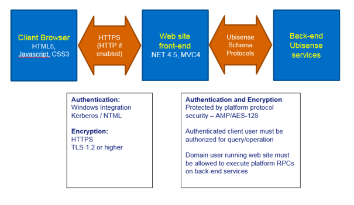

## Web Site Front-end

### Implementation

The web site front-end is implemented using Microsoft MVC4.0 hosted in an IIS
web site. The web site will use the configured IIS ports, which should
typically be 443 for https, and port 80 if http is also allowed.

The web site folder structure is split into MVC areas, where each area
implements a single tab in the web site front page, for example “Maps” or
“Reports”. For example, all content web pages for the Maps area is under the
relative URL SmartFactory/IF. This corresponds to the folder
<webroot>/Areas/IdentifyFind/.

Browser code is entirely HTML5/CSS3/javascript. The content of the pages is
dynamically build using queries back to the front-end via GET and POST verbs.
When the user changes application state, such as acknowledging an alert or
setting an object property, these are also implemented via GET verbs back to
the front-end. These query and operation requests are served from separate
URLs within each area, so for example the queries for the Map are served from
the relative URL SmartFactory/IFAPI. These queries are authenticated by IIS,
and then passed directly from the front-end to the back-end services for
execution, along with the authenticated user and the locale of their browser
for translation purposes.

Query data is encoded using JSON, and the JavaScript code maintains a strong
separation of content from code. For example, query results are always escaped
before insertion into HTML as text, to prevent HTML or JavaScript code
injection based on data. One exception is that specific formats of HTML links
(<a>…</a>) are allowed in presented data, but only with a very limited format
to avoid injection.

Communication between front-end and back-end is via normal Ubisense platform
RPCs.

### Security

Since the web site uses .NET for its server side code, it is important that
security updates to .NET should be regularly applied. Since this is a widely
used dynamic web site technology, these are high priority within Microsoft.

For a secure installation, best practice for hardening IIS should be followed,
for example:

  * configuration to use HTTPS only, using the latest protocols (e.g. TLS-1.2 or higher)
  * ensure that detailed error pages are not visible to external users
  * limit the maximum size of requests handled
  * filter requests by source domain name if possible

Authentication is implemented via windows integrated authentication. If NTLM
v1 is enabled for the server and domain, this will be available to the IIS
server front-end. However, IIS can be configured to require Kerberos
authentication if NTLM is not secure. This is recommended, since NTML v1 has a
number of vulnerabilities.

Communication between front-end and back-end can be secured in the normal
manner using the platform Security Manager. In particular, if the IIS
application pool for SmartSpace Web is configured to run as a domain user, the
platform protocol can also be configured to secure the relevant schemas for
access by that domain user (the detailed instructions are included with the
Visibility component software).

## Web Site Back-end

### Implementation

The back-end uses the Ubisense platform protocol to communicate with the
front-end. The back-end runs as normal Ubisense services which are deployed
and controlled through the Ubisense service manager. They need not be running
on the same server as the IIS web site.

### Security

See the separate discussion of Ubisense protocol security for a description of
how the protocols are secured.

The back-end implementations of queries and operations first check that the
authenticated user passed from the front-end (with integrity protected by the
platform protocol security) has a role which is authorized to perform the
query or operation. If LDAP has been configured for the SmartSpace platform,
the users and roles can be LDAP users and roles, to allow central maintenance
of authorization.

The only back-end scripting facilities are in the SQL interfaces (Applications
integration component and Reporting component).

The Visibility component has no scripting, so code injection in the back-end
is not a direct concern. For SQL interfaces, all JSON data is always either
escaped before execution, or is presented as binary parameters to the SQL
instance, so it cannot be misinterpreted as code.

# SmartSpace platform scalability use cases

## Aggregate Event Rates and Latency

Key scalability features: By using the inbuilt support for cellular
partitioning it is possible to divide up a space into cells, and run copies of
the application logic at each cell. Each process has its own asynchronously-
updated cache of the data that it uses, so there is no contention or
synchronization overhead across cells. Processes can be assigned to the same
machine or to separate machines in an arbitrarily-large cluster.

We have deployed real-time control systems using a single machine (8 Xeon
4-core), with an aggregate location event rate of ~3500Hz, simultaneously
detecting interactions between 1000 vehicles, 250 tools and 100 handheld
devices and applying simple location rules to send messages to remote devices
with latency <100ms.

In this case cell partitioning is 17 location cells, 9 geometry cells, with a
total of about 80 processes handling control system data. This machine is also
running the RTLS system management services. We estimate that by adding
processing alone (extra machines in a cluster) and deploying services across
the processing, aggregate event rate could be raised to approaching 105Hz with
no increase in latency.

## Large Numbers of Objects

Key scalability features: Object memory footprint is small (7 x 32bit words
per object reference). Type and format descriptors are stored separate from
data to ensure that storage space is limited to the data itself.

For storage of objects without significant application-level behavior (e.g.
logistics applications) about 105 objects for an individual type is a
reasonable figure. For objects with complex near-real-time behavior (e.g.
product going through a complex process of production, rework, test and yard
storage), our Offline application is designed to deal with over 10,000
vehicles across a single site, keeping track in real time of process state,
timeouts and alerts.

## Large Numbers of Users

Key scalability features: As described in the earlier section on Elasticity,
schema client processes that use data from multiple schema servers can be
copied. Because the Ubisense schema clients receive data using the Ubisense
event channel protocol, which is 1:N and asynchronous, and store it in a local
cache, increasing the number of client processes does not add any
synchronization overhead to the producer services.

It is therefore possible to support large numbers of thick client applications
on a Ubisense system because the individual client processes do not themselves
add any overhead on the server side.

# SmartSpace multi-site operation use cases

The SmartSpace platform is normally intended to be deployed at individual
sites, but it has also been used to support multi-site operations. This
section outlines the different options and use cases.

## Single System, Multiple Sites

For example, to support distributed production of airliners, we have deployed
the Ubisense software across six separate factories across Europe. In this
case we used a single central processing node and separate individual
processing nodes at each factory, connected to the central node via the site
connector protocol tunnel. The relevant location and geometry cells were
migrated to the individual factories, with the site level services running at
the central server. Because services in separate cells are isolated, there is
no need to support communications between individual factories.

## Multiple Systems, Application Integration

Another approach to multi-site operation is to run multiple systems and
integrate at the level of application data. In general, real-time control
applications are only relevant to the local site, so the value of multi-site
operation is in the area of visibility. It is likely that SmartSpace can
support the relevant visibility use cases by using its support for
hyperlinking: for example, suppose a product is assembled at a certain site
and it has components assembled at another site, it is possible to view two
different maps simultaneously by simply hyperlinking to the relevant objects
specified by name.

  * Ubisense Architecture and Protocols
  * Introduction and key principles
    * Homogeneity
    * Dynamic Binding
    * Asynchronicity
    * Modularity
    * Low Latency
    * Elasticity
  * Service and protocol architecture
    * Schema Services
    * Schema Clients
    * Processes and Cross-schema Synchronization
    * Building Applications – An Example
  * Protocols
    * Configuration Protocol
    * Event Channel Protocol and Schema Cache Update
    * Encryption and Authentication
    * Protocol Tunneling
  * Partitioning
    * Cellular Partitioning
    * Location Cells
    * Geometry Cells
    * Site Cell
    * Cellular Applications
    * Aggregation
  * Processing
    * Processing Nodes
    * Ubisense Service Administration Schema
      * Mapping cells and services to nodes
      * Ubisense file server
      * Managing service status
      * Local controllers
    * Third-party Service Administration
    * Elasticity
      * Working with standard elastic computing services
      * Repartitioning the cell hierarchy
  * Important SmartSpace services and their role
    * Core Services
    * Location Cell Manager
    * Spatial Monitor
    * Location Constraints Services
    * User Data Store and Rules Engine
    * Assertion Store
    * Search Client Interface
  * SmartSpace platform operational use cases
    * Remote Access
    * Installation
    * Upgrade
    * Simple Backup
    * Replication and Hot Backup
    * Failover
    * Shadow Systems
  * SmartSpaceVisibility
    * Basic Structure of the Web Site
    * Web Site Front-end
      * Implementation
      * Security
    * Web Site Back-end
      * Implementation
      * Security
  * SmartSpace platform scalability use cases
    * Aggregate Event Rates and Latency
    * Large Numbers of Objects
    * Large Numbers of Users
  * SmartSpace multi-site operation use cases
    * Single System, Multiple Sites
    * Multiple Systems, Application Integration

   

* * *

[www.ubisense.net](http://www.ubisense.net/)  
Copyright © 2020, Ubisense Limited 2014 - 2020. All Rights Reserved.

