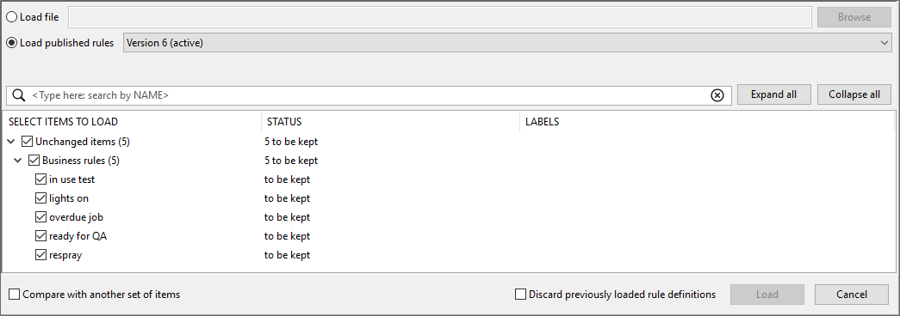

Skip To Main Content

  * placeholder

Filter:

  * All Files

Submit Search

   

You are here:

[Download as
PDF](../../../../../SmartSpaceDownloads/B7GZWZS4WX9F/SmartSpaceModuleExport.pdf
"link to PDF version of this content")

[Software
Version](../../../ComponentandFeatureOverview/FrontMatters\(Online\)/features-
and-versions.htm): 3.5

# Module import and export

The Load and Save capabilities in the Business rules workspace enable the
import and export of business rules from SmartSpace. From SmartSpace version
3.5, import and export is achieved via the creation of modules of rules and
any selected dependent items. These modules can also be used with other parts
of SmartSpace to enable the transfer of other configuration elements, such as
searches or reports, between Ubisense installations.

This guide describes the capabilities of Business rules export, and the
process for loading and saving modules. Additionally, it provides information
on other tools available for the transfer of assets between installations.

## Requirements

Business rules export requires a license for Business rules version 3.5 or
higher.

## How Business Rules Export Works

Business rules export enables the creation of modules comprising functionality
that is portable between Ubisense installations. Portable items (also referred
to as assets) can be identified for inclusion in a module by the use of labels
(previously only applicable to rule definitions). When saving items for
export, you can choose not only rule definitions but all assets that can be
included in a module. This allows, for example, the creation of a module
comprising a search for display on the web map, the properties and
representations used by the search, and the roles that can access it. To make
the selection of all required items easier, during module definition, when a
label is applied to an item, all dependent items are identified by the
software and can be labeled accordingly.

### Items that can and cannot be included in a module

Which items can be saved using the Business rules workspace?

  * Business rules
  * Custom types
  * Properties, both simple and complex properties
  * Representations
  * Roles
  * Screens
  * Searches
  * Reports
  * HMIs
  * Objects that have only a name property and inherit a type called Enumeration (referred to as enumeration objects)

What can't be saved using the Business rules workspace?

  * Ubisense types
  * Objects, other than enumeration objects
  * Shifts
  * Logged properties and logged locations used by exported Reports.

If a module is loaded with a Report that uses properties that are not already
defined in the dataset, then the logging of those properties or locations must
be configured manually. (Support for the saving of logged properties and
locations will be added in a future release.)

In general, configuration specific to an individual site cannot be labeled for
inclusion in a module. This includes objects used for defining location rules,
such as parking areas and paths; object instances, with the exception of
enumeration objects; and working time shifts. Other tools are available for
export and import of non-labelable items. See Other Import and Export Tools in
SmartSpace.

## Loading Modules

You can load modules along with any included dependent items from a file, or
currently active business rule definitions, or previously published versions
in your installation. When you choose a file or collection of rules, you will
be offered a list of items to load. By default, new and unchanged items are
selected. Items that are different to those which are current in your
installation (for rule definitions this means those that are available for
editing in the Business rules workspace), are not selected. This is to avoid
accidentally overwriting locally edited rule definitions. You can choose
changed items for loading to replace the current ones.

**Note:** It is important to remember that loading business rule definitions
does not make them active in SmartSpace. When you are ready to make them
active, you must publish them.

To load modules, in the Business rules workspace:

  1. Click Load to open a dialog where you can choose the source of the module and select items to be loaded.

  2. Choose the file or rules to be loaded.

     * To load from an external file, select Load file and enter the path and filename for the saved module, or use the Browse button to navigate to a file
     * To load current or past rule definitions, select Load published rules and select the current rules—labeled active—or a previous set from the dropdown
  3. With the module source selected, all available items are displayed in the categories: New Items, Changed Items, and Unchanged Items. By default, unchanged and new items are selected; changed items are not selected in order to avoid writing over locally edited rule definitions.

Select the items to load.

     * Use the Expand all button to display available items
     * Selecting a parent item selects all child items in that category
     * At <Type here: search by NAME> enter text (case sensitive) to search for items whose names match your input. Click  to remove the filter.

As you select items, information in the STATUS column indicates the result of
loading those items, and the number of items currently selected for loading is
shown in the Load _x_ item(s) from _source_ button.

If you already have modules loaded, choose how any conflicts will be handled
during loading by:

     * Selecting any changed items where otherwise they would be skipped and the current version retained
     * Choosing Cancel to abandon the process completely

To help you identify which items to load, you can open a second source for
comparison. Choose Compare with another set of items and choose another file
or published version (as described in step 2). Items are displayed in
categories: Only in source, Only in source for comparison, Identical,
Different.

  4. If you want to have only the items you select loaded and any definitions currently available in the Business rules workspace to be cleared away, select Discard previously loaded rule definitions.
  5. When you have selected the items you require, click Load _x_ item(s) from _source_.

All selected items are loaded and changes relating to non-Business rules
assets, such as searches, are applied immediately. However, before any
business rule definitions can become active, they must be published. See
[Publishing definitions](../../../UserResources/BusinessRulesDeveloper/rules-
engine-developer-config.htm#_Publishing_definitions).

## Saving Modules

Saving modules allows you to keep a copy of selected assets, including
definitions currently loaded in the Business rules workspace, and other items
the assets and definitions reference. You can use this functionality to create
a collection of types, objects, searches, rules and so on to encapsulate
specific business processes for use in other SmartSpace installations. Each
module is identified by a label and by applying a label to an asset you can
identify all dependent items for selection.

The recommended workflow for saving modules is:

  1. Select a file to save the modules to
  2. Create labels and apply them to assets
  3. Use the Add required labels button to apply labels to any additional items required by labeled assets
  4. Select the items you want to save
  5. Save the file

To save modules, in the Business rules workspace:

  1. Click Save to open a dialog where you can specify the content and destination of a collection of modules:

All items available for saving are listed with any previously-applied labels
shown in the LABELS column.

At any time in the you can:

     * Use the Expand all button to display available items
     * At <Type here: search by NAME> enter text (case sensitive) to limit the display to items whose names match your input. Click  to remove the filter.
  2. At Select a file to save enter the path and filename for the modules, or use the Browse button to navigate to a location or file.
  3. Create and apply labels.

     * Create a label by double-clicking <Create new label>, entering the name for the label and clicking Save.
     * Drag labels from the AVAILABLE LABELS list onto assets. Other items required by a labeled asset are indicated by the relevant label appearing in the REQUIRED LABELS column. Items labeled as required are those which are necessary for the module to work and whose omission will cause a future import to fail.
     * Slowly double-click an asset's current labels to open a dropdown from which you can select a single label to replace the current ones, or the blank entry to delete all labels from the asset. 
     * Highlight one or more assets (using Shift+click or Ctrl+click) and labels associated with the highlighted items are listed under ADDED LABELS. If labels are attached to only some of the highlighted items, they are shown inside [square brackets]. Deleting a label from the ADDED LABELS list, removes it from any items with which it has been associated without deleting the label itself.
  4. While you are adding labels, you can click Add required labels if you want any dependent items to be labeled too. If no items require labeling, the button is unavailable.
  5. Select the items to be saved.

     * Drag labels to the filters at the top of the screen to limit the displayed items to those that match the criteria you define.

     * Use the Select all and Unselect all buttons to select all or none of the displayed items.
     * Selecting a top-level category, such as Roles or Types, selects all items in that category.

As you add to your selection, the number of items to be saved is shown in the
Save _x_ item(s) button.

Make sure all required items are selected to ensure successful import of the
module.

  6. When you have specified the destination and selected the items to be saved, click Save _x_ item(s).

### Saving modules examples

#### Saving without labeling

Whilst the recommended method for saving makes use of labels, you can save
selected assets without the use of labels. For example, to save just the
business rules and no other items you:

  1. Select the file to save to
  2. Check Business rules in the list of items to save and all listed rules are selected
  3. Click Save _x_ item(s)

In this case, no dependent items are saved, and there would be no guarantee
that the rules would function if loaded into a different SmartSpace
installation.

#### Saving all items

You can save all available items by:

  1. Selecting the file to save to
  2. Clicking Select All
  3. Clicking Save _x_ item(s)

#### Saving a web form and all dependent items by using a label

With the use of labels, as the following example shows, all dependencies can
be identified and (optionally) selected to build a meaningful collection of
items into a module. Here, a form that lists products ready for despatch to a
selected country is to be saved.

First a label is created and is dragged onto the name of the form:

The label is added to the REQUIRED LABELS column for the following related
assets:

  * The search on which the form is based 
  * The types and properties used in the search
  * The roles to which the screen and form have been assigned

Additionally, the objects used in the search filter, here a list of countries
for selection when the form displays are available for saving. This is because
the Country type has only a name property and inherit an enumeration type. See
Items that can and cannot be included in a module

Clicking Add required labels adds the label to all the identified items. Note
that nothing has as yet been selected for inclusion in the module. The most
reliable way to ensure all labeled items are selected is to use one of the
filters. Drag the despatch label into a filter:

The list of items now shows only those items with the corresponding label:

Clicking Select all and then Save 19 items adds all the required assets to the
module.

#### Saving a module with space properties

The following example shows how a module that includes types with space
properties and a containment relationship requires a little more work to
ensure all dependent items are identifed and included in a module.

In TYPES / OBJECTS, the Product and Workspace types each have an extent
property:

In SPATIAL PROPERTIES, specific spaces have been defined for the area of each
workspace, a default space has been created for the product type, and a
request to monitor their spatial relationship has been defined. (See [Spatial
properties](../../../UserResources/BuildandCreate/SpatialRelations/spatial-
properties-configuration.htm) for further information.)

A complex property is defined for the spatial relationship between the two
types:

A business rule then makes use of the complex property:

To create a module containg this rule and all dependant items, in BUSINESS
RULES with the rule loaded, click Save. Creating a label and dragging it onto
the business rule and then clicking Add required labels results in dependant
items being identified. These are shown filtered by their label below:

Missing from the items identified for saving are extent of 'Product' and
extent of 'Workspace'. The easiset way to ensure these properties are also
identified is to drag the label onto the autogenerated Business rule for the
'Workspace' extent contains 'Product' extent complex property (remove the
filter first). Clicking Add required labels again adds the label to the two
properties:

Selecting all the labelled items and saving them will create a module with all
dependencies satisfied.

## Other Import and Export Tools in SmartSpace

Other tools available for data import and export are:

  * For Reporting, the ubisense_ai_config and ubisense_report_config tools can be used to import reports written by third parties. See [Loading predefined reports](../../../UserResources/Reporting/reporting-developer.htm#Loading).
  * For HMIs, the ubisense_hmi_config tool enables the import and export of HMIs. See [Exporting and Importing HMIs](../../../UserResources/Visibility/SmartSpaceHMIs/HMIs-configuration.htm#_Toc512522489).
  * For transferring LDAP and email settings, and the connection strings configured for property history, between datasets, a pair of command line tools, ubisense_ldap_and_email_export and ubisense_ldap_and_email_import, is available.
  * For transferring shift patterns between datasets, a pair of command line tools, ubisense_shift_pattern_export and ubisense_shift_pattern_import, is available.
  * For Paths and queues, a pair of command line tools, ubisense_path_export and ubisense_path_import, is available. 

These tools can all be downloaded via the DOWNLOADABLES tab in the Ubisense
Application Manager. Additional information on how to use them can be obtained
by running the tool with the \--help option.

  * Module import and export
    * Requirements
    * How Business Rules Export Works
      * Items that can and cannot be included in a module
    * Loading Modules
    * Saving Modules
      * Saving modules examples
    * Other Import and Export Tools in SmartSpace

   

* * *

[www.ubisense.net](http://www.ubisense.net/)  
Copyright © 2020, Ubisense Limited 2014 - 2020. All Rights Reserved.

