Skip To Main Content

  * placeholder

Filter:

  * All Files

Submit Search

  

You are here:

[Download as
PDF](../../../../../SmartSpaceDownloads/B7GZWZS4WX9F/UbisenseSmartSpace3Dto2DGraphics.pdf
"link to PDF version of this content")

# Converting a 3D model to a 2D SVG

This guide takes you through the steps required to convert a 3D drawing into a
2D graphic in SVG format suitable for import into SmartSpace. Two tools are
used in the process: SketchUp® to correctly orient the 3D drawing and export
it in a 2D format; Adobe® Illustrator® to edit the 2D image and export it in
SVG format.

The guide will cover the following steps:

  * Correctly orienting a model for export in SketchUp
  * Exporting a 2D model from SketchUp
  * Editing a PDF file in Illustrator
  * Exporting an SVG file from Illustrator
  * Importing the image for use as a representation in SmartSpace

The example shows the conversion of a 3D drawing of a shop floor into a 2D
SVG. The source file for the example is provided in a zip file
[3Dto2DExample.zip](../../../../../SmartSpaceDownloads/B7GZWZS4WX9F/3Dto2DExample.zip
"link to zip file of source files for the texture baking example"). If you
want to work through the instructions step by step, download and unzip the
file to a suitable location.

# Software required

The following lists the software required if you want to work through the
example.

## SketchUp® Pro

The example in this guide uses SketchUp Pro desktop software available from
<https://www.sketchup.com/>.

Note: You cannot use the free web-based version of SketchUp to create a 2D
graphic in SVG format from a 3D SketchUp drawing.

## Adobe® Illustrator® (trial version)

If you do not have a copy of Adobe® Illustrator®, you can download a free
seven-day trial of the software.

Go to <https://www.adobe.com/uk/products/illustrator/free-trial-
download.html#x> and follow the instructions on the Adobe website.

Note: You will be required to supply payment details during the download
process.

# Correctly orienting a model for export using SketchUp®

  1. Open SketchUp by typing sketchup in the Start menu.The SketchUp startup window is displayed.
  2. Open the 3D drawing file by choosing File > Open (CTRL+O), going to the directory where you unzipped the example files, and choosing Gearoid Shop Floor 3D - With coloured sections.skp:

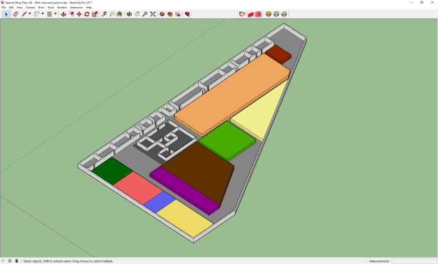

  3. Change the view to top-down by choosing Camera > Standard Views > Top:

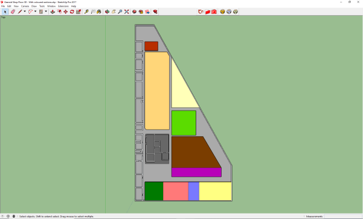

  4. Ensure you are in the Parallel Projection viewing mode by choosing Camera > Parallel Projection.

This will allow you to export a cleaner view of the model:

  5. Remove the outlines of the model: these will make the SVG unnecessarily complex.

Deselect Edges and Profiles by choosing View > Edge Style > Edges and View >
Edge Style > Profiles respectively.

After deselection, the menu looks like this (there should be no ticks by any
of the edge styles):

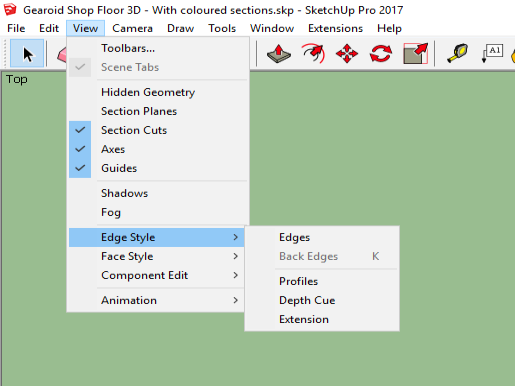

The simplified model looks like this:

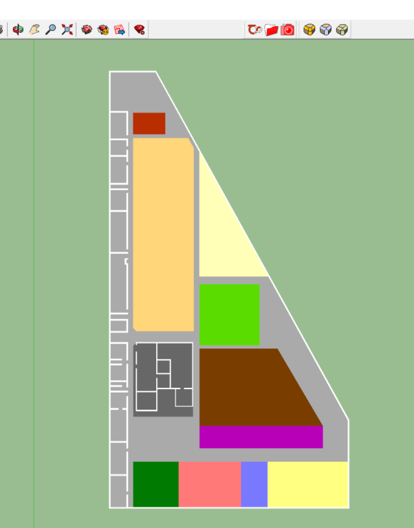

# Exporting a 2D model from SketchUp

With the model correctly oriented and cleaned up, you can export a 2D file.

Choose File > Export > 2D Graphic... and save the file, ensuring its file type
is PDF:

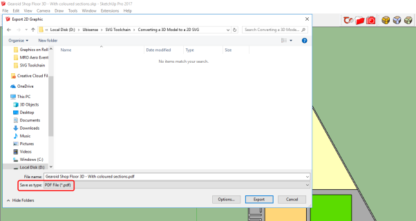

# Editing a PDF file in Adobe® Illustrator®

With the file in 2D format, you can complete the cleanup in Adobe Illustrator.

  1. Open Illustrator by typing illustrator in the Start menu.The Illustrator startup window is displayed.

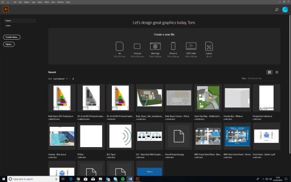

  2. Choose File > Open, navigate to the location where you saved the PDF file, and open the file:

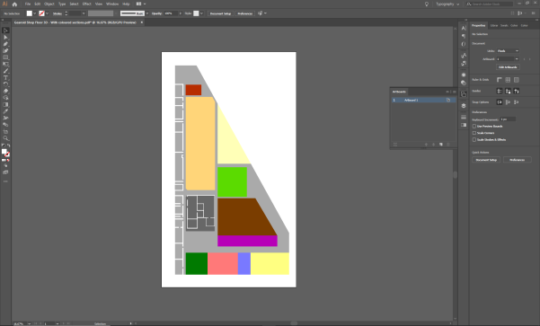

  3. If necessary, adjust the size of the artboard:

    1. Choose Windows > Artboards. If you are using the Essentials Classic workspace you can choose the Artboards icon from the tools on the right-hand side of the workspace:

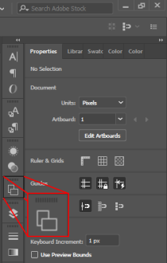

    2. Select Artboard 1 in the Artboards panel and choose Object > Artboards > Fit to Artwork Bounds.
  4. Set the color of the walls (where you previously removed their outlines in SketchUp).
    1. Hold down Shift and click on each of the walls to select them all:

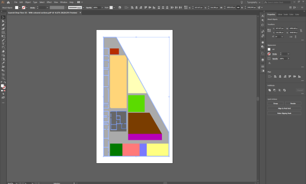

    2. With the walls selected, double-click the Fill icon in the toolbar on the left-hand side of the workspace:

  
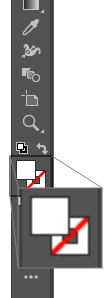

    3. In the Color Picker dialog, drag the circular cursor to select your preferred colour, or type in the colour value (as HSB, RGB, CMYK, Hex#).

For example, enter the RGB values, R: 221 G: 221 B: 221 to choose a light
gray:

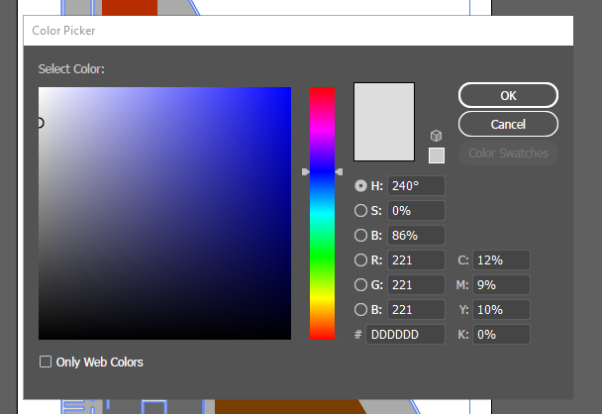

The file looks like this:

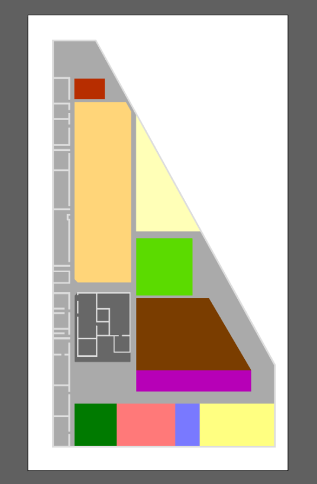

  5. Choose File > Save As... and save the file, ensuring the file type is set to Adobe Illustrator (*.Ai):

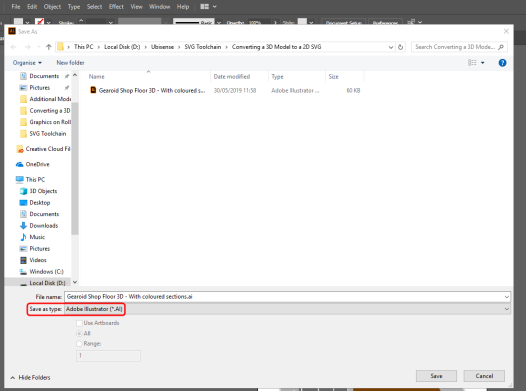

# Exporting a vector graphic from Illustrator

With file editing complete in Illustrator, the final step is to save the
result as a vector file (.SVG).

  1. Choose File > Save As...File > Export As... and in the dialog, ensure the file type is set to SVG (*.SVG) and that Use Artboards is checked:

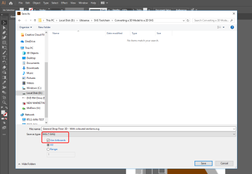

  2. Give the file a name.
  3. Click Save and then click OK to save the default settings in the SVG Options dialog:

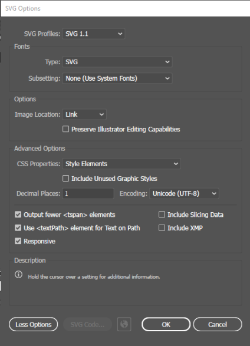

This will provide you with an SVG file which can be successfully imported into
SmartSpace.

  4. Click Save and the SVG Options dialog displays:

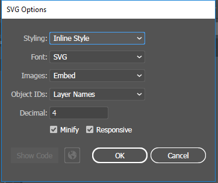

  5. Make sure the following details are selected:

     * Styling: Inline style

     * Font: SVG

     * Images: Embed

     * Object IDs: Layer Names

     * Decimal: 4

The Minify and Responsive check boxes should be checked.

  6. With the correct options selected, click OK.

# Importing the image into SmartSpace

This section describes how you can import your 2D image into SmartSpace using
the SmartSpace Config application. If you need further information on using
SmartSpace Config, see [Configure
SmartSpace](../../../../UserResources/BuildandCreate/smartspace-config-
introduction.htm).

  1. Run SmartSpace Config and open the MODEL IMPORT tab:

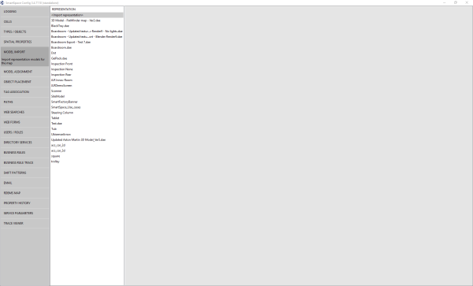

  2. Double-click <Import representation>.

  3. Navigate to the SVG file which you exported from Illustrator and select it.

The filename, including its suffix, becomes the default name of the
representation. Edit the name as required.

  4. Click Save.

The Model import workspace should look like this:

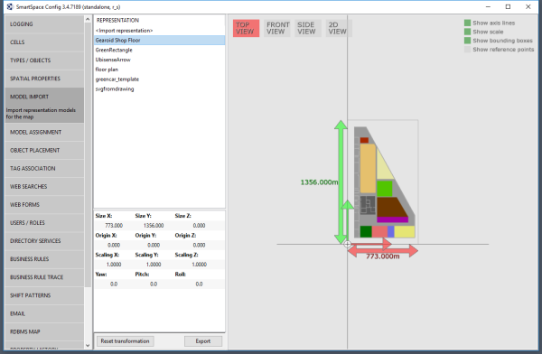

If necessary, you can resize and set the origin of the model. See [Model
import](../../../../UserResources/BuildandCreate/SiteVisualization/model-
import.htm) for further information on importing representations into
SmartSpace.

  5. Open the OBJECT PLACEMENT tab.

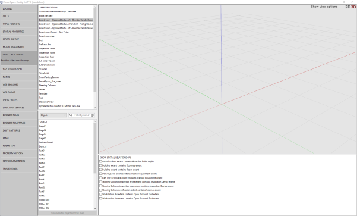

  6. Drag the file that you just imported into the workspace:

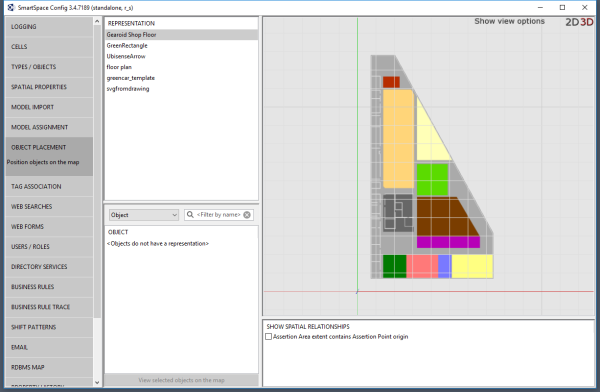

  * Converting a 3D model to a 2D SVG
  * Software required
    * SketchUp® Pro
    * Adobe® Illustrator® (trial version)
  * Correctly orienting a model for export using SketchUp®
  * Exporting a 2D model from SketchUp
  * Editing a PDF file in Adobe® Illustrator®
  * Exporting a vector graphic from Illustrator
  * Importing the image into SmartSpace

  

* * *

[www.ubisense.net](http://www.ubisense.net/)  
Copyright © 2020, Ubisense Limited 2014 - 2020. All Rights Reserved.

