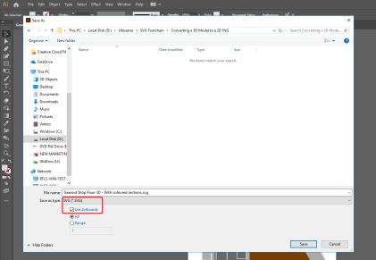
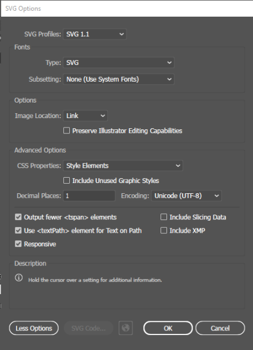
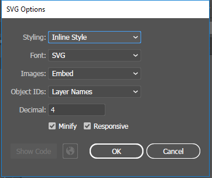
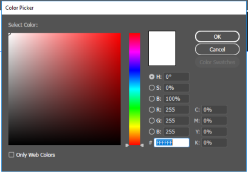
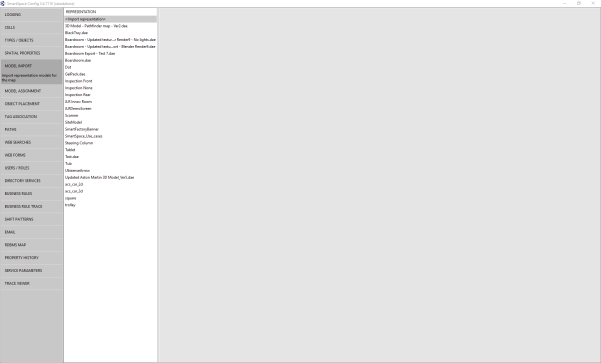

Skip To Main Content

  * placeholder

Filter:

  * All Files

Submit Search

  

You are here:

[Download as
PDF](../../../../../SmartSpaceDownloads/B7GZWZS4WX9F/UbisenseSmartSpaceColorEditableSVGs.pdf
"link to PDF version of this content")

# Generating a color-editable SVG

This guide takes you through converting a 3D model into a 2D graphic and
editing its code so that its color can be changed within SmartSpace.

The guide covers the following steps:

  * Exporting a file from SketchUp in PDF format
  * Editing the PDF file in Illustrator
  * Exporting the file from Illustrator in SVG format
  * Editing the SVG’s code to make it color adjustable
  * Importing the image for use as a representation in SmartSpace

The examples show the conversion of a 3D drawing of an AC generator into a 2D
SVG. The source file for the example is provided in a zip file
[ColorEditableSVG.zip](../../../../../SmartSpaceDownloads/B7GZWZS4WX9F/ColorEditableSVG.zip
"link to zip file of source files for the texture baking example"). If you
want to work through the instructions step by step, download and unzip the
file to a suitable location.

# Software Required

The following lists the software required if you want to work through the
example.

## SketchUp® Pro

The example in this guide uses SketchUp Pro desktop software available from
<https://www.sketchup.com/>.

Note: You cannot use the free web-based version of SketchUp to create a 2D
graphic in SVG format from a 3D SketchUp drawing.

## Adobe® Illustrator® (trial version)

If you do not have a copy of Adobe® Illustrator®, you can download a free
seven-day trial of the software.

Go to <https://www.adobe.com/uk/products/illustrator/free-trial-
download.html#x> and follow the instructions on the Adobe website.

Note: You will be required to supply payment details during the download
process.

## Notepad++

You will need access to a text editor to edit the SVG. The example in this
guide uses Notepad++. You can download the Notepad++ software from
[<https://notepad-plus-
plus.org/download/>](https://www.adobe.com/uk/products/illustrator/free-trial-
download.html#x) or use your preferred text editor.

# Exporting a file from SketchUp in SVG Format

## Opening the file in SketchUp

  1. Open SketchUp by typing sketchup in the Start menu.The SketchUp startup window is displayed.
  2. Open a new SketchUp document by choosing File > New (Ctrl+O), going to the directory where you unzipped the example files, and choosing AC Generator.skp:

This will open the document in SketchUp and the window will look like this:

## Editing the model for export

Next change the view in SketchUp so you are looking down on the object. Choose
Camera > Standard Views > Top.

This should now be the view:

Next change the viewing mode from “perspective” to “parallel projection”:
Choose Camera > Parallel Projection.

Next remove the outlines of the model by choosing View > Edge Style and
deselecting Edges and Profiles.

Once deselected the ticks will disappear beside Edges and Profiles and the
object should look like this:

## Saving the model as a PDF

With the model lined up, choose File > Export > 2D Graphic.

Next the Export 2D Graphic dialog will appear: make sure the document is saved
as the file type “PDF”.

# Editing the PDF file in Adobe® Illustrator®

  1. Open Illustrator by typing illustrator in the Start menu.The Illustrator startup window is displayed.

  2. Choose File > Open, navigate to the location where you saved the PDF file, and open the file:

  3. To simplify the vector file, select areas of similar color and use the Pathfinder tool to connect the shapes.

Display the Pathfinder tools by choosing Window > Pathfinder or by pressing
Shift+Ctrl+F9.

For example, click and drag the cursor over the wheels at the side until all
the necessary parts are selected. The selected shapes should look like this:

With the shapes selected, click the Unite (Pathfinder) icon to join the
shapes:

The joined shape should now look like this:

  1. Carry out this same process for any sections composed of multiple shapes of a similar color, some example pictures of sections this can be performed on are as follows:

  2. Finish by resizing the artboard so it tightly fits around the object.

    1. Choose Windows > Artboards. If you are using the Essentials Classic workspace you can choose the Artboards icon from the tools on the right-hand side of the workspace:

    2. Select Artboard 1 in the Artboards panel and choose Object > Artboards > Fit to Artwork Bounds.

# Exporting an SVG file from Illustrator

When the file has been cleaned it can be saved as a vector file (.SVG).

With file editing complete in Illustrator, the final step is to save the
result as a vector file (.SVG).

  1. Choose File > Save As...File > Export As... and in the dialog, ensure the file type is set to SVG (*.SVG) and that Use Artboards is checked:

  2. Give the file a name.
  3. Click Save and then click OK to save the default settings in the SVG Options dialog:

This will provide you with an SVG file which can be successfully imported into
SmartSpace.

  4. Click Save and the SVG Options dialog displays:

  5. Make sure the following details are selected:

     * Styling: Inline style

     * Font: SVG

     * Images: Embed

     * Object IDs: Layer Names

     * Decimal: 4

The Minify and Responsive check boxes should be checked.

  6. With the correct options selected, click OK.

# Adjusting the SVG’s Code

Now that the SVG has been saved, the next step is to make it color editable.
We only want to make the main body editable and to do this we need to find out
its color value.

  1. Select the main body color in illustrator, then select the color selection tool on either the left or right side of the workspace:

  

     * If you select the left option, the following dialog will appear:

     * If you select the right option, the following window will appear (make sure the paint palette icon is selected):

  2. In either dialog, the color hex code can be found at the bottom. In this instance the code is: #FFFFFF 

Remember this code as it will be important later.

Now use Notepad++ (or your preferred text editor) to edit the code of the SVG.

  1. To edit the code of the SVG, in File Explorer right click the filename and choose Edit with notepad++.

  2. In the Notepad++ window you will see a list of all the color values (Fill Colors):

The color you need to adjust is the one whose value was identified previously:
#FFFFFF.

  3. Make the color adjustable by changing (fill:#FFFFFF;) to (stroke:none;).

Now if the SVG is opened it should look something like this:

# Importing the image into SmartSpace

This section describes how you can import your color-editable 2D image into
SmartSpace using the SmartSpace Config application. If you need further
information on using SmartSpace Config, see [Configure
SmartSpace](../../../../UserResources/BuildandCreate/smartspace-config-
introduction.htm).

  1. Run SmartSpace Config and open the MODEL IMPORT tab:

  2. Double-click <Import representation>.

  3. Navigate to the SVG file which you exported from Illustrator and select it.

The filename, including its suffix, becomes the default name of the
representation. Edit the name as required.

  4. Click Save.

The Model import workspace should look like this:

If necessary, you can resize and set the origin of the model. See [Model
import](../../../../UserResources/BuildandCreate/SiteVisualization/model-
import.htm) for further information on importing representations into
SmartSpace.

You can now associate the model with a type, and assign instances of the type
different colors either manually or using the Business rules engine.

  * Generating a color-editable SVG
  * Software Required
    * SketchUp® Pro
    * Adobe® Illustrator® (trial version)
    * Notepad++
  * Exporting a file from SketchUp in SVG Format
    * Opening the file in SketchUp
    * Editing the model for export
    * Saving the model as a PDF
  * Editing the PDF file in Adobe® Illustrator®
  * Exporting an SVG file from Illustrator
  * Adjusting the SVG’s Code
  * Importing the image into SmartSpace

  

* * *

[www.ubisense.net](http://www.ubisense.net/)  
Copyright © 2020, Ubisense Limited 2014 - 2020. All Rights Reserved.

