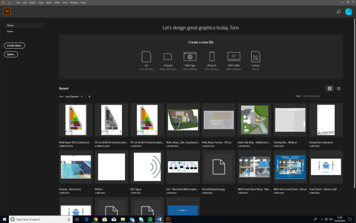

Skip To Main Content

  * placeholder

Filter:

  * All Files

Submit Search

  

You are here:

[Download as
PDF](../../../../../SmartSpaceDownloads/B7GZWZS4WX9F/UbisenseSmartSpaceSVGToolchain.pdf
"link to PDF version of this content")

# Constructing a high quality SVG file from a drawing

This guide takes you through the steps required to create a vector graphic
from a drawing of a site plan suitable for use as a background representation
in SmartSpace.

The vector-editing tool used in the examples is Adobe® Illustrator®. This
guide is not intended to provide a complete introduction to Illustrator.

The guide will cover the following steps:

  * Setting up a new document (Artboard) in Illustrator
  * Importing a working drawing into a new document
  * Creating a vector graphic based on the working drawing

    * Drawing shapes to construct the environment
    * The use of layering for efficient construction
  * Coloring the constructed vector graphics
  * Saving the completed image in SVG format
  * Importing the image for use as a representation in SmartSpace

The source file for the example is provided in a zip file
[SVGToolchain.zip](../../../../../SmartSpaceDownloads/B7GZWZS4WX9F/SVGToolchain.zip
"link to zip file of source files for the texture baking example"). If you
want to work through the instructions step by step, download and unzip the
file to a suitable location.

# Software required

The following lists the software required if you want to work through the
example.

## Adobe® Illustrator® (trial version)

If you do not have a copy of Adobe® Illustrator®, you can download a free
seven-day trial of the software.

Go to <https://www.adobe.com/uk/products/illustrator/free-trial-
download.html#x> and follow the instructions on the Adobe website.

Note: You will be required to supply payment details during the download
process.

# Setting up a new document in Illustrator

The following takes you through creating a new document in Illustrator and
sizing it to fit your drawing.

  1. Open Illustrator by typing illustrator in the Start menu.

The Illustrator startup window is displayed.

  2. Create a new custom-sized document, by clicking the Custom icon in the Create a new file panel.

(You can also open a new document by choosing File > New... or clicking the
Create New... button.)

The New Document dialog will appear.

  3. Specify the document's size:

    1. Select a Custom template.
    2. Set the dimensions as follows:

Width: 170 mm

Height: 310 mm

    3. Choose Create.

The new blank document looks like this:

# Importing a working drawing into the new document

After you have created a blank document, you can import the drawing and copy
the required section into the new document. This is described below.

  1. Choose File > Open (CTRL+O) and go to the directory where you unzipped the example file.

  2. Select SVG conversion working drawing.pdf and click Open to open the PDF file of the SVG conversion working drawing.

The opened PDF looks like this:

  3. You only require the actual image of the factory (and not the details of the drawing). Select the factory by dragging until you have selected all of it. When you let go of the cursor, the selected objects are highlighted in blue:

  4. Right click your selection and choose Group.
  5. Copy your grouped selection, by pressing CTRL+C.
  6. Display the new document you created.

All currently open documents will be listed as tabs at the top of the
workspace. Click the title of the document you created: it will be called
Untitled-_x_ if you haven’t saved it.

  7. Paste your selection from the PDF into the new document by pressing CTRL+V.

Move it into position on the artboard by clicking and dragging it.

  8. Save the new document by choosing File > Save As... and specifying where you would like to save it.
  9. Click Save, and, when the Illustrator Options dialog displays, click OK.

# Creating a vector graphic based on the working drawing

The next stage in the process involves creating shapes to represent different
areas in the building using the drawing as a template.

## Drawing shapes to construct the environment – Part 1

The following takes you through constructing the main floor and giving it a
color.

  1. Click the Pen Tool button (or press P):

  2. Recreate the shape of main floor by clicking each of the vertices around the factory perimeter in turn and then close the path by clicking on the first anchor point again:

  3. Adjust the color in the in the Appearance panel in Properties tab on the right-hand side of the workspace:

     * Set Fill to a shade of gray by clicking the box to the left of Fill and choosing an appropriate color.
     * Set Stroke to "no color" by clicking the box to the left of Stroke and choosing [none] (a line through the box indicates this).

## Using layering for efficient construction

While you are constructing multiple shapes based on the working drawing, you
don’t want the main floor you have just created to obstruct your view of the
drawing. To avoid this you can move it to a separate layer and hide it.

  1. Open the Layers panel. 

Click its title in the right-hand part of the workspace, or press F7. You can
undock the panel by dragging it into the workspace:

  2. Create a new layer by clicking the Page icon:

A new layer is added to the list:

  3. Move the shape you created from Layer 1 to Layer 2:

    1. In the Layers panel, click the arrow beside Layer 1 to list all the items in that layer.
    2. Select the shape you drew by clicking the target button.
    3. Select Layer 2.
    4. Choose Object > Arrange> Move to Current Layer.

(You can also select the shape you drew and drag it from Layer 1 to Layer 2.)

  4. The copied shape will have a red line if it has been successfully placed on the new layer:

  5. After you have moved the shape, lock the layer by clicking in the Edit column (a lock icon appears), and then hide it by clicking the eye icon in the Visibility column (the eye icon disappears):

  

  6. You can prevent the working drawing getting in the way by locking its layer. Then create a new layer to place the rest of the shapes on. Your Layers panel will look like this:

## Drawing shapes to construct the environment – Part 2

With the main background created and a new layer set up to work in, the next
step is to create colored zones/shapes for each of the factory sections:
highlighted in green in picture below.

  

  1. The process for creating each of these areas is exactly the same as creating the main floor. Select the Pen tool and outline each section to create a shape. Alternatively if the shape is a simple rectangle, use the Rectangle tool (located just below the Pen Tool) by clicking and dragging to create a shape of the appropriate size:

  2. Give each section a different color using the process described above. The file will look something like this:

  

  3. The next step is to construct the walls on the left-hand side of the drawing. This uses a similar process to creating the factory sections, but using only narrow rectangles on top of any walls:

With all the wall sections added, the file looks like this:

## Adding final shape details

The following steps take you through adding the final details and the external
wall of the building.

  1. Create the small office with chairs, tables and internal walls.

    1. Display details of the office on the drawing by hiding the rectangle that defines it:

You hide the rectangle by selecting it and choosing Object > Hide > Selection
(or by selecting it and pressing CTRL+3).

    2. Add the tables, by creating rectangles and coloring them brown:

    3. Create the chairs with the Ellipse tool. Clicking and hold the Rectangle tool and choose Ellipse Tool (or press L):

Click and drag diagonally to draw an ellipse. If you want to create circles,
hold down Shift and drag to scale the circle.

The area will now look like this:

  2. Create the internal walls the same way the larger walls were created previously, by generating multiple rectangles anywhere walls are marked out.

The completed result will look like this:

  3. Unhide the floor section by choosing Object > Show All. Make sure it is behind the shapes you have just added, by right-clicking it and choosing Arrange > Send to Back.

  4. Show the layer with the main background in it again (toggle the Visibility mode beside Layer 2) and hide the working drawing layer (toggle the Visibility mode beside Layer 1).

The design now looks like this:

  5. Add an outline to the main floor to create the main walls.

    1. Copy and paste the main floor. (You will need to unlock the layer first!)

Press CTRL+C, then CRTL+B to paste the new shape directly behind the original
one.

    2. Hide the original floor shape so you can work exclusively on the copied version.

Select the shape and choose Object > Hide > Selection.

    3. With the new floor layer selected, choose Object > Path > Offset Path to display the following dialog:

    4. At Offset box, type 1 mm.

Make sure you click the preview box so you can see how it will look.

An outline forms as the preview displays:

    5. Click OK and a new shape will be generated which is 1 mm larger (offset) all round than the original shape.

Shown here with both layers selected:

    6. Select the inner (smaller) shape and choose Object > Path > Divide Objects Below.

It will initially look like nothing has happened. However when you delete the
inner shape, only the outer shape will be left.

    7. Delete the inner shape.
    8. Set the color of the outer shape to be a dark gray:

  6. Unhide the original shape and the completed graphic looks like this:

# Exporting a vector graphic from Illustrator

With file editing complete in Illustrator, the final step is to save the
result as a vector file (.SVG).

  1. Choose File > Save As...File > Export As... and in the dialog, ensure the file type is set to SVG (*.SVG) and that Use Artboards is checked:

  2. Give the file a name.
  3. Click Save and then click OK to save the default settings in the SVG Options dialog:

This will provide you with an SVG file which can be successfully imported into
SmartSpace.

  4. Click Save and the SVG Options dialog displays:

  5. Make sure the following details are selected:

     * Styling: Inline style

     * Font: SVG

     * Images: Embed

     * Object IDs: Layer Names

     * Decimal: 4

The Minify and Responsive check boxes should be checked.

  6. With the correct options selected, click OK.

# Importing the image into SmartSpace

This section describes how you can import your image into SmartSpace using the
SmartSpace Config application. If you need further information on using
SmartSpace Config, see [Configure
SmartSpace](../../../../UserResources/BuildandCreate/smartspace-config-
introduction.htm).

  1. Run SmartSpace Config and open the MODEL IMPORT tab:

  2. Double-click <Import representation>.

  3. Navigate to the SVG file which you exported from Illustrator and select it.

The filename, including its suffix, becomes the default name of the
representation. Edit the name as required.

  4. Click Save.

The Model import workspace should look like this:

If necessary, you can resize and set the origin of the model. See [Model
import](../../../../UserResources/BuildandCreate/SiteVisualization/model-
import.htm) for further information on importing representations into
SmartSpace.

  5. Open the OBJECT PLACEMENT tab.

  6. Drag the file that you just imported into the workspace:

  * Constructing a high quality SVG file from a drawing
  * Software required
    * Adobe® Illustrator® (trial version)
  * Setting up a new document in Illustrator
  * Importing a working drawing into the new document
  * Creating a vector graphic based on the working drawing
    * Drawing shapes to construct the environment – Part 1
    * Using layering for efficient construction
    * Drawing shapes to construct the environment – Part 2
    * Adding final shape details
  * Exporting a vector graphic from Illustrator
  * Importing the image into SmartSpace

  

* * *

[www.ubisense.net](http://www.ubisense.net/)  
Copyright © 2020, Ubisense Limited 2014 - 2020. All Rights Reserved.

