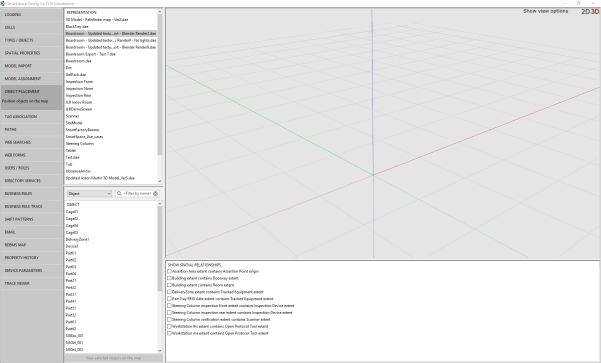

Skip To Main Content

  * placeholder

Filter:

  * All Files

Submit Search

  

You are here:

[Download as
PDF](../../../../../SmartSpaceDownloads/B7GZWZS4WX9F/UbisenseSmartSpaceColorEditableSVGs.pdf
"link to PDF version of this content")

# Editing an SVG and converting it to COLLADA

The following document describes the steps needed to construct a suitable SVG
to convert into a COLLADA (.DAE) file for import into SmartSpace.

The guide covers the following steps:

  * In Illustrator, how to manually draw shapes around one another

    * Tools needed to create shapes in Illustrator
    * Using the Shape tool
  * In Illustrator how to cut away shapes from one another if they are already overlapping
  * Exporting an SVG from Illustrator
  * Importing an SVG into Blender
  * Exporting a COLLADA file from Blender
  * Importing a COLLADA file into SmartSpace

The source file for the example is provided in a zip file
[SVGtoCOLLADA.zip](../../../../../../../SmartSpaceDownloads/B7GZWZS4WX9F/SVGToolchain.zip
"link to zip file of source files for the texture baking example"). If you
want to work through the instructions step by step, download and unzip the
file to a suitable location.

# Software required

The following lists the software required if you want to work through the
example.

## Blender

You can download the Blender 3D modeling software from
<https://www.blender.org/> where you can also find comprehensive documentation
and tutorials.

## Adobe® Illustrator® (trial version)

If you do not have a copy of Adobe® Illustrator®, you can download a free
seven-day trial of the software.

Go to <https://www.adobe.com/uk/products/illustrator/free-trial-
download.html#x> and follow the instructions on the Adobe website.

Note: You will be required to supply payment details during the download
process.

# Why do I need to edit SVGs before I convert them to COLLADA?

In [Constructing a high quality SVG file from a drawing](../SVGToolchain/SVG-
high-quality-construction.htm), you are shown how to create SVGs from working
drawings and PDF files. Whilst this method is appropriate for 2D SVGs (for
example for use in SmartSpace's web map), there can be problems when
converting SVGs to COLLADA (.DAE) files. This is because if shapes are drawn
on top of other shapes during the creation of the image, there can be problems
when the resulting images are viewed in 3D. See the image below where several
shapes are competing on the one surface, creating a strange texture:

Such problems can be avoided by altering the method for constructing SVGs in
Adobe Illustrator.

The main ways to effectively create or adjust SVGs are:

  1. Manually drawing shapes around one another to ensure they are not overlapping.
  2. Cutting away shapes from one another if they are already overlapping.

# How to manually draw shapes around one another in Illustrator

This section describes how to create a new SVG from an Illustrator file with
no overlapping shapes.

## Tools needed to create shapes in Illustrator

Illustrator offers a huge variety of tools for you to explore. However below
are some of the main tools used to create and adjust shapes:

Selection tool

The selection tool is used to select, move, rotate and transform previously-
constructed shapes.

Direct selection tool

The direct selection tool offers a similar service to the selection tool and
also provides editing capabilities at specific points.

Pen tool

Using the pen tool allows you to manually create shapes by clicking anywhere
you would like the vertex of a shape to be:

Finish drawing by either clicking on the first point again, or holding down
Ctrl and clicking to leave the path open.

Clicking and holding the pen tool can create curves in the shapes.

The pen tool can be used to draw new shapes alongside or around existing
shapes to ensure there are no overlaps:

Here the green shape was manually drawn using the pen tool so as to avoid
overlapping the blue rectangle.

## Using the shape tools

Although the pen tool offers more flexibility, it can often be quicker to draw
predefined shapes around other currently existing shapes.

Below is the dropdown menu of the shapes tool (found by clicking and holding
the shape tool, on the left-hand side of the Illustrator workspace):

The main tool to be used here (particularly when constructing SVGs of shop
floor environments) is the Rectangle Tool.

A good example of where this could be used is for constructing floor markings
as well as the floor surrounding them. New shapes can be created by selecting
the tool, clicking on the workspace, and dragging. The shapes can then be
edited using the selection tool.

Rectangle tool used to make floor markings:

The same tool can then be used to create the floor between them:

The image above includes shapes used for the floor markings and also shapes
being used to construct the floor.

This same method can be used throughout the SVG creation, as below where a
floor plan is constructed out of multiple shapes. The blue lines are small
gaps where the floor markings are placed.

The image below shows a larger section of an example shop floor. For this to
be correctly converted to a COLLADA file none of the shapes can be
overlapping: they must all be drawn around one another.

# Cutting away shapes from one another if they are already overlapping

Where you have an existing image where shapes which overlap, there are tools
in Illustrator which allow shapes to be cut away from other shapes to remove
the overlap. This can usefully save time by avoiding the need to draw around
shapes—both simple and complex ones.

The SVG below was constructed with overlapping shapes:

The instructions below guide you through creating a version of this SVG with
no overlapping shapes using the Divide objects below command.

  1. Open Illustrator by typing illustrator in the Start menu.The Illustrator startup window is displayed.

  2. Choose File > Open,, navigate to the directory where you unzipped the example file, and open the file Dividing objects below SVG.ai.

  3. The first step is to select every shape except the main background, make a copy of them, and move them to a new layer. Select all objects except the tables, chairs and walls in the office section. Selected objects are highlighted green:

  4. With the objects selected, press Ctrl+C, then Ctrl+F to make an exact copy directly in front of the original shapes. 
  5. With the copied shapes selected, open the Layers panel.

Click its title in the right-hand part of the workspace, or press F7. You can
undock the panel by dragging it into the workspace:

  6. Create a new layer by clicking the Page icon:

A new layer is added to the list:

If the shapes are still selected there will be a colored square beside the
original layer (the color of the square will depend on the color allocated to
the layer).

  7. To move the shapes to the new layer simply drag the colored square to the new layer. The square will move and the panel will look like this:

  8. When you have moved the shapes, hide the new layer by clicking the eye icon. (This layer will not as it will be not needed again until the end of the process.)
  9. Click the original layer again to return to working on it.

  10. Now we want to subtract each shape from the main floor. Illustrator does not allow for multiple shapes to be subtracted at once: each shape must be done one at a time.

We start by working with the green square in the bottom left corner of the
SVG:

  1. As it is the same height as the shapes to the right of it, the other shapes can be deleted and the green square can be dragged to become the width of all the original squares. This saves time as it means only one shape needs to be subtracted rather than four individual ones.

  2. With this shape selected, choose Object > Path > Divide Objects Below.

**Note:** This command can only be activated if a shape is selected.

The green square will then vanish as it has been used to cut away from the
background layer. It will now look like this:

  3. Select the rectangle and press Delete. This will leave the shape looking like this:

  4. Perform this same process with each main shape one by one until the SVG looks like this:

  5. Next, to cut away the walls, rather than selecting each shape one by one, we will use Illustrator's Pathfinder tool which can be used to combine multiple connected shapes to make one.

Every time there is a group of shapes intersecting each other they can be
selected and the Pathfinder tool can be used (see below):

With all these shapes selected, locate the Pathfinder tool (you can find it on
the right-hand side of the workspace in the Properties panel, or you can open
it by choosing Window > Pathfinder or pressing Shift+Ctrl+F9):

  6. Choose the Unite icon (the one on the far left). This will convert the multiple selected shapes into one shape.

The newly created shape should look similar to this:

  7. You can now repeat the process described for the simple shapes above: select the new shape, choose Object > Path > Divide objects below and delete the cutaway shape.

  1. Continue using the Pathfinder tool and Divide objects below command wherever you find overlapping shapes until your SVG looks like the image below:

  2. The final area which needs to be adjusted is the meeting room with tables and chairs. Start by removing the floor using the same process as before using Divide objects below:

  3. Next unhide the copied shapes layer from earlier by going to the layers window and clicking beside the hidden layer so the eye icon reappears.

The SVG should look like the example below:

  1. This will most likely cause the chairs, tables and walls to vanish. If this is the case, it can be easily fixed as they are merely hidden behind a shape on the level above. In the Layers panel, select the top layer (Layer 3) and then click and drag it to below the layer with the chairs, etc. on it (Layer 2).

The Layers panel should now look like this:

  1. Next select the chairs, tables and walls, make a copy of them and paste them onto a separate layer (this is the same process we used in steps 3 to 7). Once again hide this new layer.
  2. Next select each table and each chair one by one and use the Divide objects below command to subtract each shape.

After each shape has been subtracted the section should look like this:

  3. Finally the walls need to be subtracted. Start by selecting any connecting walls, then use the Pathfinder tool and then Divide objects below for each united shape.

Once all the walls have been subtracted from the background the section should
look like this:

  1. Unhide the previously hidden details of the chairs, tables and walls and the SVG should look like this:

This is the SVG construction complete.

# Exporting an SVG from Illustrator

With file editing complete in Illustrator, the final step is to save the
result as a vector file (.SVG).

  1. Choose File > Export As... and in the dialog, ensure the file type is set to SVG (*.SVG) and that Use Artboards is checked:

  2. Give the file a name.
  3. Click Save and the SVG Options dialog displays:

  4. Make sure the following details are selected:

     * Styling: Inline style

     * Font: SVG

     * Images: Embed

     * Object IDs: Layer Names

     * Decimal: 4

The Minify and Responsive check boxes should be checked.

  5. With the correct options selected, click OK.

# Importing an SVG into Blender

Blender provides many complex
features which can make it daunting to use. The following provides some
pointers to get you started.

If you are new to Blender, the main information you need is:

  * how to navigate your way through Blender's user interface
  * how to use different editors, such as the Node Editor and UV/Image editor
  * useful keyboard shortcuts (see the [Default Keymap](https://docs.blender.org/manual/en/dev/interface/keymap/blender_default.html) section on the Blender website)

Changing the default selection button

By default, Blender uses the right mouse button for selection. You can change
this to the left mouse button in the Input tab of the User Preferences dialog:
choose Files > User Preferences, open the Input tab, and choose Left at Select
With. Click Save User Settings to save this change.

Enabling the Pie Menu add-on

One particularly useful enhancement to the Blender user interface is the Pie
menu add-on. This allows you to display via a single key press an array of on-
screen options which you can click with your mouse:

To enable this add-on, choose File > User Preferences (Ctrl+Alt+U), select the
Add-ons tab, and click the Pie Menu category. Then enable the Pie Menu: UI Pie
Menu Official option and click Save User Settings.

Introductory videos

The following videos provide an introduction to the Blender user interface:

  * [https://www.youtube.com/watch?v=JYj6e-72RDs&t=830s](https://www.youtube.com/watch?v=JYj6e-72RDs&t=830s)

This is the first part of a series of videos. If you are interested into
developing your Blender skills and gaining a better understanding of the
package, you may decide to watch the later parts.

  * <https://www.youtube.com/watch?v=QAUm_E7ZiQM>

To import the SVG into Blender:

  1. Open Blender by typing blender in the Start menu.The Blender startup window is displayed.
  2. Remove all items set up in the standard Blender scene by pressing A to select all items and then X.Click Delete to remove all items.

This leaves the following workspace open in Blender:

  3. Choose File > Import > Scalable Vector Graphics (.svg) to open the Import SVG window:

  4. Locate where the previously-exported SVG was saved, select the file and choose Import SVG.

  5. At first it may appear as though the SVG has not imported. However most likely it is just very small. Therefore zoom in towards the origin using the scroll wheel until the image becomes visible:

  6. Increase the size of the model by pressing A to select the entire model. Then press S and drag the mouse pointer to scale the model to a suitable size. Click anywhere on the workspace to set that size:

  7. After then model's scale has been set, press A to select the entire model again. Then press Alt+C to open the Convert to dialog:

  8. Choose Mesh from Curve/Meta/Surf/Text.

This converts the SVG shapes to a mesh so they can be seen when saved in
COLLADA (.DAE) format.

# Exporting a COLLADA file from Blender

With the model suitably adjusted, the next step is to export it as a COLLADA
(.DAE) file. This will enable model to be dropped into SmartSpace Config.

  1. Open the export options menu by choosing File > Export > Collada (Default) (.dae).

  2. Select the location to save the COLLADA file and then click Export COLLADA:

You will be returned to the main Blender window and a message similar to this
will appear in the top banner:

# Importing a COLLADA file into SmartSpace

This section describes how you can import the COLLADA file into SmartSpace and
add it to your digital environment.

  1. Run SmartSpace Config and open the MODEL IMPORT tab:

  2. Double-click <Import representation>.

  3. Navigate to the COLLADA file which you exported from Blender and select it.

The filename, including its suffix, becomes the default name of the
representation. Edit the name as required.

  4. Click Save.

Click TOP VIEW in the Model import workspace for the file to look like this:

If necessary, you can resize and set the origin of the model. See [Model
import](../../../../UserResources/BuildandCreate/SiteVisualization/model-
import.htm) for further information on importing representations into
SmartSpace.

  5. Open the OBJECT PLACEMENT tab.

  6. Drag the file that you just imported into the workspace:

  * Editing an SVG and converting it to COLLADA
  * Software required
    * Blender
    * Adobe® Illustrator® (trial version)
  * Why do I need to edit SVGs before I convert them to COLLADA?
  * How to manually draw shapes around one another in Illustrator
    * Tools needed to create shapes in Illustrator
    * Using the shape tools
  * Cutting away shapes from one another if they are already overlapping
  * Exporting an SVG from Illustrator
  * Importing an SVG into Blender
  * Exporting a COLLADA file from Blender
  * Importing a COLLADA file into SmartSpace

  

* * *

[www.ubisense.net](http://www.ubisense.net/)  
Copyright © 2020, Ubisense Limited 2014 - 2020. All Rights Reserved.

