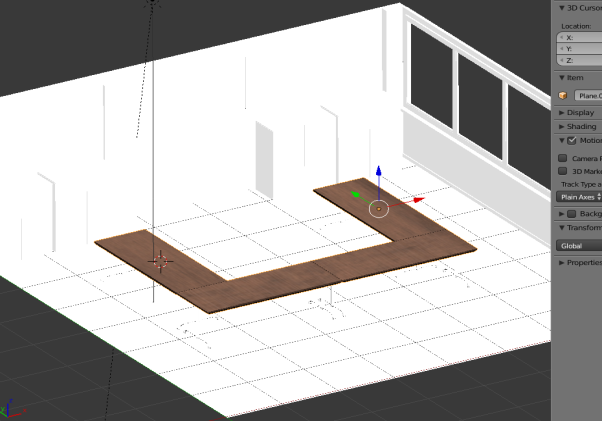

Skip To Main Content

  * placeholder

Filter:

  * All Files

Submit Search

  

You are here:

[Download as
PDF](../../../../../SmartSpaceDownloads/B7GZWZS4WX9F/UbisenseSmartSpaceTextureBaking.pdf
"link to PDF version of this content")

# Texture baking 3D models

This guide takes you through the steps required to add textures to 3D models
and import these models into SmartSpace. The tool used in the examples is
Blender, a free open source 3D creation suite. This guide is not intended to
provide a complete introduction to Blender.

The guide will cover the following steps:

  * Mapping textures to a premade Blender model

    * UV unwrapping 3D objects
    * Generating good quality textures of a suitable resolution
  * Baking previously-mapped textures to a model
  * Exporting baked textures
  * Remapping baked textures to a model using a different rendering engine
  * Exporting a texture-baked model as a COLLADA file
  * Importing a COLLADA file with textures into SmartSpace

    * Adjusting lighting settings for SmartSpace Config

The examples shown build up the representation of a boardroom. The source
files for the examples are provided in a zip file
[TextureBakingExamples.zip](../../../../../SmartSpaceDownloads/B7GZWZS4WX9F/TextureBakingExamples.zip
"link to zip file of source files for the texture baking example"). If you
want to work through the instructions step by step, download and unzip the
files to a suitable location.

# Software required

The following lists the software required if you want to work through the
example.

## Blender

You can download the Blender 3D modeling software from
<https://www.blender.org/> where you can also find comprehensive documentation
and tutorials.

# Starting Blender and exploring its user Interface

Open Blender by typing blender in the Start menu.

The Blender startup window is displayed.

If you are new to Blender, the main information you need is:

  * how to navigate your way through Blender's user interface
  * how to use different editors, such as the Node Editor and UV/Image editor
  * useful keyboard shortcuts (see the [Default Keymap](https://docs.blender.org/manual/en/dev/interface/keymap/blender_default.html) section on the Blender website)

Changing the default selection button

By default, Blender uses the right mouse button for selection. You can change
this to the left mouse button in the Input tab of the User Preferences dialog:
choose Files > User Preferences, open the Input tab, and choose Left at Select
With. Click Save User Settings to save this change.

Enabling the Pie Menu add-on

One particularly useful enhancement to the Blender user interface is the Pie
menu add-on. This allows you to display via a single key press an array of on-
screen options which you can click with your mouse:

To enable this add-on, choose File > User Preferences (Ctrl+Alt+U), select the
Add-ons tab, and click the Pie Menu category. Then enable the Pie Menu: UI Pie
Menu Official option and click Save User Settings.

Introductory videos

The following videos provide an introduction to the Blender user interface:

  * [https://www.youtube.com/watch?v=JYj6e-72RDs&t=830s](https://www.youtube.com/watch?v=JYj6e-72RDs&t=830s)

This is the first part of a series of videos. If you are interested into
developing your Blender skills and gaining a better understanding of the
package, you may decide to watch the later parts.

  * <https://www.youtube.com/watch?v=QAUm_E7ZiQM>

# Opening a 3D model in Blender

The following steps take you through opening the source files for the
boardroom and setting the correct rendering engine.

  1. Choose File > Open (CTRL+O) and go to the directory where you unzipped the example files.
  2. Select Boardroom source files – Without textures.blend and click Open Blender File to display the boardroom with no textures applied:

  3. Ensure you are working in the cycles rendering engine.

By default the rendering engine will most likely be set to Blender Render.
Change this to Cycles Render by clicking Blender Render in the center of the
top menu and choosing Cycles Render from the dropdown.

# Adding textures to a 3D object (texture mapping)

The following takes you step by step through UV unwrapping a 3D object and
mapping texture maps to it.

If you want to understand more about texture mapping, you might watch the
following video:
[https://www.youtube.com/watch?v=C7jACtwbApI&t=135s](https://www.youtube.com/watch?v=C7jACtwbApI&t=135s)

This example will show how to add texture to a specific object (an individual
table top). However to save time it is best to join objects with the same
texture, unwrap them all, and then map one texture to them all simultaneously.
In the example file, the table tops and any other groups of objects that use
the same texture have already been joined (by selecting each of the objects
and pressing CTRL+J).

To UV unwrap an 3D object and map textures to it:

  1. Select the object, here one of the table tops.

It will gain an orange outline when it is selected:

  2. Change from Object Mode to Edit Mode by clicking Object Mode in the toolbar and choosing Edit Mode from the menu.

If you have enabled the Pie Menu, you can press TAB and click Edit Mode.

  3. Split the window (called an area in Blender) in two by dragging the area corner inwards.

The screen should now look something like this:

  4. Change the Editor Type in the new area to UV/Image Editor by clicking the Editor Type selector—this indicates the current selection is 3D View (the cube icon)—and choosing UV/Image Editor from the menu:

The two areas should now look like this:

  5. Create an unwrapped version of the 3D model surfaces.

    1. Make sure you have the 3D View area selected (hover the cursor over it).
    2. Press A to select everything in Edit Mode.
    3. Press U to open the UV Mapping menu.
    4. Choose Smart UV Project and then click OK to accept the defaults in the dialog.

This will create an unwrapped version of the 3D model surfaces:

  6. Save the unwrapped surfaces as an image.

Click the New button at the bottom of the area in UV/Image Editor mode, give
the image a meaningful name, here Table 1, and choose OK.

Generally, you should leave the width and height the same. These define the
resolution of the image and can be increased if necessary. However be cautious
as if the file size of the image textures is too large, they will not
successfully import into SmartSpace.

  7. Open a new area and switch to Node Editor.

Create another area and choose Node Editor in the Editor Type selector:

The workspace should now look like this:

  8. Create a new material and give it a name.

    1. Click New in the toolbar of the area in Node Editor mode.

    2. Click the material name (this defaults to Material.xxx) and change it to a suitable name (here TableTop):

  9. Apply a high quality texture to the object and create a node editing tree.

If you are unfamiliar with Blender, we strongly recommended you watch the
recommended videos so as to understand how to create, remove and link nodes in
the Node Editor.

    1. Remove the original Diffuse BSDF node by selecting it and pressing Delete. This leaves just the Material Output node in the editor.

    2. Add a Shader node and link it to the Material Output node.

Press Shift+A to open the Add menu and choose Shader > Principled BSDF:

    3. Link it to the Material Output node at the Surface point:

    4. Create further nodes and link them.

       * Create two Image Texture nodes: for each one, press Shift+A to open the Add menu and choose Image > Image Texture.
       * Create a Normal Map node: press Shift+A to open the Add menu and choose Vector > Normal Map.
       * Link the nodes as shown in the screenshot below:

  10. Add image files to the Image Texture nodes.

    1. On the first image texture node (linked to Base Color) click Open, select the Wood_011_basecolor.jpg file (supplied in ...\Textures to be used in model\Tables) and click Open Image.

    2. Add Wood_011_normal.jpg to the other Image Texture node. Set its Color properties to Non-Color Data.

  11. Add a Texture Coordinate node and a Mapping node.

You may notice when you apply textures that they look too “large". To fix this
you need to add a Texture Coordinate node and a Mapping node and link these to
the Image Texture nodes.

    1. Press Shift+A to open the Add menu and choose Input > Texture Coordinate.
    2. Press Shift+A to open the Add menu and choose Vector > Mapping.
    3. Link the nodes as shown in the screenshot below:

    4. Adjust the Scale section of the Mapping node, by entering the following values: X: 2, Y: 2, Z: 2.

At the end of these steps, the node editing tree should look something like
this:

# Baking texture to an object

Now the object has a successfully mapped texture to it, the next step involves
“baking” this texture to the object. This essentially involves embedding the
texture to the object: this will allow easy navigation around the model
without any rendering having to occur (a technique frequently used in video
game creation).

The following video explains the concept of texture baking, and the basics of
how to successfully do it:

[https://www.youtube.com/watch?v=sB09T--
_ZvU&t=512s](https://www.youtube.com/watch?v=sB09T--_ZvU&t=512s)

To bake texture to the table top image:

  1. Create a new Image Texture node in the Node Editor:

  2. Click the Browse Image to be linked icon to the left of the Open button:

  3. Choose the UV Unwrapped file you saved in the previous section.

  4. Bake the texture to the image.

    1. Select the new Image Texture node (note: this is not linked to any other node).

    2. Ensure you have Render selected as the type of data to display and edit (The camera button's background should be blue.)
    3. Click Bake.

A progress bar at the top of the screen indicates how far the process has
progressed. When the texture has baked, the progress bar closes. The UV/Image
Editor area should look like this:

  5. Save the file in a new folder, by clicking Image in the toolbar of the UV/Image Editor area (it will have an asterisk (*) after the option if you have not yet saved) and choosing Save As Image.

The UV unwrap and the texture map you have created (with the pre-joined table
top objects) will look like the examples below:

  6. When the texture has finished baking, in the Node editor create an Emission shader by pressing Shift+A to open the Add menu and choosing Shader > Emission.
  7. Link the nodes as shown below:

Note: This disconnects the Principled BSDF shader.

  8. Change the display of the 3D View area to Material by pressing Z and choosing Material from the menu.

In the Material area the texture baked file should now be applied to the
object.

# Completing the boardroom scene

You can continue the process described in the preceding sections for all other
objects in the scene to add the remainder of the materials. Suggested
materials for each object in the example are given below. You can also find
free materials online and use those if you want to make your room unique.

Which materials to use for each object:

Table Tops

  * Image Texture 1: Wood_011_basecolor.jpg
  * Image texture 2 (Normal map): Wood_011_normal.jpg

Node map

Cabinets

  * Image Texture 1: Wood_002_COLOR.jpg
  * Image texture 2 (Normal map): Wood_002_NORM.jpg

Node map

Table Legs

  * No image textures: create a Principled BSDF shader, change the color to gray and increase the metallic slider value to approximately 0.700.

Node map

Floor

  * No image textures: create a Principled BSDF shader, change the color to a suitable shade.

Node map

Walls

  * Image Texture 1: Plaster_001_COLOR.jpg
  * Image texture 2 (Normal map): Plaster_001_NORM.jpg

Node map

Skirting Board

  * Image Texture 1: Wood_008_COLOR.jpg
  * Image texture 2 (Normal map): Wood_008_NORM.jpg

Node map

Projector Frame

  * No image textures: create a Principled BSDF shader, change the colour to dark gray or black.

Node map

Projector Screen

  * Image Texture 1: Watercolor_Paper_001_COLOR.jpg
  * Image texture 2 (Normal map): Watercolor_Paper_001_NORM.jpg

Node map

Window Frame

  * No image textures: create a Principled BSDF shader, change the color to white or light gray, and increase the metallic slider setting to 0.400.

Node map

Table Wheels

  * No image textures: create a Principled BSDF shader, change the color to gray, and increase the metallic slider setting to 0.200.

Node map

# Working with a separate rendering engine

The workflow described in the preceding sections used the Cycles Render
rendering engine because it is the most interactive method and it creates the
best quality textures with relative ease. However, there are issues with
exporting the baked textures if you use this engine. For example, if you try
to import a COLLADA file of the model you created into SmartSpace, the model
will drop in but without any textures. In order to ensure textures stay linked
to models when they are imported into SmartSpace, you need to use the Blender
Render rendering engine. The steps below take you through remapping the
textures you defined in the previous sections to the objects in the model.

To remap textures to objects:

  1. Ensure you are working in the Blender Render rendering engine.

Check that Blender Render is listed in the center of the top menu. If not,
click on the current rendering engine and choose Blender Render from the
dropdown:

  2. In 3D View and Object Mode, copy the model by pressing A to select the entire 3D model (all the objects in the model are highlighted in red or orange) and then pressing CTRL+C.

Do not import any lights with the model as these could cause problems in the
future. After you have selected all the objects in the model, hold down SHIFT
and click any selected light source twice (note: this is two separate clicks
and not a double-click).

  3. Open a new window in Blender by pressing CTRL+N, delete the default objects, and paste in the copied model by pressing CTRL+V.

A blank solid model should now be sitting in Blender. The next step will be to
remap textures to objects. We use the set of four table tops as an example:
the same process can be used for all the other objects in the model in turn.

  4. Select the table tops, and change from Object Mode to Edit Mode by clicking Object Mode in the toolbar and choosing Edit Mode from the menu.

If you have enabled the Pie Menu, you can press TAB and click Edit Mode.

Table tops in edit mode:

  5. Now the object is in edit mode it can once again be UV unwrapped:

    1. Make sure you have the 3D View area selected (hover the cursor over it).
    2. Press A to select everything in Edit Mode.
    3. Press U to open the UV Mapping menu.
    4. Choose Smart UV Project and then click OK to accept the defaults in the dialog.

Once again this will place a mesh in the UV/image editor area which will look
like this:

  6. Open the table tops' texture which you saved previously.

Click the Open button at the bottom of the area in UV/Image Editor mode,
locate the image file and click Open Image.

When the image file has been selected the UV/Image Editor area should look
like this:

  7. Create a new material.

    1. Create a new area and switch to Node Editor mode. Your workspace should now look like this:

    2. In the Node Editor create a new material by clicking the New button:

You don’t need to do anything further in the Node Editor: just leave it blank
after creating the new material.

  8. Create a new texture and apply the texture map you saved previously.

    1. Ensure you have Texture selected as the type of data to display and edit. (The checkerboard button's background should be blue.)
    2. Click New.

    3. Click Texture.
    4. Click the Browse image to be linked icon (beside the New button) and choose the previously saved texture map:

  9. To make sure the texture has mapped correctly, in the 3D View area in Object mode, press Z and choose Texture.

The texture area should look something like this if the table tops' textures
have been correctly mapped:

  10. Carry out this process for all objects in the scene, selecting the correct textures you created previously to match to each one. When they have all been mapped, the model should look something like this:

# Exporting the model from Blender

With all the textures successfully remapped, the model can be exported from
Blender as a COLLADA (.DAE) file with the textures linked to it.

  1. Open the export options menu by choosing File > Export > Collada (Default) (.dae).

  2. Select the location to save the COLLADA file and then click Export COLLADA:

You will be returned to the main Blender window and a message similar to this
will appear in the top banner:

# Importing the model into SmartSpace

This section describes how you can import your 3D model into SmartSpace using
the SmartSpace Config application. If you need further information on using
SmartSpace Config, see [Configure
SmartSpace](../../../../UserResources/BuildandCreate/smartspace-config-
introduction.htm).

If you find your import fails, you should check the total file size of the
model and its associated files. A collective file size of greater than 50MB is
likely to fail.

  1. Run SmartSpace Config and open the MODEL IMPORT tab:

  2. Double-click <Import representation>.

  3. Navigate to the COLLADA file which you exported from Blender and select it.

The filename, including its suffix, becomes the default name of the
representation. Edit the name as required.

  4. Click Save.

The Model import workspace should look like this:

If necessary, you can resize and set the origin of the model. See [Model
import](../../../../UserResources/BuildandCreate/SiteVisualization/model-
import.htm) for further information on importing representations into
SmartSpace.

  5. Open the OBJECT PLACEMENT tab.

  6. 

The final textured 3D model when placed in the SmartSpace package should look
like this:

## Adjusting lighting settings for SmartSpace Config

When a COLLADA file is dropped into SmartSpace Config it may appear quite
dark:

The following instructions show you how to use the Registry Editor to adjust
parameters in Windows Settings to correct this.

  1. Open the Registry Editor by typing regedit in the Start menu.

If you are asked if you want to allow the app to make changes to your
computer, choose Yes.

  2. To adjust the lighting you must add parameters which can be edited: right click in the Registry Editor window and choose New > String Value.

This should produce the following:

  3. Give the new value the name wx_gl_ambient.

  4. Repeat this process to add two more string values with the names wx_gl_diffuse and wx_gl_specular.

  5. Double-click wx_gl_ambient to open the Edit String dialog:

  6. Type in the value 0.2 and choose OK.
  7. In the same way, add the following for the other two values:

     * wx_gl_ambient: 0.2
     * wx_gl_diffuse: 0.5

These are the default values for lighting.

  8. You can now adjust the default values until the representation displayed in SmartSpace Config looks acceptable. The main lighting value to adjust is wx_gl_diffuse.

Double-click a value and edit the number in the Value data field, then open
SmartSpace Config and display the representation. (You will have to restart
SmartSpace Config each time you make an adjustment.)

Changing wx_gl_diffuse to 1.5 has proved successful, but each machine may
require slightly different values.

With the lighting settings adjusted, the representation should now have
improved lighting in SmartSpace Config:

  * Texture baking 3D models
  * Software required
    * Blender
  * Starting Blender and exploring its user Interface
  * Opening a 3D model in Blender
  * Adding textures to a 3D object (texture mapping)
  * Baking texture to an object
  * Completing the boardroom scene
  * Working with a separate rendering engine
  * Exporting the model from Blender
  * Importing the model into SmartSpace
    * Adjusting lighting settings for SmartSpace Config

  

* * *

[www.ubisense.net](http://www.ubisense.net/)  
Copyright © 2020, Ubisense Limited 2014 - 2020. All Rights Reserved.

