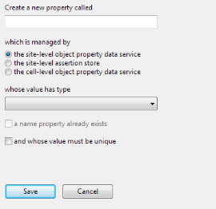
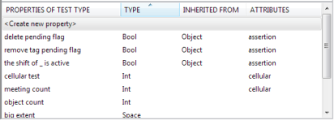
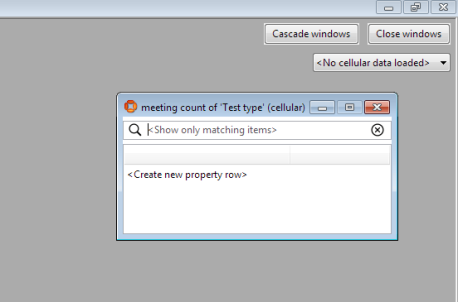
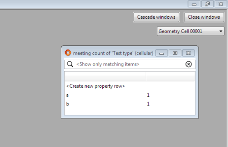
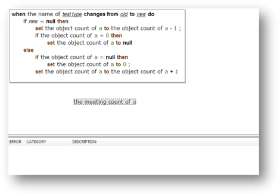
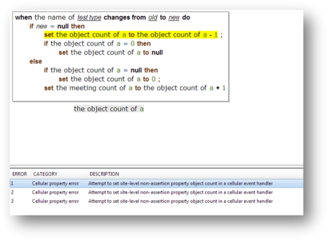
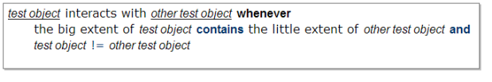
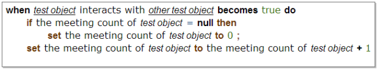
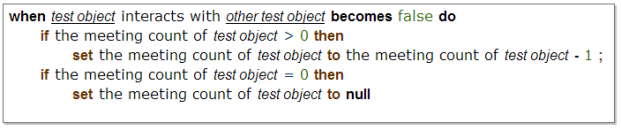

Skip To Main Content

  * placeholder

Filter:

  * All Files

Submit Search

   

You are here:

[Download as
PDF](../../../../SmartSpaceDownloads/B7GZWZS4WX9F/UbisenseRealTimeRules.pdf)

[Software
Version](../../../ComponentandFeatureOverview/FrontMatters\(Online\)/features-
and-versions.htm): 3.5

# Ubisense Real-Time Rules: Concepts and Configuration

This guide introduces the real-time rules capabilities introduced in
SmartSpace version 3.5.

# Summary of real-time rules features in version 3.5

The Real-time rules engine feature available from SmartSpace 3.5 onwards
provides some capabilities that make it easy to create scalable real-time
control applications by writing rules and event handlers.

  * Cellular object property data service. There is a new ‘Cellular object property data’ service. This is a real-time, cellular equivalent to the existing object property data service, and it runs at the spatial cell level.
  * User-defined cellular properties. The user can declare ‘cellular’ properties. Properties labeled as ‘cellular’ are managed by the cellular object property data service. 
  * User-defined assertions. The user can declare ‘assertion’ properties. These look just like normal properties but their value is managed by the site-level assertion store service.
  * Cellular rules engine. The user can define event handlers and rules using cellular properties and assertions, and these are executed at cell level by an instance of the rules engine running in the cellular user data store service.
  * Cellular .NET object property API. The .NET API has been extended to allow the user to ‘load’ a spatial cell, which will provide access to the values of cellular properties within the loaded cell, so that they can be read and written just like site level properties.
  * Support for writing real-time applications. Evaluation of cellular rules and event handlers is done in such a way that it always avoids disk contention, and preserves performance at scale by ensuring that code that can run at cell level does run at cell level. The rules language has type rules that prevent the user from accidentally breaking these real-time properties; and the .NET API can be set up to check at runtime for invocations that break real-time properties and throw a fatal error if it finds them.
  * Browsing and debugging support. The object browser panel in the SmartSpace Config tool has a menu which allows the user to specify a cell to be loaded for cellular properties, and this provides access to the values of properties within the loaded cell. If tracing is enabled, the rules engine trace panel will also display the trace output from rules and event handlers in the loaded cell.

# Real-time control components and data flow

The services that are relevant to real-time control are organized like this:

Figure 1 Organization of the services that are relevant to real-time control

## Object property data service

The site-level object property data service manages the normal user-defined
data and hosts the rules engine, which executes the user-defined rules and
event handlers.

### Use in real-time systems

This service uses a transactional persistent store: when a property value is
changed, the service invokes all the dependent event handlers and rules,
potentially changing more properties and invoking more event handlers and
rules; when the set of all dependent changes is calculated, the service writes
them synchronously to the disk and pushes them out to consumers via the event
channel. This means that slow disk response will directly affect the service’s
throughput and latency; while this generally does not matter when dealing with
normal workflow data it is an issue when implementing real-time control
systems in environments where the disk storage might be buggy or subject to
contention.

## Site-level assertion store data service

The site-level assertion service manages assertions, which can be declared by
external services (e.g. the ‘Path Group’ controls ‘Object’ assertion declared
by the paths and queues services) or, from version 3.5 onwards, declared by
the user (when declaring a property the user can nominate it as an assertion).

Every assertion visible to (or declared by) the user corresponds to a property
in the user data model, and changes to the rows of the assertion are pushed to
the user data service over the event channel and stored in the user data
service, meaning that assertions look just like properties. But when a row of
an assertion is changed in the user data service (either via the UI or via the
‘set property’ command in an event handler) the change is actually achieved by
calling an RPC on the assertion store.

### Use in real-time systems

This service supports transient assertions. The assertions are stored on disk
but this storage process is decoupled from the assertion operation itself, so
when an assertion RPC is called on the assertion store, the RPC up-call does
not touch the disk. This means that throughput and latency are independent of
disk performance. However, contention on the RPC interface of the service
itself might be a bottleneck in large-scale deployments.

## Cellular object property data service

The cellular user data service is a little bit like the site-level object
property data service, with the following differences:

  * It does not manage any site-level user data, but it does cache the parts of the site-level user data that it needs in order to evaluate site-level rules and events (the cache being updated over the event channel in the usual way)
  * It does manage cell-level user data for properties that were declared using the ‘cellular’ label. The way that cellular properties are managed by the cellular object property data service is exactly the same as the way that site-level properties and assertions are managed by the site level services, but done at cellular level
  * It connects directly to the corresponding spatial monitor service in its spatial cell and receives events directly from there, whereas the object property data service uses the spatial relation aggregation service to get spatial events
  * It executes cellular rules and events, which can set the values of the cellular properties
  * It does not use persistent storage for the properties that it manages – if persistent storage is required it can be achieved by creating an assertion, which will be stored persistently by the assertion store

### Use in real-time systems

Just like the cellular assertion store data service, the real-time rules
engine supports a data path that is isolated from the disk (via transient
assertions) and it supports cellular federation, and so is suitable for large
scale real-time control systems.

# Restrictions on cellular rules and events

To understand the restrictions on rule and event definition, you need to
understand where and how the relevant data is managed and how data is
processed by the real-time rules engine.

## Overview of real-time rules engine data processing

This diagram shows a zoomed-in view of the data sources used in the cellular
user data service and how data arrives in the service, is stored in the in-
memory database, and is pushed to the assertion store.

Figure 2 Processing of data in the real-time rules engine

## Where object property data can be set

This table summarizes where the data declared in the data model is managed,
depending on the label applied to it at declaration time.

In simple terms, cellular properties can’t be set from the site-level store
(because there is no site-level overview available for cellular properties, so
there is no mechanism for setting them), and site-level properties can’t be
set from the cell-level store (because to do so takes away the real-time
properties of the cell-level store), but site-level assertions can be set from
the cell-level store (because this doesn’t affect the real-time behavior of
the store).

Property type |  Can be set from site level object property data store / assertion store |  Can be set from cellular object property data store  
---|---|---  
Property |  Yes |  No  
Assertion |  Yes |  Yes  
Cellular property |  No |  Yes  
  
## Where object property data can be used

This table summarizes where the data declared in the data model is visible,
depending on the label applied to it at declaration time. In simple terms,
cellular properties can’t be read by the site-level store (because there is no
site-level overview available for cellular properties, so there is no
mechanism for reading them), but all kinds of properties can be read from the
cell-level store.

Property type |  Visible to site level object property data store / assertion store |  Visible to cellular object property data store  
---|---|---  
Property |  Yes |  Yes  
Assertion |  Yes |  Yes  
Cellular property |  No |  Yes  
  
## Restrictions on data use in rules and event handlers

### Definition of cellular rules and event handlers

A rule or event handler is cellular if and only if it either uses or sets a
cellular property. In simple terms, if any cellular property appears in the
head or body of a rule or event handler, then this means that the rule or
event handler concerned is cellular.

### Restrictions on cellular rules and event handlers

Because cellular rules and event handlers are executed in the cellular
property data service, and site level properties cannot be set from the
cellular property data service (see above for an explanation of why), it can
be deduced that site level properties cannot be set by cellular rules and
event handlers.

# User interface support for real time rules

## Defining cellular and assertion properties

The property creation dialogs now have the option to specify the storage
location of the property created:

The default choice is to create properties in the site-level service (which
was previously the only choice in earlier versions of the system). When
created, the properties are annotated with their attribute (assertion,
cellular or blank for the traditional style of property):

## Browsing cellular properties in the object browser

### Loading and unloading cells

In the top-right of the object browser window there is a combo box that allows
the user to select which cell-level object property data store to load:

By default, at startup, no cell is loaded and cell-level properties will all
appear empty when browsed. Loading a cell will immediately populate the
properties with their contents in the loaded cell:

### Displaying and setting cellular property content

The contents of cellular properties are displayed and set in the same way as
with site-level properties, but when a cellular property is changed its value
is changed in the cellular object property data store.

## Programming with cellular rules and event handlers

### Rule definition, type checking and new cellular type errors

Cellular rules and event handlers are defined in exactly the same way as site-
level ones, with the exception that, as explained in Restrictions on cellular
rules and events, a cellular rule cannot have a site-level property at its
head, and a cellular event handler cannot set a site level (non-assertion)
property.

Normally these constraints will be enforced by simply banning the illegal
drag-and-drop operations that would construct the incorrect code, but in some
cases new error messages will be displayed.

In the example below, ‘name’ and ‘object count’ are both site-level
properties, and ‘meeting count’ is a cellular property. So the definition
below is legal (it is a legal site-level event handler):

But if the last set action is changed by dragging out the ‘object count of a’
and replacing it with ‘the meeting count of a’ from the background, then these
errors will be visible:

Setting the meeting count in the event handler makes it into a cellular event
handler, and so all the instances in which site-level properties are set now
become errors and are displayed in the errors window.

### Tracing cellular rules and event handlers

Tracing of cellular rules and event handlers works in exactly the same way
that all other tracing works. When tracing is enabled in any rule engine trace
window, this turns on tracing in the site level and cell level rules engines.
If an individual SmartSpace Config tool has a cell loaded (via the object
browser combo box) then trace messages for that cell’s rules engine are
visible as well as trace messages for the site-level rules engine.

# Programming support for real-time applications

## Extensions to the .NET API for cellular operation

The class Ubisense.UDMAPI.ManagedBrowser (and the associated interface) has
two new functions to support cellular operation:

    
    
    public void load_cell(Ubisense.USpatial.Cell target);
            public Ubisense.USpatial.Cell target_cell();       

The load_cell function does exactly the same thing for the instance of the
browser that the load option in the object browser combo box does for the
SmartSpace Config tool: it caches the state of the cellular object property
data service for the specified cell (or no state if the cell is nil). The
target_cell function returns the currently-cached cell.

## Enabling run-time checking for real-time violations

The class Ubisense.UDMAPI.ManagedBrowser (and the associated interface) has
two new functions to support writing real-time managed browser code:

    
    
    public bool real_time_mode();
            public void real_time_mode(bool mode);
    

The real_time_mode(bool) function, called with the argument true, enables
‘real-time mode’ , ensuring that any attempt to set site-level services in the
browser will cause a fatal error, ensuring that the user cannot accidentally
write code that might suffer from contention on the site-level property data
store, and when called with the argument false, any property can be set. The
real_time_mode() function returns the current state of the real time mode in
the browser.

# An example of real-time application logic

In this simple example, we create some logic that is evaluated at cell level
and calculates the number of interactions that each ‘Test type’ object is
involved in. This uses these properties:

The spatial properties are defined such that the ‘big extent’ is a big space
round the object and the ‘little extent’ is a small space round the object.
Then these rules and event handlers are defined:

You can import these rules and event handlers into your SmartSpace
installation, by loading
[cellular_example.txt](../../../../SmartSpaceDownloads/B7GZWZS4WX9F/cellular_example.txt)
using the Business rules workspace. See [Module import and
export](../BusinessRulesExport/business-rules-export.htm) for information.

So now, if two ‘Test type’ objects are moved close to each other, their
meeting counts are both set to 1. If an instance of SmartSpace Config is
created and the relevant spatial cell is loaded, the state can be observed
changing when the objects are brought close to each other and then moved away
again.

Using the state defined above, this code example shows how the new operations
of ManagedBrowser can be used in practice. First we define an object to handle
callbacks in exactly the same way that we would do for a site-level property,
and then we define a simple function that reads the values of one property and
uses them to set the values of another.

    
    
              class EventPrinter : IRowEvents
                {
    	         public void data_inserted(string prop, List<string> row)
                    {
                        Console.Write("inserted: " + prop + " ");
                        foreach (var x in row)
                            Console.Write(x + " ");
                        Console.WriteLine("");
                    }
    
                    
                    public void data_removed(string prop, List<string> row)
                    {
                        Console.Write("removed: " + prop + " ");
                        foreach (var x in row)
                            Console.Write(x + " ");
                        Console.WriteLine("");
                    }
    
                    public void data_updated(string prop, List<string> before, List<string> after)
                    {
                        Console.Write("updated: " + prop + " ");
                        foreach (var x in before)
                            Console.Write(x + " ");
                        Console.Write("-> ");
                        foreach (var x in after)
                            Console.Write(x + " ");
                        Console.WriteLine("");
                    }
    
                    public void establish()
                    {
                        Console.WriteLine("establish event received");
                    }
    
                    public void schema_changed()
                    {
                        Console.WriteLine("schema_changed event received");
                    }
                }
    
                static void ProcessPropertyValues (ManagedBrowser browser,string property,string target_property,int target_value)
                {
                    Console.WriteLine("Printing values, loaded cell = " + browser.target_cell());
                    var values = new Dictionary<List<string>, string>();
                    browser.get_property_values(property, out values);
                    foreach (var value in values)
                    {
                        foreach (var arg in value.Key)
                            Console.Write(arg + " ");
                        Console.WriteLine(value.Value);
    
                        Console.WriteLine("Setting " + target_property + " to " + target_value + " for " + value.Key[0]);
                        browser.set_property_value(target_property, value.Key, target_value.ToString());
                    }
                }
    

Finally, the main program shows how the new operations can be used.

    
    
      static void Main(string[] args)
      {
          // Retrieve the cell from the command line arguments.
    
          // When this program is running as a service at spatial cell level, the
          // cell will automatically be passed in on the command line.  
          // If you are developing the program and want to test it, then set the command
          // line arguments in the project properties in Visual Studio.  To find the
          // required arguments to use, restart the 'Cellular object property data'
          // service; if you retrieve the trace (e.g. in the SmartSpace Config trace
          // component) then it will show lines of the form:
    
          // [06/09/2019 13:40:28] warning: controller stopped process for Business rules/Cellular object property data V3.5.7275 on USpatial::Cell:04007zTGQoW0tP6k006CnG000Mo
          // [06/09/2019 13:40:28] warning: controller saved files for Business rules/Cellular object property data V3.5.7275 on USpatial::Cell:04007zTGQoW0tP6k006CnG000Mo
          // [06/09/2019 13:40:31] warning: controller started process for Business rules/Cellular object property data V3.5.7275 on USpatial::Cell:04007zTGQoW0tP6k006CnG000Mo
          // [06/09/2019 13:40:31] warning: ubisense_cellular_rules_engine.exe (Ubisense/Business rules/Cellular object property data) license valid
    
          // so in this case the arguments would be: USpatial::Cell 04007zTGQoW0tP6k006CnG000Mo
    
          var spatial_cell = new Ubisense.USpatial.Cell();
          spatial_cell.Narrow(CommandLine.Object(args));
          if (spatial_cell.Nil())
              return;
          Console.WriteLine("Cell from command line = " + spatial_cell.ToString());
    
          ManagedBrowser browser = new ManagedBrowser();
    
          // Should print "Real time mode = False"
          Console.WriteLine("Real time mode = " + browser.real_time_mode().ToString());
    
          // Set the real time mode to true
          browser.real_time_mode(true);
    
          // Should print "Real time mode = True"
          Console.WriteLine("Real time mode = " + browser.real_time_mode().ToString());
    
          // If uncommented, the following operation should give a fatal error of this form:
          // [06/09/2019 13:27:44] fatal: can't set site-level property name<Test_type> when in real-time mode
    
          // string obj;
          // browser.create_object("Test_type", name, out obj);
    
          for (int i = 0; i < 10; ++i)
          {
              // When the target cell is nil, there will be no values of the cellular
              // property meeting_count<Test_type>.
              browser.load_cell(new Ubisense.USpatial.Cell());
              ProcessPropertyValues(browser, "meeting_count<Test_type>", "cellular_test<Test_type>", i);
    
              // When the target cell is a specific cpatial cell, meeting_count<Test_type>
              // will have values as they are in that cell.
              Console.WriteLine("Loading cell " + spatial_cell.ToString());
              browser.load_cell(spatial_cell);
              ProcessPropertyValues(browser, "meeting_count<Test_type>", "cellular_test<Test_type>", i);
          }
    
          // Wait and receive callbacks from the cell-level service
    
          browser.set_event_callback(new EventPrinter());
          browser.add_property("meeting_count<Test_type>");
    
          while (true)
              System.Threading.Thread.Sleep(1000);
      }

  * Ubisense Real-Time Rules: Concepts and Configuration
  * Summary of real-time rules features in version 3.5
  * Real-time control components and data flow
    * Object property data service
      * Use in real-time systems
    * Site-level assertion store data service
      * Use in real-time systems
    * Cellular object property data service
      * Use in real-time systems
  * Restrictions on cellular rules and events
    * Overview of real-time rules engine data processing
    * Where object property data can be set
    * Where object property data can be used
    * Restrictions on data use in rules and event handlers
      * Definition of cellular rules and event handlers
      * Restrictions on cellular rules and event handlers
  * User interface support for real time rules
    * Defining cellular and assertion properties
    * Browsing cellular properties in the object browser
      * Loading and unloading cells
      * Displaying and setting cellular property content
    * Programming with cellular rules and event handlers
      * Rule definition, type checking and new cellular type errors
      * Tracing cellular rules and event handlers
  * Programming support for real-time applications
    * Extensions to the .NET API for cellular operation
    * Enabling run-time checking for real-time violations
  * An example of real-time application logic

   

* * *

[www.ubisense.net](http://www.ubisense.net/)  
Copyright © 2020, Ubisense Limited 2014 - 2020. All Rights Reserved.

