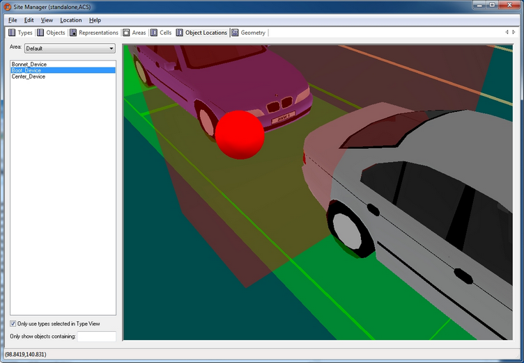

Skip To Main Content

  * placeholder

Filter:

  * All Files

Submit Search

   

You are here:

# Example of ACS with the Atlas Copco OpenProtocol

Demonstration of ACS with an assembly line getting its position information
from an external system and handling spatial relation for devices and product
spaces with the Atlas Copco OpenProtocol.

Preparing the Ubisense Platform including: Area, Cells and Representations.

Configuration of ACS including: Product Types, Product Spaces, Production
Lines, Assembly Lines, External Systems and Device Types.

Show Simulations of the ACS Protocol and Atlas Copco OpenProtocol.

## Preparation of your Environment

Follow the installations instructions for the combination of SmartSpace and
ACS and other Ubisense products you require as described in your installation
guide.

## Use SmartSpace Config to Set up a Site and Add Representations for your
Demonstration

Follow the instructions for configuring ACS given in [Configuration in
SmartSpace](../../../UserResources/ACS/acs-configuration.htm).

In particular, you must do the following.

### Site Setup

  1. Create a new Area.
  2. Add a Geometry Cell to your site.
  3. Add a Location Cell to your Geometry Cell.
  4. Extend your Location Cell. In the Cells task, double-click the location cell and, in the Edit the extent of Location Cell dialog, change the Top to 10.
  5. Extend your Geometry Cell and Site Cell to contain your Location Cell.

Restart the Location Management Services in the Ubisense Service Manager in
order to make sure that the services are running correctly.

### Add Representations

  * Import representations and push them to ACS.
  * Note: Use two different representations (e.g. BlueCar_template and WhiteCar_template).

In order to use your representation in ACS, remember to extend the
representation name with _template.

## Configuration in ACS

### Add Product Types in ACS

See Product Types in the ACS Online Help.

  1. Choose one of your created representations. 
  2. Set a suitable Type (Name) and Description. 
  3. Set the timeout to 10 seconds if you get the position from an external system, set no timeout otherwise. 

Add two different products with different representations (e.g.. BlueCar and
WhiteCar).

### Add a Production Line

See Production Lines in the ACS Online Help.

  1. Set a suitable name (e.g. Main Production Line). 
  2. Set all Product types you want to support in your production line to Supported . 

### Configure the First External System

See External Systems in the ACS Online Help.

  1. Set a suitable name (e.g. LinePLC). 
  2. As Type choose PLC.
  3. Set a suitable description. 
  4. Specify the IP Address of the computer on which the External System will be run. 
  5. Set a suitable Port (e.g. 2001). 
  6. As Protocol choose ACSProtocol.
  7. As Protocol Version choose 1.0.0.
  8. Select Remote station is Server.

For example:

### Configure the Additional Parameters for the External System

  * For parameter Alive Time-out leave the value at 15 

### Add an Assembly Line

See Assembly Lines in the ACS Online Help.

  1. Choose the area you created in SmartSpace Config. 
  2. Set a suitable Name for your assembly line (e.g. Band-01). 
  3. Choose your created Production Line. 
  4. As Location Source choose External System. 
  5. Set the Grid Snapping to 1.00m. 
  6. Set the line geometry for your assembly line.
  7. On the Externally Driven tab, the parameters for the External System can be configured. (For the Demonstration, select only your configured External System LinePLC and set any Association Id ).
  8. Set Line Movement to _Product offsets_.
  9. Set Clear locations when connection is lost for more than [s] to _10_.
  10. Commit your changes.

### Add Product Spaces

See Product Spaces in the ACS Online Help.

  1. Select your Product Type. 
  2. Add a Product Space. 
  3. Set a suitable name for the space (e.g. Bonnet). 
  4. Set the Grid Snapping to 1.00m. 
  5. Enter a value at Extent ceiling height (e.g. 3m). 
  6. Set a suitable geometry for your Product Space. 

For your demonstration, add two different products with different product
spaces (Boot for BlueCar and Bonnet for WhiteCar).

### Configure the Second External System

See External Systems in the ACS Online Help.

  1. Add a new external system. 
  2. Set a suitable name (e.g. AC-Controller-Left). 
  3. From Type choose Tool Controller.
  4. Set a suitable description. 
  5. Specify the IP Address of the computer on which the External System will be run. 
  6. Set a suitable Port (e.g. 4545). 
  7. From Protocol choose Atlas Copco OpenProtocol.
  8. From Protocol Version choose 1.0.0.
  9. Select Remote station is Server.

### Configure Additional Parameters for the External System

See Protocols (Atlas Copco OpenProtocol) in the ACS Online Help.

For this example it is not necessary to change any additional parameters.

### Add a Device

See Device Types in the ACS Online Help.

  1. Set a suitable device name (e.g. AC-Wireless). 
  2. Add a suitable description. 

### Add a Device Instance

See Device Instances in the ACS Online Help.

  1. Set a suitable name (e.g. Device Left). 
  2. As Device Type choose AC-Wireless (the type you created in the previous step). 

### Enable Product Space Rules for the Device

See Device Instances (Setting Product Space Rules) in the ACS Online Help.

  1. Select your created device.
  2. In the Device Activation pane, select the ObjectIsLocated Event for your device. 
  3. Enable the device for each of the product spaces you created earlier.

  4. As External System name select the check box for AC-Controller-Left (the second external system you created).

### Enable External System Connectivity

See Connection Status in the ACS Online Help.

Make sure the _Desired status_ column for both the external systems are set as
_Connected_.

ACS is now configured.

## Simulating the Two Protocols

For your demonstration there are two tools you can use to simulate the ACS
Protocol and the Atlas Copco OpenProtocol

In order to see any output at the cmd you must set an Environment variable,
otherwise you can see the output only in the log-File

set UABASEEVENTLOG=1.

### Simulate the ACS Protocol

With the tool ubisense_acs_protocol_clientserver.exe you can present the
product types moving at your assembly line. Use the Ubisense Application
Manager to download the tool (see the Installing Client Machines on Windows
section of your installation guide for more information).

ubisense_acs_protocol_clientserver.exe server <IP-Address> <Port> 16

For example:

ubisense_acs_protocol_clientserver.exe server 169.128.155.56 2001 16

When the ubisense_acs_protocol_clientserver starts the user has to configure
some values:

Parameter | You enter...  
---|---  
Enter line name: | The name of the assembly line, e.g. Band-01  
Enter #products: | The amount of products to be generated, e.g. 20  
Enter start offset in cm:  | The offset from the start of the assembly line, e.g. 0  
Enter product distance in cm:  | The distance between two products, e.g. 600  
Enter Product Type (colon separated): | e.g. BlueCar:WhiteCar  
Enter first Product ID (numeric): | The ID of the first product to be generated, e.g. 1  
Enter speed (m/s):  | The speed at which the tags will move along the line, e.g. 0.2  
Enter loop pause (s): | The refresh rate, e.g. 1  
  
### Simulate the Atlas Copco OpenProtocol

With the tool ubisense_open_protocol_clientserver.exe you can present devices
using the Atlas Copco OpenProtocol. You can find it in the tools directory.

ubisense_open_protocol_clientserver.exe server <IP-Address> <Port> 1

For example:

ubisense_open_protocol_clientserver.exe server 192.168.178.201 4545 1

## Demonstration in Ubisense Site Manager

If you have the Ubisense Site Manager application, you can show the moving
products and the spatial relations.

### Set the Spatial Relations

  1. Activate Object Locations tab. 
  2. Start View -> Spatial Relations. 
  3. Clear all Roles in the top part of the window. 
  4. In the lower part of the window select your spatial relation (e.g. ACS::Boot contains ACS::AC-Wireless), use the right mouse button and press Select Roles. 

### Add your Configured Tool to the Object Location

  1. Activate Types tab and select your configured Tool ACS::AC-Wireless. 
  2. Activate Object Locations and select the option Only use types selected in Type View. 
  3. Select your Device and locate it in your area. It should be inside one of your Product spaces. 
  4. Set the Z-Coordinate to 1.5. 

Moving products and the spatial relations in Ubisense Site Manager

At the command line, from ubisense_open_protocol_clientserver.exe you will see
a telegram each time your device enters or leaves your Production Space (if
you have set UABASEEVENTLOG=1 as described above).

  * Example of ACS with the Atlas Copco OpenProtocol
    * Preparation of your Environment 
    * Use SmartSpace Config to Set up a Site and Add Representations for your Demonstration
      * Site Setup
      * Add Representations
    * Configuration in ACS 
      * Add Product Types in ACS
      * Add a Production Line 
      * Configure the First External System 
      * Configure the Additional Parameters for the External System
      * Add an Assembly Line 
      * Add Product Spaces 
      * Configure the Second External System 
      * Configure Additional Parameters for the External System 
      * Add a Device 
      * Add a Device Instance 
      * Enable Product Space Rules for the Device
      * Enable External System Connectivity
    * Simulating the Two Protocols
      * Simulate the ACS Protocol 
      * Simulate the Atlas Copco OpenProtocol 
    * Demonstration in Ubisense Site Manager 
      * Set the Spatial Relations 
      * Add your Configured Tool to the Object Location 

   

* * *

[www.ubisense.net](http://www.ubisense.net/)  
Copyright © 2020, Ubisense Limited 2014 - 2020. All Rights Reserved.

