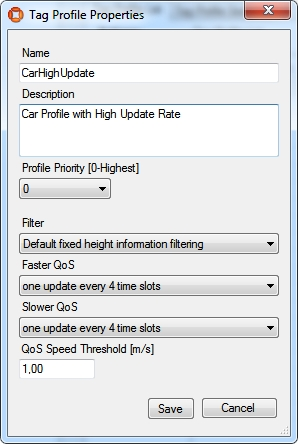
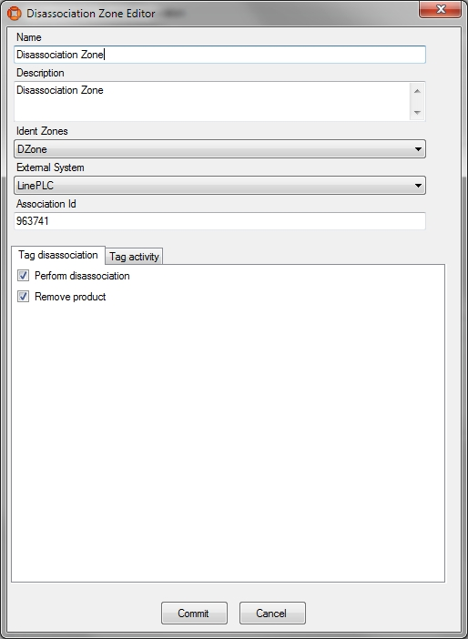
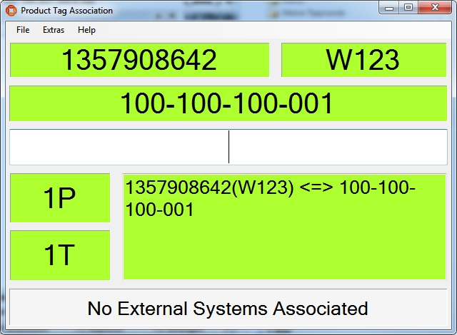

Skip To Main Content

  * placeholder

Filter:

  * All Files

Submit Search

   

You are here:

# Example of ACS with tags and a disassociation zone

Demonstration of ACS with an Assembly Line getting its position information
from tags using a disassociation zone to send tags to sleep.

Preparation of the Ubisense Platform including: area, cells and
representations.

Configuration of ACS including: Product Types, Product Type Tag Positions,
Production Lines, Assembly Lines, Tag Profiles, Disassociation Zones, Product
Tag Association, External Systems and Ident Zones.

Show Simulations of the ACS Protocol.

## Preparation of your Environment

Follow the installations instructions for the combination of SmartSpace and
ACS and other Ubisense products you require as described in your installation
guide.

## Use SmartSpace Config to Set up a Site and Add Representations for your
Demonstration

Follow the instructions for configuring ACS given in [Configuration in
SmartSpace](../../../UserResources/ACS/acs-configuration.htm).

In particular, you must do the following.

### Site Setup

  1. Create a new Area.
  2. Add a Geometry Cell to your site.
  3. Add a Location Cell to your Geometry Cell.
  4. Extend your Location Cell. In the Cells task, double-click the location cell and, in the Edit the extent of Location Cell dialog, change the Top to 10.
  5. Extend your Geometry Cell and Site Cell to contain your Location Cell.

Restart the Location Management Services in the Ubisense Service Manager in
order to make sure that the services are running correctly.

### Add Representations

  * Import representations and push them to ACS.
  * Note: Use two different representations (e.g. BlueCar_template and WhiteCar_template).

In order to use your representation in ACS, remember to extend the
representation name with _template.

## Configuration in ACS

### Add Product Types in ACS

See Product Types in the ACS Online Help.

  1. Choose one of your created representations.
  2. Set a suitable Type (Name) and Description.
  3. Set NO timeout.

Add two different products with different representations.

### Add Product Type Tag Position

See Product Type Tag Positions in the ACS Online Help.

Add the tag position for both product types:

  1. Select one of your defined product types and add the Tag Position.
  2. Set a suitable Tag Position Name and Description.
  3. Set the Tag Position Height (e.g. 0.5m).
  4. Do **NOT** check _Drive Directly?_.
  5. Set the geometry (point) for the Tag Position.

Check the Tag Position in 2D and 3D mode.

### Add a Production Line

See Production Lines in the ACS Online Help.

  1. Set a suitable name (e.g. _MainProductionLine_).
  2. Set all Product types you want to support in your production line to Supported.

### Add an Assembly Line

See Assembly Lines in the ACS Online Help.

  1. Choose the area you created in SmartSpace Config.
  2. Set a suitable Name for your assembly line (e.g. Band-01).
  3. Choose your created Production Line.
  4. As Location Source choose Tag.
  5. Set the Grid Snapping to 1.00m.
  6. Set the line geometry for your assembly line.

Activate the tab Tag Settings – see Assembly Lines (Tag Setting tab page - Tag
Recognition) in the ACS Online Help.

  1. For Tag Recognition use the Defaults button to set all values to default.
  2. For Transport Parameters set the following values:
     * Line Width [m]: 2.
     * Minimum Carrier Distance [m]: 6.
     * Standard line speed [m/s]: 0.2.
     * Click "Adapt Length".
     * Do NOT add additional Line Sections.

Activate the tab Tag Error Handling (see Assembly Lines (Tag Error Handling)
in the ACS Online Help):

  * In the Part Error Detection change nothing.
  * In the Part Error Recovery change nothing.

### Add Tag Profiles

See Tag Profile Manager (Tag Profile Properties Dialog) in the ACS Online
Help.

If you are using a Ubisense D4 system, the Tag Profile Manager dialog has
fewer parameters that you can set.

  1. Set a meaningful name (e.g. CarHighUpdate).
  2. Add a description.
  3. Set the Profile Priority to 0.
  4. Choose a filter (e.g. Default fixed height information filtering).
  5. Series 7000 systems only:

     * Choose a Faster QoS (e.g. every 4 time slots). 
     * Choose a Slower QoS (e.g. every 32 time slots). 
     * Set the QoS Speed Threshold (e.g. 1.00).

For example:

Add at least two different Tag Profiles.

### Configure your Tag Profile Sections

See Tag Profile Manager (Tag Profile Sections) in the ACS Online Help.

  1. Choose your Production Line.
  2. Choose your Assembly Line Name.
  3. Add Profile Sections.
  4. Set your Start Offset.
  5. Set your End Offset.
  6. Choose your Profile.

Configure at least two Profile Sections with different profiles.

### Configure an Ident Zone for the association

See Ident Zones in the ACS Online Help.

  1. Set a Name.
  2. Add a Description.
  3. Set Height of floor [m] (e.g. 0m).
  4. Set Height of ceiling [m] (e.g. 3m).
  5. Choose your Area.
  6. Set a suitable geometry (trigger zone) for the Ident Zone.
  7. Commit your changes.

  8. Create an event (Events tab).

  9. Give it an appropriate name. (Suffix the name with Event to distinguish it from the actual Ident Zone.)

  10. Save changes.

  11. Associate the event with Active Type _ULocationIntegration::Tag_.

### Configure an Association Zone

See Association Zones in the ACS Online Help.

  1. Set a Name.
  2. Add a Description.
  3. Choose an Ident Zone.
  4. Select your first Product Type.
  5. Choose the Tag Position for this Product Type.
  6. Select your second Product Type.
  7. Choose the Tag Position for this Product Type.
  8. Commit your changes.

For example:

### Configure an Ident Zone for the Disassociation

See Ident Zones in the ACS Online Help.

  1. Set a Name.
  2. Add a Description.
  3. Set Height of floor [m] (e.g. 0m).
  4. Set Height of ceiling [m] (e.g. 3m).
  5. Choose your Area.
  6. Set a suitable geometry (trigger zone) for the Ident Zone.
  7. Create an event (Events tab).
  8. Give it an appropriate name. (Suffix the name with Event to distinguish it from the actual Ident Zone.)
  9. Save changes.
  10. Associate the event with the Product Types as the Active Type.

### Configure a Disassociating Zone

See Disassociation Zones in the ACS Online Help.

  1. Set a Name.
  2. Add a Description.
  3. Choose your Ident Zone.
  4. On the Tag disassociation tab, check Perform disassociation and Remove product.
  5. On the Tag activity tab, check Send tag to sleep and as Wakeup time choose short.
  6. In the Tag ranges part you can configure whitelists or blacklists for Tag ranges (for the moment leave it blank and check the _Not from ranges_ radio button).

For example:

### Configure an External System

See External Systems in the ACS Online Help.

  1. Set a suitable name.
  2. As Type choose PLC.
  3. Set a suitable description.
  4. Specify the IP Address of the computer on which the External System will be run.
  5. Set a suitable Port (e.g. 2001).
  6. As Protocol choose ACSProtocol.
  7. As Protocol Version choose 1.0.0.
  8. Select Remote station is Server.

Add your association zone and Disassociation Zone as Associated Objects to
your external system (using two different association IDs).

## Use the ACSProtocol to Simulate the Association

With the tool ubisense_acs_protocol_clientserver.exe you see the
association/disassociation. Use the Ubisense Application Manager to download
the tool (see the Installing Client Machines on Windows section of your
installation guide for more information).

How to use:

ubisense_acs_protocol_clientserver.exe server <IP-Address> <Port> 14

For example:

ubisense_acs_protocol_clientserver.exe server 127.0.0.1 2001 14

You must specify some values from your own example.

Use the tool ubisense_product_tag_simulator to simulate tags moving along your
production line. Use the Ubisense Application Manager to download the tool
(see the Installing Client Machines on Windows section of your installation
guide for more information).

How to use:

ubisense_product_tag_simulator.exe [OPTIONS] <Production Line>

For example:

ubisense_product_tag_simulator.exe -t 100-0-0-1 "MainProductionLine"

## See Association of Tags to Products

See Product Tag Association in the ACS Online Help.

  1. Start the ACS Product Tag Association GUI.
  2. Set your options (Extras -> Options).
  3. Set Red Fields for Incomplete Data after [sec] to 5s.
  4. Set Blinking Fields for Incomplete Data after [sec] to 10s.
  5. Set the Tag ID prefixes to e.g.. 100- . Ensure that this is consistent with what you have specified with ubisense_product_tag_simulator.
  6. Choose your association zone.
  7. Accept your options.

## See Association of Products to Tags

If the association isn’t working:

  * Check the Assembly Line Messages (Operations -> Live Logs) and if there are no messages then try restarting the ACS Tracking Support service.

The ACS Product Tag Association tool

  * Example of ACS with tags and a disassociation zone
    * Preparation of your Environment 
    * Use SmartSpace Config to Set up a Site and Add Representations for your Demonstration
      * Site Setup
      * Add Representations
    * Configuration in ACS 
      * Add Product Types in ACS 
      * Add Product Type Tag Position
      * Add a Production Line
      * Add an Assembly Line
      * Add Tag Profiles
      * Configure your Tag Profile Sections
      * Configure an Ident Zone for the association
      * Configure an Association Zone
      * Configure an Ident Zone for the Disassociation
      * Configure a Disassociating Zone
      * Configure an External System
    * Use the ACSProtocol to Simulate the Association
    * See Association of Tags to Products
    * See Association of Products to Tags

   

* * *

[www.ubisense.net](http://www.ubisense.net/)  
Copyright © 2020, Ubisense Limited 2014 - 2020. All Rights Reserved.

