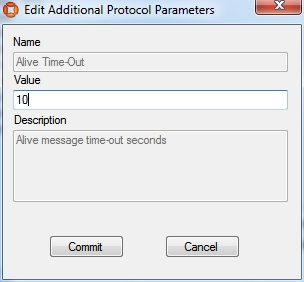
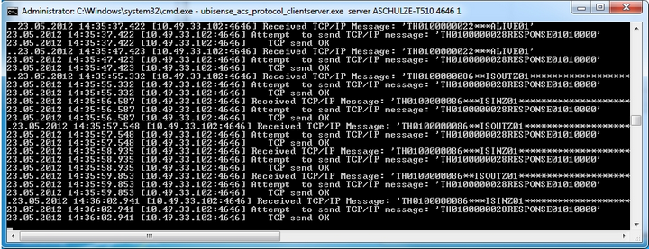
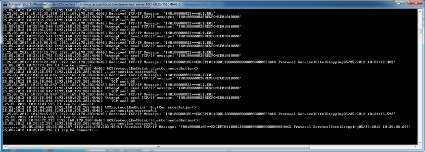

Skip To Main Content

  * placeholder

Filter:

  * All Files

Submit Search

   

You are here:

# Example of ACS using the ACS Protocol for spatial relations and message
forwarding

Demonstration of ACS with a Workspace and handling spatial relation for
devices and workspaces with the ACS Protocol, and demonstration of Message
Forwarding with the ACS Protocol.

Preparation of the Ubisense Platform including: area and cells.

Configuration of ACS including: Workspaces, External Systems and Device Types.

Show simulations of the ACS Protocol.

## Preparation of your Environment

Follow the installations instructions for the combination of SmartSpace and
ACS and other Ubisense products you require as described in your installation
guide.

## Use SmartSpace Config to Set up a Site and Add Representations for your
Demonstration

Follow the instructions for configuring ACS given in [Configuration in
SmartSpace](../../../UserResources/ACS/acs-configuration.htm).

In particular, you must do the following.

### Site Setup

  1. Create a new Area.
  2. Add a Geometry Cell to your site.
  3. Add a Location Cell to your Geometry Cell.
  4. Extend your Location Cell. In the Cells task, double-click the location cell and, in the Edit the extent of Location Cell dialog, change the Top to 10.
  5. Extend your Geometry Cell and Site Cell to contain your Location Cell.

Restart the Location Management Services in the Ubisense Service Manager in
order to make sure that the services are running correctly.

## Configuration in ACS

### Add a Workspace in ACS

See Workspaces in the ACS Online Help.

  1. Choose your area. 
  2. Set a suitable name (e.g. "Battery assembly"). 
  3. For Height of floor [m] set "0". 
  4. For Height of ceiling [m] set "2". 
  5. Set a suitable geometry for your workspace. 

### Configure an External System

See External Systems in the ACS Online Help.

  1. Set a suitable name (e.g. _ACSToolController_). 
  2. As Type choose Tool Controller. 
  3. Set a suitable description. 
  4. Specify the IP Address of the computer on which the External System will be run.
  5. Set a suitable Port (e.g. 4646). 
  6. As Protocol choose ACS Protocol.
  7. As Protocol Version choose 1.0.0. 
  8. Select Remote station is Server.
  9. Press OK.

  10. Go to Operation > Connection status and set the desired state of this external system to _Connect_.

### Configure the Additional Parameter for your External System

See Protocols (ACSProtocol) in the ACS Online Help.

  * Set parameter Alive Time-Outset value to _10_.

### Add a Device

See Device Types.

  1. Set a suitable device name (e.g. Battery assembly tool). 
  2. Add a suitable description. 

### Add a Device Instance

See Device Instances.

  1. Set a suitable name (e.g. BA Device). 
  2. As Device Type choose Battery assembly tool (the type you created in the previous step). 

### Enable Static Space Rules for the Device

See Device Instances (Setting Static Space Rules).

  1. Select your created device (in the upper pane).
  2. In the Device Activation pane below, select the ObjectIsLocated Event for your device.

Suffix the name with OILevent to distinguish it from the actual device.

  1. Enable the device for the Workspace you created earlier.

  2. As External System name choose ACSToolController (the external system you last created). 

### Enable Message Forwarding

See Message Forwarding in the ACS Online Help.

  * Select your configured External System for Message Forwarding.

ACS is now configured.

## Simulate the ACS Protocol

For your demonstration there is a tool you can use to simulate the ACS
Protocol.

In order to see any output at the command line you must set an environment
variable, otherwise you can see the output only in the log-File

set UABASEEVENTLOG=1.

### Simulate the ACSProtocol

With the tool ubisense_acs_protocol_clientserver.exe you can listen for the
ACS Protocol messages. You can find it in the tools directory.

How to use:

ubisense_acs_protocol_clientserver.exe server <IP-Address> <Port> 1

For example:

ubisense_acs_protocol_clientserver.exe server 192.168.178.201 4646 1

## Demonstration in Ubisense Site Manager

If you have the Ubisense Site Manager application, you can show the workspace
and the spatial relations.

### Set the Spatial Relations

  1. Activate "Object Locations" and select View -> Spatial Relations.
  2. Clear all Roles in the top part of the window.
  3. In the lower part of the window select your spatial relation (e.g. ACS::Workspace contains ACS::Battery assembly tool), and right-click to choose "Select roles".

### Add your configured Tool to the Object Location

  1. Activate "Types" and select your configured tool type ACS::Battery assembly tool.
  2. Activate Object Locations and select the Only use types selected in Type View check box.
  3. Select your device and place it inside the Workspace you created earlier. 
  4. Set the Z-Coordinate to 0.5 to ensure it is also vertically inside the Workspace.

At the command line from ubisense_acs_protocol_clientserver.exe you will see a
telegram each time you enter or leave your workspace with your device. You can
also see these telegrams in the corresponding Log-File
(ubisense_acs_protocol_service*.log).

### Use the Ubisense Service Manager to Start and Stop the ACSProtocol

At the command line from ubisense_acs_protocol_clientserver.exe you will see a
telegram each time the ACSProtocol is stopped. You can also see these
telegrams in the corresponding Log-File (ubisense_acs_protocol_service*.log).

  * Example of ACS using the ACS Protocol for spatial relations and message forwarding
    * Preparation of your Environment 
    * Use SmartSpace Config to Set up a Site and Add Representations for your Demonstration
      * Site Setup
    * Configuration in ACS 
      * Add a Workspace in ACS 
      * Configure an External System 
      * Configure the Additional Parameter for your External System 
      * Add a Device 
      * Add a Device Instance 
      * Enable Static Space Rules for the Device 
      * Enable Message Forwarding
    * Simulate the ACS Protocol
      * Simulate the ACSProtocol 
    * Demonstration in Ubisense Site Manager 
      * Set the Spatial Relations 
      * Add your configured Tool to the Object Location 
      * Use the Ubisense Service Manager to Start and Stop the ACSProtocol 

   

* * *

[www.ubisense.net](http://www.ubisense.net/)  
Copyright © 2020, Ubisense Limited 2014 - 2020. All Rights Reserved.

