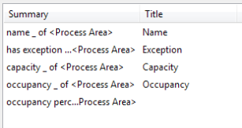
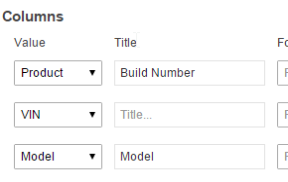

Skip To Main Content

  * placeholder

Filter:

  * All Files

Submit Search

   

You are here:

[Software
Version](../../../ComponentandFeatureOverview/FrontMatters\(Online\)/features-
and-versions.htm): 3.2

# Localization and Tailoring Configuration Guide

# Introduction

## Process

SmartSpace provides a set of tools for both localizing and tailoring
applications. Localization is the process of translating the application into
another language such as French or German. Tailoring is the process of
adapting the default application terminology to match that which is used by
the customer. For example, the Product type has a "build number" property but
a customer may prefer build number to be renamed as "GSN" – this type of
customization would be considered tailoring. As of version 3.1.7 the
configuration client does not have full localization support. For this reason,
plus also to provide consistency and aid the Support process, all
configuration and customization in the configuration client should be
completed in English. Any customization can then be localized alongside the
underlying application using the translation tools.

Basic tailoring can be achieved through the Title field provided for
properties added to searches and reports. However, this field should not be
used to provide localization, i.e. the words entered into the Title field
should always be in English.

  
---  
Defining a 'Title' that will be displayed for properties in a search on the
web map  
  
In some special cases, more advanced tailoring may be required (e.g.
customizing properties displayed as notifications), in this case the
translation tools can also be used to provide tailoring for the English
locale. For projects that require both localization and tailoring, the process
depends on whether a generic translation has already been produced for the
reference application. If this does not exist it is recommended that a generic
translation is produced first as this can then be reused for other projects.
After this, any tailoring should be completed by following the localization
process for updating translations using the existing generic translation file
and replacing Ubisense terminology with customer-specific terms. The specific
approach is dependent on the nature of the project. Some examples are
illustrated in the diagram below:

If you are unsure of the right approach, or for special cases, contact
SmartSpace Product Management.

## Tools

The majority of named items in SmartSpace (types, properties, complex
properties, etc.) are represented by a symbol in the underlying data store.
When presented to the user, in either SmartSpace Config or SmartSpace Web, the
symbol is passed to the presentation layer, which provides a translation of
the symbol that matches the user's locale settings (or the English translation
if no matching translation is specified).

Translations can be defined by using ubisense_translation_tool.exe. It is
available in the Application Manager. Go to the DOWNLOADABLES task and select
Platform/translation tool.

The tool generates and imports XLIFF files, a form of XML that is supported by
commercial translation tools such as MemoQ. MemoQ supports a sophisticated
translation workflow which is suitable for commercial translation providers.
However, Ubisense users may find it simpler to manually edit the XLIFF file
using a text editor. Each section of the XLIFF file contains a source and
target locale. The source locale is an existing translation provided as
reference for the translator – usually this will be English (en). The target
locale is the language that you wish to provide a new translation for. If
multiple translations are required one XLIFF file must be produced for each
translation.

# Structure of XLIFF files

The basic structure of the XLIFF file is as follows:

    
    
    <xliff>
         <file name="ubisense_default" source-language="en" target-language="fr-fr">
              <body>
                   <trans-unit></trans-unit>
                   <trans-unit></trans-unit>
              </body>
         </file>
         <file name="IdentifyFind" source-language="en" target-language="fr-fr">
              <body>
                   <trans-unit></trans-unit>
                   <trans-unit></trans-unit>
              </body>
         </file>
    </xliff>

Symbols are defined in a specific namespace and each namespace is represented
by a "file" element in the XLIFF file. The namespaces are defined by the
SmartSpace Product Engineering team. They cannot be defined by the user and
are not related to the application namespace concept that was introduced in
3.1.7. Namespaces tend to correspond to a particular module of either the
SmartSpace Config application or SmartSpace Web e.g. AnalyseImprove,
IdentifyFind etc. The table below details the namespaces defined in the XLIFF
file elements with a summary of which components they affect. Note that some
elements affect both SmartSpace Config and SmartSpace Web.

The source and target locale are specified using "source-language" and
"target-language" attributes on the file element, using [ISO
639](https://en.wikipedia.org/wiki/ISO_639 "ISO 639") (language) and [ISO
3166-1 alpha-2](https://en.wikipedia.org/wiki/ISO_3166-1_alpha-2 "ISO 3166-1
alpha-2") (two-letter country) codes. These attributes are set automatically
when the file is created using the translation tool.

XLIFF <file> name | SmartSpace Config | SmartSpace Web | Comments  
---|---|---|---  
ubisense_default |  ✓ |  ✓ |  All types and properties in the user data model. These may be presented to the user on screens in SmartSpace Web wherever properties are displayed without an overriding "title" (see Translating search and report "title" fields) or in notification messages  
AnalyseImprove |  |  ✓ |  Report editing in SmartSpace Web, and error messages  
AnalyseImproveUser |  |  ✓ |  User-defined "Title" fields for reports – see Translating search and report "title" fields  
ApplicationData |  |  ✓ |  Only present if using special features to translate application data (see Translating application data)  
AssociationAndConfig |  ✓ |  ✓ |  WEB FORMS in SmartSpace Config and Configuration section of SmartSpace Web – in particular tag association/disassociation error messages  
AutoAssociation |  | ✓ | Automated tag association screen in SmartSpace Web  
ConfigurationParametersUI |  |  | General user interface for SERVICE PARAMETERS in SmartSpace Config  
ConnectionString |  ✓ |  |  PROPERTY HISTORY in SmartSpace Config  
DisabledComponentUI |  |  | Messages displayed on startup if no services are running  
IdentifyAndFind |  |  ✓ |  User-defined "Title" fields for searches and configuration screens – see Translating search and report "title" fields  
IdentifyFind |  |  ✓ |  Includes error messages, tool tips and page title for Maps screen in SmartSpace Web  
InterfaceLayoutUI |  ✓ |  |  Names and descriptions of sections in workflow tab  
LLRP | ✓ |  | LLRP reader configuration in SmartSpace Config  
LocationLogging |  ✓ |  |  PROPERTY HISTORY in SmartSpace Config  
LoggingConfigurationUI | ✓ |  | LOGGING in SmartSpace Config  
LoggingOutputUI | ✓ |  | TRACE VIEWER in SmartSpace Config  
PropertyLogging |  ✓ |  |  PROPERTY HISTORY in SmartSpace Config  
RepAssignmentUI |  ✓ |  |  MODEL ASSIGNMENT in SmartSpace Config  
RepImportUI |  ✓ |  |  MODEL IMPORT in SmartSpace Config  
RepPlacementUI |  ✓ |  |  OBJECT PLACEMENT in SmartSpace Config  
RoleEditor |  ✓ |  |  USERS / ROLES in SmartSpace Config  
RulesEngineLogUI |  ✓ |  |  BUSINESS RULE TRACE in SmartSpace Config  
SearchEditor |  ✓ |  |  WEB SEARCHES in SmartSpace Config  
SensorStatusWeb |  | ✓ | Sensors screen in SmartSpace Web  
SmartFactoryWeb |  |  ✓ |  SmartSpace Web top-level menu (Report | Configuration | Map ...)  
SmartSpace Config | ✓ |  | Titles of tabs in SmartSpace Config user interface  
SmartSpaceUI | ✓ |  | Text in dropdowns to select features for configuration in SERVICE PARAMETERS in SmartSpace Config  
SmtpConfigUI |  ✓ |  |  EMAIL in SmartSpace Config  
SpatialMonitorRequestsUI | ✓ |  | Spatial relationship editor in SPATIAL PROPERTIES in SmartSpace Config  
SpatialPropertiesUI |  ✓ |  |  SPATIAL PROPERTIES in SmartSpace Config  
TagStatus |  |  ✓ |  Tags screen in SmartSpace Web  
UAppUpdate |  ✓ |  |  Application updater window (shown before splash screen when opening SmartSpace Config application)  
UCellsEditor | ✓ |  | CELLS in SmartSpace Config  
UDM |  ✓ |  |  Name of basic types and error messages for the user data model  
UDrivenObjects | ✓ |  | Parameters for Driven objects in SERVICE PARAMETERS in SmartSpace Config  
UInterface |  ✓ |  |  General user interface for SmartSpace Config  
ULDAPConfigUI |  ✓ |  |  DIRECTORY SERVICES in SmartSpace Config  
ULogging |  ✓ |  |  BUSINESS RULE TRACE in SmartSpace Config  
UMonitorAlert |  ✓ |  |  Parts of BUSINESS RULES in SmartSpace Config – full localization not possible yet  
UMonitorAlertMailer |  ✓ |  |  EMAIL in SmartSpace Config Also contains formatting for content of text in email notifications.  
UOSG |  ✓ |  |  Symbols used in 3D viewports in various parts of SmartSpace Config  
UObjectBrowser |  ✓ |  |  TYPES / OBJECTS in SmartSpace Config  
UParameters | ✓ |  | Generic types in SERVICE PARAMETERS in SmartSpace Config  
URelationalDatabase |  ✓ |  |  RDBMS MAP in SmartSpace Config  
URobustLocation | ✓ |  | Business properties and objects relating to Robust location and Parking bay snapping in SERVICE PARAMETERS in SmartSpace Config  
URole |  ✓ |  |  USERS / ROLES in SmartSpace Config  
URoleUser |  ✓ |  ✓ |  Role names  
UShiftPatterns |  ✓ |  ✓ |  SHIFT PATTERNS in SmartSpace Config and Shifts screen in SmartSpace Web  
UStaleLocation | ✓ |  | Stale location detection configuration in SERVICE PARAMETERS in SmartSpace Config  
UTagConstraints | ✓ |  | Allowed tag ranges in TAG ASSOCIATION in SmartSpace Config  
UTagOperations |  |  ✓ |  Tag battery statuses shown on Tags screen in SmartSpace Web  
UTypesAndProperties |  ✓ |  |  TYPES / OBJECTS in SmartSpace Config  
UView | ✓ |  | Text of display options in various 2D/3D viewers in SmartSpace Config  
ViewerSupport | ✓ |  | Text of alerts shown on 3D maps in SmartSpace Config  
WebSourceInjector | ✓ |  | Parameters for AVL/GPS connect in SERVICE PARAMETERS in SmartSpace Config  
  
If DIMENSION4 services are installed, additional files will be present. These
can be used to translate the Location System Config interface.

Each symbol becomes a "trans-unit" element within the file element (see Format
of translations).

# Format of translations

The translation tool generates a "trans-unit" for each symbol. Each trans-unit
has an id (the symbol) and resname (the symbol prefixed with the name of the
relevant file element). The text between the <source> tags gives the
translation in the source locale (usually English).

trans-unit for simple symbol

    
    
    <trans-unit id="Map" resname="SmartFactoryWeb::Map">
    <source>Map</source>
    </trans-unit>

To add a translation for a particular symbol a translator must add a <target>
element to the trans-unit. The <target> element inserted below adds the
translation "Karte" to the symbol "Map":

trans-unit for simple symbol with translation defined

    
    
    <trans-unit id="Map" resname="SmartFactoryWeb::Map">
    <source>Map</source>
    <target>Karte</target>
    </trans-unit>

Note: the target locale is specified in the enclosing "file" element using the
"source-language" and "target-language" attributes when exporting the XLIFF
file. See the discussion in Structure of XLIFF files.

The translation features also support more complex symbols where the displayed
string is constructed dynamically by filling in placeholders. For example:

    
    
    <Product> is in <Process Area>

becomes

    
    
    UBI1001 is in Wheel Alignment

These types of symbols use a special syntax to allow word order to be modified
in the translation. Each placeholder element is labeled using <ph> and given a
numeric id based on the order the placeholder appears in the original English
translation. The <ph> tags are also used when specifying a <target>
translation, allowing any word order to be specified. For this type of symbol
an additional <note> element is provided. The <note> element gives the value
of the <source> element in plain text (i.e. without <ph> tags) to make the
source translation easier to read.

trans-unit for complex symbol

    
    
    <trans-unit id="[Offline]__&lt;Product&gt;is_in__&lt;[Offline]Function&gt;" resname="ubisense_default::[Offline]__&lt;Product&gt;is_in__&lt;[Offline]Function&gt;">
      <source><ph id="0">Product</ph>is in<ph id="1">[Offline]Function</ph></source>
      <note annotates="source">'Product'is in'[Offline]Function'</note>
    </trans-unit>

As before, to provide a translation for the symbol the translator must add a
<target> element. The example below also shows how word order can be modified
in a translation.

trans-unit for complex symbol with translation defined

    
    
    <trans-unit id="[Offline]__&lt;Product&gt;is_in__&lt;[Offline]Function&gt;" resname="ubisense_default::[Offline]__&lt;Product&gt;is_in__&lt;[Offline]Function&gt;">
      <source><ph id="0">Product</ph>is in<ph id="1">[Offline]Function</ph></source>
      <note annotates="source">'Product'is in'[Offline]Function'</note>
      <target><ph id="1">Funktion</ph> enthält <ph id="0">Produkt</ph></target>
    </trans-unit>

# Basic Workflow

## Export XLIFF file

It is recommended that any translations are defined after the application is
fully configured. This will ensure that all required symbols are exported to
the XLIFF file. If further configuration is carried out, introducing new
symbols in the dataset, part of the translation process will need to be
repeated (see Updating translations after configuration changes).

After configuration is completed, you can run the following command to export
symbols from the dataset. N.B. the dataset needs to be running when the tool
is run.

    
    
    ubisense_translation_tool.exe export -t locale fileName

Where locale is the target locale (i.e. the language you wish to provide a
translation for) specified using the two-letter ISO 639-1 code (see
[https://www.loc.gov/standards/iso639-2/php/code_list.php](https://www.loc.gov/standards/iso639-2/php/code_list.php)).
For example, to export an XLIFF file for a German translation, the command
could be:

    
    
    ubisense_translation_tool.exe export -t de OfflineGermanTranslation.xliff

If multiple translations are required you will need to run the export command
multiple times with the various locales to generate multiple XLIFF files.

## Define translations

Add translations for all the required symbols by editing the XLIFF file (see
Format of translations).

## Import XLIFF file

With the dataset running, execute the following command:

    
    
    ubisense_translation_tool.exe import fileName

For example, if the XLIFF file was named "OfflineGermanTranslation.xliff", the
command would be:

    
    
    ubisense_translation_tool.exe import OfflineGermanTranslation.xliff

The translations will now be visible in both SmartSpace Config and SmartSpace
Web provided that the locale settings of the machine match those specified in
the XLIFF file.

# Updating translations after configuration changes

Adding new types or properties to a dataset will introduce new symbols in the
dataset. These symbols can be exported to an existing XLIFF file using the
"merge" option.

N.B. this will remove symbols that are no longer present in the platform from
the XLIFF file unless the -a flag is specified

## Export XLIFF file

With the dataset running, execute the following command:

    
    
    ubisense_translation_tool.exe merge [-a] file

Where file is an existing XLIFF file with translations defined. If -a is
specified, symbols will only be added (old symbols won't be removed). So to
merge translations into an existing German translation named
"OfflineGermanTranslation.xliff" the command is:

    
    
    ubisense_translation_tool.exe merge OfflineGermanTranslation.xliff

## Define new translations

Add translations for the new symbols by editing the XLIFF file (see Format of
translations).

## Import XLIFF file

With the dataset running, execute the following command:

    
    
    ubisense_translation_tool.exe import fileName

For example, if the XLIFF file was named "OfflineGermanTranslation.xliff", the
command would be:

    
    
    ubisense_translation_tool.exe import OfflineGermanTranslation.xliff

# Translating search and report "title" fields

Some basic localization or tailoring can be achieved through the "Title" field
that is provided for properties displayed on searches or reports.

 |    
---|---  
Defining titles for search properties |  Defining titles for a report table  
  
It is important to understand that defining a Title does not create a
translation through the mechanism described elsewhere in these topics.
Defining a title for a property in a search or report actually creates a new
symbol that is linked to the display of that particular property on that
particular search or report. These symbols are stored in file elements
"IdentifyAndFind" (for Web searches) and "AnalyseImproveUser" (for Web
reports) within the XLIFF file. Translations can then be defined for these
Title symbols as is described generally in the sections Basic Workflow and
Updating translations after configuration changes.

Where a title has not been specified (see occupancy percentage and VIN in the
images above) the translation of the basic property symbol is displayed to the
user. In this case translations are defined in the "ubisense_default" file
element of the XLIFF file.

The table below illustrates which version of a symbol is preferentially
displayed when various options are present in the dataset.

Property symbol |  Property translation (defined in "ubisense_default" for locale 'fr-fr') |  Title symbol |  Title translation (defined in "IdentifyAndFind" or "AnalyseImproveUser" for locale 'fr-fr') |  Text displayed on website (user locale 'en-en') |  Text displayed on website (user locale 'fr-fr')  
---|---|---|---|---|---  
name |  - |  - |  - |  name |  name  
name |  nom |  - |  - |  name |  nom  
name |  nom |  Name |  - |  Name |  Name  
name |  nom |  Name |  Nom |  Name |  Nom  
  
There is a risk that any changes made to the Title field of prepacked reports
or searches will be lost when upgrading to a new version of an application. To
avoid this, the changes can be defined as a translation rather than directly
through the title field. This is possible even if the required language is
English. For example the following command will generate an XLIFF file that
defines an English translation for the current dataset:

    
    
    ubisense_translation_tool.exe export -l en -t en OfflineCustomerLocalisation.xliff

Translations can then be defined for the relevant symbols in the
"IdentifyAndFind" and "AnalyseImproveUser" sections of the XLIFF files and the
XLIFF file imported using the translation tool. Changes defined this way will
be robust to most changes in searches or reports that could be introduced by
an application upgrade.

# Translating application data

A common pattern in SmartSpace is to use a type as an enumeration. For
example, Offline has a "Status" type where the instances are "Active",
"Inactive", and "Out of Action". The names of these objects are presented to
the user on the SmartSpace website and therefore, must be localizable.

The following describes the implementation of this feature and how to use it
to define translations for application data. It also describes any additional
impacts of the feature.

## Implementation

  1. In order to translate applications built using SmartSpace, application UDM data content may need to be translated in addition to types/properties. The method used is to prefix string values with a reserved symbol, indicating that they are application translatable symbols.
  2. Application translation can be achieved by only translating object names. For example, the status of process areas is defined in UDM by assigning a status object to the process area. The names of status objects are Active, Inactive and Out of Action. These will be replaced with TRANSLATE(Active), etc. This restriction to the feature allows the object identifier to be used as the unique key when choosing one of the states in a user interface.
  3. Library methods are provided to efficiently convert such strings to their localized versions, and are used whenever the web site displays translatable user data.
  4. A tool is provided to extract all such string values, and register default translations. A special namespace will be used to allow removal of symbols that are no longer declared.

## Defining Application Translations

Translations are introduced by using either the ubisense_udm_admin tool, or
the TYPES / OBJECTS workspace in SmartSpace Config, to set the name of
translatable objects to be TRANSLATE(Name).

Any objects used in rules must have their name updated to “TRANSLATE(Name)” in
those rules too, otherwise the rules will no longer be valid.

Once the set of translatable objects has been configured, use the
ubisense_udm_admin tool to register the default translations:

    
    
    $ ./ubisense_udm_admin.exe
    > register translations ;
    Found TRANSLATE(Active) symbol Active
    Found TRANSLATE(Inactive) symbol Inactive
    Found TRANSLATE(Out of Action) symbol Out of Action
    Found TRANSLATE(Idle) symbol Idle
    Found TRANSLATE(Planned) symbol Planned
    Found TRANSLATE(Unplanned) symbol Unplanned
    .. OK
    >
    

Now the default translations will be found in the ApplicationData module.
These can be extracted, translated and imported using the normal platform
translation tools. For example:

    
    
    ./ubisense_translation_tool.exe merge SF_fr-FR.xlf

Translate this XLIFF document and save, and then import:

    
    
    ./ubisense_translation_tool.exe import SF_fr-FR.xlf

## Logging and Translatable Data

Symbols are logged using the TRANSLATE(...) form. This form is only translated
when the symbols are used in a report table/chart or parameter/filter binding.
This means that translatable objects that are logged should not be removed
from UDM unless all logged instances have also been removed from the database.
It also means that changes to translations will be immediately reflected in
the output of all reports.

# Example of applying a translation file

NOTE: The example uses a Smart Factory Offline dataset and does not work
completely with SmartSpace. For reference only.

The
[Sample_EN_to_DE.xlf](../../../../SmartSpaceDownloads/B7GZWZS4WX9F/Sample_EN_to_DE.xlf)
XLIFF file can be used to explore the basic translation features. It contains
a German translation for the "IdentifyAndFind" file element.

The file can be opened in any plain text editor. You will see that only some
of the trans-unit elements have a target specified, this is because not all
features of Offline are used in the sample.

    
    
    <xliff version="1.2">
      <file original="IdentifyAndFind" datatype="plaintext" product-name="SmartFactory" category="industrial" source-language="en" target-language="de">
        <body>
    ...
          <trans-unit id="All Process Areas" resname="IdentifyAndFind::All Process Areas">
            <source>All Process Areas</source>
            <target>Alle Bearbeitungsbereiche</target>
          </trans-unit>
          <trans-unit id="Vehicles" resname="IdentifyAndFind::Vehicles">
            <source>Vehicles</source>
            <target>Fahrzeuge</target>
          </trans-unit>
          <trans-unit id="Vehicles by Process Area" resname="IdentifyAndFind::Vehicles by Process Area">
            <source>Vehicles by Process Area</source>
            <target>Fahrzeuge bei Bearbeitungsbereich</target>
    ...

You can use this XLIFF to test the basic translation workflow. You should
start with a copy of the Offline Process Improvement reference dataset.

Importing the translations

The tool gives a summary of the import operation. There is an error generated
because there is a custom property included in the translation file that is
not present in the Offline reference dataset. The other 17 symbols were
successfully imported.

You can now navigate to the SmartSpace web site and see the effect of the
translations. When viewed using my default locale (en-gb) the website displays
as normal.

If I change the locale (either at system level or in browser settings) to de-
de (German) then the effects of the translation will be visible.

You can see that not all elements of the interface have been translated. There
are two reasons for this:

  1. The untranslated searches such as "Vehicles by Option" are not used in the sample and therefore a translation was not defined
  2. The translation for other parts of the interface such as the top level menu "Report", "Map" etc. are defined in other file elements such as "SmartFactoryWeb". We only imported the "IdentifyAndFind" element in this example. For more information on the roles of file elements see Structure of XLIFF files.

  * Localization and Tailoring Configuration Guide
  * Introduction
    * Process
    * Tools
  * Structure of XLIFF files
  * Format of translations
  * Basic Workflow
    * Export XLIFF file
    * Define translations
    * Import XLIFF file
  * Updating translations after configuration changes
    * Export XLIFF file
    * Define new translations
    * Import XLIFF file
  * Translating search and report "title" fields
  * Translating application data
    * Implementation
    * Defining Application Translations
    * Logging and Translatable Data
  * Example of applying a translation file

   

* * *

[www.ubisense.net](http://www.ubisense.net/)  
Copyright © 2020, Ubisense Limited 2014 - 2020. All Rights Reserved.

