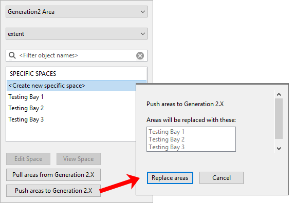
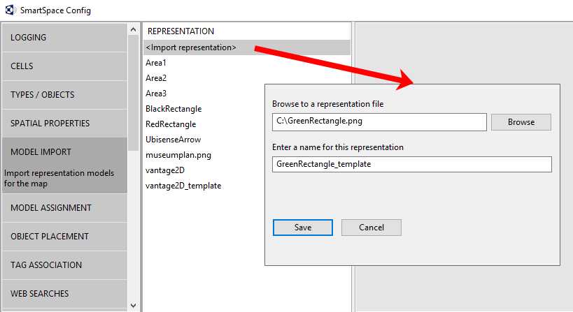
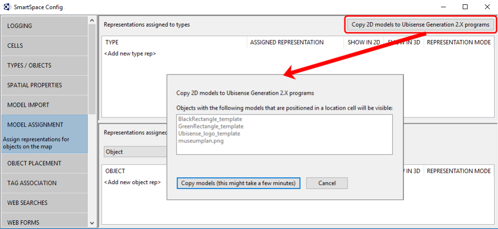

Skip To Main Content

  * placeholder

Filter:

  * All Files

Submit Search

   

You are here:

[Software
Version](../../ComponentandFeatureOverview/FrontMatters\(Online\)/features-
and-versions.htm): 3.4

# Configuration for ACS installations

From version 2.7 onwards, ACS is installed with SmartSpace in place of earlier
Ubisense services. Where previously Ubisense Site Manager would have been used
for some configuration of ACS, these activities are now carried out using
SmartSpace Config.

After you have installed ACS, the configuration activities you are required to
perform in SmartSpace Config are:

  * Creation of a Geometry Cell and Location Cell
  * Creation of ACS areas and defining their extents
  * Import of suitable graphics for use as models for ACS product types

Adding cells to your site is described in
[Cells](../BuildandCreate/Cells/cells-configuration.htm). Creating areas and
importing models is described in the following sections.

# Creating areas for use in ACS

In ACS, areas are used to partition the site model. Usually an area will
represent some complete, but relatively self-contained region of the site,
such as one floor of a building, or one functional area of a large floor.
Before you can use areas in ACS, you must define them in SmartSpace Config.
There are several stages to this: creating areas as instances of the
Generation2 Area object type and defining the spatial extents associated with
them. Once defined, you can add the areas to ACS.

You can also retrieve areas currently defined in ACS for modification in
SmartSpace.

### Creating a new area object

To create a new area:

  1. In SmartSpace Config, click TYPES / OBJECTS to open the Types and objects workspace.
  2. Drag the Generation2 Area object type from the Types list into the Object Browser workspace.
  3. Choose <Create new object>.
  4. Give the area a unique name.

You do not need to change any other properties.

  5. Click Save.

### Adding a spatial extent to an area

To add a spatial extent to the area:

  1. In SmartSpace Config click SPATIAL PROPERTIES to open the Spatial properties workspace
  2. Select Generation2 Area from the <Select a type> dropdown.
  3. Select extent from the <Select a property> dropdown.

All areas with specific spaces already defined are listed.

  4. Choose <Create new specific space>.
  5. Select an area from the Choose an object dropdown.

Only areas without a defined specific space are listed.

  6. Define the extent for the area. See [Configure space properties of types](../BuildandCreate/SpatialRelations/spatial-properties-configuration.htm#Configur) for information how to define the extent of an object.

     * Select the Generation2 Area extent check box to highlight all areas with defined spatial extents.
  7. Click Save.

When you have defined all your site's areas you can copy them to ACS.

### Copying areas to a Generation 2.X program

To copy areas to ACS:

  1. In SmartSpace Config click SPATIAL PROPERTIES.
  2. Select Generation2 Area from the <Select a type> dropdown.
  3. Select extent from the <Select a property> dropdown.

All areas with specific spaces already defined are listed.

  4. Choose Push areas to Generation2.X.

  5. Click Replace areas to confirm.

### Copying areas from a Generation 2.X program

To copy areas from ACS into SmartSpace:

  1. In SmartSpace Config click SPATIAL PROPERTIES.
  2. Select Generation2 Area from the <Select a type> dropdown.
  3. Select extent from the <Select a property> dropdown.

All areas with specific spaces already defined are listed.

  4. Choose Pull areas from Generation2.X.

  5. Click Replace areas to confirm.

# Copying models for use in ACS

### Importing models into SmartSpace

You can import 2D models using the Model import workspace. Here you can select
an image file for import and give it a name.

For any models you intend to associate with product types, you must include
the suffix _template in their names.

To import an object representation:

  1. In SmartSpace Config click MODEL IMPORT to open the Model import workspace.
  2. Double-click <Import representation>.
  3. Navigate to the image file.
  4. The filename, including its suffix, becomes the default name of the representation.

Edit the name ensuring that you add the suffix _template to the filename.

  5. Click Save
  6. You can now adjust the size and orientation of the representation, and set its origin to match the object it will depict.

See [Model import](../BuildandCreate/SiteVisualization/model-import.htm) for
further information on manipulating imported representations.

When you have imported the models you require, you can copy them to ACS.

### Copying models to ACS

To copy 2D models to ACS:

  1. In SmartSpace Config, click MODEL ASSIGNMENT to open the Model assignment workspace.
  2. Click the Copy 2D models to Ubisense Generation2.X programs button to display a list of 2D models to be copied.

All objects listed in the dialog will be imported into ACS. However, only
those whose names end in _template will be offered as representations when
defining product types.

  3. Click the Copy models... button and the files are copied to ACS.

When the operation is complete, the dialog closes and you are returned to the
Model assignment workspace.

  * Configuration for ACS installations
  * Creating areas for use in ACS
      * Creating a new area object
      * Adding a spatial extent to an area
      * Copying areas to a Generation 2.X program
      * Copying areas from a Generation 2.X program
  * Copying models for use in ACS
      * Importing models into SmartSpace
      * Copying models to ACS

   

* * *

[www.ubisense.net](http://www.ubisense.net/)  
Copyright © 2020, Ubisense Limited 2014 - 2020. All Rights Reserved.

