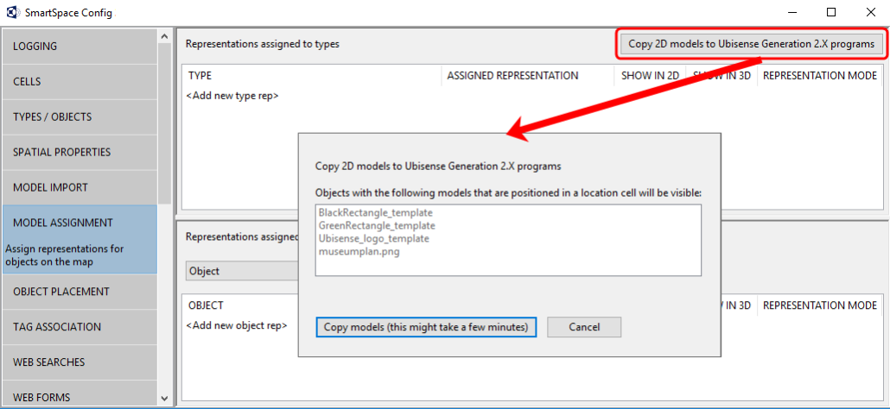

Skip To Main Content

  * placeholder

Filter:

  * All Files

Submit Search

   

You are here:

[Software
Version](../../ComponentandFeatureOverview/FrontMatters\(Online\)/features-
and-versions.htm): 3.4

# Copying models for use in ACS

Use the Copy 2D models to Ubisense Generation 2.X programs button to copy
imported representations to ACS.

To copy 2D models to ACS:

  1. In SmartSpace Config, click MODEL ASSIGNMENT to open the Model assignment workspace.
  2. Click the Copy 2D models to Ubisense Generation2.X programs button to display a list of 2D models to be copied.

All objects listed in the dialog will be imported into ACS. However, only
those whose names end in _template will be offered as representations when
defining product types.

  3. Click the Copy models... button and the files are copied to ACS.

When the operation is complete, the dialog closes and you are returned to the
Model assignment workspace.

  * Copying models for use in ACS

   

* * *

[www.ubisense.net](http://www.ubisense.net/)  
Copyright © 2020, Ubisense Limited 2014 - 2020. All Rights Reserved.

