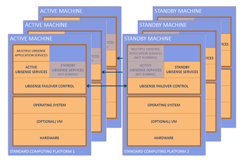

Skip To Main Content

  * placeholder

Filter:

  * All Files

Submit Search

   

You are here:

[Download as
PDF](../../../../SmartSpaceDownloads/B7GZWZS4WX9F/SmartSpaceFailover.pdf "link
to PDF version of this content")

[Software
Version](../../../ComponentandFeatureOverview/FrontMatters\(Online\)/features-
and-versions.htm): 3.3

# Ubisense Failover

A common Ubisense failover scenario is the ‘two machine’ setup. In the two
machine setup, at any one time one of the machines is the active machine and
the other the standby machine. If the active machine stops or fails, the
standby machine takes over. But it is important to ensure that both machines
do not become active at the same time.

The ubisense_failover_control service implements a protocol between two
machines to make them work in a two machine setup, controlling Ubisense
services on both machines, and minimizing the likelihood of both machines
simultaneously becoming active.

The following describes how the ubisense_failover_control service works, and
describes how to set it up to provide failover for a small system, implement
scheduled backups in the live system, and extend the failover support to a
large system using 2N separate machines.

## The Two Machine Setup

The two machine setup looks like the diagram below. Two similar machines,
using standard operating systems, and whatever VM / HW configuration is
required, are run in tandem. Each machine runs the ubisense_failover_control
service. Each instance of the service controls other Ubisense services and
talks to the other instance, using a binary exclusion protocol. The binary
exclusion protocol ensures that one machine is running the ‘active’ Ubisense
services (e.g. the core server, local controller, and replication sender), and
the other machine is running the ‘standby’ Ubisense services (e.g. the
replication receiver). The Ubisense local controller service on the active
machine will control multiple Ubisense application services as specified by
the Ubisense core server’s service administration schema (see [Ubisense
Architecture and
Protocols](../../../ITResources/ITDocs/ArchiProtocols/architecture-and-
protocols.htm) for details).

A two machine setup running a Ubisense system. At any one time, one machine is
in the active state, and the other machine is in the standby state.

## Extending the Setup to 2N Machines

In a two machine setup, the entire set of active Ubisense application services
is running on one single machine (the active machine) at any one time.

But we might want to run across multiple machines for increased throughput in
a large system, or we might want to run our Ubisense system on more than one
operating system, for example Linux for the real-time control elements of the
system and Windows for the web visibility elements. In this case we simply
repeat the two machine setup multiple times. In this case for every pair of
machines the active services will include the local controller service (so
that Ubisense application services can be started and stopped), and one pair
will also be chosen to host the Ubisense core server.

In this way we can build up a large system, possibly with different operating
systems, by creating N instances of the two machine setup.

This approach can be especially convenient combined with a VM platform. In
this case, it is easy to set up 2N virtual machines mapped onto a suitable set
of underlying hardware resources.

Multiple two-machine setups can be combined to cover a large system. In this
case we have three active machines, each of which has a standby machine.

## The reliable networking assumption, errors and precautions

Like all binary failover mechanisms, the ubisense_failover_control service
assumes that there is a reliable interconnect between it and its counterpart
on the other machine. In the case of ubisense_failover_control this
interconnect is just the standard Ethernet networking between the two
machines. This means that the networking between the machines is the most
critical component in the failover support process; intermittent failure of
networking can result in error cases for the failover protocol.

### Network isolation

The first case to consider is the temporary failure of networking on the
currently active machine, leading to unintended network isolation. To the
standby machine, this will look just like a failure of the active machine, so
the standby machine will take over. If the networking then recovers on the
isolated machine, both machines will incorrectly be active. The protocol will
quickly recover from this error case (both machines will transition to the
standby state, and then one of them will become active) but during the brief
‘both active’ period there may be incorrect system behavior.

### Network partitioning

A more serious problem could arise if networking between the active and
standby machines fails, but both machines can still talk to client machines,
sensor networks and external systems. In this case, each side of the failover
protocol will assume that the other side is down, and so both machines will
become active. This would be a serious failure: because both machines would
still be able to talk to users of the Ubisense services, this could cause
incorrect system behavior over a long period.

### Precautions

To avoid these failure cases the following precautions are advised: when two
machines are configured in a two-machine setup they should have a reliable
network between them; when running VMs, when a VM network interface fails it
is better to reboot the machine (allowing a standby to take over) than to
attempt to recover from the network interface failure.

## Implementation: the binary exclusion protocol and state machine

In the binary exclusion protocol, each side has a state consisting of two
fields:

  * Local status, which can be one of Running, Ready or Stopped. The meaning of the states is:
    * Running: this machine is the active Ubisense machine
    * Ready: this machine is the standby Ubisense machine
    * Stopped: at user request, this machine won’t run any Ubisense services
  * Remote status, which can be one of Running, Ready, Stopped, Waiting, or Timeout. The meanings of the states are as above, plus:
    * Waiting: this side of the protocol has just started, and we are waiting to hear from the remote side
    * Timeout: we have failed to hear from the remote side for long enough that we have exceeded some timeout.

Each side of the protocol repeatedly sends UDP packet containing its current
Local status to the other side, which uses the received value to update its
view of Remote status, using the Waiting and Timeout values to cover cases
where it hasn’t (recently) received any value.

The basic operation is simple:

  * Normally, if the remote machine is Running, the local machine will be Ready, and vice versa.
  * If the remote machine is Stopped or Timeout, the local machine will be Running.
  * The two machines should never both be Running.
  * If both machines are Ready (e.g. at start up time) the machine with the lowest IP address will transition to Running.

In detail, the operation is decided by this procedure, where the LOCAL STATUS
and REMOTE STATUS define a row in the table below:

  1. Ensure that the correct services are Up or Down according to the values of the ACTIVE SERVICES and STANDBY SERVICES columns below.
  2. If the Local IP is less than the Remote IP, set Local status in the way described in LOW IP STATE CHANGE, otherwise set it in the way described in HIGH IP STATE CHANGE.
  3. If there is a value specified for HEALTH REPORT then output it (see Logging for information on the destination of health reports).

When states are: | Applicable operations are:  
---|---  
LOCAL STATUS | REMOTE STATUS | ACTIVE SERVICES | STANDBY SERVICES | LOW IP STATE CHANGE | HIGH IP STATE CHANGE | HEALTH REPORT  
Running | Running | Down  | Down  | Ready | Ready | ERROR  
Running | Stopped | Up | Down  | No change  | No change | NONE  
Running | Ready | Up | Down  | No change  | No change | NONE  
Running | Waiting | Down  | Down  | No change  | No change | NONE  
Running | Timeout | Up | Down  | No change  | No change | WARNING  
Stopped | Running | Down  | Down  | No change  | No change | NONE  
Stopped | Stopped | Down  | Down  | No change  | No change | WARNING  
Stopped | Ready | Down  | Down  | No change  | No change | NONE  
Stopped | Waiting | Down  | Down  | No change  | No change | NONE  
Stopped | Timeout | Down  | Down  | No change  | No change | WARNING  
Ready | Running | Down  | Up | No change  | No change | NONE  
Ready | Stopped | Down  | Down  | Running | Running  | NONE  
Ready | Ready | Down  | Down  | Running | No change | NONE  
Ready | Waiting | Down  | Down  | No change | No change | NONE  
Ready | Timeout | Down  | Down  | Running | Running | WARNING  
  
## Using the ubisense_failover_control service

### Failover Parameters

The parameters for the service are set locally using one of these mechanisms:

  * An entry in the file platform.conf located in this folder:
    * Windows: <installdir>\bin
    * Linux: /etc/ubisense

  * On Windows, string value (with the name of the parameter) in the registry key  
HKLM\Software\Ubisense 2.1\Platform\Config

  * An entry in the file platform.conf in the folder where the service executable is executed

The following are the failover service parameters:

Parameter name | Description | Platform | Default value  
---|---|---|---  
ufc_local_ip | The IP address of the network interface to use on the local machine | Both | 0.0.0.0  
ufc_remote_ip | The IP address to send to on the remote machine | Both | 0.0.0.0  
ufc_port | The port to bind to on the local machine (and to send to on the remote machine) | Both | 27001  
ufc_timeout | The time in seconds before the remote machine is set to have status Timeout | Both | 10  
ufc_reboot_on_error | Reboot the local machine if an error is encountered when attempting to control the other Ubisense services on the local machine | Both | 0  
ufc_core | Start the Ubisense core server on the local machine when in the active state | Both | 1  
ufc_replication | Start the replication sender on the local machine when in the active state, and the replication receiver on the local machine when in the standby state. If the machines are using some kind of shared storage mechanism in order to ensure that they refer to the same data, then replication is not required and this can be set to 0. | Both | 1  
ufc_test_mode | Do not actually start or stop any services, but just print out which services would be started or stopped at any time | Both | 1  
ufc_bin | Location of the other Ubisense service executables on the local machine |  Linux only | /home/platform/bin  
  
The following are other parameters relevant to failover operation.

Parameter name | Description  
---|---  
controller_node_name | The name of the computing node to be used by the local controller. This provides the mechanism for the two machines in the two machine setup to identify themselves as the same machine, and always needs to be set when implementing failover.  
failover_platform_version | This controls the name of the platform services that failover looks for. This only needs to be set if you are running a different version of platform services to the version of failover you are installing. For example, if you were installing failover alongside a version 2.1 platform, you would set failover_platform_version to 2.1 and failover would look for services named UbisenseCoreServer 2.1 and UbisenseServiceController 2.1. The default is 3 and this parameter does not need to be set when using a version 3 platform.   
replication_directory | The path of the directory where Ubisense persistent services will write their replication files. This only needs to be set when using Ubisense Replication, that is when the parameter ufc_replication above is set to 1.  
replication_receiver_address | The address of the machine to connect to when sending replication data. This only needs to be set when using Ubisense Replication services, that is when the parameter ufc_replication above is set to 1.  
sensor_use_log_as_trace_dest |  Used when running the platform in unicast mode to ensure that sensor trace messages are correctly routed on failover. To implement this parameter:

  1. Run all the logging services on one machine (see [Logging](../../BuildandCreate/Logging/logging-configuration.htm) for further information on configuring logging servers).
  2. Set the value of sensor_use_log_as_trace_dest to 1.
  3. Run the Ubisense / Platform / Unicast monitor proxy service on the same machine as the logging services.

The effect of setting this parameter is:

  * The site level logging server will set the global configuration parameter unicast_monitor_addr to be the same as its host machine's platform_interface if this is defined
  * Sensors will send trace messages to the IP endpoint A : P, where A is the IP address component of Location_Cell / Logging_Server / Address_IPv4 for the sensor, and P is the value of the global configuration parameter unicast_monitor_port

  
  
### Platforms

The ubisense_failover_control service runs on Linux and Windows, and
implements the behavior described in the previous section.

### Logging

The service logs important state changes and error conditions using the event
log features of Windows, or the syslog features of Linux.

### Status reporting and control files

The service provides a status reporting and control mechanism based on files
in addition to the logging provided by Windows or Linux.

In the Ubisense dataset directory, the service creates a status file, which is
one of:

  * ufc_running: this machine is the active machine in the two machine setup
  * ufc_ready: this machine is the standby machine in the two machine setup
  * ufc_stopped: at user request, this machine is neither active or on standby, and all Ubisense services (apart from the failover service itself) are stopped.

And in the same directory, the user may request that the service transition
state to Stopped by creating the file ufc_stop. The user can retract that
request by removing the ufc_stop file again.

# Installing Failover

The following information guides you through the steps required to install
UbisenseFailover:

  * Installing Failover on Windows
  * Installing Failover on Linux

For information on hardware and software requirements, and for general
information on installing SmartSpace, see [SmartSpace
Installation](../../Installation/InstallationWiz.htm).

If you are also using UbisenseReplication, see [Ubisense
Replication](../Replication/replication-configuration.htm) for further
information on its installation and configuration.

## Installing Failover version 3 with earlier versions of the Ubisense
platform

Failover version 3 can be installed for use with Ubisense platform version
2.1, for example if ACS 2.6 or earlier is required. To enable failover to
control the 2.1 services, you must set failover_platform_version to 2.1. See
Failover Parameters and the installation instructions that follow for further
information.

# Installing Failover on Windows

Follow these instructions to install and deploy Failover on a single pair of
Windows machines. For information on installing Failover across several pairs
of Windows machines, see Installing on 2N Machines.

On each machine:

  1. Install the Ubisense servers.  
The server software installer, UbisenseServers.msi, is in the servers\windows
directory of your SmartSpace distribution directory.  
For further information on installing SmartSpace software on Windows machines,
see [SmartSpace Installation](../../Installation/InstallationWiz.htm).

  2. Install Replication (if required).  
The replication software installer, UbisenseReplication.msi, is in the
servers\windows directory of your SmartSpace distribution directory.  
For further information on installing the replication software on Windows
machines, see [Installing Replication on Windows](../Replication/replication-
configuration.htm#h1_2).

  3. Install Failover.  
The failover software installer, UbisenseFailoverControl.msi, is in the
servers\windows directory of your SmartSpace distribution directory.

  4. Ensure that the Ubisense servers and replication are not restarted on reboot.
    1. Run Platform Control.
    2. In Services, ensure that start services automatically on reboot is unchecked.
    3. Click Apply.

The services will now be controlled by the failover control service. By
visiting Control Panel\All Control Panel Items\Administrative Tools\Services
it should be possible to confirm that the services have startup type Manual.

  5. Ensure that the failover service is restarted on reboot.  
By visiting Control Panel\All Control Panel Items\Administrative
Tools\Services set the service UbisenseFailoverControl to have startup type
Automatic. This will ensure that the failover service is started when the
machine starts up. By using the Recovery tab, it is also possible to restart
the service if it fails.

  6. Configure Failover in the Windows registry. (For information on editing registry settings see [Registry Editor](../Replication/replication-configuration.htm#registry_edi).)  
Referring to the table below and using the examples in Failover configuration
example, configure the failover service. Ensure that the two machines have
identical configurations apart from IP addresses where the local IP on one
machine is the remote IP on the other, and vice versa.  

The following are the failover service parameters:

Parameter name | Description | Default value  
---|---|---  
ufc_local_ip | The IP address of the network interface to use on the local machine | 0.0.0.0  
ufc_remote_ip | The IP address to send to on the remote machine | 0.0.0.0  
ufc_port | The port to bind to on the local machine (and to send to on the remote machine) | 27001  
ufc_timeout | The time in seconds before the remote machine is set to have status Timeout | 10  
ufc_reboot_on_error | Reboot the local machine if an error is encountered when attempting to control the other Ubisense services on the local machine | 0  
ufc_core | Start the Ubisense core server on the local machine when in the active state | 1  
ufc_replication | Start the replication sender on the local machine when in the active state, and the replication receiver on the local machine when in the standby state. If the machines are using some kind of shared storage mechanism in order to ensure that they refer to the same data, then replication is not required and this can be set to 0. | 1  
ufc_test_mode | Do not actually start or stop any services, but just print out which services would be started or stopped at any time | 1  
  
The following are other parameters relevant to failover operation.

Parameter name | Description  
---|---  
controller_node_name | The name of the computing node to be used by the local controller. This provides the mechanism for the two machines in the two machine setup to identify themselves as the same machine, and always needs to be set when implementing failover.  
failover_platform_version | This controls the name of the platform services that failover looks for. This only needs to be set if you are running a different version of platform services to the version of failover you are installing. For example, if you were installing failover alongside a version 2.1 platform, you would set failover_platform_version to 2.1 and failover would look for services named UbisenseCoreServer 2.1 and UbisenseServiceController 2.1. The default is 3 and this parameter does not need to be set when using a version 3 platform.   
replication_directory | The path of the directory where Ubisense persistent services will write their replication files. This only needs to be set when using Ubisense Replication, that is when the parameter ufc_replication above is set to 1.  
replication_receiver_address | The address of the machine to connect to when sending replication data. This only needs to be set when using Ubisense Replication services, that is when the parameter ufc_replication above is set to 1.  
sensor_use_log_as_trace_dest |  Used when running the platform in unicast mode to ensure that sensor trace messages are correctly routed on failover. To implement this parameter:

  1. Run all the logging services on one machine (see [Logging](../../BuildandCreate/Logging/logging-configuration.htm) for further information on configuring logging servers).
  2. Set the value of sensor_use_log_as_trace_dest to 1.
  3. Run the Ubisense / Platform / Unicast monitor proxy service on the same machine as the logging services.

The effect of setting this parameter is:

  * The site level logging server will set the global configuration parameter unicast_monitor_addr to be the same as its host machine's platform_interface if this is defined
  * Sensors will send trace messages to the IP endpoint A : P, where A is the IP address component of Location_Cell / Logging_Server / Address_IPv4 for the sensor, and P is the value of the global configuration parameter unicast_monitor_port

  
  
  1. Start Failover and ensure the configuration is working correctly.  
After the configuration has been set up appropriately, the failover service
can be started.

## Installing on 2N Machines

When installing Failover over multiple pairs of machines, each pair of
machines should be configured as described above with the following
exceptions:

  * Only one machine pair should be configured to host the core server, so in step 4 the parameter ufc_core should be set to zero in the platform.conf files for all the other machine pairs
  * Each machine pair needs a new controller name. For example, if there are N pairs, then each pair could have controller_node_name set to linux_server_1, … , linux_server_N

# Installing Failover on Linux

Follow these instructions to install and deploy Failover on a single pair of
Linux machines each running the core server and local controller. For
information on installing Failover across several pairs of Linux machines, see
Installing on 2N Machines.

On each machine:

  1. Copy the servers, replication (if required) and failover control to a bin directory.  
You can find the executables in the following locations in your SmartSpace
distribution directory:  

servers | servers/linux/ubisense_core_server  
servers/linux/ubisense_local_control  
---|---  
replication |  servers/linux/ubisense_replication_sender  
servers/linux/ubisense_replication_receiver  
failover | servers/linux/ubisense_failover_control  
  2. Create a service management script for the failover service only.  
Create a suitable script for your particular Linux platform that will provide
some start/stop/status support for the failover service. This service runs as
a daemon, and so most standard techniques should be applicable. A common
script is provided in Example Linux init.d script for
ubisense_failover_control.  
For Red Hat® Linux, and other Linux platforms using systemd, see Example Linux
systemd scripts for ubisense_failover_control for information on configuring
support for the failover service.

  3. Ensure that the service management script is run on machine restart.  
Using a suitable method for your Linux platform, ensure that the failover
service is started on machine restart. On most platforms, it should also be
possible to restart the failover service on failure.

  4. Configure Failover using platform.conf.  
Referring to the table below and using the examples in Failover configuration
example, configure the failover service.  
Ensure that the two machines have identical configurations apart from IP
addresses where the local IP on one machine is the remote IP on the other, and
vice versa.

The following are the failover service parameters:

Parameter name | Description | Default value  
---|---|---  
ufc_local_ip | The IP address of the network interface to use on the local machine | 0.0.0.0  
ufc_remote_ip | The IP address to send to on the remote machine | 0.0.0.0  
ufc_port | The port to bind to on the local machine (and to send to on the remote machine) | 27001  
ufc_timeout | The time in seconds before the remote machine is set to have status Timeout | 10  
ufc_reboot_on_error | Reboot the local machine if an error is encountered when attempting to control the other Ubisense services on the local machine | 0  
ufc_core | Start the Ubisense core server on the local machine when in the active state | 1  
ufc_replication | Start the replication sender on the local machine when in the active state, and the replication receiver on the local machine when in the standby state. If the machines are using some kind of shared storage mechanism in order to ensure that they refer to the same data, then replication is not required and this can be set to 0. | 1  
ufc_test_mode | Do not actually start or stop any services, but just print out which services would be started or stopped at any time | 1  
ufc_bin | Location of the other Ubisense service executables on the local machine | /home/platform/bin  
  
The following are other parameters relevant to failover operation.

Parameter name | Description  
---|---  
controller_node_name | The name of the computing node to be used by the local controller. This provides the mechanism for the two machines in the two machine setup to identify themselves as the same machine, and always needs to be set when implementing failover.  
replication_directory | The path of the directory where Ubisense persistent services will write their replication files. This only needs to be set when using Ubisense Replication, that is when the parameter ufc_replication above is set to 1.  
replication_receiver_address | The address of the machine to connect to when sending replication data. This only needs to be set when using Ubisense Replication services, that is when the parameter ufc_replication above is set to 1.  
sensor_use_log_as_trace_dest |  Used when running the platform in unicast mode to ensure that sensor trace messages are correctly routed on failover. To implement this parameter:

  1. Run all the logging services on one machine (see [Logging](../../BuildandCreate/Logging/logging-configuration.htm) for further information on configuring logging servers).
  2. Set the value of sensor_use_log_as_trace_dest to 1.
  3. Run the Ubisense / Platform / Unicast monitor proxy service on the same machine as the logging services.

The effect of setting this parameter is:

  * The site level logging server will set the global configuration parameter unicast_monitor_addr to be the same as its host machine's platform_interface if this is defined
  * Sensors will send trace messages to the IP endpoint A : P, where A is the IP address component of Location_Cell / Logging_Server / Address_IPv4 for the sensor, and P is the value of the global configuration parameter unicast_monitor_port

  
  
  1. Start Failover and ensure the configuration is working correctly.  
After the configuration has been set up appropriately, the failover service
can be started.

## Installing on 2N Machines

When installing Failover over multiple pairs of machines, each pair of
machines should be configured as described above with the following
exceptions:

  * Only one machine pair should be configured to host the core server, so in step 4 the parameter ufc_core should be set to zero in the platform.conf files for all the other machine pairs
  * Each machine pair needs a new controller name. For example, if there are N pairs, then each pair could have controller_node_name set to linux_server_1, … , linux_server_N

# Example Linux init.d script for ubisense_failover_control

This script is a commonly-used init script template, converted for running the
Ubisense failover control service. It assumes the existence of a pseudo-user
platform, which will run the Ubisense platform. It also needs to be configured
for your platform, by setting PLATFORM_USER, UBISENSE_FAILOVER, and UCONFIG
appropriately.

    
    
    #!/bin/bash
    # Init file for Ubisense failover control server
    # chkconfig: 345 98 02
    # description: Ubisense failover control for linux
    # processname: ubisense_failover_control
    # config: /etc/ubisense.conf
    
    # source function library
    
    if [ -e /etc/rc.d/init.d/functions ] 
    then
       . /etc/rc.d/init.d/functions
    else
     # steal status() from /etc/rc.d/init.d/functions on a RH box
     status() {
    	local base=${1##*/}
    	local pid
    
    	# Test syntax.
    	if [ "$#" = 0 ] ; then
    		echo $"Usage: status {program}"
    		return 1
    	fi
    
    	# First try "pidof"
    	pid=`pidof -o $$ -o $PPID -o %PPID -x $1 || \
    	     pidof -o $$ -o $PPID -o %PPID -x ${base}`
    	if [ -n "$pid" ]; then
    	        echo $"${base} (pid $pid) is running..."
    	        return 0
    	fi
    
    	# Next try "/var/run/*.pid" files
    	if [ -f /var/run/${base}.pid ] ; then
    	        read pid < /var/run/${base}.pid
    	        if [ -n "$pid" ]; then
    	                echo $"${base} dead but pid file exists"
    	                return 1
    	        fi
    	fi
    	# See if /var/lock/subsys/${base} exists
    	if [ -f /var/lock/subsys/${base} ]; then
    		echo $"${base} dead but subsys locked"
    		return 2
    	fi
    	echo $"${base} is stopped"
    	return 3
     }
    fi
    
    # pull in sysconfig settings. NB this is configuring sysconfig, not Ubisense
    [ -f /etc/ubisense.conf ] && . /etc/ubisense.conf
    
    # local configuration – change to reflect pseudo user and location of executable
    PLATFORM_USER=${PLATFORM_USER:-platform}
    UBISENSE_FAILOVER=/home/platform/bin/ubisense_failover_control
    export UCONFIG=/etc/ubisense/platform.conf
    
    RETVAL=0
    prog="ubisense"
    
    start()
    {
    	echo -n $"Starting UBISENSE_FAILOVER:"
    	if [ -e /etc/rc.d/init.d/functions ] 
    	then
    	   daemon --check UBISENSE_FAILOVER --user=platform ${UBISENSE_FAILOVER}
    	else
    	   startproc -u platform ${UBISENSE_FAILOVER}
    	fi
            touch /var/lock/subsys/UBISENSE_FAILOVER
    	echo
    }
    
    stop()
    {
    	echo -n $"Stopping UBISENSE_FAILOVER:"
            if [ -e /etc/rc.d/init.d/functions ] 
    	then
    	    killproc UBISENSE_FAILOVER
    	else
    	    killproc ${UBISENSE_FAILOVER}
    	fi
            rm -f /var/lock/subsys/UBISENSE_FAILOVER
    	echo
    }
    
    
    case "$1" in
    	start)
    		start
    		;;
    	stop)
    		stop
    		;;
    	restart)
                    stop
    		start
    		;;
    	status)
                    status UBISENSE_FAILOVER
    		;;
    	*)
    		echo $"Usage: $0 {start|stop|restart|status}"
    		RETVAL=1
    esac
    exit $RETVAL
    

# Example Linux systemd scripts for ubisense_failover_control

The following example illustrates the use of sysemd scripts for failover on a
Red Hat® Linux machine.

The instructions assume the failover executable (ubisense_failover_control) is
in /home/platform/bin/i586_linux. If this is not the case, the service file
(ubisense_failover.service) will have to be updated to reflect the location of
the executable.

  1. Add a target file ubisense_service.target in /etc/systemd/system containing the following:

    
    
    [Unit]
    Description=ubisense_service Target
    Requires=multi-user.target
    After=multi-user.target
    AllowIsolate=yes
    

  1. Run the following commands:

    
    
    systemctl list-units --type service
    systemctl daemon-reload
    systemctl enable ubisense_service.target
    systemctl isolate ubisense_service.target
    ln -sf /etc/systemd/system/ubisense_service.target /etc/systemd/system/default.target.wants/
    

  1. Reboot the machine.
  2. Check the status of the target using the command below to make sure the target is active and running:

    
    
    systemctl list-units --type target

  1. Add a service file ubisense_failover.service in /etc/systemd/system containing the following:

    
    
    [Unit]
    Description=Daemon for ubisense_failover_service
    After=multi-user.target
    
    [Service]
    Type=forking
    ExecStart=/home/platform/bin/i586_linux/ubisense_failover_control
    
    [Install]
    WantedBy=ubisense_service.target
    

  1. Run the following commands:

    
    
    systemctl daemon-reload
    systemctl enable ubisense_failover.service
    

  1. Reboot the machine.
  2. To list the status of the services run the following command:

    
    
    systemctl list-units --type service

# Failover configuration example

In this example two Linux machines run an entire dataset with failover in a
two machine setup.

  * The IP addresses of the machines are 10.42.1.40 and 10.42.1.106.
  * The machines both have the following Ubisense executables installed in their default location (/home/platform/bin): ubisense_failover_control, ubisense_core_server, ubisense_local_control, ubisense_replication_sender, and ubisense_replication_receiver
  * The ubisense_failover_control service is set up to run via a standard init.d script.
  * The machines are both configured using the /etc/ubisense/platform.conf file, with contents as below:

10.42.1.40 platform.conf file

    
    
    controller_node_name: linux_server  
    replication_directory: /home/platform/replication  
    replication_receiver_address: 10.42.1.106  
    ufc_local_ip: 10.42.1.40  
    ufc_remote_ip: 10.42.1.106  
    ufc_test_mode: 0

10.42.1.106 platform.conf file

    
    
    controller_node_name: linux_server  
    replication_directory: /home/platform/replication  
    replication_receiver_address: 10.42.1.40  
    ufc_local_ip: 10.42.1.106  
    ufc_remote_ip: 10.42.1.40  
    ufc_test_mode: 0

## What Happens when the Example Runs

When the machines both start up (or both have the failover service started),
the following sequence of behavior occurs:

10.42.1.40 | 10.42.1.106  
---|---  
In state Ready (remote = Waiting) | In state Ready (remote = Waiting)  
In state Ready (remote = Ready) | In state Ready (remote = Ready)  
Because this machine has the lower IP address Start ubisense_core_server,  
ubisense_local_control,  
ubisense_replication_sender |   
In state Running (remote = Ready) | In state Ready (remote = Running)  
| Start ubisense_replication_receiver  
In state Running (remote = Ready) | In state Ready (remote = Running)  
  
This is the stable state with 10.42.1.40 active and 10.42.1.106 in standby,
and, because replication is enabled, the entire dataset for 10.42.1.40 is
replicated in the dataset directory for 10.42.1.106.

Looking at the dataset directories on each machine, 10.42.1.40 contains the
file ufc_running, and 10.42.1.106 contains the file ufc_ready.

## Manually Switching between Active and Standby

Now suppose we touch the file ufc_stop in the dataset directory on 10.42.1.40.
We get this sequence of events and actions:

10.42.1.40 | 10.42.1.106  
---|---  
In state Running (remote = Ready) | In state Ready (remote = Running)  
In state Ready (remote = Ready) | In state Ready (remote = Ready)  
Stop ubisense_core_server, ubisense_local_control, ubisense_replication_sender |   
In state Stopped (remote = Ready) | In state Ready (remote = Stopped)  
| Stop ubisense_replication_receiver  
Start ubisense_core_server, ubisense_local_control,
ubisense_replication_sender  
In state Stopped (remote = Running) | In state Running (remote = Stopped)  
  
The dataset is now running on 10.42.1.106. If we now remove the ufc_stop file
on 10.42.1.40, the failover service will change state to Ready, and start
ubisense_replication_receiver, which was the original stable state, but with
the machines reversed. So by using the ufc_stop file, we can instigate an
immediate switchover between the two machines.

## Failing over when Active Goes Down

If the Running machine now is powered down, the standby machine will detect
that remote = Timeout, and take over as the active machine. Suppose 10.42.1.40
is the active machine, and it fails, then we get this sequence of actions:

10.42.1.40 | 10.42.1.106  
---|---  
In state Running (remote = Ready) | In state Ready (remote = Running)  
MACHINE FAILS |   
| In state Ready (remote = Running)  
| After ufc_timeout seconds  
| In state Ready (remote = Timeout)  
| Stop ubisense_replication_receiver  
Start ubisense_core_server, ubisense_local_control,
ubisense_replication_sender  
In state Stopped (remote = Running) | In state Running (remote = Timeout)  
  
## Bringing a Single Machine Down for Maintenance or OS Patching

As part of a standard system administration maintenance process, machines will
be periodically upgraded to new OS versions, be assigned new hardware, or
otherwise maintained. This normally requires the machine concerned to be taken
out of service. In these cases, as long as a single machine in the pair is
taken out of service at a time, failover will ensure that the application will
continue to run on the other machine.

The most graceful way of achieving this is to use the ufc_stop request, as
above, to request that the machine communicate its stopped status to its
partner. This will avoid a wait of ufc_timeout seconds before the standby
machine takes over, and prevent the standby machine from logging warnings.

## Hot Backup: Taking Scheduled Dataset Backups while the System is Live

Of course, failover of this kind is not a protection against disasters that
take out an entire machine room, or user errors that delete important parts of
a dataset. To mitigate these problems it is still necessary to take frequent
backups.

The easiest guaranteed-correct way to do this is to ensure that the dataset
files are not being written during the backup. In a two machine setup that
includes replication this is easy to do by briefly stopping the replication
receiver on the standby machine, copying the dataset backup, and starting the
replication receiver again.

On Linux platforms this can be done using this procedure:

  1. Change to the dataset directory.
  2. If there is a file ufc_ready, indicating that the machine is in standby state, then
    1. Create the file ufc_stop, to request that the machine transition to state Stopped
    2. Wait for the file ufc_stopped to appear, indicating that the machine is Stopped
    3. Create the backup by copying the contents of the dataset directory to a file
    4. Remove the file ufc_stop.
  3. Finally, copy the backup file to some suitable remote location.

As a Linux shell script, this looks like:

    
    
    cd /home/platform/dataset
    if [ -f ufc_ready ] ; then
            echo "stopping standby services"
            touch ufc_stop
            while [ ! -f ufc_stopped ] ; do
                    echo "waiting to stop"
                    sleep 1
            done
            echo "backing up dataset"
            tar czf ../backup.tgz .
            echo "starting standby services"
            rm ufc_stop
            echo "moving backup to a remote location"
            # Move the file ../backup.tgz to a remote location
    fi
    

This script can be installed on both machines and run via a cron job at an
appropriate interval. On the active machine the script will do nothing, and on
the standby machine, the script will briefly stop failover while creating a
backup, and then move the backup to some shared remote storage.

  * Ubisense Failover
    * The Two Machine Setup
    * Extending the Setup to 2N Machines
    * The reliable networking assumption, errors and precautions
      * Network isolation
      * Network partitioning
      * Precautions
    * Implementation: the binary exclusion protocol and state machine
    * Using the ubisense_failover_control service
      * Failover Parameters
      * Platforms
      * Logging
      * Status reporting and control files
  * Installing Failover
    * Installing Failover version 3 with earlier versions of the Ubisense platform
  * Installing Failover on Windows
    * Installing on 2N Machines
  * Installing Failover on Linux
    * Installing on 2N Machines
  * Example Linux init.d script for ubisense_failover_control
  * Example Linux systemd scripts for ubisense_failover_control
  * Failover configuration example
    * What Happens when the Example Runs
    * Manually Switching between Active and Standby
    * Failing over when Active Goes Down
    * Bringing a Single Machine Down for Maintenance or OS Patching
    * Hot Backup: Taking Scheduled Dataset Backups while the System is Live

   

* * *

[www.ubisense.net](http://www.ubisense.net/)  
Copyright © 2020, Ubisense Limited 2014 - 2020. All Rights Reserved.

