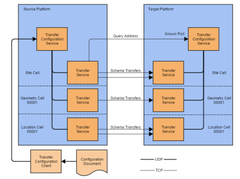

Skip To Main Content

  * placeholder

Filter:

  * All Files

Submit Search

   

You are here:

[Download as
PDF](../../../../SmartSpaceDownloads/B7GZWZS4WX9F/SmartSpacePropertytransfer.pdf
"link to PDF version of this content")

# Ubisense Property transfer

# Introduction to Property transfer

This is the documentation for the platform transfer functionality added in
2.1.11. This is split into two main sections:

  * Platform Transfer Technical User Guide, aimed at those who are deploying platform transfer. This describes what the platform transfer can do, how it is structured, installed, and configured.
  * Platform Transfer Programmer's Guide, aimed at programmers who wish to build their own platform transfer services for custom or application specific schemas.

# Platform Transfer Technical User Guide

Platform Transfer is an additional Ubisense Platform component that enables
live data to be copied from one instance of the Ubisense Platform to another
instance. This can be used to copy data such as object locations, names,
battery status, spatial ownerships, data messages, and sensor status.

The transfer operates at a low level in the platform architecture, and can be
configured to copy data in a "best-effort" or "reliable" mode. Individual
transfers can be started and stopped using a configuration tool, and the
current status and statistics of each transfer are recorded to a central
schema.

# Architecture

There are two main services, and a configuration tool.

The Transfer Configuration service has three principle concerns:

  1. It is responsible for storing the persistent configuration of transfers, including the destinations and converters to be applied to each transfer.
  2. It stores the current status of each configured transfer at each cell to which it applies, including connection state, last error, and performance statistics.
  3. It also acts as a rendezvous service for incoming transfers.

The Platform Transfer service runs on the site cell, and on each geometry and
location cell, and its functions are:

  1. To instantiate and maintain the transfers currently configured for each cell, connecting to local platform schemas at the same cell level, as required to receive transfer data. 
  2. To listen for incoming connections from other platform, and registers its listening address with the transfer configuration service. 
  3. To record current status information for each active transfer with the transfer configuration service.

The configuration client, ubisense_transfer_config, is used to configure and
report on transfers. It interacts with the transfer configuration service, and
can be used to clear, load and save a configuration, and to display the
currently recorded status.

## Protocols and Ports

As shown, all communication between platforms is done using TCP/IP
connections, while communication within each platform uses the platform UDP
protocols. Each cell can be deployed to a different controller host at both
source and target platform, and this is supported by the transfer service
architecture to enable a fully scalable solution.

Local cellular transfer services open a dynamic listening port, which they
register with the transfer configuration service. At the source platform, the
transfers are configured with a destination which is the hostname or IP
address to which the target transfer configuration service has been deployed.
The transfer configuration service listens on a known "rendezvous" port for
address queries from the source platform services. The cellular transfer
services each listen for connections on dynamic ports which they register with
their local transfer configuration service.

## Transfer modes and system impact

The transfer services support two modes for each configured transfer: best
effort, or reliable. The choice of mode effects both the supported features
and resource impact of transfer on the source platform.

  * Best Effort: any transfer not configured as reliable will be in best effort mode. In this mode no attempt is made to recover changes in the source schema which occur during down-time, such as restart of source or destination transfer services. At most 100 changes are queued for transfer, so high update rate bursts in the source schema will result in changes being discarded. However, the impact on the source system, both in terms of network traffic, memory use, and CPU use, is restricted in this mode, so it is safer for use in production systems. Best effort transfers can also be configured with converters to restrict the set of data transferred, or modify the contents. 
  * Reliable: In this mode, the services attempt to dump and apply the entire state of the source schema to the target schema each time they re-connect. The maximum number of queued changes is also much larger (by default 5000) so the transfer schema will handle bursty updates without losing any changes. However, this results in more system impact, in both network bandwidth and CPU/memory use, on the source platform. Furthermore, any configured converters are ignored: only the exact source schema state can be transferred in this mode. 

Note that in both cases the bandwidth on the TCP/IP connections between source
and target platform are the key limit to the rate of changes which will be
successfully transferred without any loss of events. However, in the reliable
mode, the state of the target schema will be recovered to match the source, in
the event of a failure or service restart.

## Simultaneous schema changes on source and target sides

Platform transfer supports inserting rows at both source and target schemas
concurrently, provided the transfer mode is "Best Effort". When receiving a
change, the target platform changes the row ids of schema rows transferred
from the source such that they do not conflict with row ids created locally.
However, there are a number of special cases which can result in unexpected
behavior:

  1. This is not supported for Reliable mode transfers. In this mode no modification of the transferred schema must be attempted locally, or strange behaviour may result. 
  2. Deleting a row from the target which has been transferred from the source will stop any updates to that row from appearing until the row is also deleted at the source. 
    1. For example, create an object named SOURCE1 in the source platform. The object appears as SOURCE1 in the target platform. Delete this object name in the target platform. Now in the source change the name from SOURCE1 to SOURCE2. The change does not appear in the target platform because the row that is being updated has been deleted. 

  1. An insert or update in the source which would violate a uniqueness constraint in the target will not be transferred. 
    1. For example, in UCell::Config the name of a cell is unique. If the target platform contains a cell called "Location Cell A" and a cell with the same name is created in the source platform, the change will not be transferred. Updates to the name in the source platform will also not be transferred, because the row being updated has not be transferred.

These transfer failures do not otherwise cause any service failures or other
unrelated data model issues.

It may be possible to avoid these kinds of behaviours by configuring Type
based filters on the transfers, such that the source platform is responsible
for all objects of a given type, and that type is not to be created directly
in the target system.

Note that when chaining transfers, so a schema is transfered from system A to
system B and then from system B to system C, a maximum of three "hops" is
supported (four platforms).

# Installation

## Requirements

Platform services must be 2.1.11 or higher on the target platform. This is
required because transferring data into the schemas requires supporting
features which were only introduced in release 2.1.11. The source platform,
however, can be version 2.1.10 or older provided the schemas to be transferred
are binary compatible with those in version 2.1.10.

## Firewall considerations

In this release the target platform hosts must allow incoming connections to
the known rendezvous port, and also to the dynamic port range. By default the
platform controller enables listening for platform services, so this should be
automatic on windows hosts.

If the target platform is running in standalone mode, it will not, by default,
update firewall rules. Installing the platform transfer services into such a
platform will NOT cause firewall exceptions to be created for the services.

In this case, you need to manually add firewall exceptions for the platform
transfer services. The easiest way to do this is to briefly restart the core
and controller in network mode, but obviously only if this is safe to do for
your environment. It is only required once per dataset location.

Otherwise manually add exceptions to allow the deployed transfer service
executables to accepted incoming connections on TCP:

dataset/Ubisense/Transfer/Platform Transfer/ubisense_platform_transfer.exe

dataset/Ubisense/Transfer/Transfer
Configuration/ubisense_transfer_config_server.exe

The rendezvous port by default is 49988. If the transfer rendezvous port must
be changed from the default, then it can be set using Ubisense configuration
parameter "transfer_port", and then the transfer configuration services must
be restarted (e.g. using the service manager). This should be done on the
target platform. The source platform configuration should then be modified so
the corresponding destination has the new port.

The dynamic ports are allocated from the dynamic port range configured for
each controller host.

## Setting a Local IP Address for Hosts with multiple IP Addresses

If a target host has multiple IP addresses, one will be picked at random as
the address passed to the source when attempting to connect. This can be a
problem if, for example, one address is through an external firewall and
therefore blocked for TCP/IP connections.

To overcome this, a configuration parameter "transfer_interface" can be set to
the local IP address to use on the target host for connections from the
source.

## Installing Services

Install and deploy the transfer services on both the source and target
platforms, using Ubisense Service Manager.

# Configuration

The configuration tool, ubisense_transfer_config, is included in the
distribution, for both Windows and Linux. It doesn't need to be installed. It
is a command-line tool which provides a number of modes of operation to manage
the configuration and monitor the status of the transfer services.

Usage: ubisense_transfer_config.exe status  
or: ubisense_transfer_config.exe clear  
or: ubisense_transfer_config.exe load <input>  
or: ubisense_transfer_config.exe save <output>

Displays and edits the schema transfers configured from this to other platform  
instances.

PARAMETERS  
input the JSON file containing the configuration

output the JSON file to which the configuration is  
written

OPTIONS  
\--help Display this help and exit  
\--version Display version information and exit

The modes, and their usage, are as follows:

## Configuration Tool Modes

### Status

This prints out the current status of all transfers for which the current
platform is the source platform. The status includes

  * whether the transfer is currently connected, or in error, 
  * when the current connection was started, 
  * the number of bytes transferred since connected, 
  * the average bytes per second transferred since connected, 
  * the current (over the last ten seconds) number of bytes per second transferred
  * the number of errors (connection failures, failures to get the remote address from rendezvous, disconnects, etc.) since the connection was started 
  * the number of times packets were discarded (overflows) due to transaction rate exceeding the TCP/IP bandwidth to the target platform
  * the number of establishes between the transfer service and its source schema, indicating failure of the UDP platform protocol within the source system 
  * if there has been an error since the transfer was started, the most recent error and time it was raised are reported 

The status is updated by the transfer service once every ten seconds, provided
it is running.

For example, here is the status for single, recently-connected transfer, of
ULocation::CellData:

    
    
    $ ./i586_windows_1.3/ubisense_transfer_config.exe status  
    Transfer locations for ULocation::CellData at cell Location Cell 00001 last updated at MM/DD/YY 15:12:55 (7.88 seconds ago)  
     status: connected  
     started: MM/DD/YY 15:11:36 (86.92 seconds ago)  
     bytes written: 2030814  
     average bytes per second: 2.57e+004  
     current bytes per second: 2.572e+004  
     errors: 0  
     overflows: 0  
     establishes: 1

Note that a single establish is the minimum expected.

### Clear

This is used to remove all currently configured transfers. The transfer
services will then disconnect and wait for a new configuration to be loaded.

### Load

This is used to read a configuration file into the transfer configuration
service schema. The loaded configuration replaces any existing configuration.
The file format is described in the section on Configuration file format.

### Save

This is used to write the current configuration to a file in the configuration
file format. The resulting file can be loaded to restore the current
configuration. The file format is described in the section on Configuration
file format.

# Configuration file format

The file format uses JSON syntax to specify the configuration. Sections of
configuration are surrounded by "{" and "}". Ordered arrays are surround by
"[" and "]". Attribute names, and string values, are delimited by double
quotes. Attributes and array elements are separated by ",". The order of
attributes within a section is irrelevant - order is only significant (and
preserved) within an array. White space outside of double quotes is ignored,
so you are free to indent the file as you see fit for clarity. See
<http://www.json.org/> for a full description of the syntax. See Configuration
example for a sample configuration file.

The outer JSON structure expected is as follows:

    
    
    { 
       "destinations": [ <destination configuration>, <destination configuration>, ... ], 
       "transfers": [ <transfer configuration>, <transfer configuration>, ... ]
    }
    

A destination configuration contains the name by which it is referred in
subsequent transfers, the address (as a hostname or IP address) of the site
level controller, and the port number for rendezvous (defaulting to 49988).
The destination can also include an optional key used when encryption is
required. See Configuring encryption below.

    
    
    {
      "name": "Validation", 
      "address": "ubivaltest.prod.ubisense", 
      "port": 49988
    }
    

A transfer configuration describes the configuration for a single
module/schema for a set of cells. For example:

    
    
    {
      "name": "transfer names", "destination": "Validation", "module": "UName", "schema": "Naming", "reliable": false, 
      "tables": [ <array of table conversions to apply> ], 
      "cells": [ <array of cell names to transfer> ]
    }
    

If reliable is true, then table conversions are ignored for the transfer.

A table conversion contains the name of the table, and then an array of
converter/parameter pairs. For example:

    
    
    {
       "table": "ObjectName",
       "converters": [
         {"OfType": "Person"}
       ]
    }
    

If a table is not mentioned, then it will be transferred with no conversion.
Standard converters include:

  * OfType, which takes a type name as the parameter. Only rows which have an object field of the given type are transferred.
  * Discard, which ignores the parameter. Discards all rows for that table.
  * NameContains, which takes a string parameter. This only applies to the UName::Naming table. Only object rows which contain the given string in their name will be transferred.

These are the converters that are available for the standard platform transfer
services. Custom converters can be defined for application specific transfer
services. See the documentation that comes with the transfer specific services
for details.

A cell name is just a quoted string which must match the name of a cell for
which the given schema is available in both the source and destination
platform. For example the cells list might be:

    
    
     "cells": [ "Location Cell 00001", "Location Cell 00002" ]

Cell names are resolved into matching cell objects separately at both the
source and target platform. Thus it is only necessary for the cell names to
match between source and target platform.

# Configuration example

The example configuration file below shows a single destination, and a pair of
best-effort transfers configured, one for the object naming schema at the Site
cell, and one for object locations for a pair of location cells.

In this example, the naming data is only transferred for objects which inherit
from the type "Person". This is specified by adding a "OfType" converter with
parameter "Person".

    
    
    {
        "destinations": [
            {
                "name": "Validation",
                "address": "ubivaltest.prod.ubisense",
                "port": 49988
            }
        ],
    
        "transfers": [
            {
                "name": "names",
                "destination": "Validation",
                "module": "UName",
                "schema": "Naming",
                "reliable": false,
                "tables": [
                    {
                        "table": "ObjectName",
                        "converters": [
                            {"OfType": "Person"}
                        ]
                    }
                ],
                "cells": [ "Site" ]
            },
            {
                "name": "locations",
                "destination": "Validation",
                "module": "ULocation",
                "schema": "CellData",
                "reliable": false,
                "tables": [
                    {
                        "table": "Location",
                        "converters": []
                    }
                ],
                "cells": [ "Location Cell 00001", "Location Cell 00002" ]
            }
        ]
    }

# Configuring encryption

Platform transfer supports the encryption of transferred data. This can be
used to protect transferred data, and to prevent unauthorized services from
modifying platforms running transfer services. The encryption uses AES (128
bit) to protect the data.

To configure encryption of transferred data, the optional "key" attribute of a
destination is used. The encryption key must be set to be the same text at
both the source and target platforms.

  * At the source platform, the encryption key is an optional attribute of a destination. Each destination can have a different encryption key, and the transfer services will encrypt outgoing data if the key is set for their destination. 
  * At the target platform, there must have a special destination configured, with name "localhost", and a key. If such a destination is in the configuration, then the transfer services will only receive data that was encrypted with the same key. 

Only the first 16 characters of the key are used. An empty string, or no key
at all, means that no encryption will be used.

For example source_encryption.json and destination_encryption.json below are a
matching pair of configurations that transfer object names using an encrypted
connection.

source_encryption.json

    
    
    {
        "destinations": [
            {
                "name": "ubivalidation.domain",
                "address": "10.4.63.1",
                "port": 49988,
                "key": "u72gh7sd933kssdf"
            }
        ],
    
        "transfers": [
            {
                "name": "names",
                "destination": "ubivalidation.domain",
                "module": "UName",
                "schema": "Naming",
                "reliable": false,
                "tables": [],
                "cells": [ "Site" ]
            }
        ]
    }
    
    

destination_encryption.json

    
    
    {
        "destinations": [
            {
                "name": "localhost",
                "address": "127.0.0.1",
                "port": 49988,
                "key": "u72gh7sd933kssdf"
            }
        ],
    
        "transfers": []
    }
    

# Schemas in Platform Transfer

The supported schemas as part of the standard platform transfer services are:

UBatteryMonitor::Configuration  
UBatteryMonitor::History  
UBatteryMonitor::Status  
UBuilding::Contents  
UCell::Config  
UCell::Extent  
UData::Data  
UData::TagDataChannel  
ULocation::CellData  
ULocation::Driven  
UName::Naming  
ULocationEngine::SensorConfiguration  
ULocationEngine::SystemStatus  
ULocationEngine::TagConfiguration  
ULocationEngine::TagManagement  
ULocationEngine::TagStatus  
USpatial::Ownership  
UVis::Representation

Application programmers can easily build new transfer services for custom
schemas. See the Platform Transfer Programmer's Guide for API reference.

# Limitations

## Multiple Transfers and Chaining Transfers

It is possible to configure multiple transfers for each schema and cell, so
for example the Locations of objects inherited from "Vehicle" could be
transferred to one platform, and objects inherited from "Tool" could be
transferred to a different platform.

Each platform can act as both a source and a sink for transfers. Hence it is
possible to configure a chain of platform to platform transfers for each
schema.

However, there is only one "Sink" per schema and cell, so only a single
transfer can be actively connected into a schema at a cell.

## Reliable transfers

No converters are applied when a transfer is configured as "reliable": true.
The "tables" section for such a transfer is ignored. All rows will be
transferred.

## Loops

It is possible with this tool to create loops where changes are copied back
into the source platform. This will result in a very high load on the
platforms involved, and will essentially break them both. Make sure the
configuration does not generate any loops.

## Hosts with multiple IP Addresses

If a target host has multiple IP addresses, one will be picked at random as
the address passed to the source when attempting to connect. This can be a
problem if, for example, one address is through an external firewall and
therefore blocked for TCP/IP connections.

To overcome this, a configuration parameter "transfer_interface" can be set to
the local IP address to use on the target host for connections from the
source.

# Monitoring

Monitor streams are also provided to display status messages and debug
messages, which may be useful if these should be logged in production use. The
two streams are:

  * transfer: normal operational information and error messages
  * transfer_debug: additional low-level protocol information which may be useful in diagnosing failures, but may generate a lot of trace messages especially with high update rate schemas transferred

# Platform Transfer Programmer's Guide

This guide is intended for Ubisense platform application programmers who need
to transfer their custom schema data from one platform to another, such as
when testing prior to upgrade of production systems. The platform transfer
system architecture is described in the Platform Transfer Technical User
Guide, and the programmer should read that guide first.

This guide describes the API for version 2.1.11 of the platform.

# Introduction

This guide is intended for Ubisense platform application programmers who need
to transfer their custom schema data from one platform to another, such as
when testing prior to upgrade of production systems. The platform transfer
system architecture is described in the Platform Transfer Technical User
Guide, and the programmer should read that guide first.

This guide describes the API for version 2.1.11 of the platform.

# Architecture

For the application programmer there are two key components to the platform
transfer system. The first is the central configuration schema, services and
configuration tool. These are contained in the UTransfer package and
namespace. The second is an instantiation of the transfer services to support
a specific set of schemas.

The platform transfer system makes it easy to transfer the contents of any
UDL-defined schema, by auto-generating, as part of the UDL compilation,
supporting classes to transfer each schema. These transfer classes can then be
registered to make them available in a custom-built platform transfer service,
which can then be deployed to the source and target platforms, and configured
using the standard central configuration. The application programmer only has
to declare and implement any custom converters/upgraders that are required,
and define the schemas that are to be supported by the new transfer service.
All the rest of the boiler-plate code required by the transfer service is
already provided by the UTransfer API and the auto-generated code.

# API Header Files

## Core Header Files

There are two key header files for the transfer API:

  * UTES/transfer.h in model_builder defines classes instantiated and used by the auto-generated code to support data transfer for each module/schema.
  * UTransfer/client.h in platform defines the classes that implement a transfer service, using the auto-generated code.

## Auto-generated Header Files

The auto-generated classes can be found in each module/schema, declared in
"<module>_<schema>_transfer.h". Here the main class is a SchemaTransferSource
within the module/schema namespace. These generated classes implement the
interfaces in UTES/transfer.h for each specific module/schema.

The auto-generation support for transfer was added in version 2.1.11 of the
UDL compiler and platform.

# Quick-Start

As an example, here is how to build a simple, but fully featured transfer
service for a new UDL schema. In this example, we assume the schema is defined
in package UApplication, and has namespace UApplication::Operations. To build
a transfer service for this schema, follow these steps:

  1. Create a new source folder, which must be in either UApplication, or a package that references UApplication in its package.mk file. The folder name can be "transfer", and we will set up to build the transfer executable in this source folder. For our example we will use folder "UApplication/src/transfer".
  2. Create a Makefile in the source folder:
    
        TOP = ../../..
    PACKAGE = UApplication
    EXECUTABLES = ubisense_application_transfer
    install:: transfer_main.cc
    include $(TOP)/config/config.mk
    transfer_main.cc: $(TOP)/../platform/UTransfer/include/UTransfer/transfer_main.cc
        $(InstallLibrary)
    

Note that the main source file for the application, transfer_main.cc, is
copied from the boiler-plate version found in UTransfer. You should not need
to change this source file.

  3. Create a file "register.h" in the source folder. Insert a definition of the register_schemas function, which defines the schema transfers to support in this transfer service:
    
        #include "UApplication_Operations_transfer.h"
    void register_schemas(UTransfer::TransferMain& main)
    {
       main.register_creator("UApplication","Operations",UUtil::Symbol("Site"),new UTransfer::Creator<UApplication::Operations::SchemaTransferSource>());
    }
    

Here we are declaring that the UApplication::Operations schema is deployed
only at the Site level of the cell hierarchy. See the API documentation below
for other possible cellular deployments.

  4. Create a file "converters.h" in the source folder. If you want to support customized converters or upgraders, define them here. For this simple example, we will only support the built-in converters "OfType" and "Discard", so the file should be empty. The "converters.h" file must still be present otherwise the service will not compile.
  5. Create a platform transfer installation package xml file, which will be used by the platform service installer to deploy the transfer service to all required cells. This is typically located at the top of the package, so in this case the file is UApplication/UApplicationTransfer.xml:
    
        <install>
       <vendor>Ubisense</vendor>
       <package>UApplication</package>
       <services>
          <value>
             <name>Application Transfer</name>
             <version>
                 <major_>2</major_>
                 <minor_>1</minor_>
                 <build_>1</build_>
             </version>
             <level>Site</level>
             <programs>
                 <key>i586_windows_1.3</key>
                 <value>ubisense_application_transfer.exe</value>
             </programs>
             <libraries>
             </libraries>
             <data>
             </data>
          </value>
       </services>
    </install>
    

  6. Create a new "release" folder which will be used to build the released package folder from which the service can be deployed. In our case we will use UApplication/src/release, and will add a Makefile in this folder to copy the released packages: 
    
        TOP = ../../..
    PACKAGE = UApplication
    include $(TOP)/config/defs.mk
    RELEASE_PACKAGE = ApplicationTransfer
    RELEASE_XML += UApplicationTransfer
    RELEASE_BINARIES += ubisense_application_transfer
    include $(TOP)/config/rules.mk
    

  7. Now make in UApplication/src/transfer and UApplication/src/release. The transfer service should now be in ../release/ApplicationTransfer ready to be installed.

# API

The key features of the UTransfer API are described in more detail here.
Essentially a transfer service is composed of the following elements:

  * A UTransfer::TransferMain class which is responsible for maintaining the set of transfer sources and sinks that have been configured.
  * A register_schemas function, which, for each supported schema, adds a Creator class to UTransfer::TransferMain, so that it can support instances of the registered schemas.
  * A TransferSource is an interface which is implemented by auto-generated code for each UDL schema. It connects to the schema at a given cell in the source platform, listens for transactions and establishes, and sends the data to a corresponding TransferSink at the target platform.
  * A TransferSink is an interface which connects to the schema at a a given cell in the target platform, receives transfer data and establishes from the source platform, and sends them to the schema server to be applied.
  * A ChangeConverter is a class which is registered with a given Creator. When it is configured, the TransferMain adds the named converter to the TransferSource for the configured table. The converter processes incoming changes from the source platform schema, and either discards or modifies them before they are sent on to the target platform. A chain of converters can be configured for each transfer. Converters are registered by specialising the method register_custom_converters on the Creator templated type.
  * A ChangeUpgrader is just like a ChangeConverter, but the output change can be of a different row type from the input. This allows schemas to be upgraded between different schema versions. A single upgrader can be configured for a transfer, and is applied after all converters. Upgraders are also registered by specialising the method register_custom_converters on the Creator templated type.

## Creators

A Creator is a templated type that is responsible for creating instances of
TransferSource and TransferSink for each configured transfer. The creator is
specialized over the auto-generated SchemaTransferSource class. The Creator is
implemented in "UTransfer/client.h", so all the application programmer need do
is:

  * register a creator for each schema they wish to support
  * optionally defined a specialized register_custom_converters method, if they wish to add custom converters or upgraders for their schema
  * optionally specialize get_service_name if the service uses a non-standard service name when connecting to the schema service

To provide custom converters and upgraders for a schema, specialize the
register_custom_converters method for the creator instance.

    
    
    // .. declare the NameContains converter above.
    namespace UName {
       namespace Naming { 
          // Function used to create and add the converter.
          void add_NameContains(const std::string&amp; param, SchemaTransferSource&amp; src) {
             // Call the auto-generated method on the table class to add the new converter.
             ObjectName::add_converter(new NameContains(param.c_str()), src);
          }
       }
    }
     
    namespace UTransfer {
       // The standard implementation has this method empty.
       template &lt;&gt;
       void Creator&lt;UName::Naming::SchemaTransferSource&gt;::register_custom_converters() {
          register_converter("NameContains", "ObjectName", &amp;UName::Naming::add_NameContains);
       }
    }

See the section on Converters below for an example custom schema converter
implementation.

The creator implementation includes a method get_service_name which has a
default implementation that returns a normal cellular platform service name,
depending on the schema and cell. If your schema services use a non-standard
service name, they can specialize this method to return a service name in the
correct form required so that schema connect will work. To get this to compile
on windows and linux compilers, it should be explicitly declared in the
UTransfer namespace.

    
    
    namespace UTransfer {
      template &lt;&gt;
      std::string Creator&lt;UApplication::MySchema::SchemaTransferSource&gt;::get_service_name(std::string default_name, UCell::Cell cell)
      {
          // Support the special service name we used.
          return "my_special_service_name%" + cell.id().to_string();
      }
    }

## Transfer Sources

A transfer source connects to a schema at a given cell, and listens for
transactions and establishes (if in reliable mode). It looks up the
corresponding transfer sink address on the target platform, by querying the
rendezvous port on the target platform using the cell name and module/schema.
If the remote address is found, the transfer source connects to it using a
TCP/IP connection, and sends updates/establishes. The source also receives
periodic empty ping packets back from the transfer sink, to ensure that the
TCP/IP connection stays alive.

The transfer source implementation for a specific UDL schema is automatically
generated by the UDL compliler, and is declared in the include file
"<module>_<schema>_transfer.h". This should be included before referring to
the transfer source, for example in "register.h".

It is not normally necessary to implement a transfer source by hand. It is
declared in "UTES/transfer.h".

## Transfer Sinks

Transfer sinks for a schema are implemented using a templated type, the key
functions of which are instantiated by the UDL compiler. A transfer sink opens
a TCP/IP port to listen for data from a transfer source. It registers this
port with the central transfer configuration service. The sink connects to the
appropriate cellular instance of the schema it serves, and decodes incoming
data from a single TCP/IP connection, passing the data on to the cellular
schema server.

It is not normally necessary to implement a transfer sink by hand. It is
declared in "UTES/transfer.h".

## Converters

A change converter implements the abstract change converter interface declared
in "UTES/transfer.h":

    
    
    namespace UTES {
       template &lt;class Row&gt;
       class ChangeConverter {
       public:
          typedef Change&lt;Row&gt; RowChange;
          typedef UType::SmartPtr&lt;const RowChange&gt; RowChangePtr;
          virtual ~ChangeConverter() {};
          virtual RowChangePtr convert(RowChangePtr change) = 0;
       };
    }

The abstract convert function takes a typed change, and returns another typed
change with the same row type. It can return an unassigned smart pointer, in
which case the transfer source will discard the change rather than passing it
on to the sink. There is also a convenient derived class ConvertKeepMatching
which implements ChangeConverter, and can be used to discard rows that don't
match a given predicate. The built-in "ContainsType" converter uses this
ConvertKeepMatching base class.

When a custom converter is implemented, a companion function should also be
declared that adds the converter to a transfer source. This function is then
registered with the Creator of the schema, and the creator uses this function
to add the converter to transfers for which it has been configured. This
registration is implemented by specialising method register_custom_converters
on the relevant Creator<> instance. For example:

    
    
    namespace UTransfer {
       // The standard implementation has this method empty.
       template &lt;&gt;
       void Creator&lt;UName::Naming::SchemaTransferSource&gt;::register_custom_converters() {
          register_converter("NameContains", "ObjectName", &amp;UName::Naming::add_NameContains);
       }
    }

To get this to compile on Windows and Linux, make sure you declare this
specialisation in the UTransfer namespace.

## Upgraders

An upgrader is very similar to a converter, but has a slightly more general
convert method. It is also declared in "UTES/transfer.h":

    
    
    namespace UTES {
       template &lt;class Row&gt;
       class ChangeUpgrader {
       public:
          typedef Change&lt;Row&gt; RowChange;
          typedef UType::SmartPtr&lt;const RowChange&gt; RowChangePtr;
          typedef UType::SmartPtr&lt;const BaseChange&gt; ChangePtr;
          
          virtual ~ChangeUpgrader() {};
          virtual ChangePtr convert(RowChangePtr change) = 0;
       };
    }

Here the convert returns a pointer to the base change type. This means that
the convert method can change the type of the row. Only a single upgrader can
be configured per transfer, and is always called last for each change. Just as
with the ChangeConverter, a factory function is declared and registered with
the Creator of the schema.

# Creating a Transfer Package

As shown in the Quick-Start section, the transfer package consists of a
deployable service built using the transfer API. Transfer services use a
common main.cc, which is copied from
"UTransfer/include/UTransfer/transfer_main.cc". The application programmer
provides two files that are included by this main.cc:

  * register.h: in this file include the "<module>_<schema>_transfer.h" file for each schema the service will support. Then define the function register_schemas and in this function instantiate a creator for each supported schema.
  * converters.h: in this file define any custom converters/upgraders, their associated factory functions, and specialisations of the Creator<schema>::register_custom_converters method to make them available when configured.

It is in these two header files that the mapping is defined from
schema/converter names to the corresponding schema/converter classes.

The best example of this is to look at the source for the package
UPlatformTransfer, which builds the PlatformTransfer service package that
supports the standard platform schemas. This can be found in
"products/UPlatformTransfer".

  * Ubisense Property transfer
  * Introduction to Property transfer
  * Platform Transfer Technical User Guide
  * Architecture
    * Protocols and Ports
    * Transfer modes and system impact
    * Simultaneous schema changes on source and target sides
  * Installation
    * Requirements
    * Firewall considerations
    * Setting a Local IP Address for Hosts with multiple IP Addresses
    * Installing Services
  * Configuration
    * Configuration Tool Modes
      * Status
      * Clear
      * Load
      * Save
  * Configuration file format
  * Configuration example
  * Configuring encryption
  * Schemas in Platform Transfer
  * Limitations
    * Multiple Transfers and Chaining Transfers 
    * Reliable transfers
    * Loops
    * Hosts with multiple IP Addresses 
  * Monitoring
  * Platform Transfer Programmer's Guide
  * Introduction
  * Architecture
  * API Header Files
    * Core Header Files
    * Auto-generated Header Files
  * Quick-Start
  * API
    * Creators
    * Transfer Sources
    * Transfer Sinks
    * Converters
    * Upgraders
  * Creating a Transfer Package

   

* * *

[www.ubisense.net](http://www.ubisense.net/)  
Copyright © 2020, Ubisense Limited 2014 - 2020. All Rights Reserved.

