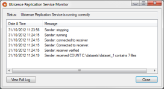
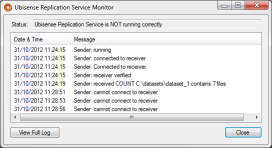

Skip To Main Content

  * placeholder

Filter:

  * All Files

Submit Search

   

You are here:

[Download as
PDF](../../../../SmartSpaceDownloads/B7GZWZS4WX9F/SmartSpaceReplication.pdf
"link to PDF version of this content")

[Software
Version](../../../ComponentandFeatureOverview/FrontMatters\(Online\)/features-
and-versions.htm): 3.2

# Ubisense Replication

The following information guides you through the steps required to install,
configure and run a simple Ubisense replication system. The system consists of
a single live machine (where the platform and services are executing) and a
single backup machine (which will replicate the live machine).

# Installing Replication on Windows

The following provides the steps required to install, configure and run a
simple Ubisense replication system on Windows. The system will consist of a
single live machine (where the platform and services are executing) and a
single backup machine (which will replicate the live machine).

## Installing Platform

Ensure the platform software has been installed on both the system being
replicated (the live system) and the replicating system (the backup system).
Ensure the same version of the platform software is installed on both systems
and is version 2.1.8 or newer. Ensure both systems have the required licenses
installed.

On the live system, in Platform Control, the dataset setting should be set to
the root directory of the Ubisense dataset. This same directory (including
drive) will be used as the location of the replicated dataset on the backup
system. For example, if the dataset directory on the live system is
d:\ubisense\dataset, the replicated dataset directory will be
d:\ubisense\dataset on the backup system. Therefore, it is important to ensure
the backup system has the same hardware (drives) as the live system.

On the backup system, in Platform Control, set the dataset setting to the same
as the dataset setting on the live system. Although this is not necessary for
the replication to work, if the backup dataset is correctly set, it will make
switching from the live system to the backup system quicker and easier if the
live system fails.

See  [SmartSpace Installation](../../Installation/InstallationWiz.htm) for
further information on installing the server software and using Platform
Control.

## Installing Ubisense Replication

Ubisense Replication software should be installed on both the live system and
the backup system.

To install Ubisense Replication:

  1. Go to the servers\windows directory of your SmartSpace distribution directory.
  2. Double-click the UbisenseReplication.msi file and the Ubisense Replication Setup wizard appears.
  3. Click Next.
  4. Choose the Destination Folder for the software.  
You can accept the default C:\Program Files (x86)\Ubisense 3 or change to
another destination.

  5. Click Next and click Install.
  6. When the installation is complete, click Finish to close the Ubisense Replication Setup wizard.

## Set Up the Backup System

A registry setting must be set to configure the backup system. On the backup
machine, set the following registry setting.

Setting | Description  
---|---  
controller_node_name |  The name of the controller. This must match the controller name on the live machine which is running the sender. The name can be any user-specified string, for example ReplicatedSystem1. The name should be unique for each live/backup setup.  
  
  
See the Registry Editor section for instructions on using the Registry Editor.

There is an optional setting that should not be set unless necessary. It will
only be necessary if the default port is already in use on the backup machine.
If this setting is added on the backup system, it must also be added on the
live system.

Setting | Description  
---|---  
replication_receiver_port |  The port number on which the Replication Receiver is listening for connections. This parameter is optional and should not be set unless it is necessary. The default port, 9876, is used if it is omitted. This value must match the sender’s corresponding setting.  
  
## Set Up the Live System

Three registry settings must be set to configure the live system. On the live
machine, set the following registry settings.

Setting | Description  
---|---  
controller_node_name |  The name of the controller. This must match the controller name on the backup machine which is running the receiver.  
replication_directory |  The directory where the Ubisense platform services should write their replication information. This is effectively a temporary directory used by the replication process. An example would be c:\ubisense\replication.  
replication_receiver_address |  The IP address of the backup machine which is running the receiver. See Get the IP address for instructions on how to get the IP address.  
  
  
See the Registry Editor section for instructions on using the registry editor.

There is an optional setting that should not be set unless set on the backup
system.

Setting | Description  
---|---  
replication_receiver_port |  The port number on which the Replication Receiver is listening for connections. This parameter is optional and should not be set unless it is necessary. The default port, 9876, is used if it is omitted. This value must match the Replication Receiver’s corresponding setting.  
  
## Replication and Service security

If you are installing Replication and also intend to use Service security to
provide authentication on your dataset, you must ensure that you have
identical copies of the credentials.dat file on your live machine and your
backup machine.

  * To achieve this, after you have generated the credentials.dat file on the live machine, copy the file from the root dataset folder of the live machine to the root dataset folder of the backup machine.

It is important to note that whenever any subsequent change is made to
credentials.dat, you must repeat this step and copy the changed file to the
other machine.

For further information on installing and configuring Service security, see
[Ubisense Security Manager](../../Core/Securitymanager/security-manager-
configuration.htm) or the SmartSpace Ubisense Architecture: Schema Security
guide.

## Starting Replication

There are two methods for starting replication:

  * Using the UbisenseFailover application to control the starting and stopping of replication services. This is the preferred method of operation.
  * Manually starting the backup and live systems.

### Using Failover to Control Replication Services

See [Ubisense Failover](../Failover/failover-configuration.htm) for further
information on installing and configuring Failover.

**If your system is configured to use SmartSpace Failover, you must only use
Failover to start your backup and live systems. Do not use the manual methods
described below.**

### Manually Starting Replication

#### Manually Starting the Backup System

On the backup machine, start a command prompt with system administrator
privileges. See Command Prompt with System Administrator Privileges for
instructions on how to start a command prompt with system administrator
privileges.

  1. Change directory to the location where the Ubisense Replication software was installed, most likely one of

  * C:\Program Files (x86)\Ubisense 3\bin
  * C:\Program Files\Ubisense 3\bin

  1. Enter the following command to start the replication service on the receiver.

    
    
    ubisense_native_services -r

After running the command, the following should be displayed.

    
    
    UbisenseReplicationReceiver 3 started
     
       Service                          Status
       ~~~~~~~                          ~~~~~~
       UbisenseServiceController 3      not running
       UbisenseCoreServer 3             not running
       UbisenseSiteConnectorClient 3    not installed (or not running)
       UbisenseReplicationSender 3      not running
       UbisenseReplicationReceiver 3    running

#### Manually Starting the Live System

On the live machine, start a command prompt with system administrator
privileges. See Command Prompt with System Administrator Privileges for
instructions on how to start a command prompt with system administrator
privileges.

  1. Change directory to the location where the Ubisense Replication software was installed, most likely one of

  * C:\Program Files (x86)\Ubisense 3\bin
  * C:\Program Files\Ubisense 3\bin

  1. Enter the following command to start the replication service on the sender.

    
    
    ubisense_native_services –c –t –s

After running the command, the following should be displayed.

    
    
    UbisenseReplicationSender 3 started
     
       Service                          Status
       ~~~~~~~                          ~~~~~~
       UbisenseServiceController 3      running
       UbisenseCoreServer 3             running
       UbisenseSiteConnectorClient 3    not installed (or not running)
       UbisenseReplicationSender 3      running
       UbisenseReplicationReceiver 3    not running
    		

## Checking the System is Working

To check the system is working, start the Ubisense Replication Service
Monitor. This can be found where the Ubisense Replication software was
installed, most likely one of:

  * C:\Program Files (x86)\Ubisense 3\bin
  * C:\Program Files\Ubisense 3\bin

Double-click UbisenseReplicationMonitor.exe to start the application.

If the replication system is working correctly, the status will show Ubisense
Replication Service is running correctly. You should also be able to see
directories and files being stored in the dataset directory on the backup
system, although this may take a little time to complete.

If the replication system is not working correctly, the status will show
Ubisense Replication Service is NOT running correctly. If this is the case,
the messages should be checked to find the cause of the problem.

When your replication system is live, it is important to ensure that the
replication receiver is not taken out of use for any length of time. Not only
does this leave you without an available backup system but you also run the
risk of eventually filling up the disk-based buffers and causing the sender
services to fail.

## Switching to the Backup System

If the live system fails for some reason, the backup system must take over. It
is possible to do this manually but the preferred method of switching to the
backup system is to use the Ubisense Failover application. See [Ubisense
Failover](../Failover/failover-configuration.htm) for further information on
installing and configuring Failover.

# Installing Replication on Linux

The following provides the steps required to install, configure and run a
simple Ubisense replication system on Linux. The system will consist of a
single live machine (where the platform and services are executing) and a
single backup machine (which will replicate the live machine).

## Installing Platform

Ensure the platform software has been installed on both the system being
replicated (the live system) and the replication system (the backup system).
Ensure the same version of the platform software is installed on both systems
and is version 2.1.8 or newer. Ensure both systems have the required licenses
installed.

On the live system, the dataset setting should be set to the root directory of
the Ubisense dataset. This same directory will be used as the location of the
replicated dataset on the backup system.

On the backup system, set the dataset setting to the same as the dataset
setting on the live system. Although this is not necessary for the replication
to work, if the backup dataset is correctly set, it will make switching from
the live system to the backup system easier if the live system fails.

See [SmartSpace Installation](../../Installation/InstallationWiz.htm) for
further information on installing the server software.

## Installing Ubisense Replication

Ubisense Replication software should be installed on both the live system and
the backup system.

There is no installation package for Linux. The ubisense_replication_sender
and ubisense_replication_receiver should be copied to the live and backup
machines, as required.

## Set up the Backup System

A configuration setting must be set to configure the backup system. On the
backup machine, set the following setting in the platform.conf file which is
normally found in /etc/Ubisense.

Setting | Description  
---|---  
controller_node_name |  The name of the controller. This must match the controller name on the live machine which is running the sender. The name can be any user-specified string, for example ReplicatedSystem1. The name should be unique for each live/backup setup.  
  
  
There is an optional setting that should not be set unless necessary. It will
only be necessary if the default port is already in use on backup machine. If
this setting is added on the backup system, it must also be added on the live
system.

Setting | Description  
---|---  
replication_receiver_port |  The port number on which the receiver is listening for connections. This parameter is optional and should not be set unless it is necessary. The default port, 9876, is used if it is omitted. This value must match the sender’s corresponding setting.  
  
## Set up the Live System

Three configuration settings must be set to configure the live system. On the
live machine, set the following settings in the platform.conf file which is
normally found in /etc/Ubisense

Setting | Description  
---|---  
controller_node_name |  The name of the controller. This must match the controller name on the backup machine which is running the receiver.  
replication_directory |  The directory where the Ubisense Platform Services should write their replication information. This is effectively a temporary directory used by the replication process. An example would be /home/ubisense/rep.  
replication_receiver_address |  The IP address of the backup machine which is running the Replication Receiver.  
  
  
There is an optional setting that should not be set unless set on the backup
system.

Setting | Description  
---|---  
replication_receiver_port |  The port number on which the receiver is listening for connections. This parameter is optional and should not be set unless it is necessary. The default port, 9876, is used if it is omitted. This value must match the receiver’s corresponding setting.  
  
## Replication and Service security

If you are installing Replication and also intend to use Service security to
provide authentication on your dataset, you must ensure that you have
identical copies of the credentials.dat file on your live machine and your
backup machine.

  * To achieve this, after you have generated the credentials.dat file on the live machine, copy the file from the root dataset folder of the live machine to the root dataset folder of the backup machine.

It is important to note that whenever any subsequent change is made to
credentials.dat, you must repeat this step and copy the changed file to the
other machine.

For further information on installing and configuring Service security, see
[Ubisense Security Manager](../../Core/Securitymanager/security-manager-
configuration.htm) or the SmartSpace Ubisense Architecture: Schema Security
guide.

## Starting the Backup System

On the backup machine, change to the directory where the replication files
were installed. Enter the following command to start the replication service
on the receiver.

    
    
    ubisense_replication_receiver &

Alternatively, the service can be started and stopped as any other service,
for example with an init.d script. The service can be started as daemon by
providing the –d command line argument.

## Starting the Live System

On the live machine, change to the directory where the replication files were
installed. Enter the following command to start the replication service on the
sender.

    
    
    ubisense_replication_sender &

Alternatively, the service can be started and stopped as any other service,
for example with an init.d script. The service can be started as daemon by
providing the –d command line argument.

## Checking the System is Working

The Linux services produce the same error and progress messages as the Windows
services (except for the omission of Windows-specific messages). The Linux
services log their messages to syslog. On most Linux systems /etc/syslog.conf
will indicate where syslog output is written to. For example, on some systems,
it is written to /var/log/messages. In this case the most recent messages can
be seen, as they arrive, with the following command:

    
    
    tail –f /var/log/messages

When your replication system is live, it is important to ensure that the
replication receiver is not taken out of use for any length of time. Not only
does this leave you without an available backup system but you also run the
risk of eventually filling up the disk-based buffers and causing the sender
services to fail.

## Switching to the Backup System

If the live system fails for some reason, the backup system must take over. It
is possible to do this manually, as described below, but the preferred method
of switching to the backup system is to use the Ubisense Failover application.
See for descriptions of failover in use.

To manually switch to the backup system, on the backup machine, stop (kill)
the ubisense_replication_receiver process and then start the core server and
local controller by entering the following commands.

    
    
    /etc/init.d/ubisense_core_server start  
    /etc/init.d/ubisense_local_control start

# Registry Editor

The following give instructions on how to add and edit Ubisense registry
settings.

Ubisense registry settings are stored under one of:

  * HKEY_LOCAL_MACHINE\SOFTWARE\WOW6432Node\Ubisense 3\Config

  * HKEY_LOCAL_MACHINE\SOFTWARE\WOW6432Node\Ubisense 2.1\Platform\Config

  1. Start the registry editor. (Click start, type regedit.exe, and press Enter). 
  2. In the tree on the left, from the top, expand HKEY_LOCAL_MACHINE, then expand SOFTWARE, and so on down the tree until you select Config.
  3. With the registry editor open and config selected in the tree on the left, the registry settings are displayed in the panel on the right.

     * To add a new setting, select the “Edit” menu, select “New” and select “String Value”. A new value will appear in the panel on the right and the value's name is being edited. Enter the name of the setting (e.g. controller_name_node).
     * To edit a settings value, select the setting in the panel on the right. Select the “Edit” menu, then select “Modify…”. This will display an editor window where the setting can be edited. Type in the setting value (e.g. ReplicationSystem1) and press Enter. The registry setting has now been set.

# Get the IP address

The following give instructions on how to get the IP address of a Windows PC.

  1. Start a command prompt. Click start, then type command and press Enter.
  2. Enter the command ipconfig and press Enter.
  3. For the output of this command, look for the section “Ethernet adapter Local Area Connection”. Find the line that starts with IPv4. The end of the line will be four numbers like 12.34.56.78. This is the IP address. See the example output below where the IP address is highlighted.

    
    
    Windows IP Configuration
    Ethernet adapter Local Area Connection:
       Connection-specific DNS Suffix  . : ubisense.local
       Link-local IPv6 Address . . . . . : fe80::d529:b237:e3e8:ec43%13
       IPv4 Address. . . . . . . . . . . : 10.42.5.126
       Subnet Mask . . . . . . . . . . . : 255.255.0.0
       Default Gateway . . . . . . . . . : 10.42.1.1

# Command Prompt with System Administrator Privileges

The following give instructions on how to start a command prompt with system
administrator privileges.

In Windows, click Start, then type command. At the top of the list being
displayed you should find “Command Prompt”. Right click on “Command Prompt”
and select Run as administrator.

  * Ubisense Replication
  * Installing Replication on Windows
    * Installing Platform
    * Installing Ubisense Replication
    * Set Up the Backup System
    * Set Up the Live System
    * Replication and Service security
    * Starting Replication
      * Using Failover to Control Replication Services
      * Manually Starting Replication
    * Checking the System is Working
    * Switching to the Backup System
  * Installing Replication on Linux
    * Installing Platform
    * Installing Ubisense Replication
    * Set up the Backup System
    * Set up the Live System
    * Replication and Service security
    * Starting the Backup System
    * Starting the Live System
    * Checking the System is Working
    * Switching to the Backup System
  * Registry Editor
  * Get the IP address
  * Command Prompt with System Administrator Privileges

   

* * *

[www.ubisense.net](http://www.ubisense.net/)  
Copyright © 2020, Ubisense Limited 2014 - 2020. All Rights Reserved.

