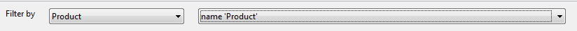
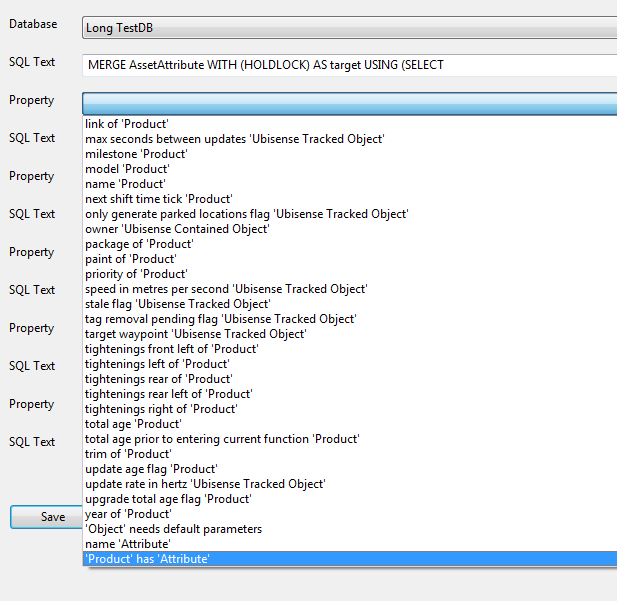
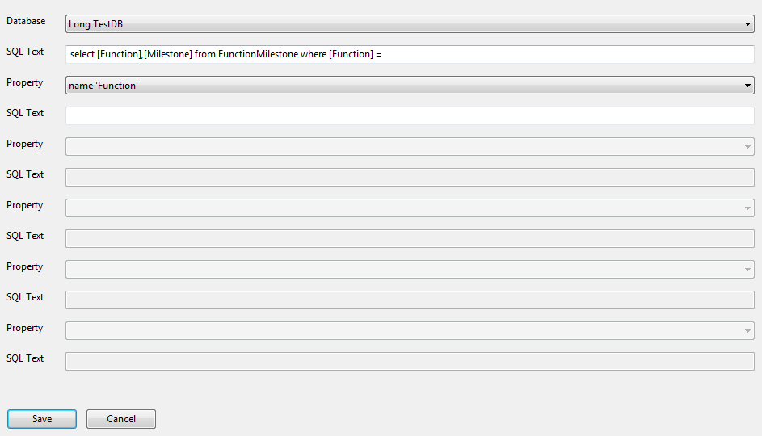
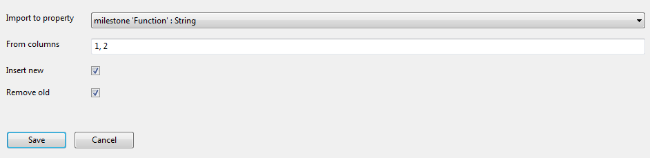
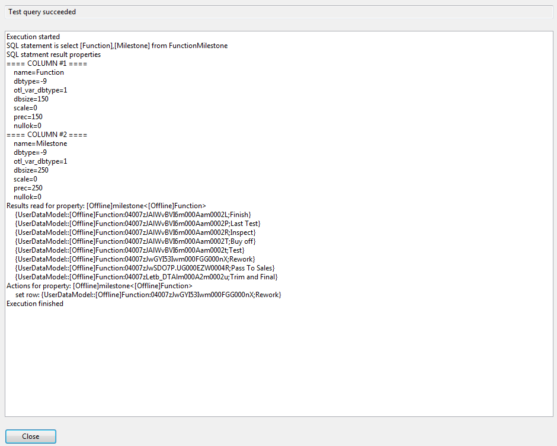
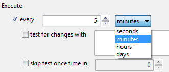

Skip To Main Content

  * placeholder

Filter:

  * All Files

Submit Search

   

You are here:

[Download as
PDF](../../../../SmartSpaceDownloads/B7GZWZS4WX9F/SmartSpaceRDBMSMap.pdf "link
to PDF version of this content")

[Software
Version](../../../ComponentandFeatureOverview/FrontMatters\(Online\)/features-
and-versions.htm): 3.2

# RDBMS map configuration

# Introduction to RDBMS map

The relational database integration feature is used to export and import
SmartSpace data to and from external databases. The data to be exported and
imported can be defined in configuration pages within the SmartSpace Config
application. Imports and exports can be configured simultaneously to and from
multiple databases, as required.

This guide describes the RDBMS map features of SmartSpace, and how they should
be configured, tested and deployed.

The intended audience is those installing and configuring a SmartSpace system
or application, who need to exchange application data with third-party
database systems.

# Features

This section introduces the basic functionality of the RDBMS map feature. For
more details see the specific configuration sections below.

## Database connections

A database connection describes the type of database and the connection string
used to connect to that database. The database server types supported are:

### SQL Server

Versions: 2008 R2 or higher, using ODBC and SQL Server Native Client library.
Limited queries may work with earlier versions.

### Oracle

Versions: 11G R2 or higher, using Oracle Instant Client 12.1 library. Limited
queries may work with earlier versions.

## Exporting

### Exporting from application data to a database connection

The basic export functionality is to select properties of application objects
to export, and to build export SQL statements to run on a database connection,
which include the property fields (keys and value).

### Binding columns into queries

The export SQL statements can also include other properties of the application
objects in the property to be exported.

### Scheduled execution

Execution can be triggered every time an included property is changed.

Changed properties can be accumulated and applied periodically in a batch.

Exports can also be executed when a trigger property changes.

## Importing

### Importing from a database connection to application data

SQL queries can be executed against a database connection, and the results
loaded into properties of application objects.

### Multiple properties per query

Imports can be configured to map specific columns returned by the SQL query to
different properties of a single application object type.

### Bound import queries

Import queries can include properties of the application object type, in which
case they are executed once for each instance of the object type determined by
execution conditions.

### Controlling the insertion and removal of rows

When new rows are returned by the query, the import can create new property
rows or ignore them. Similarly, when old rows are no longer returned by the
query, the import can delete the property rows or ignore them.

### Creating/deleting objects

When the import property is the name property of the imported object type,
then the insert and remove behavior causes object instances to be created or
deleted.

### Scheduling execution

An import can be executed periodically. Periodically executed imports can
include a test query which returns a string (a "hash" or change control value)
that changes only when the main query needs to be executed. This test query
can be skipped occasionally if there is a chance of hash collisions.

An import can also be executed at specific times every day.

An import can be executed when any of its bound properties change.

Finally, an import can be executed when another trigger property changes.

# Installation

The Relational Database Integration feature comprises three service packages:

  * URelationalDatabase.xml: Installs the configuration service which allows imports and exports to be configured in the SmartSpace Config application. This should always be installed.
  * URelationalDatabaseSQLServer.xml: Installs the service that executes imports and exports with database connections of type "Sql". 
    * In order to use this service, a suitable ODBC driver for SQL Server should be installed on the same controller server. For example, SQL Server Native Client 11 for SQL Server 2012 or 2014. See Microsoft documentation of the native client for specific version numbers.
  * URelationalDatabaseOracle.xml: Installs the service that executes imports and exports with database connections of type "Oracle". 
    * In order to use this service, the Oracle Instant Client 12.1 should be installed on the same controller server, and the system PATH environment variable should include the folder containing the oci.dll library.

All three service packages can be safely installed if integration is required
with both database server types.

The configuration user interface is the RDBMS MAP task of the SmartSpace
Config application. To install this, use the Ubisense Application Manager as
described in [SmartSpace
Installation](../../Installation/InstallationWiz.htm). This will ensure that
the correct version of SmartSpace Config will be executed to match the
platform you are connected to. Thus for the 3.1.8 features you must have also
deployed the USmartFactoryConfigUI.xml package from the 3.1.8 SmartSpace
release.

# Configuration

## Background concepts

Later we will refer to "simple" and "complex" properties. For reference, these
are defined in separate parts of the Types and objects workspace in SmartSpace
Config.

  * A "Simple" property is one which has a single object as key, and a corresponding value. For example "country code of <Product>: <String>" or "<Product> delivery date <Time>". Given an instance of the key object type, there is at most a single value of the property.
  * A "Complex" property is one where the key includes several columns, or there can be multiple values for each key. For example "<Product> is in <Function>: <Bool>" where the functions can overlap, or "<Product> entry time in <Function>: <Time>", where the key has multiple columns <Product> and <Function>.

A "name" property is a simple property of an object type with a string value.
It is used to uniquely identify the instance of the object. This might be an
unique identifier such as the build number of a Product, or the process step
name of a Function. An object type can have at most one name property, which
may be inherited from its parent types. Thus for a given type of object, there
is either no way to look up the object by its name string, or just one way.
This property is used during import execution.

## Database connections

### Creating a connection

To create a database connection, double-click <Create new database> in the top
pane of the database integration task in SmartSpace Config. This will bring up
the editor.

  * Enter a new database name. This must be distinct from any existing connections. Otherwise the new database connection configuration will replace the existing one, which is unlikely to be the desired behavior.
  * Select the type of database to connect to:SQL Server or Oracle.
  * Enter a connection string suitable for the database type.

### Testing a connection

To test that a connection can be made, click Test.

For SQL Server, if an error is generated, for more information go to SQL
Server Management Studio and under Management/SQL Server Logs, look for the
notification of a failed login, which should describe the reason the login
failed. If the login failure doesn’t appear in the server log, check the
server name and instance. If they are correct, run the SQL Server
Configuration Manager and ensure that the TCP/IP protocol is enabled for your
server instance.

### Editing a connection

To edit a database connection, double-click the row in the top pane of the
database integration task in SmartSpace Config. If you change the name, this
will be ignored.

### Deleting a connection

To delete a connection, select the row, then press Delete.

If the database connection is currently in use within a configured import or
export, this will be indicated and deletion will be cancelled. Otherwise a
confirmation dialog is displayed: click Delete to confirm deletion.

### Connection examples

SQL Server

For SQL Server Native Client 11, using Windows authentication, the database
MESDB must allow connection with role db_datareader (for imports) or
db_datawriter (for exports) for the NT AUTHORITY/SYSTEM user (assuming that is
the account under which the Ubisense Local Controller service is executed):

    
    
    Driver={SQL Server Native Client 11.0};Server=LOCALHOST\SQLSERVER2008;Database=MESDB;Trusted_Connection=yes;

Oracle

For Oracle 11g, server ORACLE01, port 1522, instance mes.production.internal,
using user "MESDB", password "unsafepassword":

    
    
    MESDB/unsafepassword@ORACLE01:1522/mes.production.internal

or

    
    
    MESDB/unsafepassword@(DESCRIPTION=(ADDRESS_LIST=(ADDRESS=(PROTOCOL=TCP)(HOST=ORACLE01)(PORT=1522)))(CONNECT_DATA=(SERVER=DEDICATED)(SERVICE_NAME=mes.production.internal)))

## Filtering imports and exports by type and property

Between the database connection pane and the test of the task there are two
filter dropdowns. These can be used to restrict the displayed exports and
imports to only those with the matching type and/or property. These controls
also restrict the choices available in some other dropdowns within the
interface, to make it easier to configure exports or imports relating to a
specific part of the application data model.

If an item you wish to edit is not visible, make sure that the current filter
does not exclude it.

## Exports

### Creating, editing and deleting

To create a new export, double-click on the <Create new export> line in the
exports pane. To edit an export, double-click the export line. In both cases
the Export editor is displayed.

To delete an export, select the row and then press Delete. A confirmation
dialog is displayed.

### Export editor

In the Export editor, no changes are made to the current configuration until
the Save button has been clicked. It is safe to edit the export upserts and
deletes without any impact on the current configured system. The Cancel button
discards any pending changes.

Choose the property to export

At the top of the Export editor is a drop-down which selects the primary
application data property to be exported. Each property can be in only one
export definition, but there can be several "upsert" and "delete" statements
in an export, so it is possible to export from a given property to multiple
destination databases, or tables within a database. The primary property must
be selected before any SQL queries can be added, because the columns and value
of the property determine the other related properties which can be embedded
into the queries. The property cannot be changed once it has been saved.

Construct Upsert and Delete queries

An upsert query is executed with current values of the exported properties,
and should update or insert the row in the database to match the current
values in the SmartSpace application data.

A delete query is executed when a specific row is removed from the SmartSpace
application data.

One important question in database export is: what happens if changes occur
within SmartSpace while the RDBMS map service is stopped? Similarly, what
happens if the target database connection fails, or one of the statements
fails to execute? From version 3.4, behavior on service startup and establish
has been improved to ensure the RDBMS module is robust to such events. The
service keeps track of the changes to business objects and properties that
have been successfully applied to the database. In this way it will
automatically retry statements that have failed to execute, and it is able to
detect the set of changes that have occurred since it was last running, and
immediately executes the corresponding upsert or delete statements to reflect
these changes in the target database.

To edit or create a query, double-click the appropriate line in the Upsert SQL
or Delete SQL list boxes. This will display the query editor.

Example Upsert

Whilst any SQL statement can be used in both upsert and delete actions, a
typical upsert can be written using the MERGE statement in SQL. For example,
in SQL Server:

    
    
    MERGE FunctionMilestone WITH (HOLDLOCK) AS target 
    USING (SELECT 
    [[name<Function>]]
    ,
    [[milestone<Function>]]
    ) AS source (Name, Milestone)
    ON (target.[Function] = source.Name) 
    WHEN MATCHED THEN 
    UPDATE SET Milestone = source.Milestone 
    WHEN NOT MATCHED THEN
    INSERT ([Function], Milestone) VALUES (source.Name, source.Milestone)

Here the target table in the database is FunctionMilestone. The export would
be of a property called "milestone <Function>: <String>", which is a simple
property of the "Function" type. The source table of the merge statement is
formed by directly creating a single row from the exported properties bound
into the query—this is represented here in pseudo-code by the syntax
"[[property]]".

The keyword "Function" has been escaped with square brackets to avoid an
error. Also note the use of the HOLDLOCK, which is only required if another
application might also modify the target table.

A very similar statement is available in Oracle.

Example deletion

To make delete statements robust, they should only use a single property
value, such as the name or unique ID of an object in SmartSpace. This is
because the changes to business object properties are processed asynchronously
in the RDBMS map service, so by the time they are executed the other property
values for the object may have already been removed.

Consider, for example, an exported property "comment<Product>:String".

We could set the delete statement to be:

DELETE FROM ExportCommentTable WHERE Id=name<Product> AND
Comment=comment<Product>

Now if a given product is deleted in SmartSpace, the name and comment will be
removed. When the change to remove the product name is processed, the comment
of the product has already been removed, so the delete statement will not
work.

Instead, we could use the simpler statement:

DELETE FROM ExportCommentTable WHERE Id=name<Product>

Now the statement can be evaluated as the product name is removed, because the
service knows the name that has been removed, and doesn't have to look up the
comment of the same product.

### The query editor

The query editor allows a database connection to be selected, and then a
sequence of alternating "SQL Text" and "Property" entries to be configured.
These are concatenated to build the SQL statement to be executed.

The property selection drop-down includes the value of the primary property of
the export (at the very bottom of the list) and also all possible properties
of objects otherwise included in the primary exported property. For example,
if the primary property is "<Product> has <Attribute>", where both Product and
Attribute are object types, then the drop down will include all "simple"
properties of Product; all simple properties of Attribute; and the value
'Product' has 'Attribute'.

When there are multiple columns in the property with a given object type, they
will be distinguished in the drop-down by a number, where the first object of
the type will be "1", and the second "2", etc. For example, if there was a
property '<Function> is prerequisite of <Function> in <Process Map>', then the
available properties would include "name 'Function': 1" and "name 'Function':
2"

When the export is executed for each row of the primary property, the text and
selected property values will be used to create the SQL statement to be
executed.

The Save button on the query editor does not actually make any changes to the
currently configured exports. Only the Save button in the Export editor
applies the pending changes.

### Scheduling exports

An export will by default be executed when any property in the export is
changed. When a row is inserted or updated, the upserts will be executed. When
a row is deleted, the deletes will be executed.

If an update period is specified, then changes will be accumulated by the
service until that period expires, and then all changes will be executed at
once as a single batch. This is useful if a SmartSpace property changes
frequently, but the integration only requires occasional updates to the
database table, because it reduces the database server load.

It is also possible to specify a trigger property. If a row of the trigger
property is inserted, deleted or changes, then the upserts for the
corresponding objects will be executed. If the trigger property does not share
any object types with the exported property then it will have no effect.

Finally, when the specific database engine service starts, all export upserts
are executed for all current rows of their primary properties.

### Export errors

When an error occurs executing an export upsert or delete, the error will be
logged to the "rdb_exception" platform monitor stream. Enable this stream
while configuring exports to view errors in the current configuration. See
Tracing for information on other streams.

Unlike imports, there is no Test button.

## Imports

### Creating, editing and deleting

Double-click on <Create new import> to add a new import definition, and
double-click an existing import to edit it. In both cases the Import editor
will be displayed. To delete an import, select the row and press Delete. A
confirmation dialog is displayed.

### Import editor

In the Import editor, no changes are made to the current configuration until
the Save button has been clicked. It is safe to edit the import and test
without any impact on the current configured system. The Cancel button
discards any pending changes.

Select the import type

Each import has a primary object type, which is selected in the Import type
drop-down, at the top of the editor. This cannot be changed once an import has
been defined, because the type chosen determines the properties available to
import into, and those that can be bound into queries. If the import is
configured to create and delete objects, then those objects will be this type.

It is not possible to define the query or any imported property mappings until
the import type has been selected.

Define the query

The query definition can be edited by clicking the Edit query button. You
cannot directly type into the query definition text box as this is just for
reference. The query editor is the same window as in the Export editor. Select
a database connection to use, and then query is built up from an alternating
list of SQL text and (optional) bound properties.

There are two forms of import query, and they are executed differently.

  * Unbound: When no property drop-downs are configured, and the entire query is contained in the first "SQL Text" line, then the query will be executed once each time it is triggered, and all rows applied to the current application data as defined by the property column mappings.
  * Bound: When at least one property drop-down is configured, the query will be executed separately for each object instance for which it is triggered. See the Execution conditions section below. The results for each execution will then be applied to the current application data as defined by the property column mappings. The query shown above is a bound import query.

In the import configuration, the properties available will all be simple
properties of the import type.

The Save button on the query editor does not actually make any changes to the
currently configured imports. Only the Save button in the Import editor
applies the pending changes.

Property column mappings

Each query can import into one or more properties of the import type. The
"Import to property" section of the editor is used to set up these property
mappings, including which properties are imported to, and which result columns
returned by the SQL query map to each column in the properties.

Double-click <Create new result> to add a new mapping, or double-click an
existing mapping to edit it. To delete a mapping, select a row and press
Delete. No confirmation dialog is shown, but recall that no changes are
actually applied until the "Save" button is clicked in the Import editor.

Select the property to which the result columns should be imported. Note that
each property can only appear in a single import mapping, so if the property
you wish to import to does not appear in the drop-down, it is probably already
mapped in another import. To track down other uses of a property, use the
filter controls in the main task pane.

Then type a comma-separated list of column numbers in the SQL query results to
use for that property. The column numbers start at 1, so to use the first and
second result column, type "1,2".

The number of columns that must be specified depends on the type of property
selected.

  * For a "name" property of the import type, only a single result column should be selected. Importing to a name property can be used to create and remove instances of objects, in combination with the "insert new" and "remove old" flags.
  * For a "simple" property of the import type, two columns should be selected, one for the object and one for its column.
  * For a "complex" property, one column must be defined for each key of the complex property, and one for the value.

Any property columns which are objects must be mapped to a string result
column which is the name of the object. When importing the results, the result
column string is looked up using the name property of the object type in the
corresponding property column. See below.

Next specify the insertion and removal behavior for this property.

  * Insert new: Check this box to insert property rows returned by the query for which the property key is not currently contained in the SmartSpace application data. If the mapped property is the name property of the import type, this causes the object to be created with the given name.
  * Remove old: Check this box to remove property rows not returned by the query for which there is a current property key in the current SmartSpace application data. If the mapped property is the name property of the import type, this causes the object instance to be deleted when no longer returned by the query. For an unbound query, all current property rows are expected to be returned by the query. For a bound query, only the property rows for the triggering object are expected to be returned. Any expected rows which are not returned will be removed if this box is checked. Thus this flag can be used correctly with bound queries.

The Save button on the property column mapping editor does not actually make
any changes to the currently configured imports. Only the Save button in the
Import editor applies the pending changes.

Testing the query

The import query and mappings can be tested before they are saved. Click the
Test query button at the bottom of the Import editor. To test a query, the
service for the database type must be running (Relational Database SQL Server,
or Relational Database Oracle), otherwise an error will be shown. This is the
only part of configuration which requires the database specific service to be
deployed and running.

When a query is executed, a text window is displayed showing the result and
technical details.

The test output includes:

  * The SQL statement generated from the configured SQL query.
  * Any errors or exceptions generated when the SQL was sent to the database.
  * The output columns of the SQL statement, and their internal types and precision. For reference, the otl_var_dbtype field of each column is one of:

Code |  Type  
---|---  
1 |  null terminated string  
2 |  8-byte floating point number  
3 |  4-byte floating point number  
4 |  signed 32-bit integer  
5 |  unsigned 32-bit integer  
6 |  signed 16-bit integer  
7 |  signed 32-bit integer (for 32-bit, and LLP64 C++ compilers), signed 64-bit integer (for LP-64 C++ compilers)  
8 |  data type that is mapped into Oracle date/timestamp, DB2 timestamp, MS SQL datetime/datetime2/time/date, Sybase timestamp, etc.  
9 |  data type that is mapped into LONG in Oracle 7/8/9/10/11/12, TEXT in MS SQL Server and Sybase, CLOB in DB2  
10 |  data type that is mapped into LONG RAW in Oracle, IMAGE in MS SQL Server and Sybase, BLOB in DB2  
11 |  data type that is mapped into CLOB in Oracle 8/9/10/11/12  
12 |  data type that is mapped into BLOB in Oracle 8/9/10/11/12  
16 |  DB2 TIME data type  
17 |  DB2 DATE data type  
18 |  Oracle timestamp with timezone type  
19 |  Oracle 9i/10g/11g TIMESTAMP WITH LOCAL TIME ZONE type  
20 |  MS SQL Server, DB2, MySQL, PostgreSQL, etc. BIGINT (signed 64-bit integer) type  
23 |  RAW, BINARY, VARBINARY, BYTEA, VARCHAR BYTE, CHAR BYTE, etc.  
27 |  unsigned 64-bit integer  
  * The results read when the query was executed, after looking up internal object ids for any object names read. Note that if the query is a bound query, it is tested with an arbitrarily chosen instance of the import type picked from the current application data.
  * Any type conversion errors when the query results are applied to the mapped properties.
  * The actions that would be applied to the SmartSpace properties if the query were actually executed right now. Actions are insert row, set row and delete row, and also show creation and deletion of objects. No actual actions are applied during the test.

Forcing columns to match property types

Sometimes the database binding may have a default type for the results of a
query that does not match the property it is being imported into. For example,
if the property has a bool value, and you are attempting to return '1' from a
query as "true", the result is incorrectly converted to a numeric (i.e.
floating point) type by the default Oracle binding. However, it is possible to
force a specific type (and column order) for each return column, using the
following syntax:

    
    
    SELECT COLUMN2 :#1<type>, COLUMN2 :#2<type> FROM ...

The number after the '#' character determines the column number for this
result column. The above statement returns them in the order they are
declared. The 'type' in angle brackets determines how the column is bound. The
following set of types is supported:

    
    
     <char[XXX]>
     <double>
     <float>
     <int>
     <bigint>
     <ubigint>
     <unsigned>
     <short>
     <long>
     <raw[XXX]>
     <raw_long>
     <timestamp>
     <varchar_long>

If you cannot get an import to load correctly because of type errors, try
using a suitable type from the list above for the column which is not working.
For example, to return a product name and a bool 'true' from a table
ProductIsActive, we need an integer type for the bool property value:

    
    
    SELECT Name, 1 :#<int> FROM ProductIsActive

Importing objects and date/times

Special processing occurs when importing to object and date/time properties.

  * For Object columns in a property, the SQL result must be a string column, and this is looked-up in the name property of the type to find the instance of the object. If the instance is not found, then it will be skipped, unless the mapping is to a name property for the import base type, and the "insert new" flag is set, in which case a new object instance of that type will be created. 
  * For Time columns in a property, the importer assumes that the column in the results will be readable as a datetime (otl_var_dbtype = 8), and will be in UTC. If this is not so, convert the column within your SQL statement, for example:

    
    
    CAST(SWITCHOFFSET(datecolumn, '+00:00') AS DATETIME)

Calling stored procedures

In SQL Server connections, you can use the ODBC call markup, and pass
parameters too, in your query.

    
    
    { call dbo.MyStoredProcedure( [[bound_property]], [[bound_property]] ) }

Execution conditions

The final part of configuring an import is to set the execution conditions.
There are a number of options, which can be combined as required. Check the
box next to each method you want to use to trigger execution, and then fill in
any parameters for that method.

  * Periodic execution: the query is executed at regular intervals, specified in seconds, minutes, hours or days.

    * An optional test query can be specified, which should return a single row with a single string column. This should be a "hash" or sequence number used to detect changes to the database. The service records the last value returned by the test, and if it is the same as the last time it was executed, the import is skipped. Typically this query will either use some sort of binary table hash, or a grouped maximum of some change management column on the table.
    * If the test query uses a hash function, then there may be a small chance of a hash collision, where the data changes but the hash does not. The test can be skipped occasionally to get around hash collisions.
  * At given times during each day: a list of times are specified in 24-hour clock, in the local time zone.
  * When any of the bound properties change: the query is executed when any property included in the import query definition changes, including inserts and deletes.
  * When another trigger property changes: you can specify any other property of the import type. When a row changes, or is inserted or deleted, the query is executed. 

All queries are also executed at startup of the database specific service.

When a bound query is triggered by a property change, it is executed once for
each of the import type object instances in the changed property rows.

When a bound query is triggered by any other method, it is executed once for
each current object instance of the import type in the SmartSpace application
data.

When an unbound query is triggered, it is executed once.

## Tracing

The following platform monitoring streams are available:

  * rdb: Messages about basic functionality such as initialization of the services
  * rdb_query: Messages about each query execution, including the statements executed, and any application data errors.
  * rdb_exception: Errors encountered during execution of SQL queries.

# Deployment tool

The RDBMS map feature comes with a deployment tool which can be used to save
and load relational database imports and exports to/from a file. The tool can
be used to move configuration from integration to production, or the reverse.

    
    
    E:\temp\> ubisense_relational_database_config.exe
    You need to specify a mode
    Usage: ubisense_relational_database_config.exe export [OPTIONS]
       or: ubisense_relational_database_config.exe import [OPTIONS]
    Export and import relational database integration definitions.
     
    OPTIONS
      -c, --clear               Remove configuration not in the input
      -i, --input <input>       The input file
      -o, --output <output>     The output file
      --help                    Display this help and exit
      --version                 Display version information and exit

In export mode, the tool writes all current relational database definitions to
the output file (or the standard output if not specified). The output is a
JSON format file, and can be edited with a text editor if needed. Definitions
include databases, imports and exports, and all their properties.

In import mode, the tool reads the input file (or the standard input if not
specified) and applies the definitions to the current relational database
configuration, updating matching existing configuration. If the -c option is
given, it also removes any other databases, imports and exports not in the
current input.

For example, to save the configuration to file defs.js:

    
    
    ubisense_relational_database_config.exe export -o defs.js

To load the configuration from defs.js, clearing any existing configuration:

    
    
    ubisense_relational_database_config.exe import -i defs.js -c

To get the tool, run Application Manager, click DOWNLOADABLES, and select
Application integration > RDBMS admin tools >
ubisense_relational_database_config.exe. Click Download.

  * RDBMS map configuration
  * Introduction to RDBMS map
  * Features
    * Database connections
      * SQL Server
      * Oracle
    * Exporting
      * Exporting from application data to a database connection
      * Binding columns into queries
      * Scheduled execution
    * Importing
      * Importing from a database connection to application data
      * Multiple properties per query
      * Bound import queries
      * Controlling the insertion and removal of rows
      * Creating/deleting objects
      * Scheduling execution
  * Installation
  * Configuration
    * Background concepts
    * Database connections
      * Creating a connection
      * Testing a connection
      * Editing a connection
      * Deleting a connection
      * Connection examples
    * Filtering imports and exports by type and property
    * Exports
      * Creating, editing and deleting
      * Export editor
      * The query editor
      * Scheduling exports
      * Export errors
    * Imports
      * Creating, editing and deleting
      * Import editor
    * Tracing
  * Deployment tool

   

* * *

[www.ubisense.net](http://www.ubisense.net/)  
Copyright © 2020, Ubisense Limited 2014 - 2020. All Rights Reserved.

