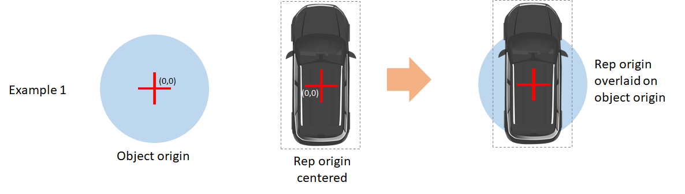
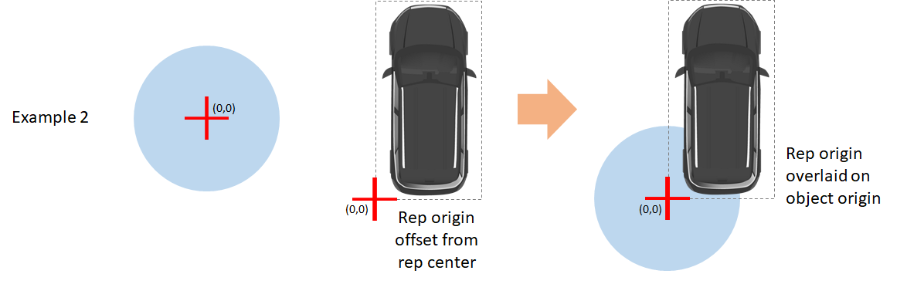
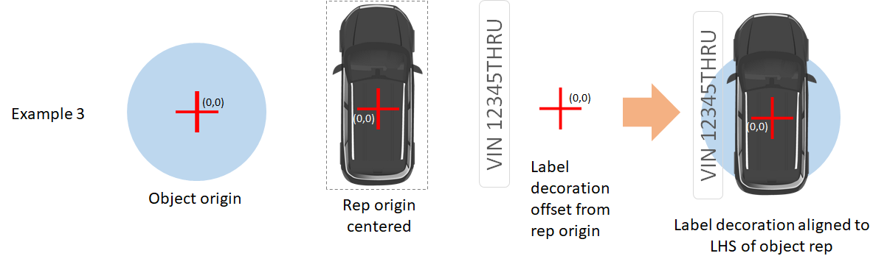
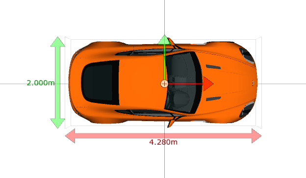
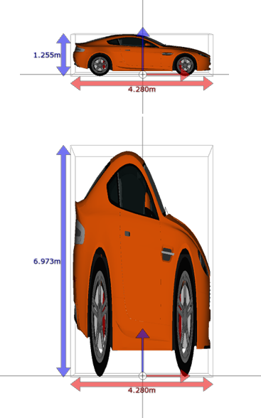
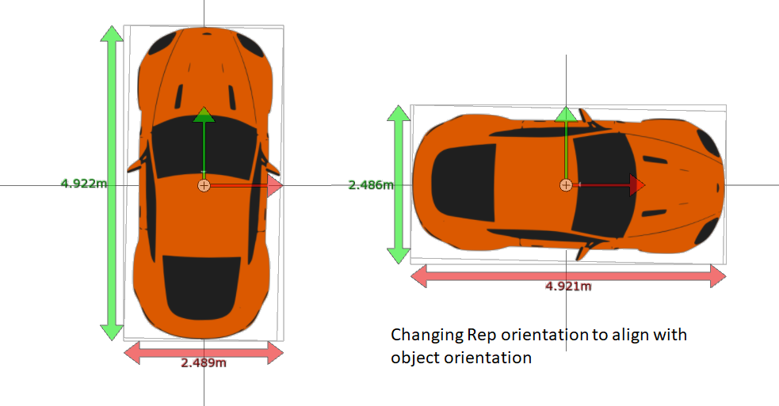
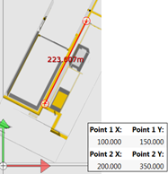
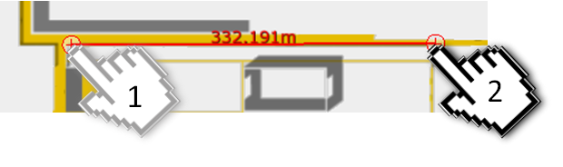

Skip To Main Content

  * placeholder

Filter:

  * All Files

Submit Search

   

You are here:

[Software
Version](../../../ComponentandFeatureOverview/FrontMatters\(Online\)/features-
and-versions.htm): 3.2

# Model import

You can use the Model import workspace to import graphical representations for
both your site and the objects within it.

Images for use as SmartSpace reps can come from many sources and may require
preparation before they are suitable for import and use in SmartSpace. See
[Graphics in SmartSpace](../../../ITResources/ITDocs/Graphics/graphics-
introduction.htm) for a selection of guides describing the steps required to
optimize image files for use in SmartSpace.

# The Model import workspace

The Model import workspace lists all representations (images) that have been
imported into SmartSpace. This includes both images used for object
representations and background images. The main purpose of the workspace is to
import new reps and transform them to meet the scale, orientation and offset
requirements of the object to which they will be attached, or the environment
into which they will be dropped for background images.

Click on MODEL IMPORT to display the workspace.

The workspace is described in the following sections:

List of representations

A list of representations currently available in SmartSpace is displayed.

  * Clicking on a representation name populates a second table listing transformations applied to the image and displays the image in the representation editor.
  * Double-clicking a representation name allows you to give it a new name.
  * Double-clicking <Import representation> allows you to import new image files for use as representations. See Importing an object representation and Importing a site model for information on importing objects and site representations respectively. 

Rep scaling controls

When a rep is displayed in the Model import workspace details of its size,
position, scale and orientation are shown. You can change these by double-
clicking a measurement and entering a new value.

Clicking Reset transformation returns the image to its originals dimensions
and position. See Resetting a Representation to its Initial Values

Clicking Export allows you to export a rep for editing with tools outside of
SmartSpace. See Exporting Representations from SmartSpace.

Representation viewer

When a rep is selected from the List of representations, it is displayed in
the Representation editor.

  * To zoom into the workspace, rotate the mouse wheel away from you.
  * To zoom out of the workspace, rotate the mouse wheel towards you.
  * If the representation is too large (or too small) to view in the workspace, press Home to go back to the default screen setting.

## Resetting a Representation to its Initial Values

At any point, you can reset a representation back to the default size, scale,
rotation and offset from the origin:

1\. On the Model import workspace, select the representation.

2\. Click the Reset transformation button.

This will also reset any map representations that you may have placed on the
map.

## Managing the Rendering Order of 2D reps

When importing 2D representations for use in the WebMap, consideration must be
given to the layering of reps as they are rendered into the WebMap view. The
default Z coordinate of all reps is Z=0. This means that 2D reps dropped into
the z-plane of the world model will all be coplanar which results in an
unpredictable output from the rendering engine, i.e. it’s not clear which rep
is “on top”.

To overcome this, we recommend setting a small negative offset for the
background rep in the Z-axis. This ensures that object reps are always
rendered on top of the background rep in the WebMap view. We recommend a value
of -0.01.

1\. On the Import visual models tab, select the map representation.

2\. In the Origin Z field, enter -0.01.

## Replacing an Existing Representation with a New Source File

It may be necessary to update a representation because the base image has
changed (for example when the site background is modified due to building
layout changes). Replacing a rep is straightforward. Import the new rep using
the standard import procedure, but when you are asked to name the rep, use the
same name as the one you are trying to replace. You will be asked to confirm
the change and the transformation of the original rep will be applied to the
new rep. Now wherever the old rep appears in your SmartSpace configuration,
the new rep will appear instead.

## Exporting Representations from SmartSpace

Representation files are modified outside of SmartSpace using appropriate
editing tool (see [Constructing a high quality SVG file from a
drawing](../../../ITResources/ITDocs/Graphics/SVGToolchain/SVG-high-quality-
construction.htm) for an example of the toolchain for creating reps). If you
do not have the original file it is possible to export the required
representations from SmartSpace to disk. To do this, select the required rep
from the Representation list view and use the Export button. This will prompt
you to select a path to which you want the file to be saved.

# Importing an object representation

## Importing a New Object Rep File

To import an object representation:

1\. On the Model import workspace, double-click <Import representation>.

2\. Navigate to the image file.

3\. The filename, including its suffix, becomes the default name of the
representation. Edit the name as required.

4\. Click Save.

## Setting Scale, Orientation and Origin Offset

After importing a representation, you need to adjust it to match the size,
position and orientation of the object to which it will be attached.

The controls that enable you to make these adjustments are discussed below.

### Setting rep size

Size adjustment allows you to explicitly set the size of the rep to a size
that matches the known (or approximate) dimensions of the object. Clicking on
any of the X, Y, or Z values switches into an edit mode allowing you to set a
new value. Clicking away from the edit control sets the new value and scales
the other two values accordingly, ensuring that the aspect ratio of the
representation is preserved. Within the rendering workspace you will see the
changes to the rep scale portrayed along the axes of the view projection you
are using (Top Down, Front View or Side View). Switching to a different
projection will display a different scale combination pair. Note that Front
and Side views are not relevant for 2D Reps because there is no height (Z)
scale that needs to be set.

### Setting Rep Origin

The rep origin is important as this determines how the representation will
appear relative to the location of an object to which it is assigned. In most
situations, the base rep for an object – the image that depicts it as a car, a
tractor, a trolley etc. – will have its origin in the center of the bounding
box of that rep. When the rep is assigned to a object the two origins overlap
and the rep is centered around the object. See Example 1.

If the object rep were not centered within the bounding box the rep would be
offset from the object origin (see example 2). This ability to offset the rep
is important for decorations where the decoration can be attached alongside
the object. Example 3 depicts this for a text label assigned to the object.

Modifying the rep origin can be done numerically by single-clicking and
updating the values in X, Y and Z (Z only for 3D reps), or by dragging the
origin-point that is rendered over the rep in the render view, as shown below.

### Setting Rep Scale

Instead of setting explicit dimensions for a rep (which preserves the aspect
ratio of the object in all dimensions), you can set the scale of each
dimension independently of the other dimensions. In this way, the example
below shows a 3D rep with the Z scale at 1 and a comparative change with the Z
scale at 3. Neither of the other dimensions for the rep have changed.

Scaling 2D Representations

If you are scaling a 2D rep, make sure you scale the z axis size to a similar
scale to the x and y axes, otherwise the default zoom in the SmartSpace Config
maps may be further out than expected. For example, if you have a rep with
(Scale X, Scale Y, Scale Z) set to (0.05, 0.05, 1.0), you will find that the
map default zoom gives a lot of space around the rep. This is automatically
done correctly if you scale the image using reference points (described in
Resizing a representation based on the distance between two points) or if you
set the image's overall size. But if you directly set the scale, it is up to
you to ensure that the relative scales are reasonable.

### Setting Rep Orientation

If the representation used for the object has an implied directionality (such
as the front and back of a vehicle), then the object representation should
preferably be aligned with the forward facing axis of the object. As was the
case for aligning origins, the vertical and horizontal axes of the object and
rep coordinate systems are aligned. So if the imported rep is not properly
aligned, it is possible to rotate the rep axes to properly align with the
object, as shown below.

Orientation can be adjusted by dragging the red or green axis arrows, or by
setting any of the angular rotations explicitly by clicking on the edit
controls. Pitch and Roll values only apply to 3D reps.

### Resizing a representation based on the distance between two points

To resize or scale a representation based on a known distance:

1\. Click to turn on Show reference points.

2\. Position the two ends of the reference line on the two points.

3\. If you are scaling the X-axis (the same applies if you are scaling the
Y-axis):

  * Note the value in Point 1 X and adjust the distance in Point 2 X.  
Or:

    * a. Enter 0 in Point 1 X.
    * b. Enter the distance in Point 2 X.

The representation is then scaled along the X-axis – the scale factor is shown
in the Scaling X field.

4\. If necessary, press the Home key to zoom to the representation.

# Importing a site model

The site background can be configured in several different ways, depending on
whether you’re configuring the 3D site visualization or the browser-based web
map view. In general, the same principles are followed; an image or model is
imported, saved and then transformed to match the scale and coordinate system
of the world model. Before you import a site model you may need to optimize
its appearance. See [Graphics in
SmartSpace](../../../ITResources/ITDocs/Graphics/graphics-introduction.htm)
for examples of preparing image and model types for import into SmartSpace.

To import a site background:

1\. On the Model import workspace, double-click <Import representation>.

2\. Navigate to the image file.

3\. The filename, including its suffix, becomes the default name of the
representation. Edit the name as required.

4\. Click Save.

The next step is to adjust the representation for scale, orientation and
offset so as to match the main coordinate system. The easiest and most
accurate way to do this is with the Reference Points tool, but this can also
be done manually by adjusting the following parameters.

### Size

Shows the size of the X,Y (and Z with 3D) dimensions of the representation.
These dimensions can be modified to match the scaling of the world model.

### Origin

By default, the lower-left corner of the representation is positioned at the
origin (0,0). In the workspace, the origin is marked by the crosshair inside
following symbol, and by the intersection of the axis lines (if the Show axis
lines option is turned on).

The origin of a background rep is primarily important for 2D reps used in the
web map feature of the visibility component. The web map supports the
configuration of Views (described in [Views](../../Visibility/Webmaps/web-
maps-introduction.htm#Views) and configured in [The Cells
workspace](../Cells/cells-configuration.htm#cells-workspace)) and the origin
of the 2D rep is the point that is evaluated for whether the rep falls within
the view (of a defined search) or not. This is particularly important if views
are being used to restrict certain user Roles from seeing different parts of
the site, in which case multiple background reps would be used to correspond
to the set of defined views, thereby returning only the portion of the
background map they are authorized to see.

The best and most accurate way to set the origin is with the Set Reference
Points tool. This will ensure that all background reps align with each other
and the world coordinate system.

### Scaling

Shows the current scale of the representation. You can enter new scale factors
here or use the reference points to set the scale.

### Rotation

Shows the angle of rotation (in degrees) of the map representation. You can
use the reference points to rotate the representation. While pitch and roll
are settable, they are not commonly used as reps are typically already aligned
correctly with these axes, and only yaw needs to be modified (in some
circumstances). This is particularly true for 2D reps which are already
coplanar with the horizontal plane of the world model.

## Setting Scale, Orientation and Origin Using the Set Reference Points Tool

The most accurate way to align a background representation is to use the set
Reference Points tool. This allows you to select two known points in the
imported representation and match them to known coordinates in the world
model. SmartSpace then calculates the scale, orientation and (origin) offset
that maps the selected points in the representation to the defined coordinates
in the world model.

To do this you need to know the coordinates (x,y,z) of two points that exist
in the real world which are also easily identifiable in the site
representation. This is typically a set of edges, corners or other easily
identifiable marker. The greater the distance between these points the more
accurate the alignment will be, because any error in the point positions is a
proportion of the baseline between the two points.

The Reference Points tool is directional. Reversing the order of Point 1 (left
end) and Point 2 (right end) of the reference line will rotate the map
representation.

To transform a map representation based on known coordinates:

1\. On the Model import workspace, select the map representation.

2\. In the workspace, click to turn on Show reference points.

3\. Position the two ends of the reference line on the two locations.

4\. Enter the X, Y coordinates of the first location in the Point 1 X, Point 1
Y fields.

5\. Enter the X, Y coordinates of the second location in the Point 2 X, Point
2 Y fields.

  * Model import
  * The Model import workspace
    * Resetting a Representation to its Initial Values
    * Managing the Rendering Order of 2D reps
    * Replacing an Existing Representation with a New Source File
    * Exporting Representations from SmartSpace
  * Importing an object representation
    * Importing a New Object Rep File
    * Setting Scale, Orientation and Origin Offset
      * Setting rep size
      * Setting Rep Origin
      * Setting Rep Scale
      * Setting Rep Orientation
      * Resizing a representation based on the distance between two points
  * Importing a site model
      * Size
      * Origin
      * Scaling
      * Rotation
    * Setting Scale, Orientation and Origin Using the Set Reference Points Tool

   

* * *

[www.ubisense.net](http://www.ubisense.net/)  
Copyright © 2020, Ubisense Limited 2014 - 2020. All Rights Reserved.

