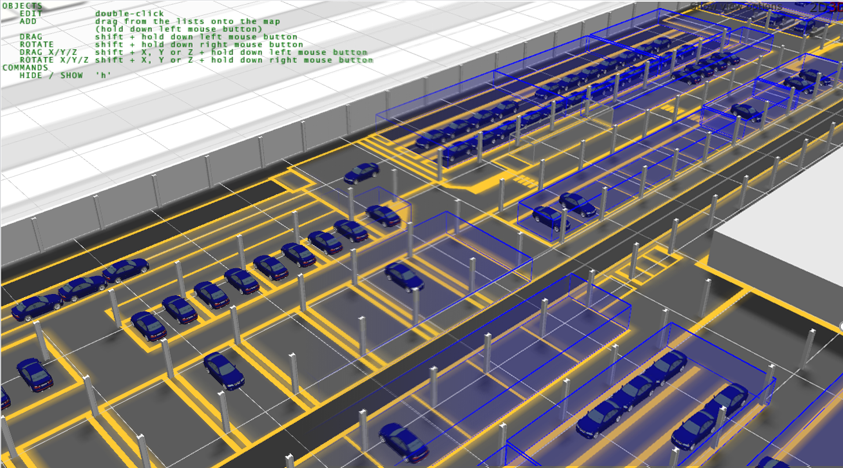
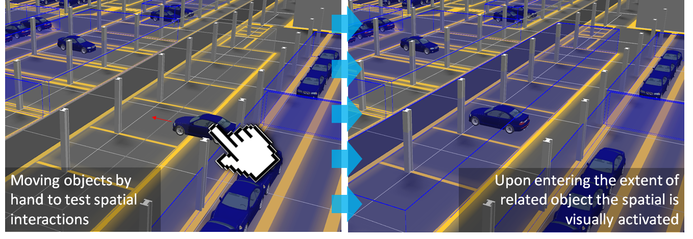
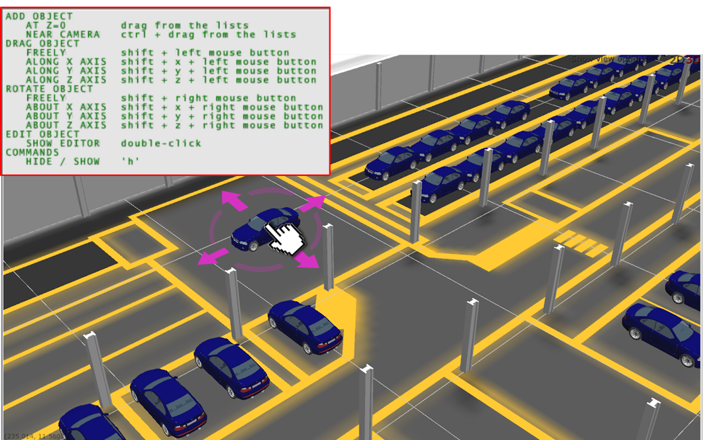

Skip To Main Content

  * placeholder

Filter:

  * All Files

Submit Search

  

You are here:

[Software
Version](../../../../ComponentandFeatureOverview/FrontMatters\(Online\)/features-
and-versions.htm): 3.2

# Object placement

Site visualization provides a window where humans can interact with the
objects moving around in the SmartSpace digital twin of their real world. It
provides a real-time view of where objects are located and the ability to
monitor any spatial relations that have been defined to see when they’re
getting activated and by which objects.

One of the core features of SmartSpace is the ability to define spatial
relations between objects which describe important real-world interactions
between those types. This is the basis for building location and context-aware
applications using SmartSpace, and as such it is important to see what the
system thinks is happening at any time. Also, when building new applications,
it is important to be able to test spatial relation definitions. Hence site
visualization allows you to virtually “pick objects up” and a move them around
in the world model. In this way, you can test spatial interactions that you’ve
defined without relying on a live location source.

# The Place objects workspace

The Place objects workspace is an interactive drag-and-drop interface for
placing objects into the world model, moving them around, and visualizing
spatial relations that have been configured.

Click on OBJECT PLACEMENT to display the workspace.

The Place objects workspace provides a 3D-view of your virtual world with a
list of representations for use as background objects to build the world
model, and a list of objects which have been assigned a default representation
and can therefore be added as active participants in the environment you
create.

The Place objects workspace is described in the following sections:

Map viewer

The map viewer, by default, shows a 3D view of your world model.

  * Click 2D to switch to a 2D view from above. Click 3D to return to the 3D view.
  * Click Show view options to configure how to view your world model. Choose:

    * Show grid to display a grid to enable more accurate placement of objects
    * Show cell extents to display the extents of the cells configured using the Cells workspace.
    * Show name labels to display the ID of each object on the map 
    * Show help to display instructions for placing and moving objects on the map. You can also press H to toggle the display of this information
  * Double-click an object on the map to display a dialog where you can specify its exact location, make it stationary, or delete it from the map

List of representations

All representations added to SmartSpace using the Model import workspace are
listed in the top-left of the screen. Dragging a rep from this list adds it as
a background representation on the map. See Placing background reps for
further information on working with background reps.

List of objects

Objects that have been assigned default representations are listed in the
lower left-hand part of the screen. Dragging an object from the list adds it
to the map. See Placing objects on the map for information on adding objects
to the map.

  * Choose an object type from the dropdown to see a list of all instances of the object
  * Use the case-sensitive filter to enter a complete or partial ID to refine the list ( clears the filter)
  * Choose <Located objects> or <Unlocated objects> from the dropdown to limit the list to objects are or are not located on the map
  * Use the <Background objects> option to list representations that have been added to the map as background objects
  * Zoom to a specific object or objects by selecting one or more from the list and clicking <View selected objects on the map>
  * Double-click an object on the map to display a dialog where you can specify its exact location, make it stationary, or delete it from the map
  * When you double-click an object, an additional pane displays on the lower right-hand side of the screen where you can select properties and associated reps for display alongside the object on the map:

Show spatial relationships toggle

  * A table listing all defined spatial relations with check boxes to toggle them on and off

# Placing background reps

The environment view is a combination of moving objects and background
representations which give visual context for human users interacting with the
SmartSpace world model. Background representations are expected to remain
static in the scene, and as such they can be dragged from the representation
list into the scene.

Before you place a background rep, you must have imported the image (see
[Importing a site model](../model-import.htm#ImportSite)) and have set its
origin using the Set Reference Points tool (see [Setting Scale, Orientation
and Origin Using the Set Reference Points Tool](../model-import.htm#Setting)).
Then, when you have dropped the background rep into the scene, aligning it
with the world coordinate system should just be a matter of setting its
coordinates to (0,0).

Double-click the background you have just dragged into the scene. This opens a
dialog that allows you to set the location of the rep in world coordinates. If
your rep is already correctly scaled and offset, you can enter zeros for all
translation and rotation fields. Additionally, you can lock the rep in place
to reduce the chance that it gets accidentally moved while interacting with
the world model using your mouse.

You can also follow the instructions displayed in green to move a background
rep around in the environment. However, this is fine for background reps that
are decorative, any reps that must be accurately aligned with the world
coordinate system should not be moved in this way

Using the same dialog you can also select Unset object location to remove the
rep from the scene.

# Placing objects on the map

For objects to be included in the List of objects available for placing in the
virtual environment, they must be instances of types which have been assigned
a representation using the <default> representation mode (see [Adding a
representation to a type](../assignreps/model-assignment.htm#Adding)).

Objects differ from background reps in that they are active participants in
the SmartSpace object model. They come in two classes:

  * objects that are expected to remain stationary in the environment
  * objects that are mobile in the environment

Objects can be placed into the environment by dragging and dropping object
names from the objects list.

You then have the option to move and re-orient the object using mouse and
keyboard controls as described in the Help text that overlays the environment
display:

Alternatively, if you have known coordinates for objects, you can double-click
and set object location and orientation explicitly. For stationary objects you
can select the Lock object position option to ensure they are not accidentally
moved.

# Viewing spatial relations

Some types and objects will have spatial properties (extents) which are used
to detect spatial interactions between objects as they move around and
interact with each other in the world model. The environment view makes it
possible to visualize these spatial relations as they happen in real-time,
which can be a helpful validation to ensure new applications are working as
expected. This same ability can be used to test spatial relations between
object types by manually moving them, as described in Placing objects on the
map.

Before you can visualize or test any spatial relations, you must have
configured some. You can find information on configuring spatial relationships
in [Configure spatial relationships between
types](../../SpatialRelations/spatial-properties-configuration.htm#Configur2).

To enable a spatial relationship in the environment view, choose one or more
spatial relations from the spatial relations list view.

Upon selection the space extents that currently satisfy the selected
containment relation are highlighted in blue. Any spaces that are not
currently “activated” are shown in a light gray color.

It is possible to modify the default active/inactive colors.

  * Object placement
  * The Place objects workspace
  * Placing background reps
  * Placing objects on the map
  * Viewing spatial relations

  

* * *

[www.ubisense.net](http://www.ubisense.net/)  
Copyright © 2020, Ubisense Limited 2014 - 2020. All Rights Reserved.

