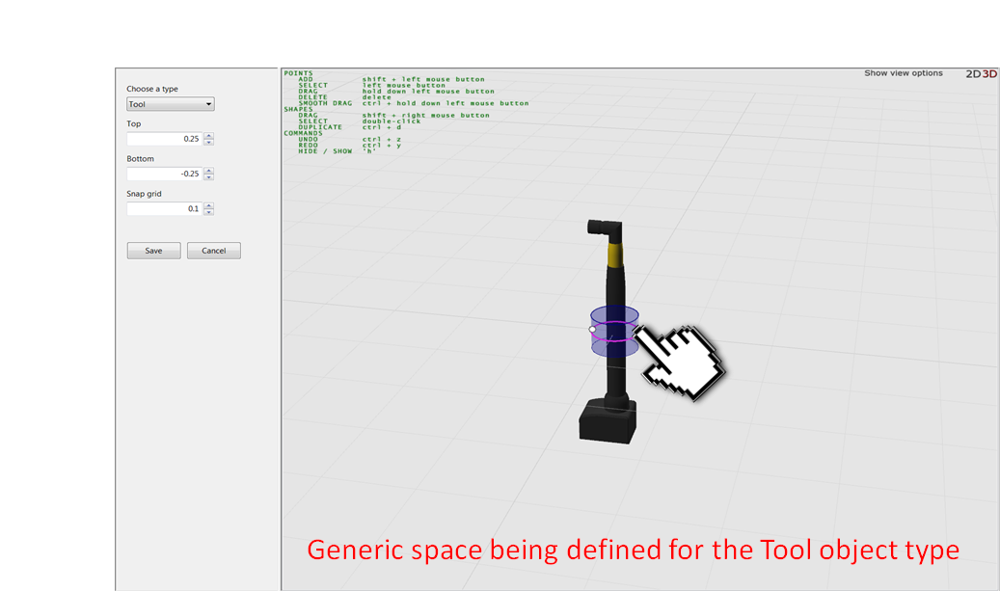
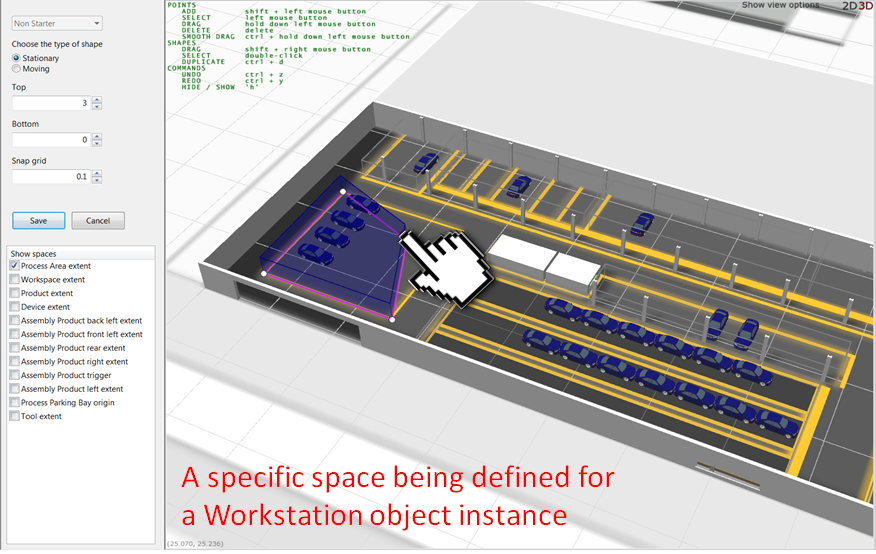

Skip To Main Content

  * placeholder

Filter:

  * All Files

Submit Search

   

You are here:

[Software
Version](../../../ComponentandFeatureOverview/FrontMatters\(Online\)/features-
and-versions.htm): 3.2

# Spatial properties

A generic space is one which is assigned generically to an object type and
which exists for every instance of that type. The space is “attached” to the
object, in that its position relative to the origin of the object is fixed,
and as such when the object moves the space moves by exactly the same amount
as well. This is known as a relative space in SmartSpace. An example of such a
space is shown below, where a trackable hand tool has a cylindrical generic
space attached.

The alternative to a generic space is a specific space. This is a space
definition which is unique to an object instance of a particular type.
Specific spaces can be both stationary (they are fixed to a specific location
in the world model) or relative (much like generic spaces, they move relative
to the object location). An example of a stationary specific space is a
geofence that represents a physical workspace or footprint in a factory. Such
physical workstation footprints will be different in size, position and
orientation across the factory, so a specific space is required to capture the
uniqueness of each space. In this case you would need an instance of a type
called “workstation” in your object model with at least one Space property
defined. You can then define a specific space for that object for the
workstation, such as in the example shown below.

# The Spatial properties workspace

The Spatial properties workspace in SmartSpace Config provides tools to
create, edit and delete spatial properties and to create spatial relations.

Click on SPATIAL PROPERTIES to display the workspace.

### Details of types and spaces

In the Details of types and spaces area, you can select a type and an
associated space property. Only types with space properties are listed in the
<Select a type> dropdown and only space properties are listed for them at
<Select a property>.

The lists below show details of default and specific spaces that have been
defined.

To view an existing space, select a type and a space property, then a default
or specific space, and then click View Space. To edit a space, select the
property in the default spaces or specific spaces list and click Edit Space
(or double-click the name of the property).

### Spatial property editor

The Spatial property editor displays the representation associated with the
selected type. Click Show view options to configure the features the editor
displays.

### Spatial relationship editor

The Spatial relationship editor displays details of any monitored spatial
relations and the service that requested it. The list contains spatial
relations defined for particular SmartSpace features and also those you define
(the latter are shown as requested by SmartSpace Config ).

Double-clicking <Add new request> allows you to define new spatial relations.
This is described in Configure spatial relationships between types.

# Configure space properties of types

When you have a type with a space property defined (described in [Creating a
custom type and adding a space property](../../Core/Typeandobject/types-and-
objects-introduction.htm#Create)) and which has a default representation set
(described in [Adding a representation to a
type](../SiteVisualization/assignreps/model-assignment.htm#Adding)) you can
configure the volumetric values for its extent.

Open the Edit spatial properties workspace and decide whether you want to
define a generic or a specific space. In the example below we’ll present the
process for a generic space, but the process is much the same for specific
spaces.

  1. Choose a Type from the dropdown for which you wish to define a generic space, then select the space property you wish to edit and double-click the <Create new default space> option.

  2. Ensure that your object type is selected from the dropdown and press Home to enter the editor view around your object representation.  
Use the prompts overlaid on the screen to help you move and orient your view
to best match the space extent you’re trying to define.

  3. Hold down the Shift key and left-click in the editor view to set the first point of your extent. Repeat this to begin creating a space around the object. By default, two points define a cylinder and three or more points define a multi-sided polygon.

  4. Modify the extent to meet your requirements. Some editing tips follow:

     * At any time you can move a node of the extent by left-clicking the node to select it and left-dragging the mouse.
     * You can delete a node at any time by left-clicking the node to select it (it will be highlighted red) and pressing Delete.
     * You can move the whole space by pressing the Shift key on your keyboard and right-click dragging the space with your mouse
     * It is often easier to define the horizontal extent of the object using a top-down (or 2D) view. You can toggle between 2D and 3D views using either the number keys on your keyboard (2 and 3) or clicking on the 2D 3D text in the editor view.
  5. Ensure the vertical extent (height) of the space is set appropriately for your application.

For small, mobile objects whose height (as reported by a tracking system) is
likely to vary quite a bit, we recommend that you center the vertical extent
to form a somewhat flat cylinder around the object. This has the effect of
making spatial monitoring for this class of object a 2D containment
evaluation, which is good when the height of the object can vary quite a bit
and it is really the interaction in the X/Y plane that is most interesting for
business applications.

When defining the extent for a stationary space (one that is static in the
world model) it is important to ensure that the vertical extent is both high
enough (to account for variations in tracked height of objects moving in and
out of these spaces) and low enough (it is possible to get a tracked height
for objects that is below the ground plane. In this case, give stationary
spaces a generous ceiling value and a slightly negative floor value).

When defining a specific stationary space in the world model, a pink line is
used to indicate both the bounding box of your space and its intersection with
the ground plane (height = 0). This makes it easier to see whether your space
extent has a slightly negative value yet or not.

# Configure spatial relationships between types

To define a new spatial relation between two objects:

  1. In the Spatial relationship editor double-click <Add new request>.

  2. Choose a container object and a contained object from the lists of objects with defined spatial extents.
  3. Click Save to save the relationship.

  * Spatial properties
  * The Spatial properties workspace
      * Details of types and spaces
      * Spatial property editor
      * Spatial relationship editor
  * Configure space properties of types
  * Configure spatial relationships between types

   

* * *

[www.ubisense.net](http://www.ubisense.net/)  
Copyright © 2020, Ubisense Limited 2014 - 2020. All Rights Reserved.

