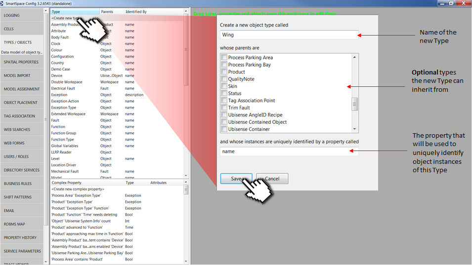
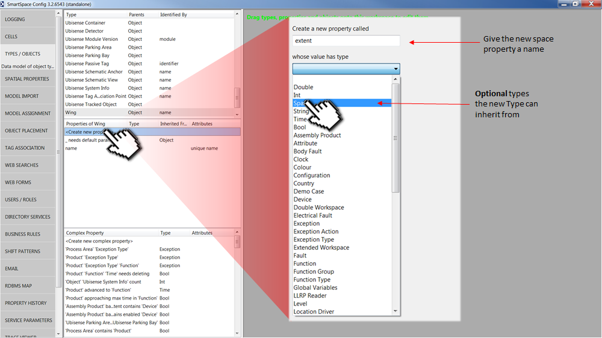

Skip To Main Content

  * placeholder

Filter:

  * All Files

Submit Search

   

[Software
Version](../../../ComponentandFeatureOverview/FrontMatters\(Online\)/features-
and-versions.htm): 3.2

# Creating a custom type and adding a space property

Types and objects are created using the SmartSpace Config application. You can
find a description of the workspace for creating types and objects in
[Configure SmartSpace](../smartspace-config-intro.htm). The instructions below
take you through creating a type, giving it a name, and adding a spatial
property.

To create a new type, click on TYPES / OBJECTS to open the Types and objects
workspace and double-click <Create new type>.

This will display the type creation dialog. At this point you must:

1\. Give your new Type a name.

2\. Decide whether you want the type to inherit from any existing types.

3\. Give your new type a property with which instances of the object can be
uniquely identified, .i.e. a “name” or “UID” property.

4\. Click Save.

If you want to add a space property to your new type, select the type in the
top half of the Types and properties list and double-click the <Create new
property> option in the lower half.

This will pop up the property creation dialog. From here you must:

1\. Give the new property a name. Because we are creating a property of type
Space, it is good practice to use the term “extent” or “space” as part of the
name.

2\. From the dropdown menu, choose the Space Type for the property.

3\. Click Save.

  * Creating a custom type and adding a space property

   

* * *

[www.ubisense.net](http://www.ubisense.net/)  
Copyright © 2019, Ubisense Limited 2014 - 2019. All Rights Reserved.

