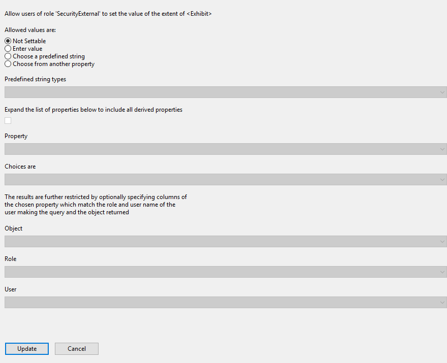

Skip To Main Content

  * placeholder

Filter:

  * All Files

Submit Search

   

You are here:

[Software
Version](../../../ComponentandFeatureOverview/FrontMatters\(Online\)/features-
and-versions.htm): 3.2

# Users and roles

Use the Users and roles workspace to create and manage roles and their
associated permissions, and to associate users, groups and email addresses
with them. For a detailed explanation of users and roles in SmartSpace, see
Users and roles in the [Smart
Workers](../../../ComponentandFeatureOverview/TopLevel/smart-workers-
introduction.htm) section of the website.

With the licensing of the Visibility component, authorized users can manage
users and roles using the browser-based
[Roles](../../Visibility/OpsWebInterface/roles-configuration-operations-web-
interface.htm) screen in SmartSpace Web.

# The Users and roles workspace

The Users and roles workspace is a configuration interface for creating roles,
adding members to those roles and assigning the searches, editable properties
and views visible to the members of a role.

Click on USERS / ROLES to display the workspace.

The workspace is divided into three main areas which are described in the
following sections:

Existing roles

A list of roles currently available in SmartSpace is displayed.

  * Clicking on a role name displays the users currently assigned to the role
  * Double-clicking <Create new role> allows you to create a new role and give it a name. See Adding a New Role

Members of currently selected role

A list of users, roles and groups that are currently assigned to the role.

  * Double-clicking <Add new member> allows you to add a new member to the role. See Adding Users, Groups, Roles and Email Addresses to a Role.

Access control configuration

Three tabs are available for Searches, Properties and Views. See Access
Control Management for further information.

Searches

  * Clicking Searches displays a list of available searches on the left-hand side with those searches currently assigned to the role on the right. 
  * Dragging a search from the left-hand list into the right-hand list adds it to the role.
  * You can delete a search from the role by selecting it in the right-hand list and pressing Delete.

Properties

  * Clicking Properties displays a list of available properties. 
  * Double-clicking a property allows you to specify if and how a role can interact with that property. See Making properties editable by roles for further information.

Views

  * Clicking Views displays a list of available views on the left-hand side with those currently assigned to the role on the right. 
  * Dragging a view from the left-hand list into the right-hand list adds it to the role.

  * You can delete a view from the role by selecting it in the right-hand list and pressing Delete.

# Working with users and roles

## Adding a New Role

To add a new role in the Users and roles workspace:

  1. Double-click <Create new role>.

  1. Give the role a name and click Create. The new role is added to the list of existing roles.

### Default Roles

SmartSpace is supplied with the following roles which control access to
different parts of SmartSpace Web:

  * System.Operator: members of the System.Operator role can access the Tag and Battery Status screen and the Sensor Status screen.
  * System.Manager: members of the System.Manager role can access the Roles screen and the Shifts screen.
  * Ubisense.SmartSpace.Administrator: if Reports engine developer is licensed, members of the Ubisense.SmartSpace.Administrator role can view all reports and create and edit new ones. 

These roles are nested: System.Manager is a member of System.Operator; and
Ubisense.SmartSpace.Administrator is a member of System.Manager. This means
that the permissions are inherited so that by default the different roles can
access screens in SmartSpace Web as follows:

|  Report Creation  | HMI Creation  |  Roles  |  Shifts  |  Tags  |  Sensors   
---|---|---|---|---|---|---  
System.Operator  |  |  |  |  |   |    
System.Manager  |  |  |   |   |   |    
Ubisense.SmartSpace.Administrator  |   |   |   |   |   |    
  
## Adding Users, Groups, Roles and Email Addresses to a Role

To add groups from a connected directory service, ensure that you have first
configured a connection as described in [Directory services](../directory-
services-configuration.htm).

To add a new user, group or role to a role, select the role and then double-
click <Add a new member>.

You can only select the Send notification emails and Display notifications on
map check boxes if you are adding a group to the role.

This is the expected behavior.

Notifications are generated when you use the Notify action in the Business
rules engine.

Notify accepts several different inputs:

  * Named user
  * Email address
  * Group name

For the first two, notify generates a web map popup or an email notification
respectively. It’s obvious what is being requested at the rules engine level
because of the type of input.

Groups, however, could contain both users and email addresses, so you have to
tell the system if you want one or both (maps notifications and emails)
explicitly. Otherwise you run the risk of sending alert emails to everyone in
an active directory group when all you wanted was popups on the web map.

## Managing Roles and Members

Editing the membership of roles is a matter of adding new members in the same
way as described in Adding Users, Groups, Roles and Email Addresses to a Role.
You can delete existing members by selecting them in the members list and
pressing Delete.

Roles can be added as described in Adding a New Role or removed by selecting
them in the roles list and pressing Delete.

## Access Control Management

Access control for roles determines what users are allowed to see and do with
features of the SmartSpace web, including which searches they can see, which
properties they can edit, and which views are used to return located objects
to the web map.

### Adding searches to roles

You can add searches in different combinations to the roles that you have
configured. To add searches that have been defined in the Web searches
workspace (see [Configuring web searches](../WebMaps/web-searches-
configuration.htm#Configur)), drag them into the Search list owned by the
currently selected role.

### Making properties editable by roles

You can define how users interact with the value in a property by assigning
editable properties to one or more roles. All other properties returned by a
search or on a configuration screen will be view only. To define how a role
can interact with a property, select the role from the Role list and double-
click the name of a property.

Depending on the type of access you wish to give the role, enter the required
information and click Update to save the details.

Not Settable

If a property is not settable by a role, members of the role can view, but not
edit, the value of the property. This is the default for all properties.

Enter value

If members of a role are allowed to enter a value for the property, click
Enter value.

Choose a predefined string

If members of a role can choose from a list of predefined values, click Choose
a predefined string and choose from the list of string types that becomes
available.

Choose from another property

If members of a role can choose from a list of values taken from a different
property to the one they are editing, click Choose from another property.

  * Property: choose the property from which the value can be chosen.
  * Choices are: 
  * Additional constraints: you can further restrict the values by choosing Object, Role and User.

### Adding views to roles

You can define regions of your site that can be viewed by the different roles
you have configured. You use areas of your site that have been defined using
the Cells workspace (see [Cells](../Cells/cells-configuration.htm) for further
information) and these are displayed in the list of views. To configure views,
drag them into the Views list of the currently selected role.

  * Users and roles
  * The Users and roles workspace
  * Working with users and roles
    * Adding a New Role
      * Default Roles
    * Adding Users, Groups, Roles and Email Addresses to a Role
    * Managing Roles and Members
    * Access Control Management
      * Adding searches to roles
      * Making properties editable by roles
      * Adding views to roles

   

* * *

[www.ubisense.net](http://www.ubisense.net/)  
Copyright © 2020, Ubisense Limited 2014 - 2020. All Rights Reserved.

