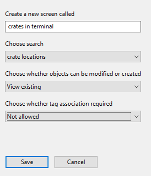
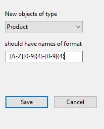

Skip To Main Content

  * placeholder

Filter:

  * All Files

Submit Search

   

You are here:

[Software
Version](../../../ComponentandFeatureOverview/FrontMatters\(Online\)/features-
and-versions.htm): 3.2

# Web forms

The Web forms workspace provides configuration options to create or edit
screens for display in a browser where authorized users can display, and
optionally edit, textual data from SmartSpace. See [Configuring Web
forms](../../Visibility/Webforms/web-forms-concepts.htm) for information on
using web forms in a browser.

The information displayed in a web form is defined by a search query
(described in [Web searches](../WebMaps/web-searches-configuration.htm)). Use
the Web forms workspace to choose the search for a web form and the roles that
can access it, and how the authorized roles can interact with the form.

The Web forms workspace also allows you to define how users format the names
of new objects created via a web form.

# The Web forms workspace

## Overview of the Web forms workspace

The Web forms workspace provides configuration options to create or edit web
forms or "screens" for use in [Web
forms](../../../ComponentandFeatureOverview/TopLevelFeatures/Visibility/web-
forms.htm).

Click on WEB FORMSto display the workspace.

The workspace is divided into three main areas which are described in the
following sections:

Screens and searches list

A list of screens currently available in SmartSpace is displayed with their
associated searches and permissions for object and tag operations.

  * The order of forms in this list is the order they will be presented to the user within a particular role. Ordering can be modified by dragging and dropping a search to a different row in the list. 
  * Clicking on a screen name displays configuration options for that screen
  * Double-clicking <Create new screen> allows you to create a new screen and give it a name. See Creating a web form for more information.
  * Slowly double-clicking the Search, Object Operations, or Tag Association settings for a form allows you to select a different setting. See Creating a web form for available settings

Access configuration

Tabs are available for roles, options, mandatory properties, buttons and
colors.

Available To Roles

  * Clicking Available To Roles displays a list of roles which can be authorized to access the screen
  * Select or deselect roles by clicking in the check boxes beside their names

See Assigning a screen to a role for further information.

Options

  * Clicking Options displays a list of options
  * Select or deselect options by clicking in the check boxes beside their names
  * Disable submit on ENTER: The normal behavior of a web form is to automatically save when a user presses Enter if all mandatory properties have been provided. (This Enter is also normally generated at the end of a barcode scan.) This automatic save can be disabled, if the user often needs to fill in non-mandatory fields, by selecting Disable submit on ENTER. 
  * The remainder of these options are only available if you have enabled tag association or disassociation. See Tag association and disassociation for further information.

Mandatory Properties

  * Clicking Mandatory Properties displays a list of properties and whether they are mandatory during data input
  * Select or deselect properties by clicking in the check boxes beside their names  
No properties are displayed if the form only allows viewing of existing
objects

See Mandatory properties in a screen for further information.

Buttons

  * Clicking Buttons displays a list of buttons associated with the screen
  * Double-clicking <Create new button> allows you to create a new button and define its behavior

See Adding buttons to a screen for further information.

Colours

  * Clicking Colours allows you to set properties to define the color of the property column in the screen

See Defining colors for a screen for further information.

Input constraints

A list of name formats to enforce when new objects are created or edited.

  * Double-clicking <Add name format> allows you to add a new name format
  * You can delete a name format by selecting it and pressing Delete

See Configuring input constraints for further information.

# Creating a web form

Before you create a new web form or screen, you need to create the search it
will use to retrieve the data to display. See [Creating a new
search](../WebMaps/web-searches-configuration.htm#Creating) for information on
how to do this.

To create a new screen:

  1. In the Web forms workspace, double-click <Create new screen>.

  2. Enter a name for the screen and choose the search to be used.
  3. You can also specify:
     * How users interact with objects on the screen   
This can be:

       * View existing
       * Modify existing
       * View existing and create new
       * Modify existing and create new
     * Whether tag association is enabled  
This can be:

       * Not allowed
       * Allowed 
       * Compulsory
       * Disassociation  

By default, tag association is not allowed. If you specify one of Allowed,
Compulsory or Disassociation, additional options are available on the Options
tab. See Tag association and disassociation for a description of these
options.

  4. Click Save.

## Assigning a screen to a role

After you have created the screen you make it available to users in SmartSpace
Web by assigning it to one or more roles.

  1. Find the new screen in the Screens and searches list and click on it.
  2. Click on the Available To Roles tab and then select the role(s) which are permitted to access the screen.

Other tabs allow you to configure options for tag association and
disassociation and details of how users interact with the screen. See
Configuration options for Web forms for information on these features.

## Modifying a screen

You can modify details of a screen by selecting it in the Screens and searches
list and:

  * Slowly double-clicking on its name to rename it.
  * Slowly double-clicking on its current Search, Object Operations and Tag Association setting to open a dropdown to select a new setting.

## Deleting a screen

You can delete a screen by selecting it in the Screens and searches list and
pressing Delete. You will be asked to confirm the deletion.

# Configuration options for Web forms

In addition to allowing you to associate a screen with roles (see Assigning a
screen to a role for how to do this), tabs in the central section of the Web
forms workspace offer various options for configuring how users interact with
the screen. These options are described in the following sections.

## Tag association and disassociation

To define options for tag association and disassociation (see Creating a web
form for how to enable this):

  1. Find the screen in the Screens and searches list and click on it.
  2. Click on the Options tab and then select the tag association or disassociation options permitted for the screen.

  3. If the screen has tag association set to Allowed or Compulsory, the following settings are available:
     * Hide tag positions: Do not offer a choice of tag position for the tag during tag association. This will normally be ticked if there is only one valid tag position configured for the object type. See [Assigning Tag Positions to Types](../ManTagAssociation/tag-association-configuration.htm#Assignin2) for information on configuring tag positions for types.
     * Hide tag types: Do not offer a choice of tag type for the tag during tag association.

The default tag type to assign can be set using the tag_default_type
configuration parameter, which is set to the name of one of the
DIMENSION4-supported tag types: Industrial tag (C cell), Minitag, Powered tag,
Tool tag (A cell). If a default type is configured, and Hide tag types has
been set, the default type will be used automatically.

     * Check tag activity: When ticked the tag association will fail if the tag is not currently active. For the DIMENSION4 sensor system, this means that the tag must have sent its status to the sensor system within the last hour. Other sensor systems may have other definitions of active.
     * Disable tag id detection: When configuring a screen to associate tags to objects, if the object names are numeric, then the screen automatically converts them to tag IDs and drops them into the tag ID field. If this is not the required behavior, it can be disabled by selecting Disable tag id detection.

If the screen is configured to allow tag disassociation, the Request
confirmation setting is available. If selected, this will show an extra
confirmation dialog to the user before disassociating the object and tag.

  4. All forms can have the setting Disable submit on ENTER: The normal behavior of a web form is to automatically save when a user presses Enter if all mandatory properties have been provided. (This Enter is also normally generated at the end of a barcode scan.) This automatic save can be disabled, if the user often needs to fill in non-mandatory fields, by selecting Disable submit on ENTER. 

## Mandatory properties in a screen

You can make the input of some properties mandatory. In SmartSpace Web
mandatory properties are indicated by an asterisk ***** after their name.

One important use of the mandatory setting is to prevent the creation of
objects with no names. To ensure that any objects that are created or edited
in a web form have a value entered for the property that is the object's name,
it is advisable to make that name property mandatory.

Before you can make properties mandatory, you must have made them settable.
See [Making properties editable by roles](../UsersAndRoles/users-and-roles-
configuration.htm#Making) for information on making properties settable.

To specify the properties for which you require user input:

  1. Find the screen in the Screens and searches list and click on it.
  2. Click on the Mandatory properties tab.

  

  3. Select the properties for which user input is required.

## Adding buttons to a screen

Before you add a button to add web form, you must make sure the property that
is the subject of the search has a Boolean valued property and that this
property can be edited by users of the form.

For example for a search returning objects of type “Product”:

  1. Ensure that there is a Bool valued property of the object type.   
In the Types and objects workspace, select the Product type, and double-click
<Create new property> in the Properties of Product table. Give the property a
name, and select Bool as the value, leaving the check boxes unchecked.

  2. Ensure that the property can be set by users of the roles which use the web form.   
In the Users and roles workspace select the role, then click on the
“Properties” tab and double-click the Boolean property you created. In the
editor, at Allowed values are: select Enter value, and click Update.

To add the button to the web form:

  1. In the Web forms workspace, find the screen in the Screens and searches list and click on it.
  2. Click on the Buttons tab.  

  3. Double-click <Create new button>.
  4. In the Create new button dialog:
     * Give the button a name
     * Choose the property from the dropdown

If the property does not appear then it is not settable by a role that can
view the web form.

Leave Multiple Selection blank. It has no functionality in this release.

  5. Click Save.

When you reload the Configuration web page in a browser, the named button
should appear at the bottom of the list of results. Select a row and click the
button to set the property to true for the selected object.

You can edit the settings for an existing button by slowly double-clicking on
a property and selecting a new value from the dropdown.

## Defining colors for a screen

Before you add colors to parts of the results list, you must make sure the
property that is the subject of the search has a string valued property that
contains valid HTML5 color strings and it has been be added to the
Representation result list in the Web searches workspace.

A color can be one of the following forms:

  * A named color supported by all browsers. There are many web references for this list of colors, for example: <https://www.w3schools.com/colors/colors_names.asp>.
  * A hex color, such as “#FF0000”, where the bytes are red, green, blue.
  * A transparent color using the form “rgba(128,0,233,0.5)”. Here the first three parts are red, green and blue components in the range 0-255, and the last part is a floating point transparency (alpha) in the range 0-1, where 1 is a solid color, and 0 is completely transparent.

Other color formats are available but are not guaranteed to work in all
browsers. The formats recommended above are the ones that work across most
browsers.

For example for a search returning objects of type “Product”:

  1. In the Types and objects workspace, select the Product type, and double-click <Create new property> in the Properties of Product table. Give the property a name, for example "color", and select String as the value, leaving the check boxes unchecked.
  2. This color property must be returned as one of the representation properties of the search that the web form is based on.
  3. In the Web searches workspace, select the search on which the form is based, and drag the string valued property into the Representation result list:

To define the foreground and background colors for the property columns in a
screen:

  1. In the Web forms workspace, find the screen in the Screens and searches list and click on it.
  2. Click on the Colours tab.  

  3. Slowly double-click on the Foreground or Background column for a property to choose from a dropdown of representation properties to use for that property.

When you reload the Configuration web page in a browser, the rows should now
be colored as configured according to the color strings from the color
property added to the Product object type.

# Configuring input constraints

You can define name formats to be used to validate the entered names of
objects as they are created or modified. The format is a regular expression
that must successfully match against the name of the object in order for it to
be saved. There are many web references to regular expressions.

Consider the case where a Product name must consist of an upper-case letter
followed by four digits, followed by a hyphen, and then another four digits.
For example V0023-1872. A suitable regular expression for this is
[A-Z][0-9]{4}-[0-9]{4}.

To define how an object can be named:

  1. In the Web forms workspace, double-click <Add name format>.
  2. Select the object type, and enter the regular expression to apply.

  3. Click Save.

Now when a Product name is created or modified, if it does not match the
format, an error will be displayed and the change will not be saved.  

  * Web forms
  * The Web forms workspace
    * Overview of the Web forms workspace
  * Creating a web form
    * Assigning a screen to a role
    * Modifying a screen
    * Deleting a screen
  * Configuration options for Web forms
    * Tag association and disassociation
    * Mandatory properties in a screen
    * Adding buttons to a screen
    * Defining colors for a screen
  * Configuring input constraints

   

* * *

[www.ubisense.net](http://www.ubisense.net/)  
Copyright © 2020, Ubisense Limited 2014 - 2020. All Rights Reserved.

