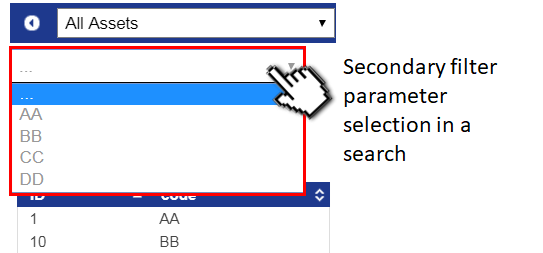
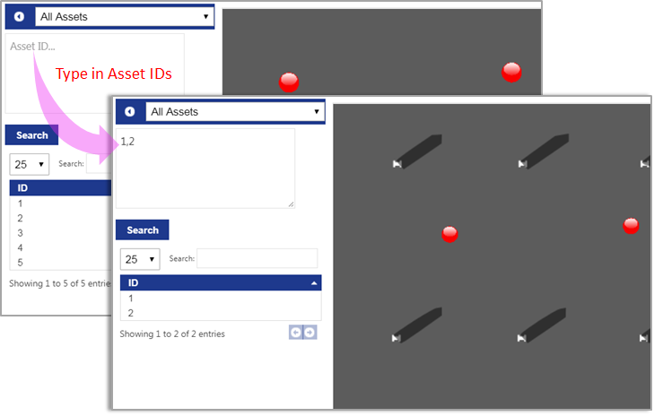

Skip To Main Content

  * placeholder

Filter:

  * All Files

Submit Search

   

You are here:

[Software
Version](../../../ComponentandFeatureOverview/FrontMatters\(Online\)/features-
and-versions.htm): 3.2

# Web searches

The Web searches workspace provides configuration options to create or edit
search queries for use in [Web
maps](../../../ComponentandFeatureOverview/TopLevelFeatures/Visibility/web-
maps.htm), [Web
forms](../../../ComponentandFeatureOverview/TopLevelFeatures/Visibility/web-
forms.htm) and
[HMIs](../../../ComponentandFeatureOverview/TopLevelFeatures/Visibility/HMIs.htm)

If you have licensed the Rules engine developer, you can use the BUSINESS
RULES workspace to load searches (and any dependent items, such as
representations) that have been developed in other SmartSpace installations,
and you can export searches you have created, for use elsewhere. See the
[Module import and
export](../../../ITResources/ITDocs/BusinessRulesExport/business-rules-
export.htm) guide.

#### Displaying tag locations

From version 3.5, a built-in search is available for displaying tag locations
on the web map. See [Displaying tag locations on the web
map](../../Visibility/Webmaps/tag-locations-displaying-web-maps.htm) for
further information.

# Configuring web searches

The Web searches workspace provides configuration options to create or edit
search queries for use in [Web
maps](../../../ComponentandFeatureOverview/TopLevelFeatures/Visibility/web-
maps.htm) and [Web
forms](../../../ComponentandFeatureOverview/TopLevelFeatures/Visibility/web-
forms.htm).

Click on WEB SEARCHESto display the workspace:

Creating new searches follows a standard workflow as indicated in the example
above. Some options are mandatory for every search; some are optional and are
slightly more advanced features for creating more sophisticated search
behavior. Search options are described in the following sections.

## Mandatory Controls

Searches list

  * A list of searches currently defined in the system. The order of searches in this list is the order they will be presented to the user within a particular role. Ordering can be modified by dragging and dropping a search to a different row in the list.

  * Double clicking the <Add new search> option allows you to create a new “empty search”.  
See Creating a new search for more information.

  * Searches can be deleted by clicking on the appropriate search name and pressing Delete.

Primary search subject

  * Choose a property of a type on which to base a search.
  * Choose an object type from the result set (searches based on Complex properties only)
  * Where type inheritance is detected, choose the level of objects returned by the search (parent or child). Property rows will only be returned if the object inherits the selected type.

Behavior controls

These controls determine how and when searches execute. Options include:

  * Draw All

> Select this option if you want to see all result objects rendered into the
> scene.
>
> If not selected, only when an object is selected from the result list is it
> rendered into the scene.

  * Visible

> Because search definitions can be used to populate both the web map and web
> form, the Visible check box is used to distinguish between these two.
>
> If a search is not marked as Visible, it will not be offered to users in the
> web map, but can still be used for web forms , and for HMIs .

  * Hide Search Filter

> By default, all searches include a text filter to find specific objects in
> the result set (using a partial string match). The Hide Search Filter option
> allows you to hide this filter.

  * Auto Zoom

> This option causes the map to automatically pan and zoom to the location of
> the currently selected object in the result set.

  * Auto Run

> This option forces a search to run automatically when selected from the list
> of searches available to a user.
>
> If not selected, the user must explicitly run the search in order to
> retrieve the latest set of objects.

  * Show History

> This option allows you to display a short history of the last five movements
> of any object as a mini snail trail on the web map with nodes for each
> recorded location.

  * Refresh Interval

> Allows you to set the refresh interval for a search. The search results are
> updated automatically with this frequency.
>
> Notes:
>
>   * A 60 second interval is the default for all searches. For searches that
> can return many objects, it is advisable to keep the refresh interval quite
> long, otherwise many map clients can result in a significant load on the
> server.
>   * For performance reasons, for searches returning more than 2000 objects,
> the web map imposes a lower limit of 30 seconds on the refresh interval.
>   * This refresh interval does not apply to “live” location updates on the
> web map. This is controlled by a different service and happens at a fixed
> interval of one second.
>

Representation modes

  * Choose which representation modes will be visible for the objects returned by the search.
  * The <default> representation mode is also displayed for all object types. Modes are only visible if there is a 2D model for the mode with Show in 2D selected. If there are no such modes for an object type, then it will not appear on the map. At least one representation mode must be selected for objects to be visible in the web map.
  * The Fixed attribute specifies whether the representation will have a fixed orientation or change its orientation if the object’s orientation changes.

  * Where decorations for items, such as object status, have been assigned (through additional representation modes, as described in [Adding a representation to a type](../SiteVisualization/assignreps/model-assignment.htm#Adding)) include them here to ensure they appear with the base object representation.

Subject properties

List of properties that can be dragged into the different views to configure
visible properties. Available properties are:

  * All the properties of the “returned objects” type are available, and can be dragged into any of the Summary, Details or Representation views.
  * If the “based on” property is a property from an object type T to another object type U, and we select the T as the returned object type, then properties of U will also be available in the list, but can only be dragged into the details view. For example:

    * we have “the kit of <quality note>: <kit>” and we select quality note as the returned object,

    * if there is a property “name <kit>: string”, then this will appear in the list, and can be dragged into the details view.

  * Finally, properties for which the returned object type is the value column are also available: these can only be dragged into the details view. For example:

    * we have “the name of <process area>: string” and we select process area as the returned object,

    * if there is a property “the area of <product>: <process area>” then we can drag this into details view, and if the process area has multiple products they will be all shown in the details view, one per line.

Summary view configuration

The summary view is the table listing the set of objects returned when a
search is run.

The table can be populated with any combination of properties from the Subject
properties list, adding a new row for each new property added.

For each column it is possible to control the display of the properties in
various ways:

  * TITLE: By default, columns are labeled with the name of the property. TITLE allows you to customize the column title to better match the search results.
  * FORMAT: Specify the way in which floating point numbers (doubles in SmartSpace) and date and time are displayed in search results in the web map and web forms.

Available formats for floating point
numbers

number  | A floating point number; FORMAT DETAILS specifies the number of decimal places displayed.  
---|---  
digits | An integer number, i.e. no decimal places; FORMAT DETAILS specifies the minimum number of digits, leading zeroes are added if needed.  
days | Assume the number is a time in hours; divide value by 24, display to 2 decimal places.  
hours | Assume the number is a time in hours; display to 2 decimal places.  
minutes | Assume the number is a time in hours; multiply by 60, display to 2 decimal places.  
seconds | Assume the number is a time in hours; multiply by 3600, display to 2 decimal places.  
d.hh:mm:ss |  Assume the number is a time in hours; display as days, hours, minutes, seconds.  
  
Available formats for date and time

All the date formats are localized depending on the browser preferred
language/culture. If custom is specified, the custom format can be defined in
the FORMAT DETAILS column, described below.

If no format is specified, short date short time is used by default.

Formats are:

    * long date short time
    * long date long time
    * short date short time
    * short time
    * long time
    * short date
    * long date
    * year month
    * month day
    * invariant (yyyy-MM-ddTHH:mm)
    * d.hh:mm:ss in future
    * d.hh:mm:ss in past
    * days in future
    * days in past
    * hours in future
    * hours in past
    * minutes in future
    * minutes in past
    * custom

  * FORMAT DETAILS: Available when the selected format is either number or digits for floating point numbers, or custom for date and time.

    * For number, FORMAT DETAILS defines the number of decimal places displayed.
    * For digits, FORMAT DETAILS defines the minimum number of digits, leading zeroes are added if needed.
    * For custom date and time, FORMAT DETAILS allows a format string to be entered, which is either one of the standard forms or a set of fields. In the standard forms the cultural format is used for all but R, so the order of year/month/date may vary.

Custom date and time formats

      * d: "M/d/yyyy"

      * D: "dddd, MMMM dd, yyyy"

      * t: "h:mm tt"

      * T: "h:mm:ss tt"

      * f: "dddd, MMMM dd, yyyy h:mm tt"

      * F: "dddd, MMMM dd, yyyy h:mm:ss tt"

      * M: "MMMM dd"

      * Y: "yyyy MMMM"

      * R: "yyyy-MM-ddTHH:mm:ss"

      * S: d then t

      * ip: interval in past (d.hh:mm:ss)

      * if: interval in future (d.hh:mm:ss)

      * idp: days in past

      * idf: days in future

      * ihp: hours in past

      * ihf: hours in future

      * imp: minutes in past

The fields available are as follows and, if using fields, the string can also
contain non-field labels, optionally escaped within single quotes.

Available fields

      * ddd: Day of the week, as a three-letter abbreviation

      * dddd: Day of the week, using the full name

      * d: Day of month, without leading zero for single-digit days

      * dd: Day of month, with leading zero for single-digit days

      * MMM: Month, as a three-letter abbreviation

      * MMMM: Month, using the full name

      * M: Month, as digits, with no leading zero for single-digit months

      * MM: Month, as digits, with leading zero for single-digit months

      * y: Year, as two digits, but with no leading zero for years less than 10

      * yy: Year, as two digits, with leading zero for years less than 10

      * yyyy: Year represented by four full digits

      * h: Hours with no leading zero for single-digit hours, using 12-hour clock

      * hh: Hours with leading zero for single-digit hours, using 12-hour clock

      * H: Hours with no leading zero for single-digit hours, using 24-hour clock

      * HH: Hours with leading zero for single-digit hours, using 24-hour clock

      * m: Minutes with no leading zero for single-digit minutes

      * mm: Minutes with leading zero for single-digit minutes

      * s: Seconds with no leading zero for single-digit seconds

      * ss: Seconds with leading zero for single-digit seconds

      * t: One character am/pm indicator ("a" or "p")

      * tt: Multicharacter am/pm indicator

      * f: Deciseconds

      * ff: Centiseconds

      * fff: Milliseconds

      * z: Time zone offset, no leading zero

      * zz: Time zone offset with leading zero

      * zzz: Time zone offset with leading zero

      * g or gg: Era

      * WW: ISO week number

  * SORT
    * Determines the sort order of results in the result list.
    * Enable multi-column sorting by assigning First, Second, Third sort orders

  * ORDER   
Determines whether a sorted column will be ascending or descending.

Note: For performance and layout reasons, it is advised to keep the number of
properties below 10.

Details view configuration

The details view is a snapshot of properties owned by each object which
becomes visible when an object is explicitly selected on the web map or when
listed in a web form.

The table can be populated with any combination of properties from the Subject
properties list, adding a new row for each new property added.

For each column it is possible to control the display of the properties in
various ways:

  * TITLE: By default, columns are labeled with the name of the property. TITLE allows you to customize the column title to better match the search results.
  * FORMAT: Specify the way in which floating point numbers (doubles in SmartSpace) and date and time are displayed in search results in the web map and web forms.

Available formats for floating point
numbers

number  | A floating point number; FORMAT DETAILS specifies the number of decimal places displayed.  
---|---  
digits | An integer number, i.e. no decimal places; FORMAT DETAILS specifies the minimum number of digits, leading zeroes are added if needed.  
days | Assume the number is a time in hours; divide value by 24, display to 2 decimal places.  
hours | Assume the number is a time in hours; display to 2 decimal places.  
minutes | Assume the number is a time in hours; multiply by 60, display to 2 decimal places.  
seconds | Assume the number is a time in hours; multiply by 3600, display to 2 decimal places.  
d.hh:mm:ss |  Assume the number is a time in hours; display as days, hours, minutes, seconds.  
  
Available formats for date and time

All the date formats are localized depending on the browser preferred
language/culture. If custom is specified, the custom format can be defined in
the FORMAT DETAILS column, described below.

If no format is specified, short date short time is used by default.

Formats are:

    * long date short time
    * long date long time
    * short date short time
    * short time
    * long time
    * short date
    * long date
    * year month
    * month day
    * invariant (yyyy-MM-ddTHH:mm)
    * d.hh:mm:ss in future
    * d.hh:mm:ss in past
    * days in future
    * days in past
    * hours in future
    * hours in past
    * minutes in future
    * minutes in past
    * custom

  * FORMAT DETAILS: Available when the selected format is either number or digits for floating point numbers, or custom for date and time.

    * For number, FORMAT DETAILS defines the number of decimal places displayed.
    * For digits, FORMAT DETAILS defines the minimum number of digits, leading zeroes are added if needed.
    * For custom date and time, FORMAT DETAILS allows a format string to be entered, which is either one of the standard forms or a set of fields. In the standard forms the cultural format is used for all but R, so the order of year/month/date may vary.

Custom date and time formats

      * d: "M/d/yyyy"

      * D: "dddd, MMMM dd, yyyy"

      * t: "h:mm tt"

      * T: "h:mm:ss tt"

      * f: "dddd, MMMM dd, yyyy h:mm tt"

      * F: "dddd, MMMM dd, yyyy h:mm:ss tt"

      * M: "MMMM dd"

      * Y: "yyyy MMMM"

      * R: "yyyy-MM-ddTHH:mm:ss"

      * S: d then t

      * ip: interval in past (d.hh:mm:ss)

      * if: interval in future (d.hh:mm:ss)

      * idp: days in past

      * idf: days in future

      * ihp: hours in past

      * ihf: hours in future

      * imp: minutes in past

The fields available are as follows and, if using fields, the string can also
contain non-field labels, optionally escaped within single quotes.

Available fields

      * ddd: Day of the week, as a three-letter abbreviation

      * dddd: Day of the week, using the full name

      * d: Day of month, without leading zero for single-digit days

      * dd: Day of month, with leading zero for single-digit days

      * MMM: Month, as a three-letter abbreviation

      * MMMM: Month, using the full name

      * M: Month, as digits, with no leading zero for single-digit months

      * MM: Month, as digits, with leading zero for single-digit months

      * y: Year, as two digits, but with no leading zero for years less than 10

      * yy: Year, as two digits, with leading zero for years less than 10

      * yyyy: Year represented by four full digits

      * h: Hours with no leading zero for single-digit hours, using 12-hour clock

      * hh: Hours with leading zero for single-digit hours, using 12-hour clock

      * H: Hours with no leading zero for single-digit hours, using 24-hour clock

      * HH: Hours with leading zero for single-digit hours, using 24-hour clock

      * m: Minutes with no leading zero for single-digit minutes

      * mm: Minutes with leading zero for single-digit minutes

      * s: Seconds with no leading zero for single-digit seconds

      * ss: Seconds with leading zero for single-digit seconds

      * t: One character am/pm indicator ("a" or "p")

      * tt: Multicharacter am/pm indicator

      * f: Deciseconds

      * ff: Centiseconds

      * fff: Milliseconds

      * z: Time zone offset, no leading zero

      * zz: Time zone offset with leading zero

      * zzz: Time zone offset with leading zero

      * g or gg: Era

      * WW: ISO week number

## Optional Controls

Background searches

It is possible to execute additional searches alongside a primary search so as
to show different sets of objects on the web map. Use this control to add
background searches to your search definition.

If you add more than one background search, the order in which the background
search objects are drawn on the map is determined by their position in the
SEARCHES list. A search that is higher up the list will be drawn on top of one
lower down the list.

Secondary searches and filters

Secondary searches and filters allow you to further filter down the set of
results returned by the primary search. A number of different options can be
presented to the user, including:

  * Enter a value  
This adds an input box to the search in which the end-user can enter a string
parameter that must match (partial) the property values returned for the
subject of the search.

See Filter parameters with selection by user-input strings for further
information.

  * Choose from  
This allows you to add a filter which groups all the values returned for the
subject property and presents them to the user as selectable parameters. At
runtime, the collection of values for that property are presented using a
dropdown menu to select from. If you select the Multiple values check box the
end-user can include multiple values from the dropdown menu against which
results get filtered.

See Filter parameters with grouped values and selection from a dropdown for
further information.

Representations list

SVGs support dynamic properties in their markup which SmartSpace can populate
on the fly in the web map. These include the ability to dynamically fill a
color field of the SVG or dynamically fill different text fields in the SVG.
In this way it is possible to use a string property representing an RGB value
of the form rgb(val,val,val) to populate the SVG, or assign string properties
to fill the various empty fields in the SVG. See [Adding a label to the
representation of an object](../../Visibility/Webmaps/labels-for-
representations-web-maps.htm) and [Dynamic color in object representations on
the web map](../../Visibility/Webmaps/fillable-SVGs-web-maps.htm) for further
information.

# Creating a new search

To create a new search:

  1. In the Web searches workspace, double-click <Add new search>.  

  2. Enter a name for the search and click Create.

  3. Find the new search in the Searches list and click on it to update its configuration.
  4. Specify the property to use as your Primary search subject by clicking based on and choosing from the list of properties.

  5. Decide how you want the search to behave when users interact with it. Select the Behavior controls you need.

  6. If the search is going to be displayed using the SmartSpaceweb map, add one or more Representation modes for the object.   
See [Adding a representation to a type](../SiteVisualization/assignreps/model-
assignment.htm#Adding) for information on adding representation modes to
objects.

  7. Decide which properties should be displayed in the columns and rows of the summary view (see Summary view configuration) and details view (see Details view configuration) respectively.

Next steps

After you have created a search, you can:

  1. Add your search to one or more roles. See [The Users and roles workspace](../UsersAndRoles/users-and-roles-configuration.htm#u-r-1) for information on assigning searches to roles.
  2. Test your search and role allocation on the web map. See [Web maps at runtime](../../Visibility/Webmaps/web-maps-introduction.htm#at).

You can also add your search definition to a new web form. See [Web
forms](../WebForms/web-forms-configuration.htm).

# Filter parameters

## Filter parameters with selection by user-input strings

Often you will want to search for one or more objects by a specific set of
unique IDs. For example, you may wish to copy a comma-separated list of object
IDs from a document directly into a search filter and have only those objects
returned and displayed on the map.

For example, let’s say we wanted to search for a number of assets by their
unique name property called “Asset ID”.

To do this we can:

  1. Create a general search for the Asset type using a property called Asset ID, by following the steps in Creating a new search.

  2. Double-click <Add new parameter> to add a new filter:

  3. Select the property the parameter is based on (it defaults to the primary search property) and the values to match in the property. In this example, use the primary search property, the asset id of <asset> : string. Because this search is based on the name of the primary property, you get the same results whether you select asset or string at The values matched are. When searching on complex properties or when using a property other than the primary property of the search, you may have more options here and the one you select can have an effect on the search results. See Filter parameters with grouped values and selection from a dropdown for an example.

  4. Select Enter a value and check Multiple values. This means the user will be presented with a text box where they can enter a list of asset IDs in the web map.

The Multiple values check box works as follows:

     * Unchecked: the search matches all property values that contain the text entered by the user as a substring.
     * Checked: the text entered by the user is split at “,” “;” and white space, and each value is matched as a substring as above. Single or double quotes can be used to prevent splitting an identifier that contains “,” “;” or white space.

In this example, with Multiple values checked the user can copy their comma-
separated list of asset IDs providing each asset ID does not contain spaces or
“;”.

  5. The values users will input are string values, in our example for the ID of the assets they want to find. We can ensure that the web map interface prompts them for the property values expected by giving the parameter a title. This determines the text prompt displayed in the input box.

When this search has been added to a role and made visible in the web map, you
will see a free text input box displayed underneath the chosen search as shown
below:

## Filter parameters with grouped values and selection from a dropdown

You can configure a filter to group all the values returned for the subject
property and present them to the user as selectable parameters. At runtime,
the collection of values for that property are presented using a dropdown menu
to select from. If you select the Multiple values check box the end-user can
include multiple values from the dropdown menu against which results get
filtered.

The following example allows the instances of the Asset type to be grouped
into categories identified by a 2-character code from which the user can
select one or more at runtime. To do this:

  1. In the Types and objects workspace create a type called Code with a name property and add some objects:

  2. Again in the Types and objects workspace, add a property to the asset type with a value of type code:

  3. Add some assets with different codes:

  4. Create a search for the Asset type using the Asset ID property, by following the steps in Creating a new search.
  5. Double-click <Add new parameter> to add a new filter:

  6. Select the property the parameter is based on (it defaults to the primary search property) and the values to match in the property. In this example we want to group the assets by their two-character code, so select the the code of <asset> : code. Here, we are not using the primary search property and we can use either asset or code as the value to match.

Choose code to present the user with a list of codes.

  7. Select the Code of <asset> : code at Choose from and check Multiple selections. This means the user will be presented with a list of instances of the Code type that have been assigned to at least one asset. In this example, the user would be offered codes AA, BB, DD, EE but not CC which has not been used.

If, instead of selecting the code of <asset> : code, you selected the name of
<code> : string the user would be presented with a list all configured codes
regardless of whether they had been used.

  8. We can ensure that the web map interface shows a meaningful prompt for users by giving the parameter a title. This displays at the head of the list of selections.

When this search has been added to a role and made visible in the web map, you
will see a list of codes for the user to select as shown below:

  * Web searches
  * Configuring web searches
    * Mandatory Controls
    * Optional Controls
  * Creating a new search
  * Filter parameters
    * Filter parameters with selection by user-input strings
    * Filter parameters with grouped values and selection from a dropdown

   

* * *

[www.ubisense.net](http://www.ubisense.net/)  
Copyright © 2020, Ubisense Limited 2014 - 2020. All Rights Reserved.

